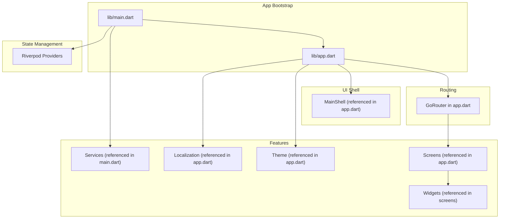
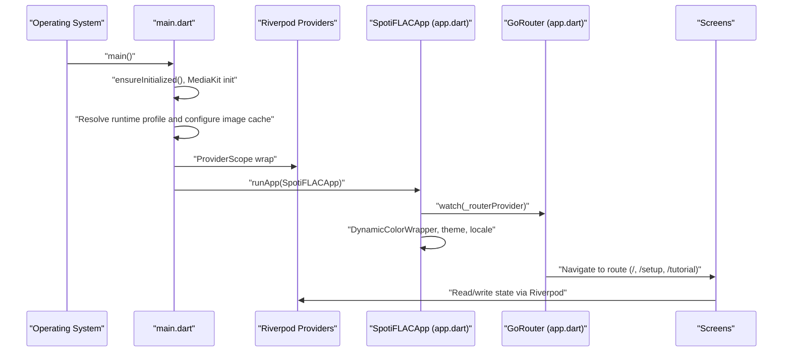
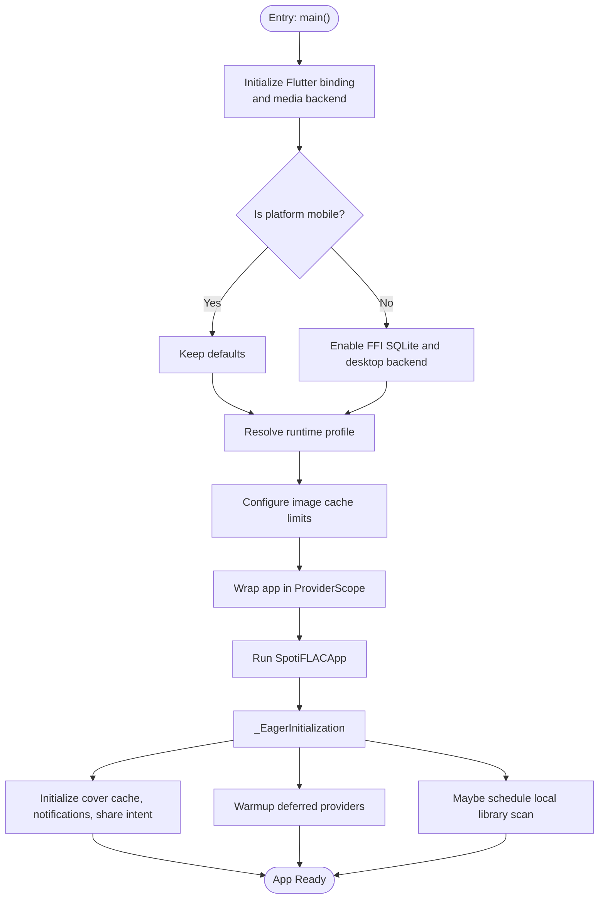
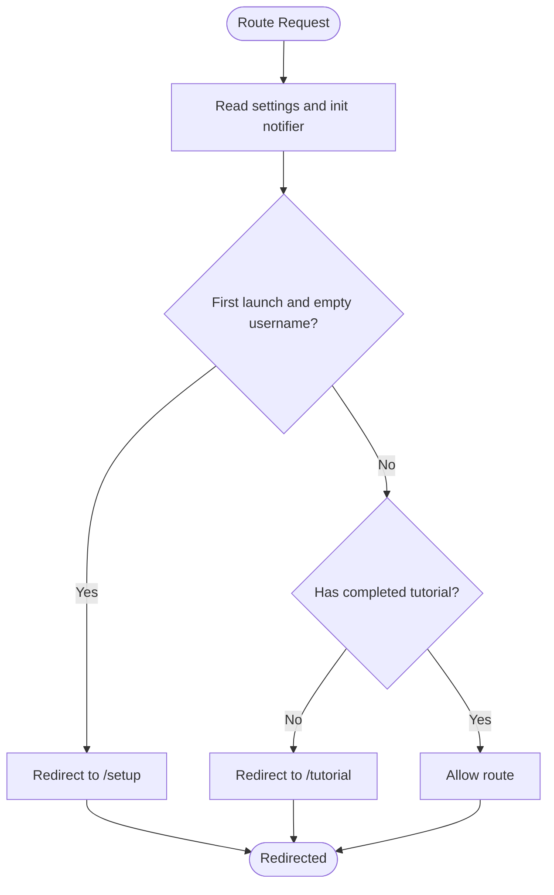
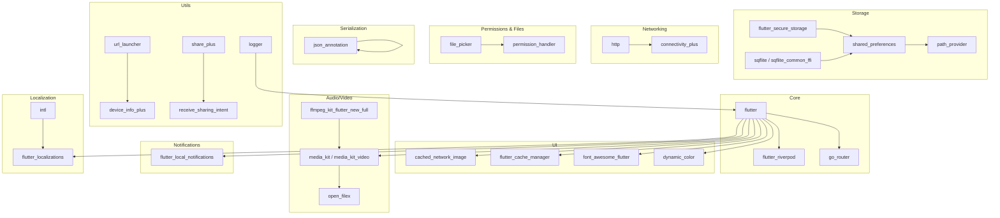

# Frontend Application (Flutter)

<cite>
**Referenced Files in This Document**
- [main.dart](file://lib/main.dart)
- [app.dart](file://lib/app.dart)
- [pubspec.yaml](file://pubspec.yaml)
</cite>

## Table of Contents
1. [Introduction](#introduction)
2. [Project Structure](#project-structure)
3. [Core Components](#core-components)
4. [Architecture Overview](#architecture-overview)
5. [Detailed Component Analysis](#detailed-component-analysis)
6. [Dependency Analysis](#dependency-analysis)
7. [Performance Considerations](#performance-considerations)
8. [Troubleshooting Guide](#troubleshooting-guide)
9. [Conclusion](#conclusion)

## Introduction
This document describes the Flutter frontend application architecture and implementation for a cross-platform media application. It focuses on the application bootstrap, routing, state management with Riverpod, theming and localization, and platform-specific initialization. The project uses Riverpod for reactive state management, GoRouter for navigation, and integrates platform bridges for desktop environments. The documentation also outlines the directory layout and build configuration to help developers understand how the app is organized and how to extend or maintain it.

## Project Structure
The application follows a conventional Flutter structure with feature-based organization under lib. The primary entry point initializes platform-specific services, configures caching, and starts the app inside a Riverpod ProviderScope. The app’s routing and UI shell are defined in a dedicated module, while state providers, screens, widgets, services, and themes are organized into separate packages.

Key directories and responsibilities:
- lib/main.dart: Application entry point, platform detection, eager initialization, and global service setup
- lib/app.dart: Navigation setup with GoRouter, app-wide theming, localization, and the main app shell
- lib/providers/: Reactive state providers (Riverpod)
- lib/screens/: Screen components and page layouts
- lib/widgets/: Reusable UI components
- lib/services/: Platform bridges, notifications, and background services
- lib/theme/: Theme definitions and dynamic color wrapper
- lib/l10n/: Localization delegates and generated localizations
- lib/models/: Data models and serialization
- lib/utils/: Utility helpers and extensions
- lib/constants/: Constants and configuration values
- lib/core/: Core abstractions and platform interfaces
- pubspec.yaml: Dependencies, dev dependencies, assets, and Flutter configuration

**Diagram sources**
- [main.dart](file://lib/main.dart)
- [app.dart](file://lib/app.dart)

**Section sources**
- [main.dart](file://lib/main.dart)
- [app.dart](file://lib/app.dart)
- [pubspec.yaml](file://pubspec.yaml)

## Core Components
This section highlights the core building blocks of the application and how they interact during startup and runtime.

- Application entry point and platform initialization
  - Ensures Flutter binding is initialized and media backend is ready
  - Detects non-mobile platforms and switches to FFI SQLite and desktop backend
  - Configures image cache limits based on runtime profile
  - Wraps the app in ProviderScope for Riverpod

- Eager initialization
  - Initializes cover cache manager, notifications, and share intent services
  - Sets up extension directories and installs default extensions
  - Warms up deferred providers (download history, library collections, local library)
  - Schedules auto-scan for local library based on settings and elapsed time

- App shell and routing
  - Defines a provider for GoRouter with redirect logic based on settings and first-launch state
  - Routes include the main shell, setup, and tutorial screens
  - Uses DynamicColorWrapper for adaptive theming and supports overscroll behavior toggle
  - Localizations are configured with app-specific and global delegates

- Theming and localization
  - Theme mode and themes are provided via a dynamic color wrapper
  - Locale selection respects user settings or system locale
  - Scroll behavior can be disabled for overscroll effects on specific platforms

**Section sources**
- [main.dart](file://lib/main.dart)
- [app.dart](file://lib/app.dart)

## Architecture Overview
The application architecture centers around a Riverpod-driven state model, a centralized router, and modularized UI components. The startup sequence ensures platform-specific services are ready before rendering the UI.

**Diagram sources**
- [main.dart](file://lib/main.dart)
- [app.dart](file://lib/app.dart)

## Detailed Component Analysis

### Application Bootstrap and Eager Initialization
The bootstrap process performs platform detection, media backend initialization, and service setup. It also schedules provider warmups and auto-scan logic for the local library.

**Diagram sources**
- [main.dart](file://lib/main.dart)

**Section sources**
- [main.dart](file://lib/main.dart)

### Navigation with GoRouter
The app defines a single router provider that manages redirects and routes. Redirect logic ensures the user progresses through setup and tutorial flows appropriately.

**Diagram sources**
- [app.dart](file://lib/app.dart)

**Section sources**
- [app.dart](file://lib/app.dart)

### State Management with Riverpod
The application uses Riverpod for reactive state management. Providers are organized under lib/providers and are consumed by screens and widgets. The main entry wraps the app in ProviderScope, enabling global provider access. Deferred providers are warmed up after the first frame to improve perceived performance.

Key patterns observed:
- ProviderScope at the root
- Selectors for derived state reads
- Notifiers for state updates
- Manual listening for settings changes
- Scheduled warmups for heavy providers

**Section sources**
- [main.dart](file://lib/main.dart)

### Theming and Localization
Theming is handled via a dynamic color wrapper that adapts to system preferences and theme mode. Localization is configured with app-specific and global delegates, and the locale is selected from settings or system defaults. Overscroll effects can be disabled per platform.

**Section sources**
- [app.dart](file://lib/app.dart)

## Dependency Analysis
The application declares dependencies for state management, routing, persistence, networking, UI components, permissions, file picking, JSON serialization, utilities, FFmpeg integration, media playback, notifications, and localization. Dev dependencies include code generation and linting tools.

**Diagram sources**
- [pubspec.yaml](file://pubspec.yaml)

**Section sources**
- [pubspec.yaml](file://pubspec.yaml)

## Performance Considerations
- Image cache sizing: The app dynamically adjusts image cache limits based on runtime profile to prevent memory pressure on low-RAM devices.
- Deferred provider warmup: Heavy providers are warmed up after the first frame to reduce initial load latency.
- Platform-specific optimizations: Desktop builds use FFI SQLite and a desktop backend bridge to improve performance and compatibility.
- Overscroll effects: Can be disabled to reduce unnecessary animations on specific platforms.

**Section sources**
- [main.dart](file://lib/main.dart)

## Troubleshooting Guide
Common areas to investigate:
- Router redirect loops: Verify settings state and initialization notifier values to ensure proper redirect logic.
- Provider initialization order: Ensure deferred providers are warmed up after mounting and that subscriptions are closed on dispose.
- Platform initialization failures: Confirm media backend initialization and desktop bridge setup succeed before rendering the app.
- Localization issues: Ensure supported locales and delegates are correctly configured and that the locale setting resolves to a valid code.

**Section sources**
- [app.dart](file://lib/app.dart)
- [main.dart](file://lib/main.dart)

## Conclusion
The Flutter frontend is structured around a clean separation of concerns: a robust bootstrap and initialization pipeline, a centralized router with conditional redirects, a Riverpod-driven state model, and modular UI components. The build configuration supports cross-platform deployment with platform-specific optimizations and a comprehensive set of dependencies for media, storage, networking, and UX. This foundation enables scalable development and maintenance across Android, iOS, and desktop targets.