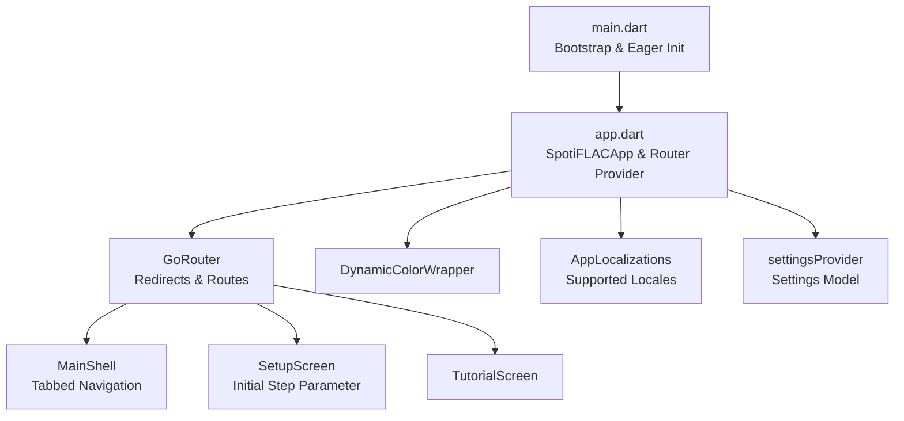
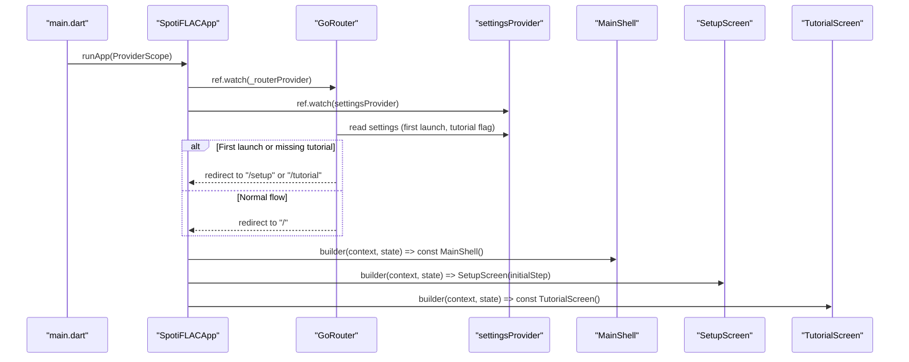
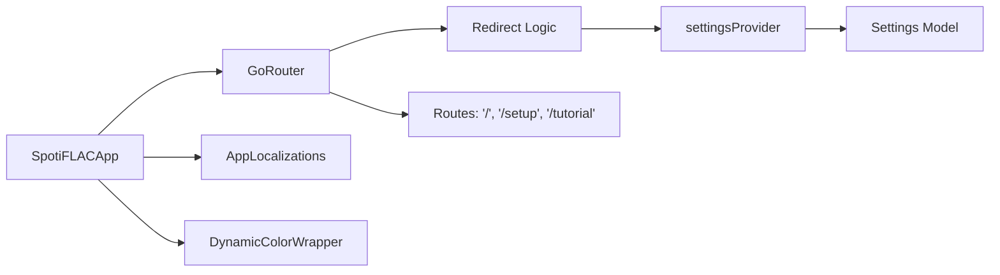

# Navigation and Routing

<cite>
**Referenced Files in This Document**
- [app.dart](file://lib/app.dart)
- [main.dart](file://lib/main.dart)
- [app_info.dart](file://lib/constants/app_info.dart)
- [app_localizations.dart](file://lib/l10n/app_localizations.dart)
- [settings.dart](file://lib/models/settings.dart)
- [settings.g.dart](file://lib/models/settings.g.dart)
- [audio_player_provider.dart](file://lib/providers/audio_player_provider.dart)
- [download_queue_provider.dart](file://lib/providers/download_queue_provider.dart)
- [explore_provider.dart](file://lib/providers/explore_provider.dart)
- [local_library_provider.dart](file://lib/providers/local_library_provider.dart)
- [library_collections_provider.dart](file://lib/providers/library_collections_provider.dart)
- [settings_provider.dart](file://lib/providers/settings_provider.dart)
- [dynamic_color_wrapper.dart](file://lib/theme/dynamic_color_wrapper.dart)
</cite>

## Table of Contents
1. [Introduction](#introduction)
2. [Project Structure](#project-structure)
3. [Core Components](#core-components)
4. [Architecture Overview](#architecture-overview)
5. [Detailed Component Analysis](#detailed-component-analysis)
6. [Dependency Analysis](#dependency-analysis)
7. [Performance Considerations](#performance-considerations)
8. [Troubleshooting Guide](#troubleshooting-guide)
9. [Conclusion](#conclusion)
10. [Appendices](#appendices)

## Introduction
This document explains the navigation and routing system of the application, focusing on the tabbed navigation architecture, route configuration, and navigation state management. It documents the main shell structure, navigation service implementation via GoRouter, and deep linking capabilities. It also covers navigation patterns, route guards, parameter passing between screens, the relationship between navigation and state management, navigation persistence and restoration, performance optimization strategies, and best practices for navigation UX and accessibility.

## Project Structure
The navigation system centers around a single-router configuration built with GoRouter and integrated into the app via a Riverpod provider. The application bootstraps services early and renders the router inside a themed, localized MaterialApp. The router defines top-level routes and redirects based on application settings and lifecycle events.

**Diagram sources**
- [main.dart:22-44](file://lib/main.dart#L22-L44)
- [app.dart:13-52](file://lib/app.dart#L13-L52)
- [app.dart:54-97](file://lib/app.dart#L54-L97)

**Section sources**
- [main.dart:22-44](file://lib/main.dart#L22-L44)
- [app.dart:13-52](file://lib/app.dart#L13-L52)
- [app.dart:54-97](file://lib/app.dart#L54-L97)

## Core Components
- Router provider: Creates and configures GoRouter with redirect logic, initial location, and top-level routes.
- Redirect logic: Controls navigation flow based on settings (first launch, tutorial completion) and initialization state.
- Top-level routes: Home shell, setup screen with optional initial step parameter, and tutorial screen.
- Error fallback: On navigation errors, the shell is shown as a safety net.
- App integration: The router is passed into MaterialApp.router, enabling localization and theming.

Key responsibilities:
- Route definition and guards
- Parameter extraction from state.extra
- Locale-driven localization
- Theme-aware rendering

**Section sources**
- [app.dart:13-52](file://lib/app.dart#L13-L52)
- [app.dart:54-97](file://lib/app.dart#L54-L97)

## Architecture Overview
The navigation architecture uses a centralized router provider that encapsulates navigation state and policies. The router delegates to a main shell that hosts tabbed navigation. The app’s settings provider influences redirect decisions and thus navigation persistence across launches.

**Diagram sources**
- [main.dart:35-43](file://lib/main.dart#L35-L43)
- [app.dart:13-52](file://lib/app.dart#L13-L52)
- [app.dart:54-97](file://lib/app.dart#L54-L97)

## Detailed Component Analysis

### Router Provider and Redirect Logic
- Initial location is set to the root path.
- Redirect evaluates:
  - Whether settings initialization has occurred
  - Whether the user is on the setup or tutorial route
  - First-launch conditions and tutorial completion flag
- Returns appropriate redirect targets or null to continue.
- Error fallback renders the main shell.

Implementation highlights:
- Uses a Riverpod Provider to supply a single GoRouter instance.
- Integrates with settingsInitNotifier to react to settings initialization events.
- Extracts initial step for SetupScreen from state.extra.

**Section sources**
- [app.dart:13-52](file://lib/app.dart#L13-L52)

### Route Configuration and Builders
- Root route builds the main shell.
- Setup route supports an initial step parameter extracted from state.extra.
- Tutorial route is a static screen.
- ErrorBuilder falls back to the main shell.

Parameter passing:
- The setup route demonstrates passing an initial step via state.extra, allowing dynamic initialization of the setup wizard.

**Section sources**
- [app.dart:32-51](file://lib/app.dart#L32-L51)

### Main Shell and Tabbed Navigation
- The root route builder returns a MainShell widget.
- The shell is responsible for hosting tabbed navigation and coordinating active tabs.
- While the shell itself is not defined in the referenced files, its role is central to the navigation architecture.

Note: The shell’s internal tab structure and selection logic are not present in the referenced files. The router delegates to the shell for tabbed navigation.

**Section sources**
- [app.dart:32-34](file://lib/app.dart#L32-L34)

### Navigation State Management and Persistence
- Settings model and provider drive navigation decisions:
  - First launch flag
  - Username presence
  - Tutorial completion flag
- settingsInitNotifier triggers router refresh to re-evaluate redirects after settings initialization.
- The router persists navigation state implicitly through the current route stack managed by GoRouter.

Persistence mechanisms:
- Redirect logic ensures the user lands on the correct screen after setup or tutorial completion.
- settingsInitNotifier acts as a signal to refresh navigation state post-initialization.

**Section sources**
- [app.dart:17-31](file://lib/app.dart#L17-L31)
- [settings_provider.dart](file://lib/providers/settings_provider.dart)
- [settings.dart](file://lib/models/settings.dart)
- [settings.g.dart](file://lib/models/settings.g.dart)

### Localization and Theming Integration
- The app sets locale based on settings and supports system locale.
- DynamicColorWrapper supplies theme variants for light/dark modes.
- These integrations occur alongside router configuration, ensuring consistent UX during navigation transitions.

**Section sources**
- [app.dart:67-92](file://lib/app.dart#L67-L92)
- [dynamic_color_wrapper.dart](file://lib/theme/dynamic_color_wrapper.dart)
- [app_localizations.dart](file://lib/l10n/app_localizations.dart)

### Deep Linking Capabilities
- The router is configured as the primary router for the app via MaterialApp.router.
- Deep links can be handled by extending the router configuration to support external URIs and mapping them to existing routes.
- Current implementation focuses on internal navigation; deep link handling would require adding named routes and link handlers.

[No sources needed since this section provides general guidance]

### Navigation Patterns and Examples
- Conditional redirect pattern: Evaluate settings and current location to decide the next route.
- Parameterized route pattern: Pass initialStep to SetupScreen via state.extra.
- Fallback pattern: On navigation errors, render the main shell.

**Section sources**
- [app.dart:17-31](file://lib/app.dart#L17-L31)
- [app.dart:35-43](file://lib/app.dart#L35-L43)
- [app.dart:50](file://lib/app.dart#L50)

### Route Guards
- Redirect guard: Centralized logic determines whether to allow navigation to requested routes or redirect elsewhere.
- Initialization guard: Uses settingsInitNotifier to defer navigation until settings are ready.

**Section sources**
- [app.dart:17-31](file://lib/app.dart#L17-L31)
- [app.dart:16](file://lib/app.dart#L16)

### Parameter Passing Between Screens
- SetupScreen reads an initialStep parameter from state.extra to configure its wizard steps.
- This enables dynamic initialization without global state coupling.

**Section sources**
- [app.dart:37-42](file://lib/app.dart#L37-L42)

### Relationship Between Navigation and State Management
- settingsProvider exposes flags that influence redirect decisions.
- settingsInitNotifier signals router refresh, ensuring navigation reflects updated state.
- Providers for audio player, downloads, explore, and library collections are initialized early but remain separate from routing logic.

**Section sources**
- [app.dart:17-31](file://lib/app.dart#L17-L31)
- [settings_provider.dart](file://lib/providers/settings_provider.dart)
- [audio_player_provider.dart](file://lib/providers/audio_player_provider.dart)
- [download_queue_provider.dart](file://lib/providers/download_queue_provider.dart)
- [explore_provider.dart](file://lib/providers/explore_provider.dart)
- [local_library_provider.dart](file://lib/providers/local_library_provider.dart)
- [library_collections_provider.dart](file://lib/providers/library_collections_provider.dart)

### Navigation Restoration Mechanisms
- The router does not explicitly define restoration IDs or restoration buckets.
- Restoration behavior relies on the default GoRouter route restoration semantics.
- To enhance restoration, consider adding restoration scopes for tabs and saving/restoring active tab indices.

[No sources needed since this section provides general guidance]

## Dependency Analysis
The navigation system depends on:
- GoRouter for routing and redirect logic
- Riverpod for the router provider and settings state
- Localization and theming for UI consistency
- Settings model for navigation decisions

**Diagram sources**
- [app.dart:13-52](file://lib/app.dart#L13-L52)
- [app.dart:54-97](file://lib/app.dart#L54-L97)
- [settings_provider.dart](file://lib/providers/settings_provider.dart)
- [settings.dart](file://lib/models/settings.dart)

**Section sources**
- [app.dart:13-52](file://lib/app.dart#L13-L52)
- [app.dart:54-97](file://lib/app.dart#L54-L97)
- [settings_provider.dart](file://lib/providers/settings_provider.dart)
- [settings.dart](file://lib/models/settings.dart)

## Performance Considerations
- Router initialization occurs once via a Riverpod Provider, minimizing overhead.
- Early initialization of providers and services reduces contention during navigation.
- Image cache sizing is tuned per platform/runtime profile to avoid memory pressure during navigation-heavy screens.
- Consider enabling route preloading for frequently visited tabs to reduce perceived latency.

[No sources needed since this section provides general guidance]

## Troubleshooting Guide
Common issues and resolutions:
- Navigation stuck on setup or tutorial:
  - Verify settingsInitNotifier emits and settingsProvider updates accordingly.
  - Confirm isFirstLaunch and hasCompletedTutorial flags are accurate.
- Incorrect locale or theme during navigation:
  - Ensure settings.locale is set and DynamicColorWrapper is applied.
- Deep link failures:
  - Add explicit route handling for external URIs and map them to existing routes.

**Section sources**
- [app.dart:17-31](file://lib/app.dart#L17-L31)
- [app.dart:67-92](file://lib/app.dart#L67-L92)

## Conclusion
The navigation and routing system leverages a centralized GoRouter provider with Riverpod-managed settings to enforce conditional navigation flows. The architecture cleanly separates route configuration, redirect logic, and UI integration, while supporting parameterized routes and fallback behavior. Extending the system with restoration scopes, deep link handlers, and route preloading can further improve reliability and user experience.

## Appendices

### Best Practices for Navigation UX and Accessibility
- Provide clear focus indicators and keyboard navigation for tabbed shells.
- Announce route changes for assistive technologies.
- Offer consistent back/forward behavior and minimize layout shifts during navigation.

[No sources needed since this section provides general guidance]

### Platform-Specific Navigation Patterns
- Android/iOS: Respect platform back button behavior and system gestures.
- Desktop: Support browser-style navigation controls and keyboard shortcuts.
- Mobile: Prefer bottom/tab navigation for primary destinations.

[No sources needed since this section provides general guidance]