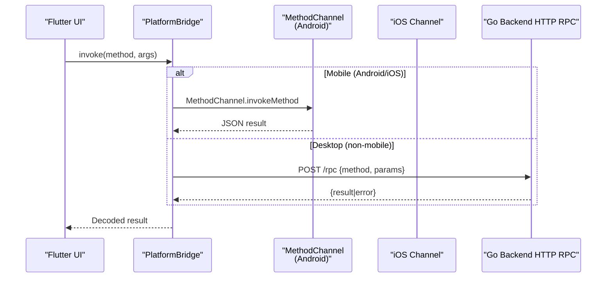
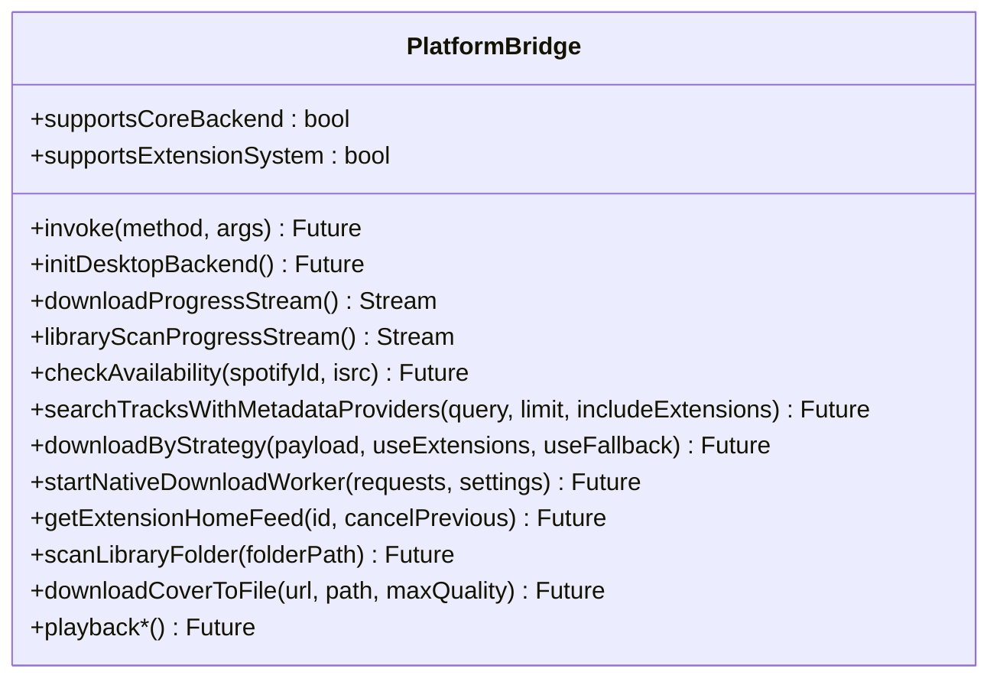
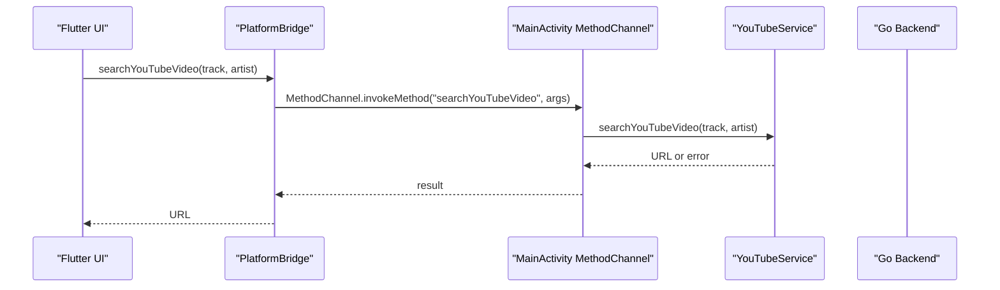
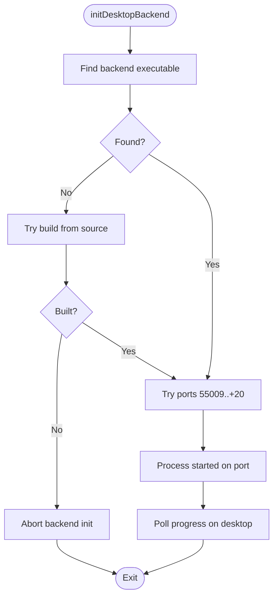
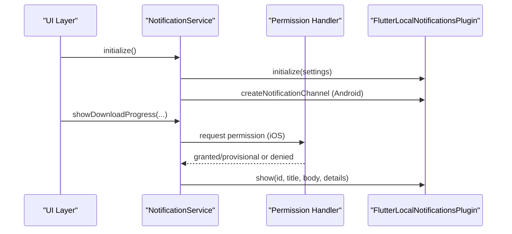
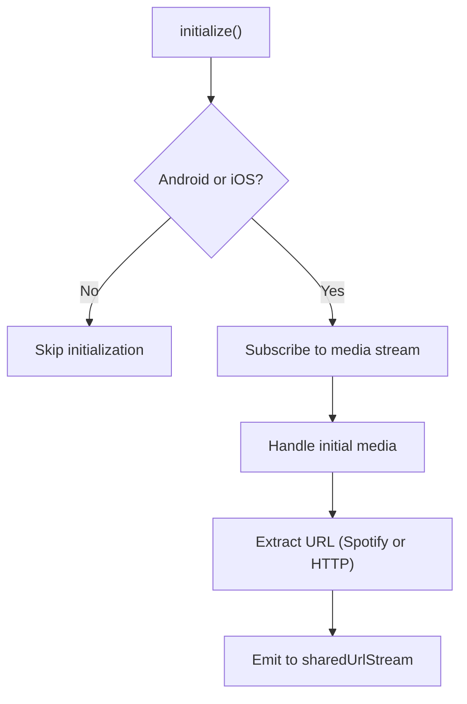
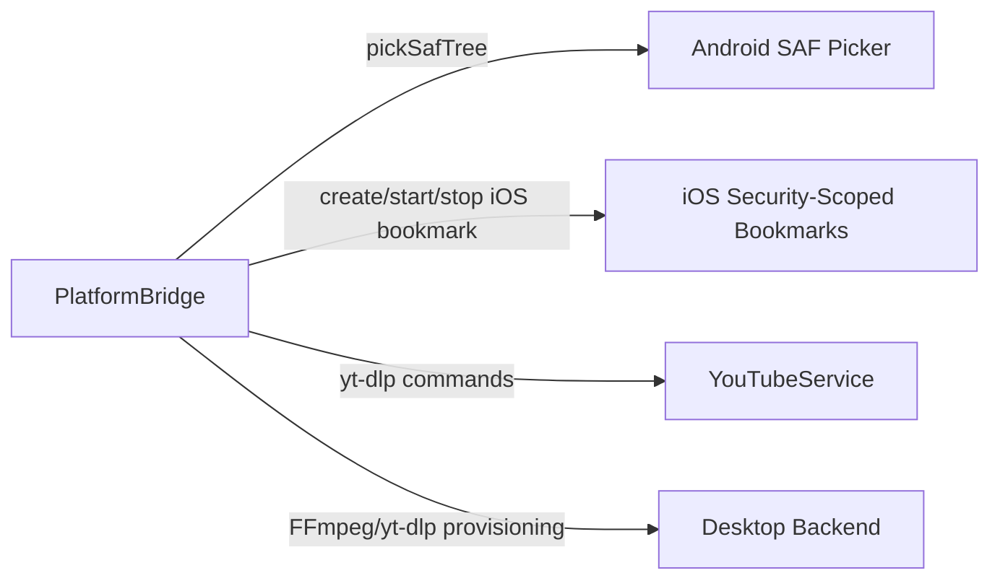
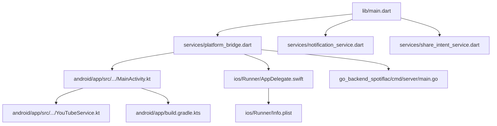

# Platform Integration

<cite>
**Referenced Files in This Document**
- [main.dart](file://lib/main.dart)
- [platform_bridge.dart](file://lib/services/platform_bridge.dart)
- [notification_service.dart](file://lib/services/notification_service.dart)
- [share_intent_service.dart](file://lib/services/share_intent_service.dart)
- [MainActivity.kt](file://android/app/src/main/kotlin/com/example/bitly/MainActivity.kt)
- [YouTubeService.kt](file://android/app/src/main/kotlin/com/example/bitly/YouTubeService.kt)
- [AppDelegate.swift](file://ios/Runner/AppDelegate.swift)
- [main.go](file://go_backend_spotiflac/cmd/server/main.go)
- [build.gradle.kts](file://android/app/build.gradle.kts)
- [Info.plist](file://ios/Runner/Info.plist)
</cite>

## Table of Contents
1. [Introduction](#introduction)
2. [Project Structure](#project-structure)
3. [Core Components](#core-components)
4. [Architecture Overview](#architecture-overview)
5. [Detailed Component Analysis](#detailed-component-analysis)
6. [Dependency Analysis](#dependency-analysis)
7. [Performance Considerations](#performance-considerations)
8. [Troubleshooting Guide](#troubleshooting-guide)
9. [Conclusion](#conclusion)

## Introduction
This document explains the platform integration architecture for cross-platform communication and native feature access. It covers the platform bridge design, method channel communication, desktop backend orchestration, notification service implementation, share intent handling, and platform-specific feature integration. Practical examples demonstrate platform detection, feature availability checks, graceful degradation strategies, permissions handling, and performance considerations for platform calls.

## Project Structure
The application follows a hybrid architecture:
- Flutter UI layer orchestrates initialization, services, and Riverpod providers.
- Platform bridge encapsulates platform-specific calls and caches.
- Android/iOS native layers expose method channels and native helpers.
- Desktop backend is launched automatically on non-mobile platforms and communicates via HTTP RPC.

```mermaid
graph TB
subgraph "Flutter UI"
M["main.dart<br/>App bootstrap"]
PB["PlatformBridge<br/>(services/platform_bridge.dart)"]
NS["NotificationService<br/>(services/notification_service.dart)"]
SI["ShareIntentService<br/>(services/share_intent_service.dart)"]
end
subgraph "Android Native"
MA["MainActivity.kt<br/>MethodChannel handler"]
YS["YouTubeService.kt<br/>yt-dlp wrapper"]
end
subgraph "iOS Native"
AD["AppDelegate.swift<br/>Flutter registration"]
end
subgraph "Desktop Backend"
GB["Go Backend HTTP RPC<br/>cmd/server/main.go"]
end
M --> PB
M --> NS
M --> SI
PB <- --> MA
PB <- --> AD
PB --> GB
MA --> YS
```

**Diagram sources**
- [main.dart:22-44](file://lib/main.dart#L22-L44)
- [platform_bridge.dart:37-53](file://lib/services/platform_bridge.dart#L37-L53)
- [notification_service.dart:40-97](file://lib/services/notification_service.dart#L40-L97)
- [share_intent_service.dart:34-53](file://lib/services/share_intent_service.dart#L34-L53)
- [MainActivity.kt:23-133](file://android/app/src/main/kotlin/com/example/bitly/MainActivity.kt#L23-L133)
- [YouTubeService.kt:10-92](file://android/app/src/main/kotlin/com/example/bitly/YouTubeService.kt#L10-L92)
- [AppDelegate.swift:5-12](file://ios/Runner/AppDelegate.swift#L5-L12)
- [main.go:107-134](file://go_backend_spotiflac/cmd/server/main.go#L107-L134)

**Section sources**
- [main.dart:22-44](file://lib/main.dart#L22-L44)
- [platform_bridge.dart:37-53](file://lib/services/platform_bridge.dart#L37-L53)
- [MainActivity.kt:23-133](file://android/app/src/main/kotlin/com/example/bitly/MainActivity.kt#L23-L133)
- [main.go:107-134](file://go_backend_spotiflac/cmd/server/main.go#L107-L134)

## Core Components
- PlatformBridge: Centralized abstraction over mobile method channels and desktop HTTP RPC. Provides typed invocations, caching, event streams, and native worker coordination.
- NotificationService: Cross-platform notification orchestration with platform-specific channels and permission handling.
- ShareIntentService: Cross-platform share intent handling with platform gating and URL extraction.
- Android MainActivity: Registers method channel handlers and delegates YouTube operations to native helpers.
- Go Backend: HTTP RPC server exposing media operations, extension management, and playback control.

**Section sources**
- [platform_bridge.dart:37-53](file://lib/services/platform_bridge.dart#L37-L53)
- [notification_service.dart:9-24](file://lib/services/notification_service.dart#L9-L24)
- [share_intent_service.dart:8-26](file://lib/services/share_intent_service.dart#L8-L26)
- [MainActivity.kt:15-133](file://android/app/src/main/kotlin/com/example/bitly/MainActivity.kt#L15-L133)
- [main.go:555-800](file://go_backend_spotiflac/cmd/server/main.go#L555-L800)

## Architecture Overview
The platform bridge supports two transport modes:
- Mobile method channel: Direct Dart-to-native calls on Android/iOS.
- Desktop HTTP RPC: Automatic backend startup and HTTP-based invocation on non-mobile platforms.



**Diagram sources**
- [platform_bridge.dart:44-81](file://lib/services/platform_bridge.dart#L44-L81)
- [MainActivity.kt:26-132](file://android/app/src/main/kotlin/com/example/bitly/MainActivity.kt#L26-L132)
- [main.go:359-385](file://go_backend_spotiflac/cmd/server/main.go#L359-L385)

**Section sources**
- [platform_bridge.dart:83-141](file://lib/services/platform_bridge.dart#L83-L141)
- [main.dart:26-30](file://lib/main.dart#L26-L30)

## Detailed Component Analysis

### Platform Bridge: Method Channel and Desktop RPC
- Transport selection: Uses method channel on mobile; switches to HTTP RPC on desktop after launching backend.
- Caching: LRU-style in-memory cache with TTL and persistence for metadata and availability lookups.
- Event streams: Broadcast streams for download and library scan progress; polls on desktop.
- Typed decoding: Background JSON decoding for large payloads; strict type assertions for results.



**Diagram sources**
- [platform_bridge.dart:37-2265](file://lib/services/platform_bridge.dart#L37-L2265)

**Section sources**
- [platform_bridge.dart:44-81](file://lib/services/platform_bridge.dart#L44-L81)
- [platform_bridge.dart:241-283](file://lib/services/platform_bridge.dart#L241-L283)
- [platform_bridge.dart:565-606](file://lib/services/platform_bridge.dart#L565-L606)
- [platform_bridge.dart:1495-1509](file://lib/services/platform_bridge.dart#L1495-L1509)
- [platform_bridge.dart:1672-1712](file://lib/services/platform_bridge.dart#L1672-L1712)
- [platform_bridge.dart:1735-1743](file://lib/services/platform_bridge.dart#L1735-L1743)
- [platform_bridge.dart:899-910](file://lib/services/platform_bridge.dart#L899-L910)
- [platform_bridge.dart:2176-2263](file://lib/services/platform_bridge.dart#L2176-L2263)

### Android Method Channel Handlers
- Registration: MainActivity registers a MethodChannel with a fixed name and sets a method call handler.
- Dispatch: Routes method names to backend operations, including database, extension system, search, YouTube, history/collections, lyrics/sync, SAF storage utilities, and availability checks.
- Threading: Executes long-running tasks on a single-thread executor; posts results on the main thread.
- YouTube integration: Delegates YouTube search and download to a native helper.



**Diagram sources**
- [MainActivity.kt:26-132](file://android/app/src/main/kotlin/com/example/bitly/MainActivity.kt#L26-L132)
- [YouTubeService.kt:12-23](file://android/app/src/main/kotlin/com/example/bitly/YouTubeService.kt#L12-L23)
- [platform_bridge.dart:871-880](file://lib/services/platform_bridge.dart#L871-L880)

**Section sources**
- [MainActivity.kt:23-133](file://android/app/src/main/kotlin/com/example/bitly/MainActivity.kt#L23-L133)
- [YouTubeService.kt:10-92](file://android/app/src/main/kotlin/com/example/bitly/YouTubeService.kt#L10-L92)

### Desktop Backend Orchestration
- Startup: On non-mobile platforms, PlatformBridge locates or builds the Go backend binary and starts it on an available port.
- RPC: Flutter invokes methods via HTTP POST to /rpc; Go backend dispatches to internal functions.
- Streaming: Progress events are polled on desktop; on mobile, broadcast streams are used.



**Diagram sources**
- [platform_bridge.dart:83-141](file://lib/services/platform_bridge.dart#L83-L141)
- [main.go:107-134](file://go_backend_spotiflac/cmd/server/main.go#L107-L134)

**Section sources**
- [platform_bridge.dart:83-141](file://lib/services/platform_bridge.dart#L83-L141)
- [main.go:107-134](file://go_backend_spotiflac/cmd/server/main.go#L107-L134)

### Notification Service Implementation
- Initialization: Creates platform-specific channels and settings; Android requires explicit channel creation.
- Permissions: Requests iOS notification permission when needed; gracefully handles denial.
- Safety: Wraps show calls with platform exception handling; logs and skips when notifications are disallowed.
- Streams: Provides multiple notification types for downloads, library scans, and updates.



**Diagram sources**
- [notification_service.dart:40-97](file://lib/services/notification_service.dart#L40-L97)
- [notification_service.dart:99-146](file://lib/services/notification_service.dart#L99-L146)
- [notification_service.dart:148-193](file://lib/services/notification_service.dart#L148-L193)

**Section sources**
- [notification_service.dart:9-24](file://lib/services/notification_service.dart#L9-L24)
- [notification_service.dart:40-97](file://lib/services/notification_service.dart#L40-L97)
- [notification_service.dart:99-146](file://lib/services/notification_service.dart#L99-L146)

### Share Intent Handling
- Platform gating: Share intent is only initialized on Android and iOS.
- Parsing: Extracts Spotify URIs and generic HTTP URLs; sanitizes trailing punctuation.
- Lifecycle: Subscribes to media stream; captures initial shared content.



**Diagram sources**
- [share_intent_service.dart:34-53](file://lib/services/share_intent_service.dart#L34-L53)
- [share_intent_service.dart:55-99](file://lib/services/share_intent_service.dart#L55-L99)

**Section sources**
- [share_intent_service.dart:8-26](file://lib/services/share_intent_service.dart#L8-L26)
- [share_intent_service.dart:34-53](file://lib/services/share_intent_service.dart#L34-L53)
- [share_intent_service.dart:55-99](file://lib/services/share_intent_service.dart#L55-L99)

### Platform-Specific Feature Integration
- Android SAF: Folder picker via ACTION_OPEN_DOCUMENT_TREE; persists permissions and resolves display names.
- iOS bookmarks: Security-scoped bookmark APIs for accessing shared locations.
- Desktop: Automatic FFmpeg/yt-dlp provisioning and backend orchestration.



**Diagram sources**
- [platform_bridge.dart:702-705](file://lib/services/platform_bridge.dart#L702-L705)
- [platform_bridge.dart:2000-2034](file://lib/services/platform_bridge.dart#L2000-L2034)
- [YouTubeService.kt:25-52](file://android/app/src/main/kotlin/com/example/bitly/YouTubeService.kt#L25-L52)
- [main.go:59-105](file://go_backend_spotiflac/cmd/server/main.go#L59-L105)

**Section sources**
- [MainActivity.kt:176-218](file://android/app/src/main/kotlin/com/example/bitly/MainActivity.kt#L176-L218)
- [platform_bridge.dart:2000-2034](file://lib/services/platform_bridge.dart#L2000-L2034)
- [main.go:59-105](file://go_backend_spotiflac/cmd/server/main.go#L59-L105)

## Dependency Analysis
- Flutter entrypoint initializes platform-specific backend on non-mobile platforms and launches services.
- PlatformBridge depends on method channels on Android/iOS and HTTP RPC on desktop.
- Android depends on a native helper for YouTube operations.
- iOS relies on FlutterAppDelegate registration for plugin support.
- Android build integrates a local AAR dependency.



**Diagram sources**
- [main.dart:22-44](file://lib/main.dart#L22-L44)
- [platform_bridge.dart:37-53](file://lib/services/platform_bridge.dart#L37-L53)
- [MainActivity.kt:15-133](file://android/app/src/main/kotlin/com/example/bitly/MainActivity.kt#L15-L133)
- [AppDelegate.swift:5-12](file://ios/Runner/AppDelegate.swift#L5-L12)
- [main.go:107-134](file://go_backend_spotiflac/cmd/server/main.go#L107-L134)
- [build.gradle.kts:47-50](file://android/app/build.gradle.kts#L47-L50)
- [Info.plist:1-50](file://ios/Runner/Info.plist#L1-L50)

**Section sources**
- [main.dart:22-44](file://lib/main.dart#L22-L44)
- [build.gradle.kts:47-50](file://android/app/build.gradle.kts#L47-L50)
- [Info.plist:1-50](file://ios/Runner/Info.plist#L1-L50)

## Performance Considerations
- Payload size: Large JSON results are decoded in a background isolate when exceeding a threshold to avoid UI jank.
- Caching: Metadata and availability lookups use in-memory cache with TTL and persistence to reduce redundant calls.
- Event polling: On desktop, progress streams poll periodically; on mobile, broadcast streams minimize overhead.
- Threading: Android method channel handlers execute work on a single-thread executor and post results on the main thread.
- Resource cleanup: PlatformBridge exposes cleanup methods and cancels in-flight requests when clearing caches.

[No sources needed since this section provides general guidance]

## Troubleshooting Guide
- Method channel failures: PlatformBridge catches exceptions and returns structured errors; inspect logs for detailed messages.
- Desktop backend startup: If backend fails to start, verify executable presence, port conflicts, and build steps.
- Notifications on iOS: If notifications are disallowed, the service logs and skips; prompt users to adjust settings.
- SAF picker on Android: Ensure persisted URI permissions and handle cancellation gracefully.
- yt-dlp availability: On desktop, FFmpeg/yt-dlp are auto-provisioned; verify PATH or bundled executables.

**Section sources**
- [platform_bridge.dart:135-145](file://lib/services/platform_bridge.dart#L135-L145)
- [platform_bridge.dart:147-173](file://lib/services/platform_bridge.dart#L147-L173)
- [notification_service.dart:131-146](file://lib/services/notification_service.dart#L131-L146)
- [MainActivity.kt:188-218](file://android/app/src/main/kotlin/com/example/bitly/MainActivity.kt#L188-L218)
- [main.go:59-105](file://go_backend_spotiflac/cmd/server/main.go#L59-L105)

## Conclusion
The platform integration leverages a unified PlatformBridge abstraction to deliver consistent functionality across Android, iOS, and desktop. Method channels and HTTP RPC provide flexible transport depending on the platform. Robust caching, streaming progress, and platform-specific helpers enable efficient media operations, extension management, and user notifications. Graceful degradation and explicit permission handling ensure reliable experiences across diverse environments.