# Advanced Patterns and Best Practices

<cite>
**Referenced Files in This Document**
- [main.dart](file://lib/main.dart)
- [app.dart](file://lib/app.dart)
- [settings_provider.dart](file://lib/providers/settings_provider.dart)
- [audio_player_provider.dart](file://lib/providers/audio_player_provider.dart)
- [download_queue_provider.dart](file://lib/providers/download_queue_provider.dart)
- [explore_provider.dart](file://lib/providers/explore_provider.dart)
- [library_collections_provider.dart](file://lib/providers/library_collections_provider.dart)
- [local_library_provider.dart](file://lib/providers/local_library_provider.dart)
- [playback_queue_provider.dart](file://lib/providers/playback_queue_provider.dart)
- [extension_provider.dart](file://lib/providers/extension_provider.dart)
- [stats_provider.dart](file://lib/providers/stats_provider.dart)
- [settings.dart](file://lib/models/settings.dart)
- [track.dart](file://lib/models/track.dart)
- [platform_bridge.dart](file://lib/services/platform_bridge.dart)
- [shell_navigation_service.dart](file://lib/services/shell_navigation_service.dart)
</cite>

## Table of Contents
1. [Introduction](#introduction)
2. [Project Structure](#project-structure)
3. [Core Components](#core-components)
4. [Architecture Overview](#architecture-overview)
5. [Detailed Component Analysis](#detailed-component-analysis)
6. [Dependency Analysis](#dependency-analysis)
7. [Performance Considerations](#performance-considerations)
8. [Troubleshooting Guide](#troubleshooting-guide)
9. [Conclusion](#conclusion)
10. [Appendices](#appendices)

## Introduction
This document presents advanced Riverpod patterns and best practices used in Bitly, focusing on complex state management scenarios such as asynchronous state handling, error boundary management, and persistence strategies. It also covers provider composition, conditional providers, dynamic provider creation, handling complex UI state, managing large datasets efficiently, and implementing undo/redo functionality. Additional topics include performance optimization, memory leak prevention, debugging advanced state management issues, and testing strategies for providers and state management components.

## Project Structure
Bitly organizes state management primarily under the providers directory, with supporting models, services, and UI routing orchestrated from the application entry points. Providers encapsulate stateful logic, handle persistence, and coordinate with native backend bridges for heavy operations.

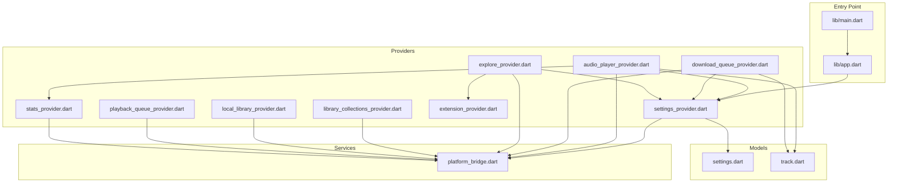

**Diagram sources**
- [main.dart:22-44](file://lib/main.dart#L22-L44)
- [app.dart:13-52](file://lib/app.dart#L13-L52)
- [settings_provider.dart:27-675](file://lib/providers/settings_provider.dart#L27-L675)
- [audio_player_provider.dart:89-651](file://lib/providers/audio_player_provider.dart#L89-L651)
- [download_queue_provider.dart:486-8824](file://lib/providers/download_queue_provider.dart#L486-L8824)
- [explore_provider.dart:262-497](file://lib/providers/explore_provider.dart#L262-L497)
- [library_collections_provider.dart:666-2488](file://lib/providers/library_collections_provider.dart#L666-L2488)
- [local_library_provider.dart:95-339](file://lib/providers/local_library_provider.dart#L95-L339)
- [playback_queue_provider.dart:94-237](file://lib/providers/playback_queue_provider.dart#L94-L237)
- [extension_provider.dart:797-1815](file://lib/providers/extension_provider.dart#L797-L1815)
- [stats_provider.dart:1-35](file://lib/providers/stats_provider.dart#L1-L35)
- [settings.dart:1-317](file://lib/models/settings.dart#L1-L317)
- [track.dart:1-287](file://lib/models/track.dart#L1-L287)
- [platform_bridge.dart](file://lib/services/platform_bridge.dart)

**Section sources**
- [main.dart:22-44](file://lib/main.dart#L22-L44)
- [app.dart:13-52](file://lib/app.dart#L13-L52)

## Core Components
- Settings provider: Central persistent state with migrations, secure preferences, and backend synchronization.
- Audio player provider: Complex async state with media playback, parallel prefetching, and lifecycle-aware disposal.
- Download queue provider: Large dataset management with deduplication, background maintenance, and incremental cleanup.
- Explore provider: Conditional provider selection, caching, and extension-driven home feed.
- Library collections provider: Snapshot-based loading, normalization, and migration of legacy keys.
- Local library provider: Streaming progress updates, cancellation, and cleanup routines.
- Playback queue provider: Queue manipulation with shuffle indices and repeat modes.
- Extension provider: Capability-based provider resolution and health checks.
- Stats provider: FutureProvider-backed analytics queries.

**Section sources**
- [settings_provider.dart:27-675](file://lib/providers/settings_provider.dart#L27-L675)
- [audio_player_provider.dart:89-651](file://lib/providers/audio_player_provider.dart#L89-L651)
- [download_queue_provider.dart:486-8824](file://lib/providers/download_queue_provider.dart#L486-L8824)
- [explore_provider.dart:262-497](file://lib/providers/explore_provider.dart#L262-L497)
- [library_collections_provider.dart:666-2488](file://lib/providers/library_collections_provider.dart#L666-L2488)
- [local_library_provider.dart:95-339](file://lib/providers/local_library_provider.dart#L95-L339)
- [playback_queue_provider.dart:94-237](file://lib/providers/playback_queue_provider.dart#L94-L237)
- [extension_provider.dart:797-1815](file://lib/providers/extension_provider.dart#L797-L1815)
- [stats_provider.dart:1-35](file://lib/providers/stats_provider.dart#L1-L35)

## Architecture Overview
Bitly uses Riverpod’s typed providers to separate concerns:
- NotifierProvider for mutable state with imperative updates.
- FutureProvider for asynchronous reads.
- Provider for lightweight factories and singletons.
- StateNotifierProvider for state machines with explicit state transitions.

Routing integrates with settings to manage onboarding and tutorial flows. Eager initialization warms up deferred providers and coordinates background tasks.

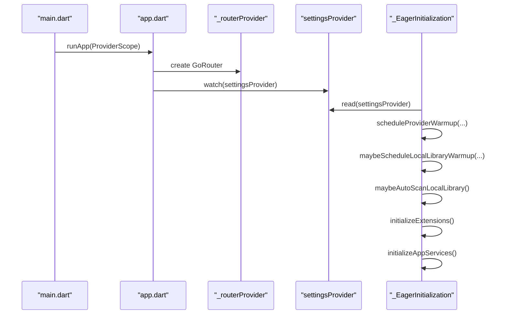

**Diagram sources**
- [main.dart:22-44](file://lib/main.dart#L22-L44)
- [app.dart:13-52](file://lib/app.dart#L13-L52)
- [settings_provider.dart:27-675](file://lib/providers/settings_provider.dart#L27-L675)

**Section sources**
- [main.dart:96-286](file://lib/main.dart#L96-L286)
- [app.dart:13-52](file://lib/app.dart#L13-L52)

## Detailed Component Analysis

### Settings Provider: Persistence, Migrations, and Backend Synchronization
- Dual persistence: tries Go backend first, falls back to SharedPreferences.
- Migration pipeline: runs on load, normalizes legacy settings and flags.
- Secure storage: sensitive keys are handled via secure storage.
- Premium validation: periodic timer to revoke expired trials.
- Backend sync: lyrics, network compatibility, and fallback extension settings synchronized to native bridge.

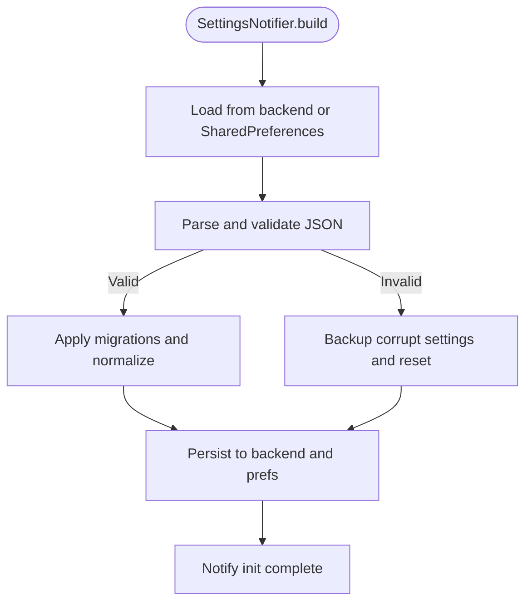

**Diagram sources**
- [settings_provider.dart:51-127](file://lib/providers/settings_provider.dart#L51-L127)

**Section sources**
- [settings_provider.dart:27-675](file://lib/providers/settings_provider.dart#L27-L675)
- [settings.dart:1-317](file://lib/models/settings.dart#L1-L317)

### Audio Player Provider: Async State, Parallel Prefetching, and Lifecycle Management
- Player lifecycle: initializes MediaKit player, sets properties, listens to streams.
- Parallel prefetching: video, lyrics, and audio download start concurrently.
- Playback orchestration: local file vs remote download, completion logging, auto-advance.
- Video playback: separate controller, caching, and disposal.
- Stats integration: logs plays and unlocks achievements.

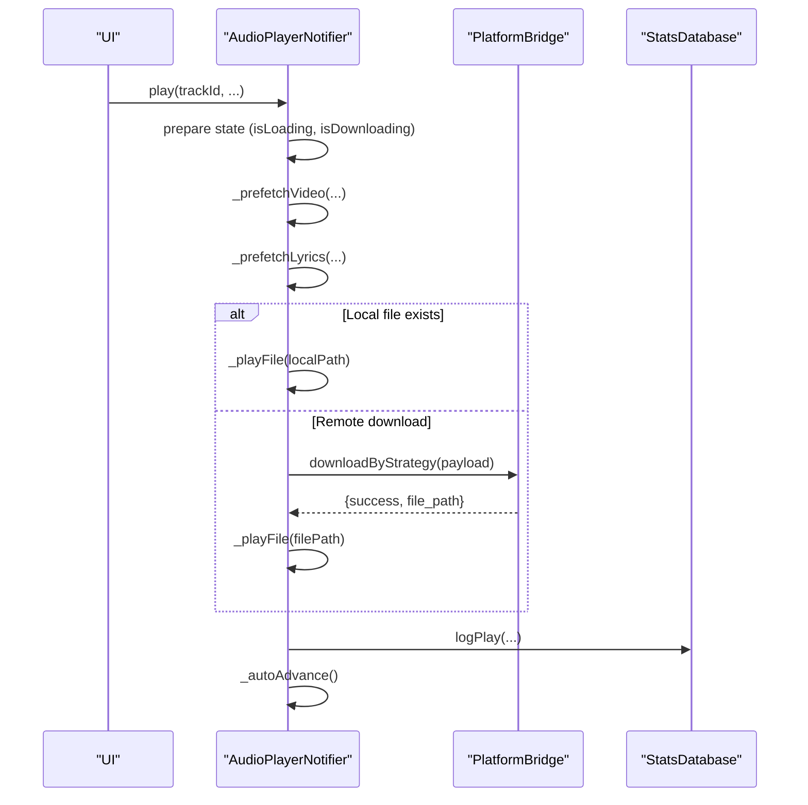

**Diagram sources**
- [audio_player_provider.dart:190-263](file://lib/providers/audio_player_provider.dart#L190-L263)
- [audio_player_provider.dart:399-443](file://lib/providers/audio_player_provider.dart#L399-L443)
- [audio_player_provider.dart:623-630](file://lib/providers/audio_player_provider.dart#L623-L630)

**Section sources**
- [audio_player_provider.dart:89-651](file://lib/providers/audio_player_provider.dart#L89-L651)

### Download Queue Provider: Large Dataset Management and Maintenance
- History deduplication: prioritizes ISRC > name|artist, merges metadata.
- Startup maintenance: SAF repair, orphan cleanup, audio metadata backfill.
- Incremental operations: batches and cursors to avoid blocking UI.
- History adoption and updates: in-memory history plus DB upserts.

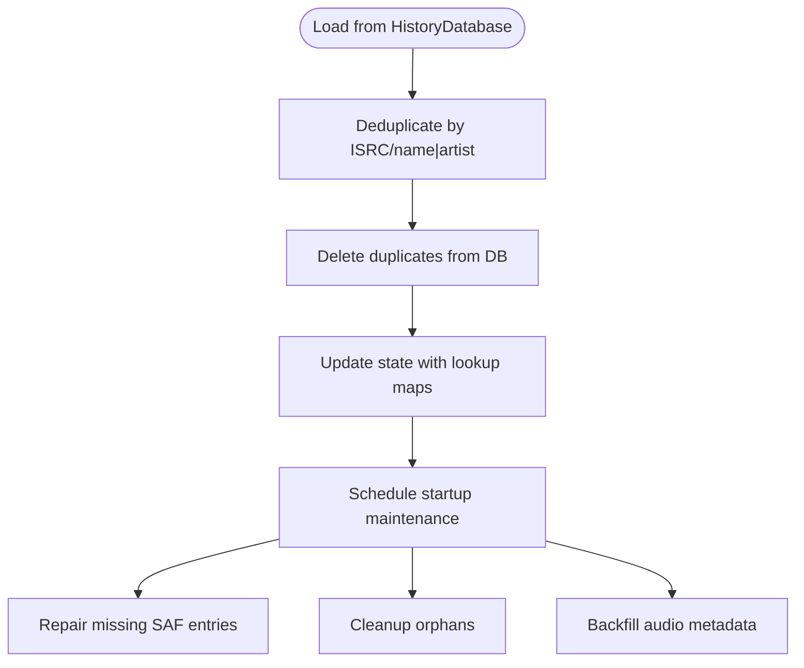

**Diagram sources**
- [download_queue_provider.dart:518-552](file://lib/providers/download_queue_provider.dart#L518-L552)
- [download_queue_provider.dart:554-627](file://lib/providers/download_queue_provider.dart#L554-L627)
- [download_queue_provider.dart:629-669](file://lib/providers/download_queue_provider.dart#L629-L669)

**Section sources**
- [download_queue_provider.dart:486-8824](file://lib/providers/download_queue_provider.dart#L486-L8824)

### Explore Provider: Conditional Provider Selection and Caching
- Home feed disabled by settings: clears state and cancels requests.
- Cache restoration: decodes and normalizes cached sections, applies provider defaults.
- Extension-driven fetch: resolves home feed extension, fetches sections, saves to cache.
- Greeting and freshness: local greeting, cache TTL enforcement.

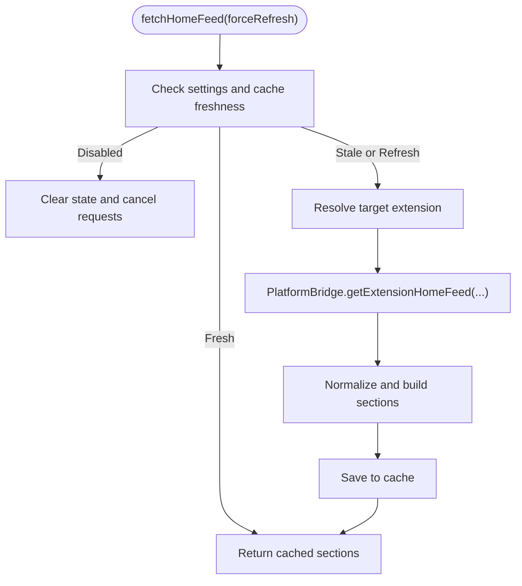

**Diagram sources**
- [explore_provider.dart:370-491](file://lib/providers/explore_provider.dart#L370-L491)
- [explore_provider.dart:273-332](file://lib/providers/explore_provider.dart#L273-L332)

**Section sources**
- [explore_provider.dart:262-497](file://lib/providers/explore_provider.dart#L262-L497)

### Library Collections Provider: Snapshot Loading and Key Migration
- Snapshot-based load: aggregates wishlist, loved, playlists, favorites from DB.
- Legacy key migration: normalizes old-style keys and ISRC-based keys.
- Corruption detection: removes corrupted loved entries and updates state.

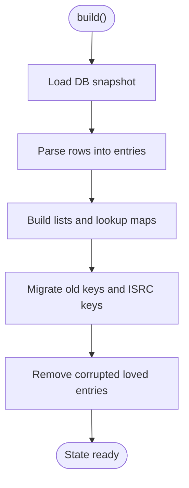

**Diagram sources**
- [library_collections_provider.dart:678-682](file://lib/providers/library_collections_provider.dart#L678-L682)
- [library_collections_provider.dart:684-796](file://lib/providers/library_collections_provider.dart#L684-L796)
- [library_collections_provider.dart:798-800](file://lib/providers/library_collections_provider.dart#L798-L800)

**Section sources**
- [library_collections_provider.dart:666-2488](file://lib/providers/library_collections_provider.dart#L666-L2488)

### Local Library Provider: Streaming Progress and Cleanup
- Scan lifecycle: starts scan, subscribes to progress stream, replaces DB contents, persists timestamps.
- Cancellation: cancels scan and cleans up subscriptions.
- Cleanup: compares scanned paths against DB to remove missing files.

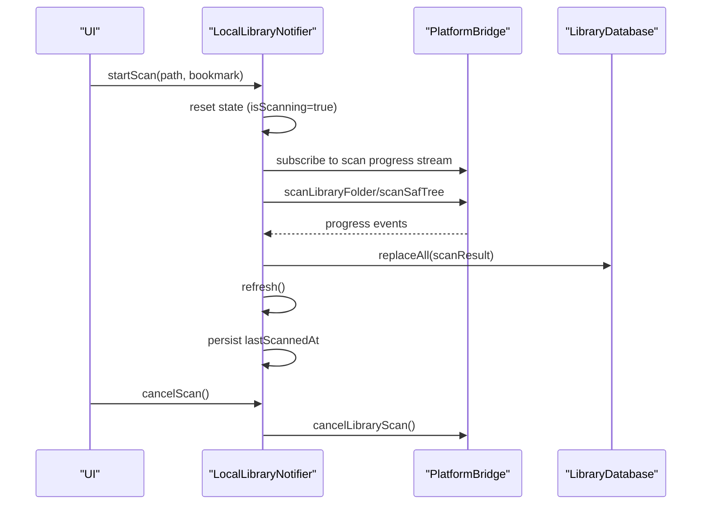

**Diagram sources**
- [local_library_provider.dart:172-227](file://lib/providers/local_library_provider.dart#L172-L227)
- [local_library_provider.dart:229-241](file://lib/providers/local_library_provider.dart#L229-L241)

**Section sources**
- [local_library_provider.dart:95-339](file://lib/providers/local_library_provider.dart#L95-L339)

### Playback Queue Provider: Queue Manipulation and Repeat Modes
- Queue state: items, current index, shuffle, repeat mode, and shuffle indices.
- Operations: next, previous, goToIndex, toggleShuffle, cycleRepeatMode, clear, removeAt.
- Backend sync: encodes queue to JSON and syncs with native layer.

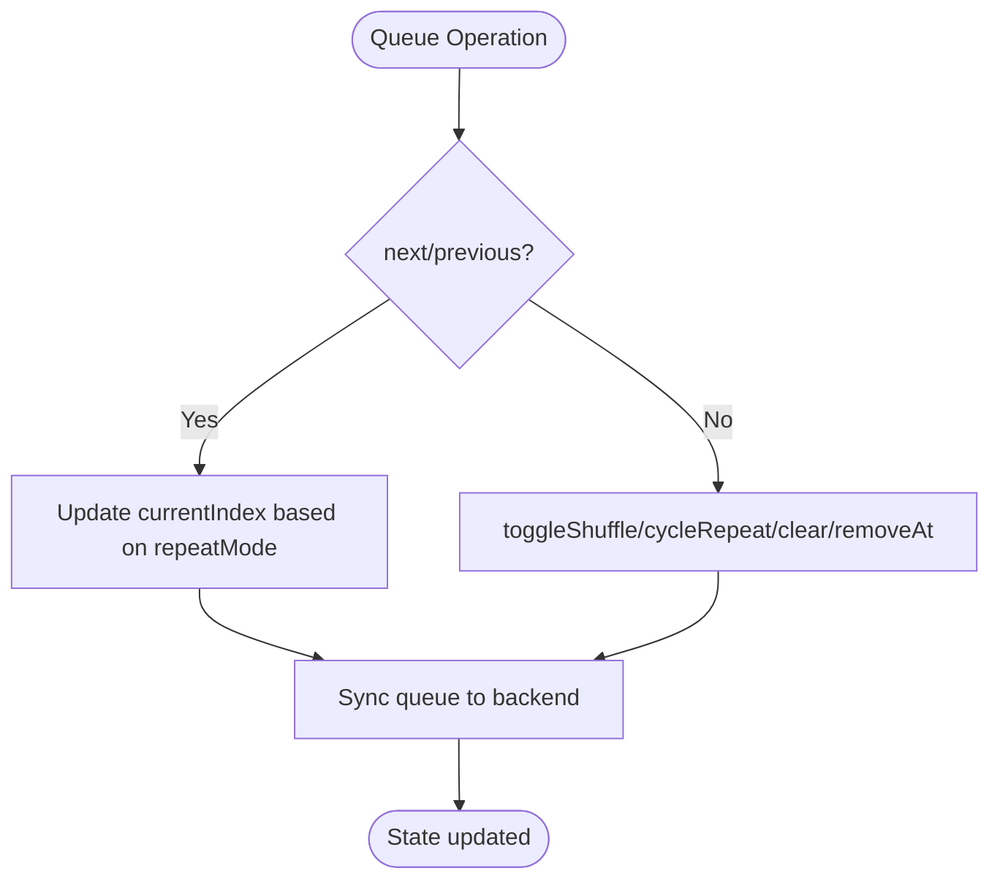

**Diagram sources**
- [playback_queue_provider.dart:144-191](file://lib/providers/playback_queue_provider.dart#L144-L191)
- [playback_queue_provider.dart:102-110](file://lib/providers/playback_queue_provider.dart#L102-L110)

**Section sources**
- [playback_queue_provider.dart:94-237](file://lib/providers/playback_queue_provider.dart#L94-L237)

### Extension Provider: Capability-Based Resolution and Health Checks
- Extension model: capabilities, settings, quality options, health checks.
- Provider resolution: resolves effective metadata/download providers based on replacements and enabled extensions.
- Health status caching: TTL-based caching for service health checks.

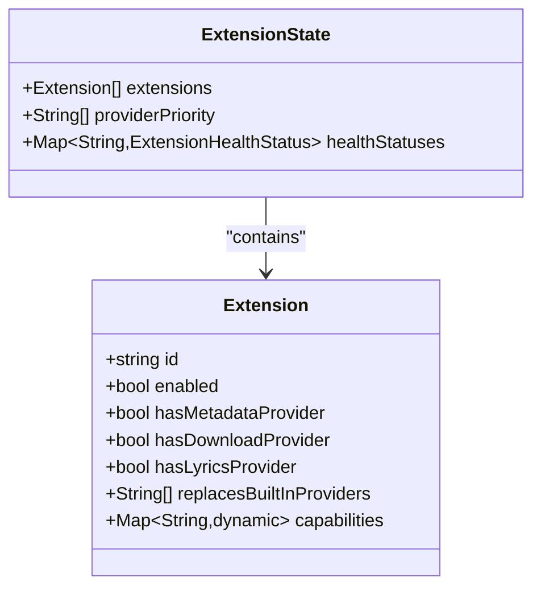

**Diagram sources**
- [extension_provider.dart:51-265](file://lib/providers/extension_provider.dart#L51-L265)
- [extension_provider.dart:741-780](file://lib/providers/extension_provider.dart#L741-L780)

**Section sources**
- [extension_provider.dart:797-1815](file://lib/providers/extension_provider.dart#L797-L1815)

### Stats Provider: Analytics Queries
- Factory provider for StatsDatabase singleton.
- FutureProvider wrappers for top tracks, albums, artists, recent plays, totals, and achievements.

**Section sources**
- [stats_provider.dart:1-35](file://lib/providers/stats_provider.dart#L1-L35)

## Dependency Analysis
- Settings drives many providers: audio player, download queue, explore, and local library.
- PlatformBridge mediates heavy operations: downloads, scans, metadata lookups, playback queue sync.
- Navigation service coordinates tab switching and active navigator state.
- Models define shared data structures used across providers.

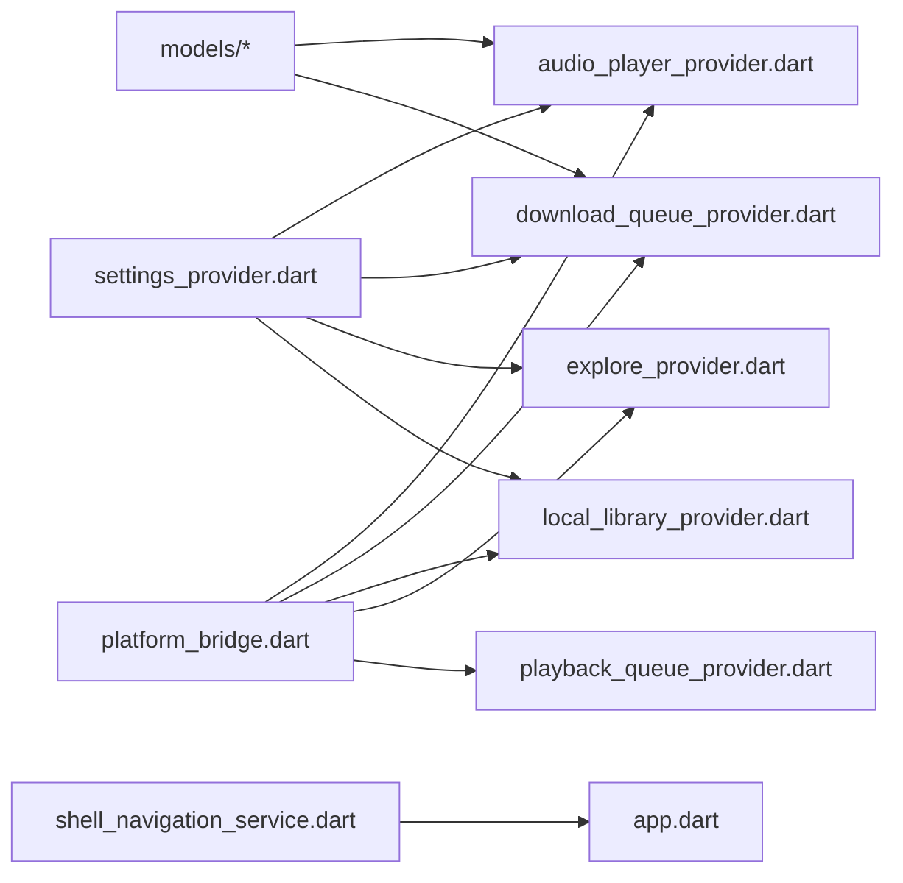

**Diagram sources**
- [settings_provider.dart:27-675](file://lib/providers/settings_provider.dart#L27-L675)
- [audio_player_provider.dart:89-651](file://lib/providers/audio_player_provider.dart#L89-L651)
- [download_queue_provider.dart:486-8824](file://lib/providers/download_queue_provider.dart#L486-L8824)
- [explore_provider.dart:262-497](file://lib/providers/explore_provider.dart#L262-L497)
- [local_library_provider.dart:95-339](file://lib/providers/local_library_provider.dart#L95-L339)
- [playback_queue_provider.dart:94-237](file://lib/providers/playback_queue_provider.dart#L94-L237)
- [platform_bridge.dart](file://lib/services/platform_bridge.dart)
- [shell_navigation_service.dart:1-32](file://lib/services/shell_navigation_service.dart#L1-L32)
- [track.dart:1-287](file://lib/models/track.dart#L1-L287)
- [settings.dart:1-317](file://lib/models/settings.dart#L1-L317)

**Section sources**
- [app.dart:13-52](file://lib/app.dart#L13-L52)
- [main.dart:22-44](file://lib/main.dart#L22-L44)

## Performance Considerations
- Eager initialization: warm up expensive providers after first frame to reduce perceived latency.
- Deferred providers: schedule warmups with staggered delays to avoid jank.
- Background maintenance: use incremental steps with cursors and batch sizes to prevent UI stalls.
- Streaming progress: use streams for long-running tasks (library scan) and cancel on dispose.
- Caching: cache home feed and metadata lookups with TTL and in-flight de-duplication.
- Memory control: bound image cache size and dispose players/timers on dispose.
- Deduplication: deduplicate large lists (history, collections) to minimize rendering overhead.

[No sources needed since this section provides general guidance]

## Troubleshooting Guide
- Settings corruption: detect and backup corrupt settings, reset to defaults, and re-run migrations.
- Player errors: inspect player error/log streams, handle timeouts, and ensure proper disposal.
- Download failures: surface errors from backend, update history state, and retry strategies.
- Explore fetch errors: clear cache on decode failure, fallback gracefully, and show user-friendly messages.
- Library scan issues: cancel scan on demand, handle subscription errors, and clean up on completion.
- Queue sync failures: log warnings when backend sync fails and retry.

**Section sources**
- [settings_provider.dart:78-86](file://lib/providers/settings_provider.dart#L78-L86)
- [audio_player_provider.dart:166-171](file://lib/providers/audio_player_provider.dart#L166-L171)
- [download_queue_provider.dart:1273-1276](file://lib/providers/download_queue_provider.dart#L1273-L1276)
- [explore_provider.dart:321-331](file://lib/providers/explore_provider.dart#L321-L331)
- [local_library_provider.dart:202-205](file://lib/providers/local_library_provider.dart#L202-L205)

## Conclusion
Bitly demonstrates advanced Riverpod patterns through robust provider composition, careful async state handling, and pragmatic persistence strategies. The codebase showcases conditional provider selection, dynamic provider creation, efficient large dataset management, and lifecycle-aware resource disposal. These patterns provide a strong foundation for scalable state management in complex applications.

[No sources needed since this section summarizes without analyzing specific files]

## Appendices

### Testing Strategies for Providers and State Management
- Unit tests for NotifierProvider: construct notifier, call methods, assert state transitions.
- FutureProvider tests: wrap with ProviderScope, override dependencies, await results.
- Streams: test stream subscriptions and cancellations; verify no leaks.
- Mock platform bridge: intercept PlatformBridge invocations to simulate success/failure.
- State snapshots: test copyWith and immutable updates to ensure correctness.
- Concurrency: test concurrent saves, fetches, and cancellations.

[No sources needed since this section provides general guidance]