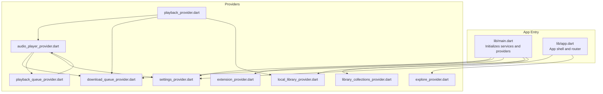
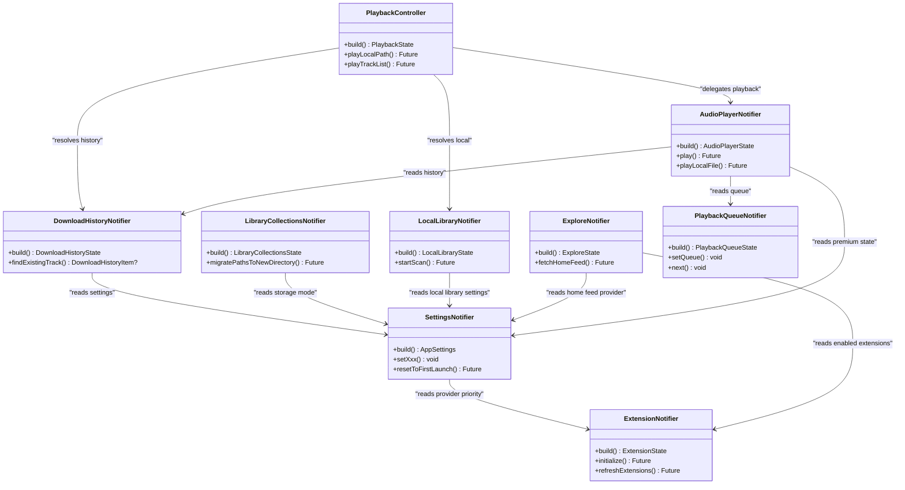
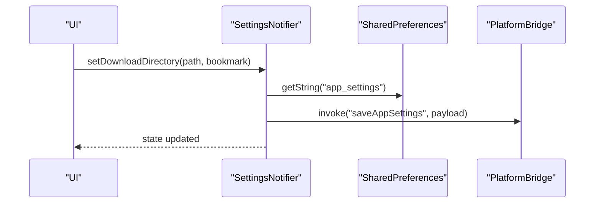
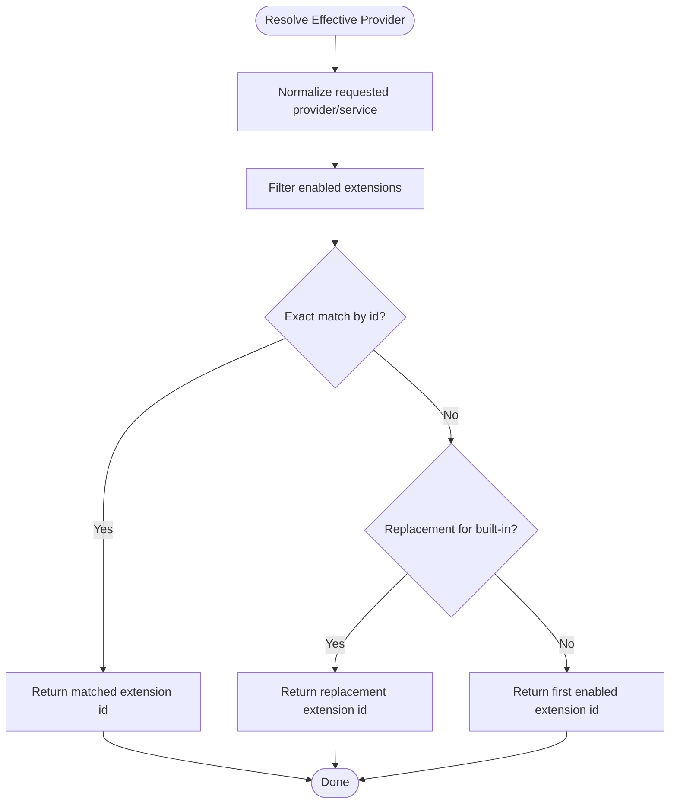
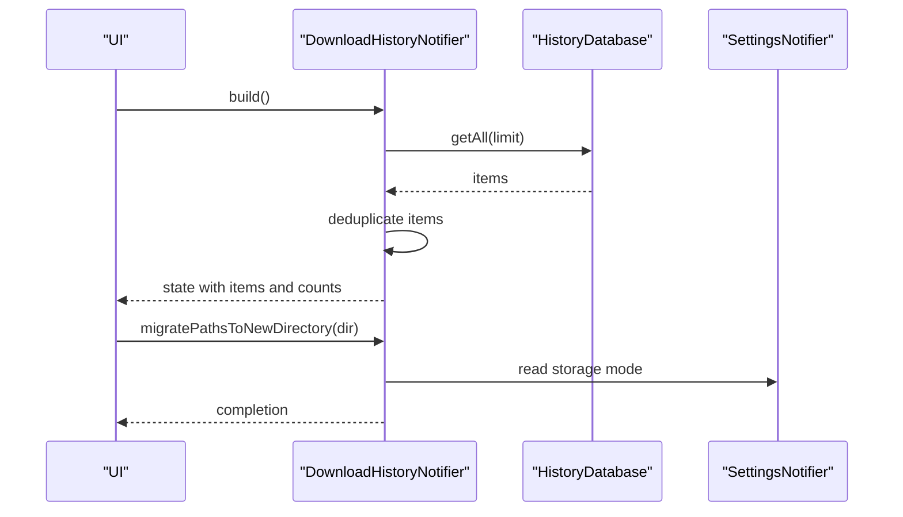
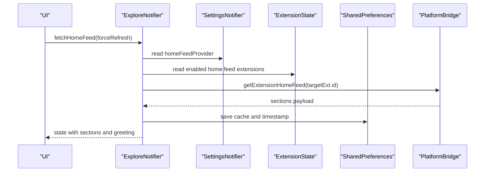
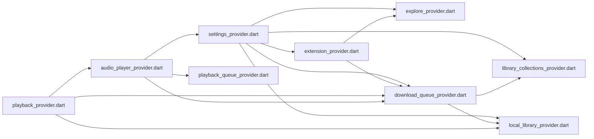

# Provider Organization and Architecture

<cite>
**Referenced Files in This Document**
- [main.dart](file://lib/main.dart)
- [app.dart](file://lib/app.dart)
- [settings_provider.dart](file://lib/providers/settings_provider.dart)
- [download_queue_provider.dart](file://lib/providers/download_queue_provider.dart)
- [extension_provider.dart](file://lib/providers/extension_provider.dart)
- [library_collections_provider.dart](file://lib/providers/library_collections_provider.dart)
- [local_library_provider.dart](file://lib/providers/local_library_provider.dart)
- [explore_provider.dart](file://lib/providers/explore_provider.dart)
- [playback_provider.dart](file://lib/providers/playback_provider.dart)
- [audio_player_provider.dart](file://lib/providers/audio_player_provider.dart)
- [playback_queue_provider.dart](file://lib/providers/playback_queue_provider.dart)
</cite>

## Table of Contents
1. [Introduction](#introduction)
2. [Project Structure](#project-structure)
3. [Core Components](#core-components)
4. [Architecture Overview](#architecture-overview)
5. [Detailed Component Analysis](#detailed-component-analysis)
6. [Dependency Analysis](#dependency-analysis)
7. [Performance Considerations](#performance-considerations)
8. [Troubleshooting Guide](#troubleshooting-guide)
9. [Conclusion](#conclusion)

## Introduction
This document explains how Riverpod providers are organized and structured in the Bitly application. It focuses on the provider directory layout, naming conventions, separation of concerns, and interdependencies across domains such as settings, downloads, library, and playback. It also covers provider composition, dependency injection patterns, shared state management, circular dependency avoidance, provider ordering, and modular design approaches.

## Project Structure
The providers live under the lib/providers directory and are imported and orchestrated from the application entry points. The main entry initializes providers and services, while the app shell wires routing and theming around providers.

**Diagram sources**
- [main.dart:10-21](file://lib/main.dart#L10-L21)
- [app.dart:9-11](file://lib/app.dart#L9-L11)
- [settings_provider.dart:1-25](file://lib/providers/settings_provider.dart#L1-L25)
- [extension_provider.dart:1-16](file://lib/providers/extension_provider.dart#L1-L16)
- [download_queue_provider.dart:1-30](file://lib/providers/download_queue_provider.dart#L1-L30)
- [library_collections_provider.dart:1-20](file://lib/providers/library_collections_provider.dart#L1-L20)
- [local_library_provider.dart:1-12](file://lib/providers/local_library_provider.dart#L1-L12)
- [explore_provider.dart:1-11](file://lib/providers/explore_provider.dart#L1-L11)
- [playback_provider.dart:1-10](file://lib/providers/playback_provider.dart#L1-L10)
- [audio_player_provider.dart:1-18](file://lib/providers/audio_player_provider.dart#L1-L18)
- [playback_queue_provider.dart:1-10](file://lib/providers/playback_queue_provider.dart#L1-L10)

**Section sources**
- [main.dart:22-44](file://lib/main.dart#L22-L44)
- [app.dart:13-52](file://lib/app.dart#L13-L52)

## Core Components
This section outlines the primary providers and their roles, grouped by domain and responsibilities.

- Settings domain
  - settingsProvider: Centralized application settings and preferences, backed by platform bridge and secure storage, with migrations and synchronization to backend services.
  - Interacts with: extension provider priorities, download fallbacks, lyrics settings, and premium state.

- Downloads and history
  - downloadHistoryProvider: Manages download history items, deduplication, and maintenance tasks (SAP repair, orphan cleanup, metadata backfill).
  - Interacts with: settings, extension provider, library collections, local library, platform bridge, and databases.

- Extensions
  - extensionProvider: Manages installed extensions, capabilities, health, and provider priority lists for metadata and download providers.
  - Interacts with: settings, platform bridge, and shared preferences.

- Library collections
  - libraryCollectionsProvider: User collections (wishlist, loved, playlists, favorites) with persistence and migration logic.
  - Interacts with: download queue provider for path migration, settings for storage mode, and databases.

- Local library
  - localLibraryProvider: Scans and indexes local audio files, exposes scanning progress, and provides search and cleanup utilities.
  - Interacts with: platform bridge for scanning, shared preferences for bookmarks/timestamps, and library database.

- Explore/home feed
  - exploreProvider: Fetches and caches home feed content from enabled extensions, with provider resolution and caching.
  - Interacts with: settings for home feed provider selection, extension provider for capabilities, and shared preferences for caching.

- Playback
  - playbackProvider: Orchestrates playback decisions across local library, download history, and audio player.
  - Interacts with: audio player provider, download history provider, and local library provider.
  - audioPlayerProvider: MediaKit-based player with video pre-fetch, lyrics pre-fetch, stats logging, and queue-aware playback.
  - Interacts with: settings, download queue provider, playback queue provider, platform bridge, and stats database.
  - playbackQueueProvider: Queue management with repeat modes, shuffle, and backend synchronization.

**Section sources**
- [settings_provider.dart:27-675](file://lib/providers/settings_provider.dart#L27-L675)
- [download_queue_provider.dart:486-800](file://lib/providers/download_queue_provider.dart#L486-L800)
- [extension_provider.dart:797-800](file://lib/providers/extension_provider.dart#L797-L800)
- [library_collections_provider.dart:666-800](file://lib/providers/library_collections_provider.dart#L666-L800)
- [local_library_provider.dart:95-285](file://lib/providers/local_library_provider.dart#L95-L285)
- [explore_provider.dart:262-497](file://lib/providers/explore_provider.dart#L262-L497)
- [playback_provider.dart:16-203](file://lib/providers/playback_provider.dart#L16-L203)
- [audio_player_provider.dart:89-651](file://lib/providers/audio_player_provider.dart#L89-L651)
- [playback_queue_provider.dart:94-237](file://lib/providers/playback_queue_provider.dart#L94-L237)

## Architecture Overview
The application uses Riverpod’s NotifierProvider and StateNotifierProvider patterns to encapsulate state and side effects. Providers are composed to form cohesive domains, with explicit dependencies and minimal coupling.

**Diagram sources**
- [settings_provider.dart:27-675](file://lib/providers/settings_provider.dart#L27-L675)
- [extension_provider.dart:797-800](file://lib/providers/extension_provider.dart#L797-L800)
- [download_queue_provider.dart:486-552](file://lib/providers/download_queue_provider.dart#L486-L552)
- [library_collections_provider.dart:666-797](file://lib/providers/library_collections_provider.dart#L666-L797)
- [local_library_provider.dart:95-285](file://lib/providers/local_library_provider.dart#L95-L285)
- [explore_provider.dart:262-497](file://lib/providers/explore_provider.dart#L262-L497)
- [playback_provider.dart:16-203](file://lib/providers/playback_provider.dart#L16-L203)
- [audio_player_provider.dart:89-651](file://lib/providers/audio_player_provider.dart#L89-L651)
- [playback_queue_provider.dart:94-237](file://lib/providers/playback_queue_provider.dart#L94-L237)

## Detailed Component Analysis

### Settings Provider
- Purpose: Centralized application settings with migrations, secure storage, and backend synchronization.
- Composition: Uses NotifierProvider with a Notifier subclass; reads/writes SharedPreferences and platform bridge; exposes setters for all settings.
- Interactions: Read by extension provider for priorities, by download queue for fallbacks, by explore for home feed selection, and by audio player for premium state.

**Diagram sources**
- [settings_provider.dart:335-348](file://lib/providers/settings_provider.dart#L335-L348)
- [settings_provider.dart:219-249](file://lib/providers/settings_provider.dart#L219-L249)

**Section sources**
- [settings_provider.dart:27-675](file://lib/providers/settings_provider.dart#L27-L675)

### Extension Provider
- Purpose: Manage extensions, capabilities, health, and provider priority lists for metadata and download providers.
- Composition: Uses NotifierProvider with a Notifier subclass; resolves effective providers based on enabled extensions and replacements.
- Interactions: Read by explore provider for home feed, by settings for priorities, and by download queue for service resolution.

**Diagram sources**
- [extension_provider.dart:267-325](file://lib/providers/extension_provider.dart#L267-L325)

**Section sources**
- [extension_provider.dart:797-800](file://lib/providers/extension_provider.dart#L797-L800)
- [extension_provider.dart:1494-1524](file://lib/providers/extension_provider.dart#L1494-L1524)

### Download Queue Provider
- Purpose: Manage download history, deduplicate entries, and perform maintenance tasks.
- Composition: Uses NotifierProvider with a Notifier subclass; maintains lookup maps for fast queries.
- Interactions: Read by playback provider for resolving local paths, by library collections for path migration, and by settings for fallbacks.

**Diagram sources**
- [download_queue_provider.dart:518-552](file://lib/providers/download_queue_provider.dart#L518-L552)
- [download_queue_provider.dart:795-800](file://lib/providers/download_queue_provider.dart#L795-L800)
- [library_collections_provider.dart:794-797](file://lib/providers/library_collections_provider.dart#L794-L797)

**Section sources**
- [download_queue_provider.dart:486-800](file://lib/providers/download_queue_provider.dart#L486-L800)
- [library_collections_provider.dart:794-800](file://lib/providers/library_collections_provider.dart#L794-L800)

### Library Collections Provider
- Purpose: Persist and manage user collections (wishlist, loved, playlists, favorites).
- Composition: Uses NotifierProvider with a Notifier subclass; performs migrations and maintains sets for fast containment checks.
- Interactions: Read by playback provider for cover/audio paths, by download queue for path migration.

**Section sources**
- [library_collections_provider.dart:666-800](file://lib/providers/library_collections_provider.dart#L666-L800)

### Local Library Provider
- Purpose: Scan and index local audio files, expose scanning progress, and provide search/cleanup utilities.
- Composition: Uses StateNotifierProvider with a StateNotifier subclass; integrates with platform bridge and shared preferences.
- Interactions: Read by playback provider for local path resolution, by settings for enabling/disabling, and by download queue for path migration.

**Section sources**
- [local_library_provider.dart:95-285](file://lib/providers/local_library_provider.dart#L95-L285)

### Explore Provider
- Purpose: Fetch and cache home feed from enabled extensions, with provider resolution and caching.
- Composition: Uses NotifierProvider with a Notifier subclass; restores from cache, resolves target extension, and saves to cache.
- Interactions: Reads settings for home feed provider and extension provider for capabilities.

**Diagram sources**
- [explore_provider.dart:370-492](file://lib/providers/explore_provider.dart#L370-L492)

**Section sources**
- [explore_provider.dart:262-497](file://lib/providers/explore_provider.dart#L262-L497)

### Playback Provider
- Purpose: Decide whether to play local files or trigger downloads, and coordinate with audio player and queues.
- Composition: Uses NotifierProvider with a Notifier subclass; resolves paths from local library and download history.
- Interactions: Reads audio player, download history, and local library providers.

**Section sources**
- [playback_provider.dart:16-203](file://lib/providers/playback_provider.dart#L16-L203)

### Audio Player Provider
- Purpose: MediaKit-based player with video pre-fetch, lyrics pre-fetch, stats logging, and queue-aware playback.
- Composition: Uses NotifierProvider with a Notifier subclass; manages player lifecycle and video controller.
- Interactions: Reads settings, playback queue, download history, and platform bridge.

**Section sources**
- [audio_player_provider.dart:89-651](file://lib/providers/audio_player_provider.dart#L89-L651)

### Playback Queue Provider
- Purpose: Manage playback queue with repeat modes, shuffle, and backend synchronization.
- Composition: Uses NotifierProvider with a Notifier subclass; maintains shuffle indices and syncs with backend.
- Interactions: Used by audio player provider.

**Section sources**
- [playback_queue_provider.dart:94-237](file://lib/providers/playback_queue_provider.dart#L94-L237)

## Dependency Analysis
This section maps provider dependencies and highlights coupling, cohesion, and potential circular dependencies.

**Diagram sources**
- [settings_provider.dart:10-15](file://lib/providers/settings_provider.dart#L10-L15)
- [extension_provider.dart:9-10](file://lib/providers/extension_provider.dart#L9-L10)
- [download_queue_provider.dart:12-15](file://lib/providers/download_queue_provider.dart#L12-L15)
- [library_collections_provider.dart:9-11](file://lib/providers/library_collections_provider.dart#L9-L11)
- [local_library_provider.dart:5-9](file://lib/providers/local_library_provider.dart#L5-L9)
- [explore_provider.dart:7-9](file://lib/providers/explore_provider.dart#L7-L9)
- [playback_provider.dart:2-6](file://lib/providers/playback_provider.dart#L2-L6)
- [audio_player_provider.dart:5-9](file://lib/providers/audio_player_provider.dart#L5-L9)
- [playback_queue_provider.dart:3-5](file://lib/providers/playback_queue_provider.dart#L3-L5)

Observations:
- Cohesion: Each provider encapsulates a single responsibility (settings, downloads, extensions, library, playback).
- Coupling: Low to moderate; dependencies are explicit and mostly read-only.
- Circular dependencies: None observed in the analyzed files; providers read each other but do not form cycles.
- Ordering: Initialization order is managed by the app entry and eager initialization; warmup timers schedule reads for deferred providers.

**Section sources**
- [main.dart:143-191](file://lib/main.dart#L143-L191)
- [app.dart:13-52](file://lib/app.dart#L13-L52)

## Performance Considerations
- Deferred initialization: Eager initialization schedules warmup timers for heavy providers (download history, library collections, local library) to avoid blocking startup.
- Caching: Explore provider caches home feed sections and timestamps; settings provider persists to both platform bridge and SharedPreferences.
- Background maintenance: Download history notifier performs incremental maintenance (SAP repair, orphan cleanup, metadata backfill) after initial load.
- Lookup maps: Download history and library collections maintain lookup maps for O(1) containment checks and fast queries.
- Parallel operations: Audio player pre-fetches video and lyrics concurrently with playback preparation.

[No sources needed since this section provides general guidance]

## Troubleshooting Guide
Common issues and remedies:
- Settings corruption: Settings provider detects and resets corrupted settings, backing up the original JSON and falling back to defaults.
- Premium state drift: Settings provider periodically validates premium state against backend and updates state accordingly.
- Explore cache invalidation: On failure to restore cache, the provider removes invalid entries and logs warnings.
- Download history inconsistencies: Download history notifier deduplicates entries and cleans up duplicates from the database.
- Library scan progress: Local library notifier listens to platform bridge streams and updates state with progress and counts.

**Section sources**
- [settings_provider.dart:51-127](file://lib/providers/settings_provider.dart#L51-L127)
- [settings_provider.dart:129-143](file://lib/providers/settings_provider.dart#L129-L143)
- [explore_provider.dart:273-332](file://lib/providers/explore_provider.dart#L273-L332)
- [download_queue_provider.dart:518-552](file://lib/providers/download_queue_provider.dart#L518-L552)
- [local_library_provider.dart:190-206](file://lib/providers/local_library_provider.dart#L190-L206)

## Conclusion
The Bitly application employs a clean, modular Riverpod architecture with strong separation of concerns across domains. Providers are organized by domain, use consistent naming and composition patterns, and minimize coupling through explicit dependencies. Deferred initialization, caching, and background maintenance ensure responsive UX. The design avoids circular dependencies and supports scalable evolution of features like extensions and playback.