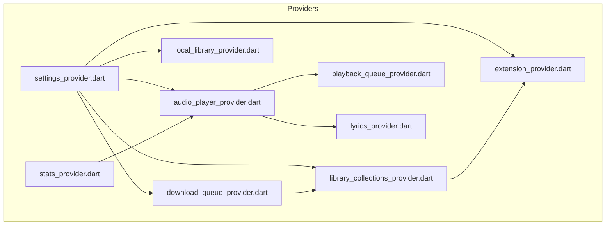
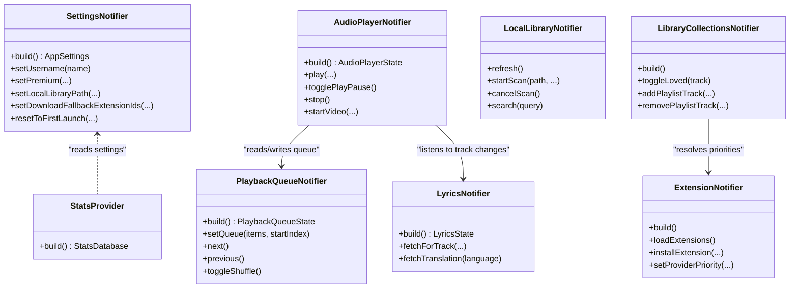
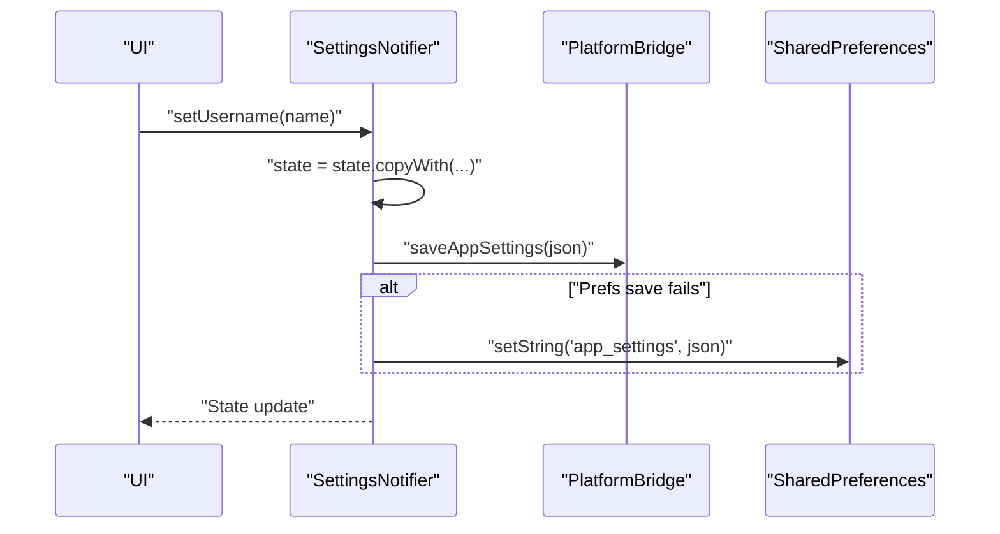
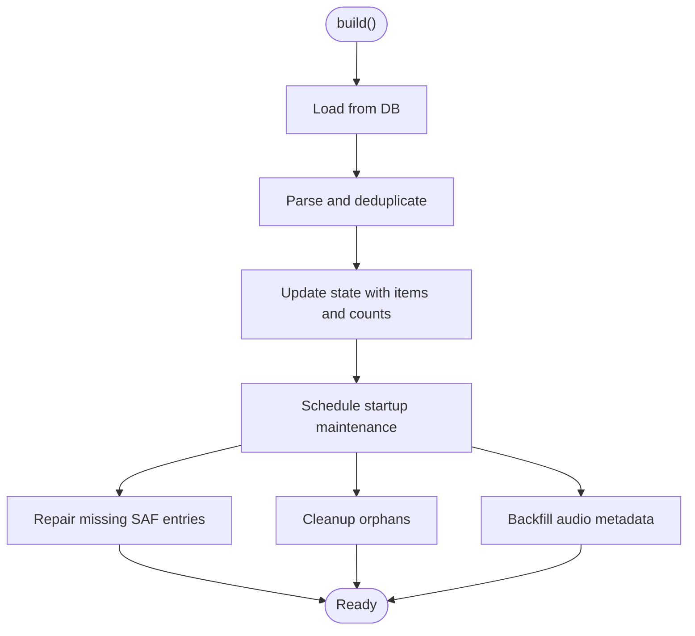
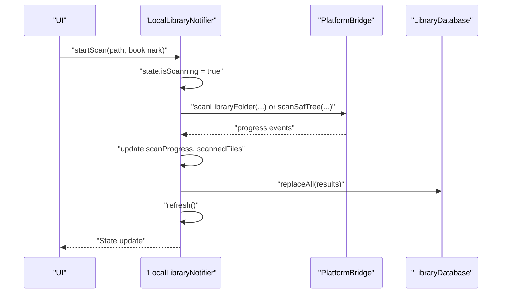
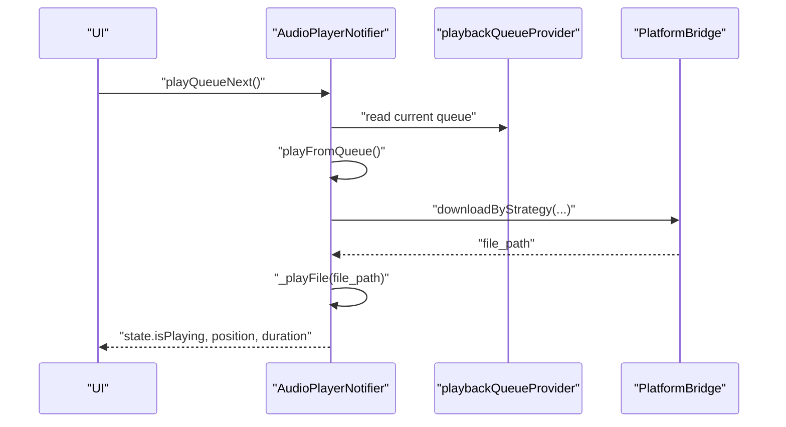
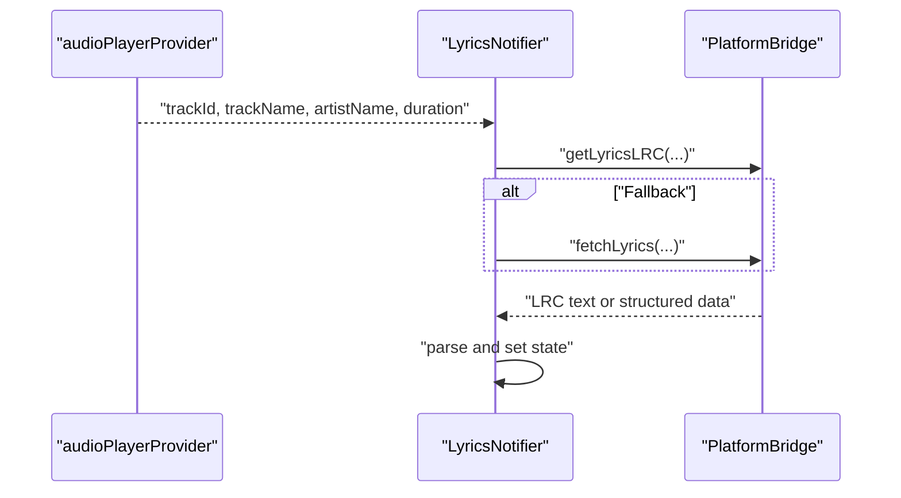
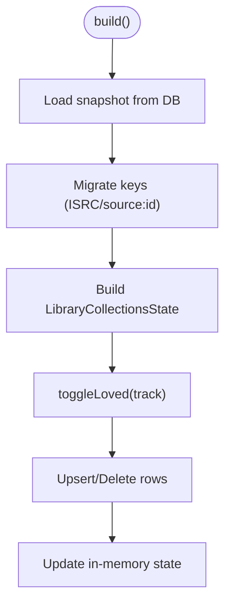
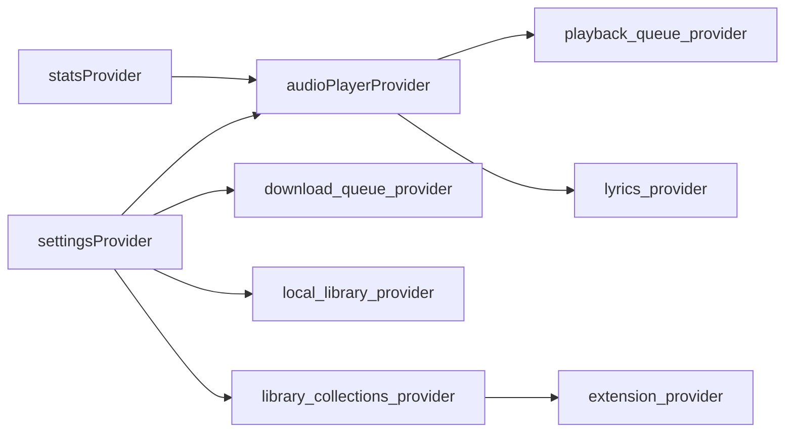

# Provider Types and Patterns

<cite>
**Referenced Files in This Document**
- [settings_provider.dart](file://lib/providers/settings_provider.dart)
- [download_queue_provider.dart](file://lib/providers/download_queue_provider.dart)
- [local_library_provider.dart](file://lib/providers/local_library_provider.dart)
- [audio_player_provider.dart](file://lib/providers/audio_player_provider.dart)
- [playback_queue_provider.dart](file://lib/providers/playback_queue_provider.dart)
- [lyrics_provider.dart](file://lib/providers/lyrics_provider.dart)
- [library_collections_provider.dart](file://lib/providers/library_collections_provider.dart)
- [extension_provider.dart](file://lib/providers/extension_provider.dart)
- [stats_provider.dart](file://lib/providers/stats_provider.dart)
</cite>

## Table of Contents
1. [Introduction](#introduction)
2. [Project Structure](#project-structure)
3. [Core Components](#core-components)
4. [Architecture Overview](#architecture-overview)
5. [Detailed Component Analysis](#detailed-component-analysis)
6. [Dependency Analysis](#dependency-analysis)
7. [Performance Considerations](#performance-considerations)
8. [Troubleshooting Guide](#troubleshooting-guide)
9. [Conclusion](#conclusion)

## Introduction
This document explains the Riverpod provider types and implementation patterns used in Bitly, focusing on how the app manages configuration state, asynchronous downloads, and complex UI state coordination. It compares Provider, AsyncNotifier, StateProvider, and StateNotifier, and demonstrates when to use each with concrete examples from the codebase. It also covers initialization, state updates, lifecycle management, cleanup, and performance implications.

## Project Structure
Bitly organizes providers under lib/providers. Each provider encapsulates a domain concern:
- Configuration and settings: settings_provider.dart
- Download queue and history: download_queue_provider.dart
- Local library scanning and indexing: local_library_provider.dart
- Playback and lyrics: audio_player_provider.dart, lyrics_provider.dart, playback_queue_provider.dart
- Collections and extension orchestration: library_collections_provider.dart, extension_provider.dart
- Statistics and analytics: stats_provider.dart

**Diagram sources**
- [settings_provider.dart](file://lib/providers/settings_provider.dart)
- [download_queue_provider.dart](file://lib/providers/download_queue_provider.dart)
- [local_library_provider.dart](file://lib/providers/local_library_provider.dart)
- [audio_player_provider.dart](file://lib/providers/audio_player_provider.dart)
- [playback_queue_provider.dart](file://lib/providers/playback_queue_provider.dart)
- [lyrics_provider.dart](file://lib/providers/lyrics_provider.dart)
- [library_collections_provider.dart](file://lib/providers/library_collections_provider.dart)
- [extension_provider.dart](file://lib/providers/extension_provider.dart)
- [stats_provider.dart](file://lib/providers/stats_provider.dart)

**Section sources**
- [settings_provider.dart](file://lib/providers/settings_provider.dart)
- [download_queue_provider.dart](file://lib/providers/download_queue_provider.dart)
- [local_library_provider.dart](file://lib/providers/local_library_provider.dart)
- [audio_player_provider.dart](file://lib/providers/audio_player_provider.dart)
- [playback_queue_provider.dart](file://lib/providers/playback_queue_provider.dart)
- [lyrics_provider.dart](file://lib/providers/lyrics_provider.dart)
- [library_collections_provider.dart](file://lib/providers/library_collections_provider.dart)
- [extension_provider.dart](file://lib/providers/extension_provider.dart)
- [stats_provider.dart](file://lib/providers/stats_provider.dart)

## Core Components
This section contrasts the four Riverpod provider types used in Bitly and highlights their roles:
- Notifier<TState>: General-purpose notifier with imperative state updates and lifecycle hooks. Used for complex, long-lived state with side effects.
- StateNotifier<TState>: Specialized notifier for UI-centric state with frequent small updates.
- FutureProvider<T>: Asynchronous initialization/loading of immutable data.
- Provider<T>: Singleton-like services or factories that expose shared instances.

Examples from the codebase:
- NotifierProvider: settingsProvider, audioPlayerProvider, lyricsProvider, libraryCollectionsProvider
- StateNotifierProvider: localLibraryProvider
- FutureProvider: totalStatsProvider, topTracksProvider, recentPlaysProvider, achievementProgressProvider, unlockedSecretsProvider
- Provider: statsProvider

**Section sources**
- [settings_provider.dart](file://lib/providers/settings_provider.dart)
- [audio_player_provider.dart](file://lib/providers/audio_player_provider.dart)
- [lyrics_provider.dart](file://lib/providers/lyrics_provider.dart)
- [local_library_provider.dart](file://lib/providers/local_library_provider.dart)
- [library_collections_provider.dart](file://lib/providers/library_collections_provider.dart)
- [stats_provider.dart](file://lib/providers/stats_provider.dart)

## Architecture Overview
Bitly’s state architecture centers around Notifier-based providers for complex, reactive state machines and StateNotifier for UI-focused state. Asynchronous initialization is handled by FutureProvider, while singleton services are exposed via Provider. Providers coordinate across domains (playback, downloads, libraries, extensions).

**Diagram sources**
- [settings_provider.dart](file://lib/providers/settings_provider.dart)
- [audio_player_provider.dart](file://lib/providers/audio_player_provider.dart)
- [lyrics_provider.dart](file://lib/providers/lyrics_provider.dart)
- [local_library_provider.dart](file://lib/providers/local_library_provider.dart)
- [library_collections_provider.dart](file://lib/providers/library_collections_provider.dart)
- [extension_provider.dart](file://lib/providers/extension_provider.dart)
- [playback_queue_provider.dart](file://lib/providers/playback_queue_provider.dart)
- [stats_provider.dart](file://lib/providers/stats_provider.dart)

## Detailed Component Analysis

### Settings Provider (Notifier)
- Type: NotifierProvider<SettingsNotifier, AppSettings>
- Purpose: Central configuration and preferences, including premium state, storage modes, download settings, and UI preferences.
- Initialization: Loads from a native bridge and SharedPreferences, normalizes values, runs migrations, and synchronizes backend settings.
- Updates: Exposes setters for each setting; persists to native bridge and SharedPreferences; triggers backend sync for certain settings.
- Lifecycle: Uses a ValueNotifier to signal initialization completion; includes periodic premium validation.

**Diagram sources**
- [settings_provider.dart](file://lib/providers/settings_provider.dart)

**Section sources**
- [settings_provider.dart](file://lib/providers/settings_provider.dart)

### Download Queue Provider (Notifier)
- Type: NotifierProvider<DownloadHistoryNotifier, DownloadHistoryState>
- Purpose: Manages download history, deduplication, startup maintenance, and SAF repair tasks.
- Initialization: Loads from a database asynchronously; deduplicates entries; schedules maintenance steps.
- Updates: Mutates state to reflect loaded items, counts, and lookup indices; performs incremental cleanup and metadata backfill.
- Lifecycle: Schedules maintenance after initial load; uses cursors to paginate work across launches.

**Diagram sources**
- [download_queue_provider.dart](file://lib/providers/download_queue_provider.dart)

**Section sources**
- [download_queue_provider.dart](file://lib/providers/download_queue_provider.dart)

### Local Library Provider (StateNotifier)
- Type: StateNotifierProvider<LocalLibraryNotifier, LocalLibraryState>
- Purpose: Indexes and exposes local music library, supports scanning, search, and cleanup.
- Initialization: Constructor triggers refresh; state toggles loading flags.
- Updates: Refreshes from database; starts/stops scan streams; updates progress; bumps version counters.
- Lifecycle: Subscribes to platform scan progress; cancels subscriptions on completion/cancel; writes last-scanned timestamps.

**Diagram sources**
- [local_library_provider.dart](file://lib/providers/local_library_provider.dart)

**Section sources**
- [local_library_provider.dart](file://lib/providers/local_library_provider.dart)

### Audio Player Provider (Notifier)
- Type: NotifierProvider<AudioPlayerNotifier, AudioPlayerState>
- Purpose: Orchestrates playback, video pre-fetch, lyrics pre-fetch, and statistics logging.
- Initialization: Creates and configures a media player; subscribes to position/duration/completion/error logs; disposes on dispose.
- Updates: Plays local or remote files; handles auto-advance; logs plays; manages video controller lifecycle.
- Lifecycle: Registers onDispose to cancel timers and dispose players; clears state on stop.

**Diagram sources**
- [audio_player_provider.dart](file://lib/providers/audio_player_provider.dart)
- [playback_queue_provider.dart](file://lib/providers/playback_queue_provider.dart)

**Section sources**
- [audio_player_provider.dart](file://lib/providers/audio_player_provider.dart)
- [playback_queue_provider.dart](file://lib/providers/playback_queue_provider.dart)

### Lyrics Provider (Notifier)
- Type: NotifierProvider<LyricsNotifier, LyricsState>
- Purpose: Fetches synchronized/un-synced lyrics and translations on track change.
- Initialization: Listens to audio player provider; triggers fetch when track changes.
- Updates: Parses LRC lines; sets sync type; supports translation fetching.

**Diagram sources**
- [lyrics_provider.dart](file://lib/providers/lyrics_provider.dart)
- [audio_player_provider.dart](file://lib/providers/audio_player_provider.dart)

**Section sources**
- [lyrics_provider.dart](file://lib/providers/lyrics_provider.dart)
- [audio_player_provider.dart](file://lib/providers/audio_player_provider.dart)

### Library Collections Provider (Notifier)
- Type: NotifierProvider<LibraryCollectionsNotifier, LibraryCollectionsState>
- Purpose: Manages user playlists, favorites, and collection snapshots; migrates legacy keys; resolves audio/cover paths.
- Initialization: Loads snapshot from database; migrates keys; exposes helpers for existence checks and lookups.
- Updates: Toggles loved items; adds/removes playlist tracks; updates in-memory indices; persists to database.

**Diagram sources**
- [library_collections_provider.dart](file://lib/providers/library_collections_provider.dart)

**Section sources**
- [library_collections_provider.dart](file://lib/providers/library_collections_provider.dart)

### Extension Provider (Notifier)
- Type: NotifierProvider<ExtensionNotifier, ExtensionState>
- Purpose: Loads, installs, and prioritizes extensions; resolves effective providers for metadata and downloads; exposes health checks.
- Initialization: Loads extensions and priorities; caches health statuses; exposes helpers to resolve effective services.
- Updates: Installs/uninstalls extensions; updates provider priority lists; exposes capability queries.

**Section sources**
- [extension_provider.dart](file://lib/providers/extension_provider.dart)

### Stats Provider (Provider + FutureProvider)
- Type: Provider<StatsDatabase>, FutureProvider<T>
- Purpose: Exposes a singleton StatsDatabase and async stats endpoints (totals, top lists, recent plays, achievements, secrets).
- Usage: Injected by Provider; queried by FutureProvider for UI rendering.

**Section sources**
- [stats_provider.dart](file://lib/providers/stats_provider.dart)

## Dependency Analysis
Providers depend on each other and on services:
- Settings influences playback, downloads, and library paths.
- Audio player depends on playback queue and lyrics providers.
- Library collections coordinate with extensions for provider resolution.
- Stats provider is consumed by audio player for play logging and achievements.

**Diagram sources**
- [settings_provider.dart](file://lib/providers/settings_provider.dart)
- [audio_player_provider.dart](file://lib/providers/audio_player_provider.dart)
- [playback_queue_provider.dart](file://lib/providers/playback_queue_provider.dart)
- [lyrics_provider.dart](file://lib/providers/lyrics_provider.dart)
- [library_collections_provider.dart](file://lib/providers/library_collections_provider.dart)
- [extension_provider.dart](file://lib/providers/extension_provider.dart)
- [stats_provider.dart](file://lib/providers/stats_provider.dart)

**Section sources**
- [settings_provider.dart](file://lib/providers/settings_provider.dart)
- [audio_player_provider.dart](file://lib/providers/audio_player_provider.dart)
- [playback_queue_provider.dart](file://lib/providers/playback_queue_provider.dart)
- [lyrics_provider.dart](file://lib/providers/lyrics_provider.dart)
- [library_collections_provider.dart](file://lib/providers/library_collections_provider.dart)
- [extension_provider.dart](file://lib/providers/extension_provider.dart)
- [stats_provider.dart](file://lib/providers/stats_provider.dart)

## Performance Considerations
- Prefer StateNotifier for UI-centric state to minimize unnecessary rebuilds caused by frequent small updates.
- Use Notifier for complex state machines with side effects; ensure async operations are awaited and canceled appropriately to prevent leaks.
- Defer heavy initialization to FutureProvider or Notifier.build to avoid blocking the UI thread.
- Batch writes and updates (e.g., settings persistence) to reduce IO overhead.
- Cancel subscriptions and timers in onDispose to prevent memory leaks.
- Use lookup indices and immutable snapshots for fast reads in large datasets (e.g., library collections).

## Troubleshooting Guide
Common issues and remedies:
- Settings corruption: Settings provider backs up corrupted settings and resets to defaults; verify backup keys and migration logic.
- Download failures: Verify native bridge calls and retry strategies; check SharedPreferences persistence.
- Library scan hangs: Ensure progress subscription cancellation on cancel/finish; confirm platform bridge signals are handled.
- Player errors: Inspect player error streams and logs; verify media availability and timeouts.
- Lyrics fetch failures: Fallback from LRC to structured fetch; handle empty results gracefully.

**Section sources**
- [settings_provider.dart](file://lib/providers/settings_provider.dart)
- [download_queue_provider.dart](file://lib/providers/download_queue_provider.dart)
- [local_library_provider.dart](file://lib/providers/local_library_provider.dart)
- [audio_player_provider.dart](file://lib/providers/audio_player_provider.dart)
- [lyrics_provider.dart](file://lib/providers/lyrics_provider.dart)

## Conclusion
Bitly leverages Riverpod’s provider types strategically:
- Notifier for complex, long-running state machines (settings, downloads, collections, audio player).
- StateNotifier for UI-centric state (local library).
- FutureProvider for asynchronous initialization and immutable data.
- Provider for singleton services.

Adhering to these patterns ensures predictable lifecycles, efficient updates, and maintainable cross-domain coordination.