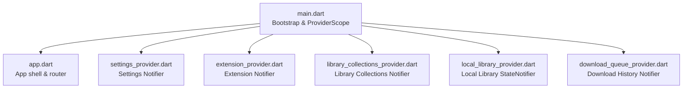
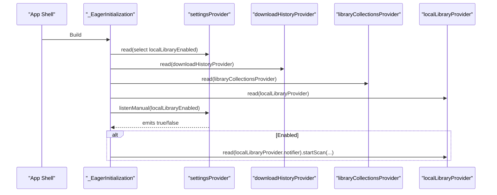
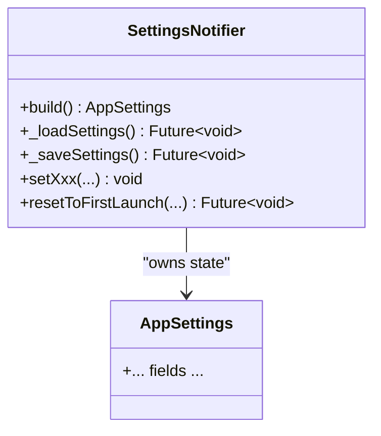
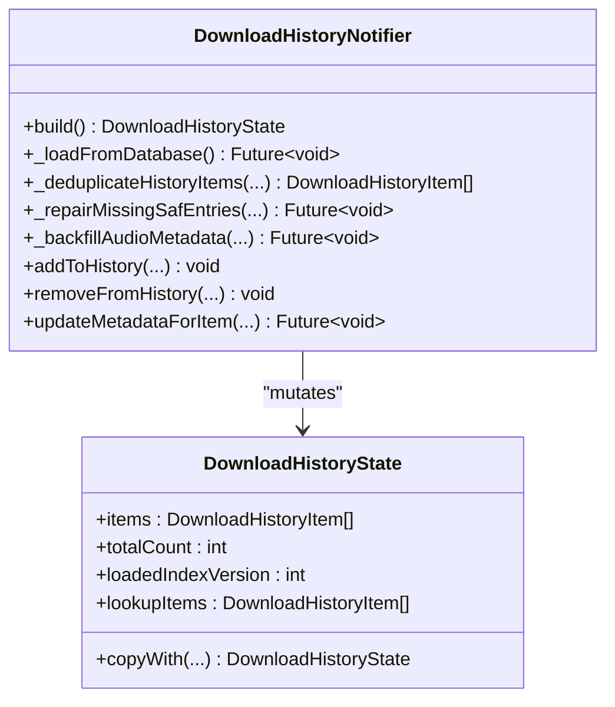
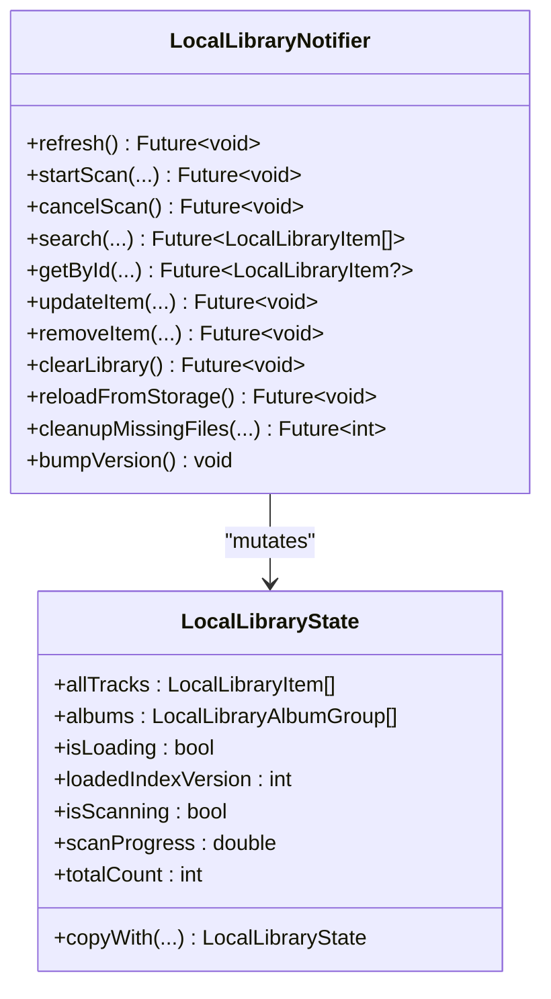
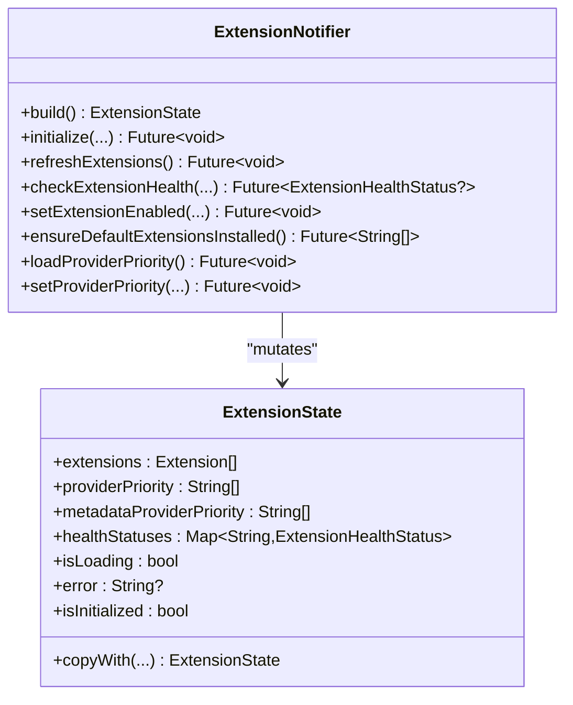
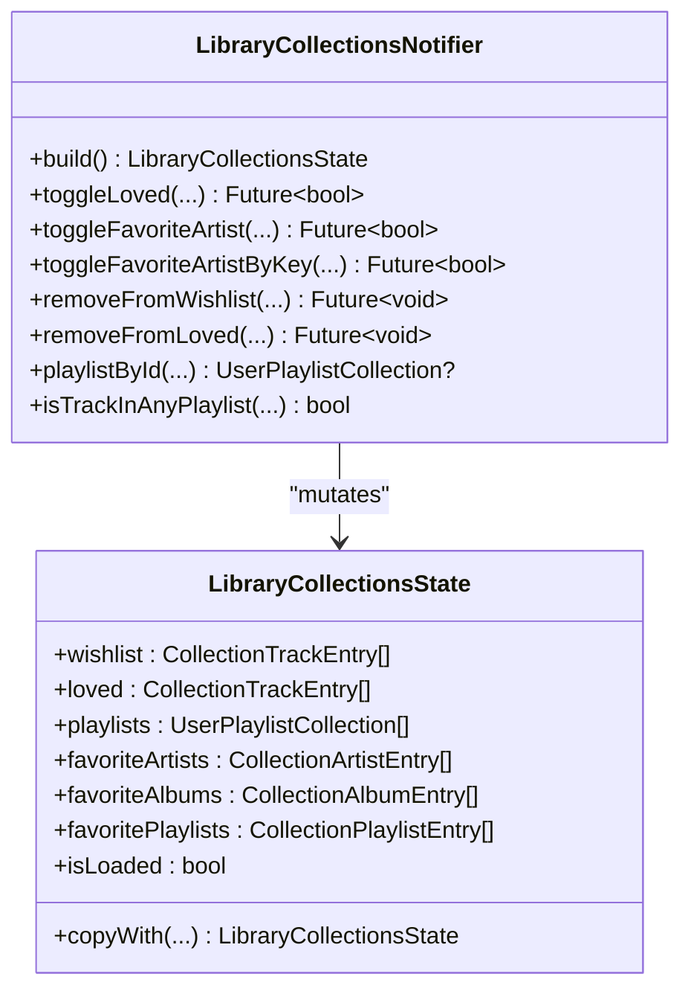
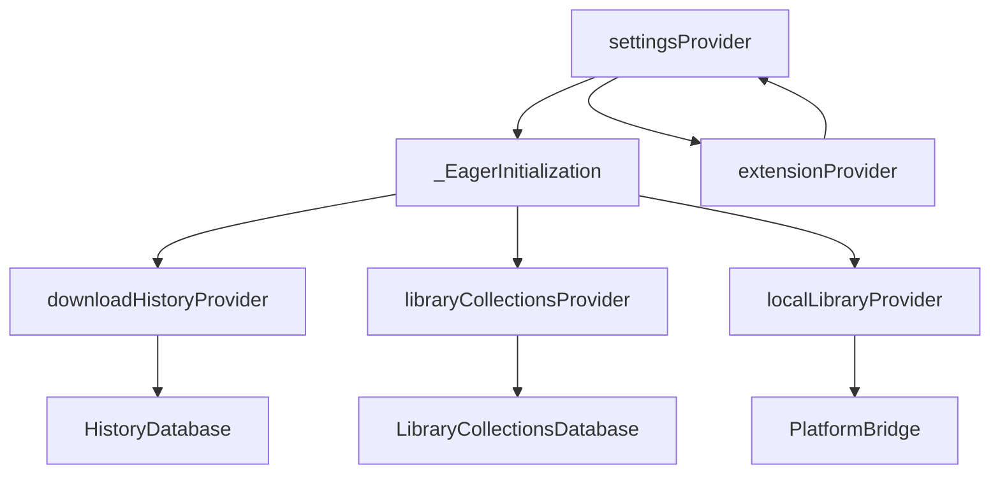

# State Management with Riverpod

<cite>
**Referenced Files in This Document**
- [main.dart](file://lib/main.dart)
- [app.dart](file://lib/app.dart)
- [settings_provider.dart](file://lib/providers/settings_provider.dart)
- [download_queue_provider.dart](file://lib/providers/download_queue_provider.dart)
- [local_library_provider.dart](file://lib/providers/local_library_provider.dart)
- [extension_provider.dart](file://lib/providers/extension_provider.dart)
- [library_collections_provider.dart](file://lib/providers/library_collections_provider.dart)
</cite>

## Table of Contents
1. [Introduction](#introduction)
2. [Project Structure](#project-structure)
3. [Core Components](#core-components)
4. [Architecture Overview](#architecture-overview)
5. [Detailed Component Analysis](#detailed-component-analysis)
6. [Dependency Analysis](#dependency-analysis)
7. [Performance Considerations](#performance-considerations)
8. [Troubleshooting Guide](#troubleshooting-guide)
9. [Conclusion](#conclusion)

## Introduction
This document explains the Riverpod state management implementation in the application. It focuses on provider patterns, state management architecture, and reactive UI updates. It documents the provider hierarchy, subscription management, and state synchronization across components. Concrete examples are drawn from settings_provider.dart, download_queue_provider.dart, and local_library_provider.dart. Differences between providers, notifiers, and selectors are clarified, along with state persistence, lifecycle, and performance considerations. Best practices for provider organization, state normalization, and avoiding unnecessary rebuilds are included, alongside troubleshooting and debugging techniques.

## Project Structure
Riverpod is integrated at the application bootstrap via ProviderScope, ensuring all providers are available globally. Initialization logic eagerly warms up selected providers and subscribes to settings-driven toggles to enable optional subsystems like the local library.

**Diagram sources**
- [main.dart:22-44](file://lib/main.dart#L22-L44)
- [app.dart:54-97](file://lib/app.dart#L54-L97)

**Section sources**
- [main.dart:22-44](file://lib/main.dart#L22-L44)
- [app.dart:54-97](file://lib/app.dart#L54-L97)

## Core Components
This section introduces the three key state management patterns used in the codebase:
- Notifier: A mutable state provider that owns and mutates state, commonly used for settings and complex histories.
- StateNotifier: A lightweight mutable state provider for UI-centric state, used for local library.
- FutureProvider: A read-only provider that computes asynchronous results, used for localized queries.

Examples:
- Settings Notifier: [settings_provider.dart:27-675](file://lib/providers/settings_provider.dart#L27-L675)
- Local Library StateNotifier: [local_library_provider.dart:95-289](file://lib/providers/local_library_provider.dart#L95-L289)
- Local Library Cover Batch Provider: [local_library_provider.dart:317-339](file://lib/providers/local_library_provider.dart#L317-L339)

Key provider definitions:
- Settings: [settings_provider.dart:672-675](file://lib/providers/settings_provider.dart#L672-L675)
- Local Library: [local_library_provider.dart:287-289](file://lib/providers/local_library_provider.dart#L287-L289)
- Local Library Cover: [local_library_provider.dart:317-339](file://lib/providers/local_library_provider.dart#L317-L339)

**Section sources**
- [settings_provider.dart:27-675](file://lib/providers/settings_provider.dart#L27-L675)
- [local_library_provider.dart:95-289](file://lib/providers/local_library_provider.dart#L95-L289)
- [local_library_provider.dart:317-339](file://lib/providers/local_library_provider.dart#L317-L339)

## Architecture Overview
The state architecture centers on a global ProviderScope that initializes providers and orchestrates eager loading. The main initialization widget subscribes to settings to conditionally warm up providers and trigger scans. Providers communicate through Riverpod’s reactive subscriptions and selective reads.

**Diagram sources**
- [main.dart:143-191](file://lib/main.dart#L143-L191)
- [main.dart:226-233](file://lib/main.dart#L226-L233)

**Section sources**
- [main.dart:143-191](file://lib/main.dart#L143-L191)
- [main.dart:226-233](file://lib/main.dart#L226-L233)

## Detailed Component Analysis

### Settings Provider (Notifier)
The settings provider encapsulates application-wide preferences and user preferences. It uses a Notifier to manage AppSettings state, loads from a native bridge and shared preferences, persists changes, and synchronizes external settings.

Highlights:
- State ownership and mutation via Notifier<AppSettings>.
- Dual persistence: native bridge and SharedPreferences.
- Reactive initialization notifier to signal readiness.
- Extensive setters for granular updates (audio quality, download directory, lyrics, etc.).
- Synchronization to backend services (lyrics, network compatibility, extension fallbacks).

**Diagram sources**
- [settings_provider.dart:27-675](file://lib/providers/settings_provider.dart#L27-L675)

**Section sources**
- [settings_provider.dart:27-675](file://lib/providers/settings_provider.dart#L27-L675)

### Download Queue Provider (Notifier)
The download queue provider manages download history and performs maintenance tasks. It uses a Notifier to maintain DownloadHistoryState, deduplicates entries, repairs SAF entries, and backfills audio metadata.

Highlights:
- DownloadHistoryState with lookup maps for fast access.
- Deduplication by ISRC and name|artist keys.
- Startup maintenance: SAF repair, orphan cleanup, metadata backfill.
- Asynchronous updates with in-memory state and database persistence.

**Diagram sources**
- [download_queue_provider.dart:486-670](file://lib/providers/download_queue_provider.dart#L486-L670)
- [download_queue_provider.dart:362-484](file://lib/providers/download_queue_provider.dart#L362-L484)

**Section sources**
- [download_queue_provider.dart:486-670](file://lib/providers/download_queue_provider.dart#L486-L670)
- [download_queue_provider.dart:362-484](file://lib/providers/download_queue_provider.dart#L362-L484)

### Local Library Provider (StateNotifier)
The local library provider manages the device-side music library. It uses a StateNotifier to expose LocalLibraryState and offers scanning, search, and cleanup operations.

Highlights:
- LocalLibraryState with loading flags, progress, and counts.
- Scanning via platform bridge with progress streaming.
- Refresh and bump-version mechanisms to trigger UI updates.
- Queries by ID, ISRC, and name|artist.

**Diagram sources**
- [local_library_provider.dart:95-289](file://lib/providers/local_library_provider.dart#L95-L289)
- [local_library_provider.dart:14-93](file://lib/providers/local_library_provider.dart#L14-L93)

**Section sources**
- [local_library_provider.dart:95-289](file://lib/providers/local_library_provider.dart#L95-L289)
- [local_library_provider.dart:14-93](file://lib/providers/local_library_provider.dart#L14-L93)

### Extension Provider (Notifier)
The extension provider manages third-party extensions, their health, priorities, and settings. It uses a Notifier to maintain ExtensionState and reconciles settings with enabled extensions.

Highlights:
- ExtensionState with lists of extensions and health statuses.
- Priority reconciliation for download and metadata providers.
- Health checks with caching and refresh scheduling.
- Lifecycle-aware cleanup.

**Diagram sources**
- [extension_provider.dart:797-1599](file://lib/providers/extension_provider.dart#L797-L1599)
- [extension_provider.dart:741-780](file://lib/providers/extension_provider.dart#L741-L780)

**Section sources**
- [extension_provider.dart:797-1599](file://lib/providers/extension_provider.dart#L797-L1599)
- [extension_provider.dart:741-780](file://lib/providers/extension_provider.dart#L741-L780)

### Library Collections Provider (Notifier)
The library collections provider maintains user favorites, playlists, and related metadata. It uses a Notifier to manage LibraryCollectionsState and performs migrations and local cover extraction.

Highlights:
- LibraryCollectionsState with sets for fast membership checks.
- Toggle operations for loved/wishlist and favorite artists/playlists.
- Migration of legacy keys to normalized per-source keys.
- Local cover extraction and folder cleanup on unlike.

**Diagram sources**
- [library_collections_provider.dart:666-805](file://lib/providers/library_collections_provider.dart#L666-L805)
- [library_collections_provider.dart:403-620](file://lib/providers/library_collections_provider.dart#L403-L620)

**Section sources**
- [library_collections_provider.dart:666-805](file://lib/providers/library_collections_provider.dart#L666-L805)
- [library_collections_provider.dart:403-620](file://lib/providers/library_collections_provider.dart#L403-L620)

### Provider Patterns and Selection
- Providers vs Notifiers vs Selectors:
  - Provider<T>: Stateless, read-only factories. Used for router creation in app shell.
  - Notifier<TState>: Mutable state with imperative updates. Used for settings and histories.
  - StateNotifier<TState>: Lightweight mutable state for UI-centric data. Used for local library.
  - FutureProvider.family<T>: Async read-only computation keyed by arguments. Used for localized cover queries.

Examples:
- Router provider: [app.dart:13-52](file://lib/app.dart#L13-L52)
- Settings provider: [settings_provider.dart:672-675](file://lib/providers/settings_provider.dart#L672-L675)
- Local library provider: [local_library_provider.dart:287-289](file://lib/providers/local_library_provider.dart#L287-L289)
- Local library cover provider: [local_library_provider.dart:317-339](file://lib/providers/local_library_provider.dart#L317-L339)

**Section sources**
- [app.dart:13-52](file://lib/app.dart#L13-L52)
- [settings_provider.dart:672-675](file://lib/providers/settings_provider.dart#L672-L675)
- [local_library_provider.dart:287-289](file://lib/providers/local_library_provider.dart#L287-L289)
- [local_library_provider.dart:317-339](file://lib/providers/local_library_provider.dart#L317-L339)

## Dependency Analysis
Providers depend on each other and on services:
- Settings drives initialization and conditions for warming providers and enabling subsystems.
- Local library depends on platform bridge streams for scan progress and on SharedPreferences for timestamps.
- Download history coordinates with local library and collections to keep UI synchronized.
- Extension provider influences settings and vice versa, especially around default services and priorities.

**Diagram sources**
- [main.dart:143-191](file://lib/main.dart#L143-L191)
- [local_library_provider.dart:172-227](file://lib/providers/local_library_provider.dart#L172-L227)
- [download_queue_provider.dart:518-552](file://lib/providers/download_queue_provider.dart#L518-L552)
- [library_collections_provider.dart:678-776](file://lib/providers/library_collections_provider.dart#L678-L776)
- [extension_provider.dart:1306-1352](file://lib/providers/extension_provider.dart#L1306-L1352)

**Section sources**
- [main.dart:143-191](file://lib/main.dart#L143-L191)
- [local_library_provider.dart:172-227](file://lib/providers/local_library_provider.dart#L172-L227)
- [download_queue_provider.dart:518-552](file://lib/providers/download_queue_provider.dart#L518-L552)
- [library_collections_provider.dart:678-776](file://lib/providers/library_collections_provider.dart#L678-L776)
- [extension_provider.dart:1306-1352](file://lib/providers/extension_provider.dart#L1306-L1352)

## Performance Considerations
- Minimize rebuilds:
  - Use select to narrow subscriptions to specific fields (e.g., settingsProvider.select((s) => s.localLibraryEnabled)).
  - Use FutureProvider.family for targeted queries to avoid global recomputation.
- Efficient state updates:
  - Prefer immutable copies with copyWith to leverage Riverpod’s change detection.
  - Batch updates where possible (e.g., in-memory + single DB write).
- Deferred initialization:
  - Warm up heavy providers with scheduled timers to avoid startup stalls.
- Background work:
  - Offload maintenance tasks (SAF repair, metadata backfill) to background futures to keep UI responsive.
- Persistence:
  - Debounce or coalesce writes to disk to reduce I/O churn.

[No sources needed since this section provides general guidance]

## Troubleshooting Guide
Common issues and debugging techniques:
- Settings not persisting:
  - Verify dual persistence paths (native bridge and SharedPreferences) and error logging during save/load.
  - Check corruption handling and backup logic.
- Download history inconsistencies:
  - Deduplication and migration logs indicate whether items were merged or removed.
  - Use findExistingTrackAsync and lookup helpers to diagnose missing entries.
- Local library scan hangs:
  - Inspect scan progress subscription and cancellation logic.
  - Confirm platform bridge progress events and error handling.
- Extension health flapping:
  - Health checks are cached; force refresh to bypass cache.
  - Review lifecycle cleanup and concurrent health futures.
- UI not updating:
  - Ensure subscriptions use select and that state mutations occur via notifiers.
  - Verify bumpVersion or incrementing loadedIndexVersion triggers rebuilds.

**Section sources**
- [settings_provider.dart:51-127](file://lib/providers/settings_provider.dart#L51-L127)
- [download_queue_provider.dart:554-595](file://lib/providers/download_queue_provider.dart#L554-L595)
- [local_library_provider.dart:191-206](file://lib/providers/local_library_provider.dart#L191-L206)
- [extension_provider.dart:955-1015](file://lib/providers/extension_provider.dart#L955-L1015)

## Conclusion
The application employs Riverpod to create a robust, reactive state layer. Notifiers encapsulate complex state and persistence, StateNotifiers handle UI-centric data, and FutureProvider enables efficient, targeted reads. The initialization flow ensures providers are warmed and subsystems are coordinated via settings. Following the best practices outlined here will help maintain performance, reliability, and developer productivity as the codebase evolves.