# State Synchronization and Reactive Updates

<cite>
**Referenced Files in This Document**
- [main.dart](file://lib/main.dart)
- [app.dart](file://lib/app.dart)
- [settings_provider.dart](file://lib/providers/settings_provider.dart)
- [audio_player_provider.dart](file://lib/providers/audio_player_provider.dart)
- [download_queue_provider.dart](file://lib/providers/download_queue_provider.dart)
- [explore_provider.dart](file://lib/providers/explore_provider.dart)
- [extension_provider.dart](file://lib/providers/extension_provider.dart)
- [library_collections_provider.dart](file://lib/providers/library_collections_provider.dart)
- [local_library_provider.dart](file://lib/providers/local_library_provider.dart)
- [view_mode_provider.dart](file://lib/providers/view_mode_provider.dart)
- [main_shell.dart](file://lib/screens/main_shell.dart)
</cite>

## Table of Contents
1. [Introduction](#introduction)
2. [Project Structure](#project-structure)
3. [Core Components](#core-components)
4. [Architecture Overview](#architecture-overview)
5. [Detailed Component Analysis](#detailed-component-analysis)
6. [Dependency Analysis](#dependency-analysis)
7. [Performance Considerations](#performance-considerations)
8. [Troubleshooting Guide](#troubleshooting-guide)
9. [Conclusion](#conclusion)

## Introduction
This document explains how state synchronization and reactive updates work in this Flutter application using Riverpod. It focuses on how state changes propagate through the UI hierarchy, how subscriptions are managed, and how multiple widgets can react to the same provider. It also covers performance techniques such as selective rebuilding, provider isolation, and avoiding unnecessary updates, along with practical debugging and monitoring approaches.

## Project Structure
The application initializes Riverpod at the root and organizes state into focused providers under lib/providers. UI widgets consume providers via Consumer/ConsumerState widgets and watch/select subsets of state to minimize rebuilds. The main entry point configures global providers and orchestrates deferred initialization to warm up expensive providers.

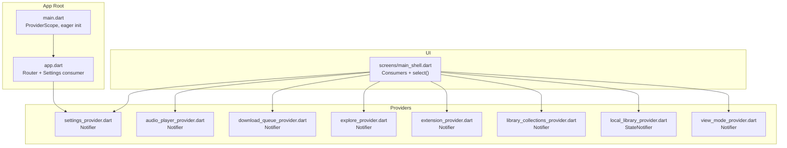

**Diagram sources**
- [main.dart:22-44](file://lib/main.dart#L22-L44)
- [app.dart:13-52](file://lib/app.dart#L13-L52)
- [settings_provider.dart:27-49](file://lib/providers/settings_provider.dart#L27-L49)
- [audio_player_provider.dart:89-116](file://lib/providers/audio_player_provider.dart#L89-L116)
- [download_queue_provider.dart:486-508](file://lib/providers/download_queue_provider.dart#L486-L508)
- [explore_provider.dart:262-271](file://lib/providers/explore_provider.dart#L262-L271)
- [extension_provider.dart:797-800](file://lib/providers/extension_provider.dart#L797-L800)
- [library_collections_provider.dart:666-682](file://lib/providers/library_collections_provider.dart#L666-L682)
- [local_library_provider.dart:95-101](file://lib/providers/local_library_provider.dart#L95-L101)
- [view_mode_provider.dart:5-16](file://lib/providers/view_mode_provider.dart#L5-L16)
- [main_shell.dart:414-524](file://lib/screens/main_shell.dart#L414-L524)

**Section sources**
- [main.dart:22-44](file://lib/main.dart#L22-L44)
- [app.dart:13-52](file://lib/app.dart#L13-L52)

## Core Components
- ProviderScope and eager initialization: The app wraps the app tree in ProviderScope and performs early initialization of services and providers to reduce perceived latency.
- Settings provider: Centralized app-wide settings consumed across the UI and used to drive routing and feature toggles.
- Audio player provider: A notifier-driven state machine for playback, emitting fine-grained updates (position, duration, loading states).
- Download queue provider: Manages history and deduplication, with startup maintenance and background tasks.
- Explore provider: Fetches and caches curated content from extensions, with request lifecycle and caching.
- Extension provider: Tracks extension capabilities, priorities, and health; resolves effective providers.
- Library collections provider: Maintains user favorites, playlists, and derived indices for fast lookups.
- Local library provider: Scans and indexes local audio files, with progress streaming and cancellation.
- View mode provider: Simple toggling state for UI layout modes.

These components demonstrate Riverpod’s reactive model: providers encapsulate state and side effects, and consumers subscribe to specific slices to trigger targeted rebuilds.

**Section sources**
- [main.dart:96-134](file://lib/main.dart#L96-L134)
- [settings_provider.dart:27-49](file://lib/providers/settings_provider.dart#L27-L49)
- [audio_player_provider.dart:89-116](file://lib/providers/audio_player_provider.dart#L89-L116)
- [download_queue_provider.dart:486-508](file://lib/providers/download_queue_provider.dart#L486-L508)
- [explore_provider.dart:262-271](file://lib/providers/explore_provider.dart#L262-L271)
- [extension_provider.dart:797-800](file://lib/providers/extension_provider.dart#L797-L800)
- [library_collections_provider.dart:666-682](file://lib/providers/library_collections_provider.dart#L666-L682)
- [local_library_provider.dart:95-101](file://lib/providers/local_library_provider.dart#L95-L101)
- [view_mode_provider.dart:5-16](file://lib/providers/view_mode_provider.dart#L5-L16)

## Architecture Overview
The architecture follows a layered reactive pattern:
- UI layer: Consumer/ConsumerState widgets observe providers and render based on state slices.
- State layer: Providers (Notifier/StateNotifier/FutureProvider) manage state transitions and side effects.
- Services layer: PlatformBridge and databases integrate with native/back-end systems.

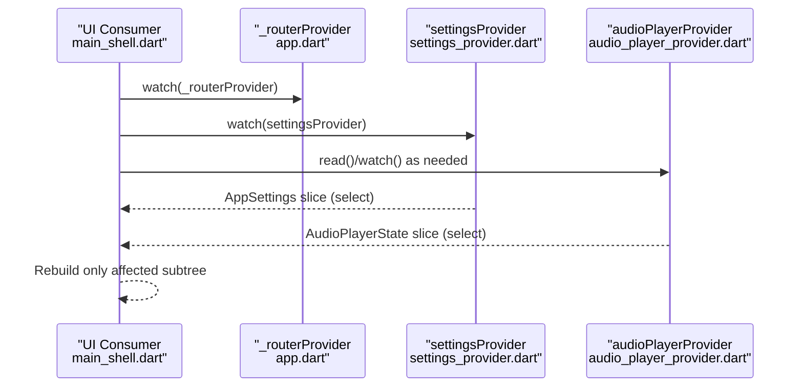

**Diagram sources**
- [main_shell.dart:414-417](file://lib/screens/main_shell.dart#L414-L417)
- [app.dart:13-52](file://lib/app.dart#L13-L52)
- [settings_provider.dart:27-49](file://lib/providers/settings_provider.dart#L27-L49)
- [audio_player_provider.dart:89-116](file://lib/providers/audio_player_provider.dart#L89-L116)

## Detailed Component Analysis

### Settings Provider and Routing
- The settings provider loads persisted settings, normalizes values, and synchronizes backend preferences.
- The router listens to a ValueNotifier to refresh routes when settings are ready and to enforce onboarding flows.

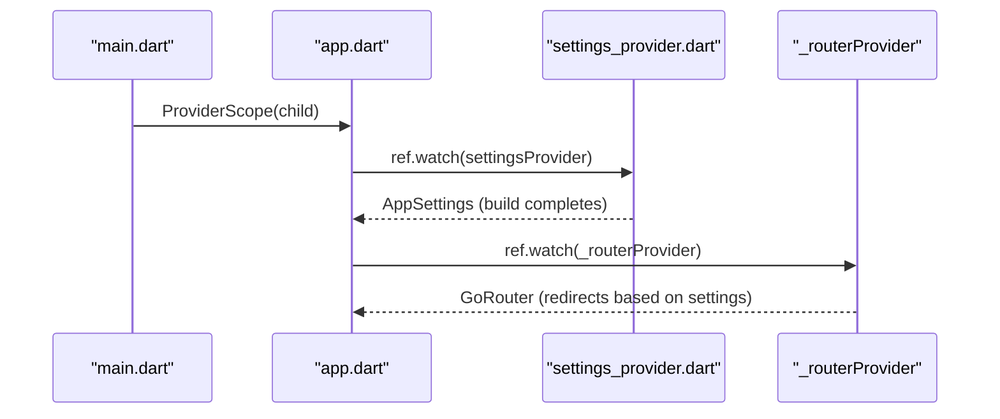

**Diagram sources**
- [main.dart:22-44](file://lib/main.dart#L22-L44)
- [app.dart:13-52](file://lib/app.dart#L13-L52)
- [settings_provider.dart:27-49](file://lib/providers/settings_provider.dart#L27-L49)

**Section sources**
- [main.dart:22-44](file://lib/main.dart#L22-L44)
- [app.dart:13-52](file://lib/app.dart#L13-L52)
- [settings_provider.dart:27-49](file://lib/providers/settings_provider.dart#L27-L49)

### Audio Player Provider: Fine-Grained Updates
- The audio player notifier maintains a complex state and streams updates from the underlying media player.
- Consumers can use select to watch only the fields they need (e.g., isPlaying, position), minimizing rebuilds.

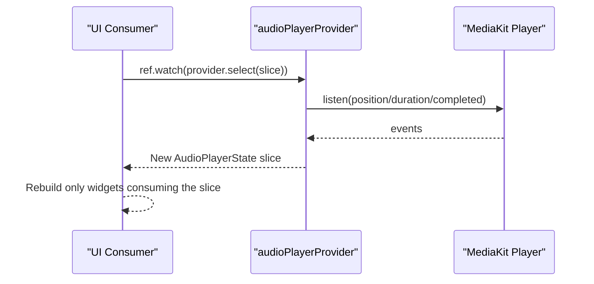

**Diagram sources**
- [audio_player_provider.dart:107-188](file://lib/providers/audio_player_provider.dart#L107-L188)
- [audio_player_provider.dart:200-263](file://lib/providers/audio_player_provider.dart#L200-L263)

**Section sources**
- [audio_player_provider.dart:89-116](file://lib/providers/audio_player_provider.dart#L89-L116)
- [audio_player_provider.dart:107-188](file://lib/providers/audio_player_provider.dart#L107-L188)
- [audio_player_provider.dart:200-263](file://lib/providers/audio_player_provider.dart#L200-L263)

### Download Queue Provider: Startup Warmup and Maintenance
- On app start, the app schedules warmup reads for heavy providers to preload data and reduce first-use latency.
- The download history notifier performs background maintenance and deduplication asynchronously.

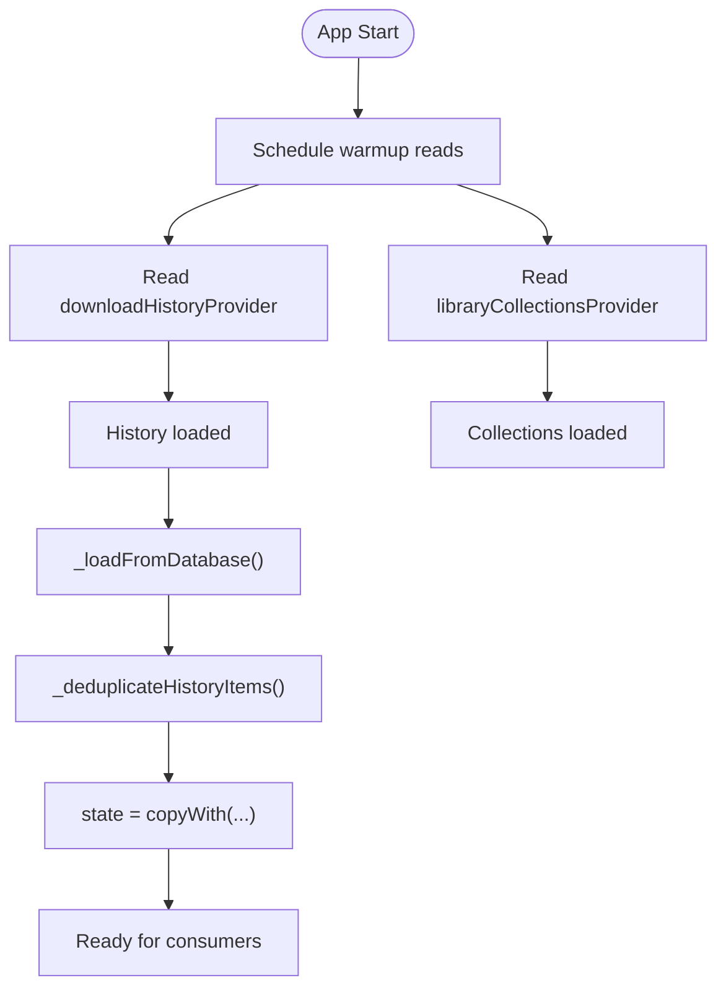

**Diagram sources**
- [main.dart:143-151](file://lib/main.dart#L143-L151)
- [download_queue_provider.dart:518-552](file://lib/providers/download_queue_provider.dart#L518-L552)
- [download_queue_provider.dart:554-627](file://lib/providers/download_queue_provider.dart#L554-L627)

**Section sources**
- [main.dart:143-151](file://lib/main.dart#L143-L151)
- [download_queue_provider.dart:486-508](file://lib/providers/download_queue_provider.dart#L486-L508)
- [download_queue_provider.dart:518-552](file://lib/providers/download_queue_provider.dart#L518-L552)
- [download_queue_provider.dart:554-627](file://lib/providers/download_queue_provider.dart#L554-L627)

### Explore Provider: Caching and Request Lifecycle
- The explore notifier restores cached sections, fetches fresh content with cancellation support, and persists to cache.
- Consumers can watch isLoading/error/sections to render appropriate UI.

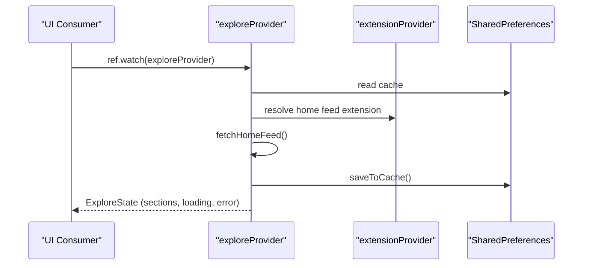

**Diagram sources**
- [explore_provider.dart:262-271](file://lib/providers/explore_provider.dart#L262-L271)
- [explore_provider.dart:334-350](file://lib/providers/explore_provider.dart#L334-L350)
- [explore_provider.dart:370-492](file://lib/providers/explore_provider.dart#L370-L492)

**Section sources**
- [explore_provider.dart:262-271](file://lib/providers/explore_provider.dart#L262-L271)
- [explore_provider.dart:334-350](file://lib/providers/explore_provider.dart#L334-L350)
- [explore_provider.dart:370-492](file://lib/providers/explore_provider.dart#L370-L492)

### Extension Provider: Resolution and Health
- Resolves effective providers for metadata and download based on extension capabilities and user preferences.
- Tracks health statuses and supports priority lists.

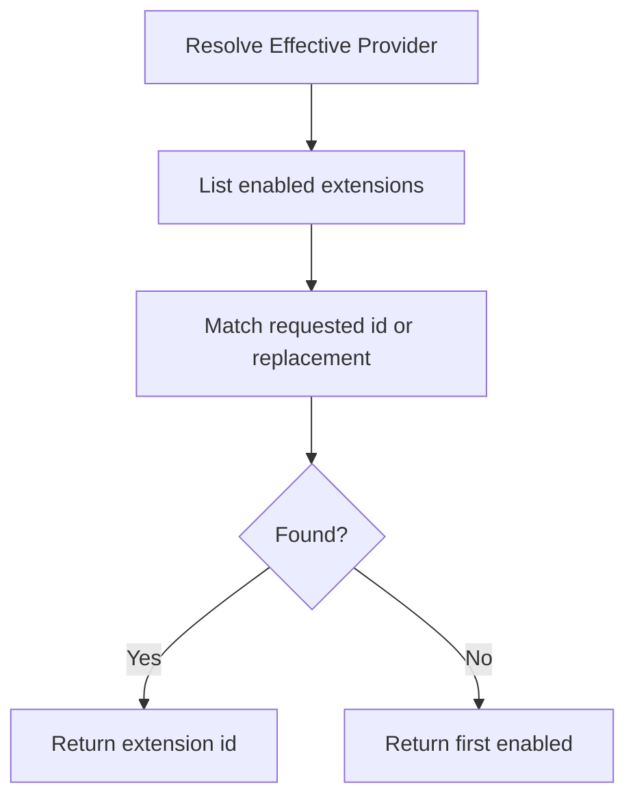

**Diagram sources**
- [extension_provider.dart:267-295](file://lib/providers/extension_provider.dart#L267-L295)
- [extension_provider.dart:297-325](file://lib/providers/extension_provider.dart#L297-L325)

**Section sources**
- [extension_provider.dart:267-295](file://lib/providers/extension_provider.dart#L267-L295)
- [extension_provider.dart:297-325](file://lib/providers/extension_provider.dart#L297-L325)

### Library Collections Provider: Derived Indices and Lookups
- Maintains sets and maps for fast membership and existence checks across wishlist, loved, playlists, and artists.
- Provides copyWith to preserve indices when updating state immutably.

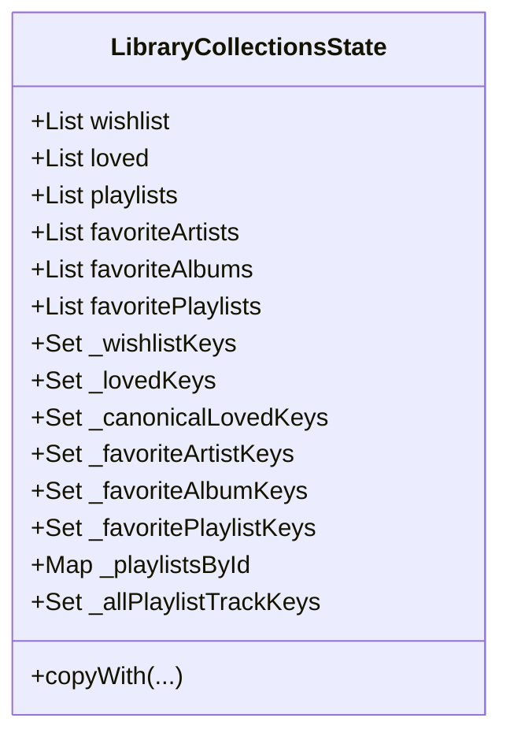

**Diagram sources**
- [library_collections_provider.dart:403-620](file://lib/providers/library_collections_provider.dart#L403-L620)

**Section sources**
- [library_collections_provider.dart:403-620](file://lib/providers/library_collections_provider.dart#L403-L620)

### Local Library Provider: Streaming Progress and Cancellation
- Starts scans and streams progress updates via a platform bridge stream.
- Supports cancellation and finalization steps.

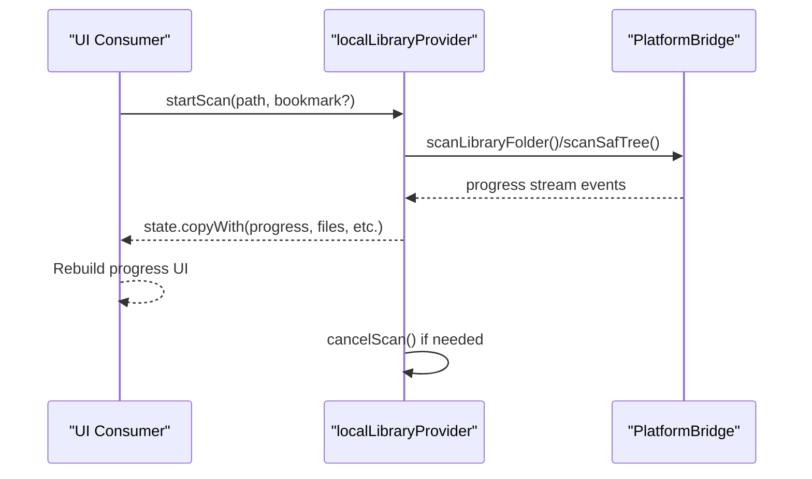

**Diagram sources**
- [local_library_provider.dart:172-227](file://lib/providers/local_library_provider.dart#L172-L227)
- [local_library_provider.dart:191-206](file://lib/providers/local_library_provider.dart#L191-L206)

**Section sources**
- [local_library_provider.dart:95-101](file://lib/providers/local_library_provider.dart#L95-L101)
- [local_library_provider.dart:172-227](file://lib/providers/local_library_provider.dart#L172-L227)
- [local_library_provider.dart:191-206](file://lib/providers/local_library_provider.dart#L191-L206)

### View Mode Provider: Simple Toggle Pattern
- Demonstrates minimal reactive state with a simple toggle method.

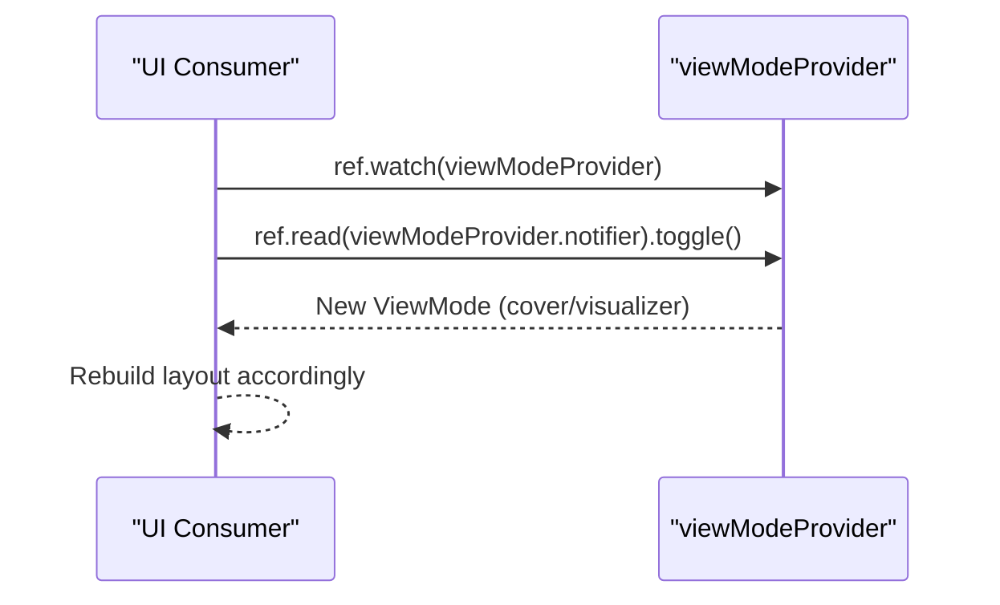

**Diagram sources**
- [view_mode_provider.dart:5-16](file://lib/providers/view_mode_provider.dart#L5-L16)

**Section sources**
- [view_mode_provider.dart:5-16](file://lib/providers/view_mode_provider.dart#L5-L16)

## Dependency Analysis
- Subscription granularity: Consumers use select to watch only the fields they need, reducing rebuild scope.
- Deferred initialization: Heavy providers are warmed up after the first frame to improve startup responsiveness.
- Cross-provider dependencies: Some providers read others (e.g., audio player reads settings, main shell reads multiple providers).
- Isolation: Each provider encapsulates its own state and side effects, minimizing cross-contamination.

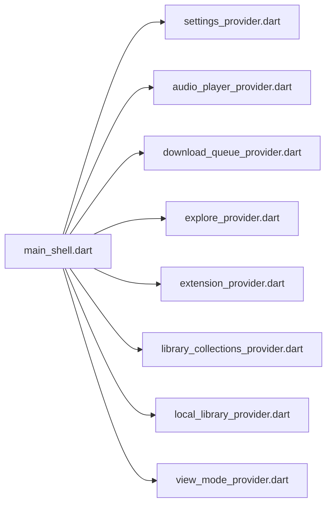

**Diagram sources**
- [main_shell.dart:414-524](file://lib/screens/main_shell.dart#L414-L524)
- [settings_provider.dart:27-49](file://lib/providers/settings_provider.dart#L27-L49)
- [audio_player_provider.dart:89-116](file://lib/providers/audio_player_provider.dart#L89-L116)
- [download_queue_provider.dart:486-508](file://lib/providers/download_queue_provider.dart#L486-L508)
- [explore_provider.dart:262-271](file://lib/providers/explore_provider.dart#L262-L271)
- [extension_provider.dart:797-800](file://lib/providers/extension_provider.dart#L797-L800)
- [library_collections_provider.dart:666-682](file://lib/providers/library_collections_provider.dart#L666-L682)
- [local_library_provider.dart:95-101](file://lib/providers/local_library_provider.dart#L95-L101)
- [view_mode_provider.dart:5-16](file://lib/providers/view_mode_provider.dart#L5-L16)

**Section sources**
- [main_shell.dart:414-524](file://lib/screens/main_shell.dart#L414-L524)

## Performance Considerations
- Selective rebuilding: Use select to watch only the fields needed by a widget. This minimizes rebuilds and improves UI responsiveness.
- Provider isolation: Keep stateful providers focused and self-contained. Avoid sharing mutable state across unrelated domains.
- Deferred initialization: Warm up heavy providers after the first frame to avoid blocking UI rendering.
- Avoid unnecessary updates: Use immutable copyWith patterns and only update fields that change.
- Streaming updates: For long-running tasks, stream incremental progress and update only the relevant UI segments.
- Caching: Persist frequently accessed data (e.g., explore home feed) to reduce network and computation overhead.

[No sources needed since this section provides general guidance]

## Troubleshooting Guide
- Diagnosing subscription leaks: Ensure manual subscriptions (e.g., for progress streams) are canceled in dispose to prevent memory leaks.
- Monitoring provider subscriptions: Use select to confirm which parts of state are driving rebuilds. Verify that consumers are not watching broader state than necessary.
- Debugging state flow:
  - Add logging around state transitions in notifiers (e.g., player events, scan progress).
  - Confirm that settings changes propagate to backend integrations (e.g., lyrics provider sync).
- Validating reactive updates:
  - Temporarily watch larger state slices to confirm whether a widget rebuild is triggered by the intended provider.
  - Use small, isolated tests to reproduce issues with specific providers.

**Section sources**
- [main.dart:127-133](file://lib/main.dart#L127-L133)
- [audio_player_provider.dart:129-187](file://lib/providers/audio_player_provider.dart#L129-L187)
- [local_library_provider.dart:191-206](file://lib/providers/local_library_provider.dart#L191-L206)
- [settings_provider.dart:145-185](file://lib/providers/settings_provider.dart#L145-L185)

## Conclusion
This application demonstrates robust state synchronization and reactive updates using Riverpod. Providers encapsulate state and side effects, consumers subscribe to precise slices, and the UI rebuilds only when necessary. Deferred initialization, selective rebuilding, and careful subscription management deliver a responsive user experience. The patterns shown here—selective watching, provider isolation, streaming updates, and caching—are key to building scalable, maintainable reactive UIs.