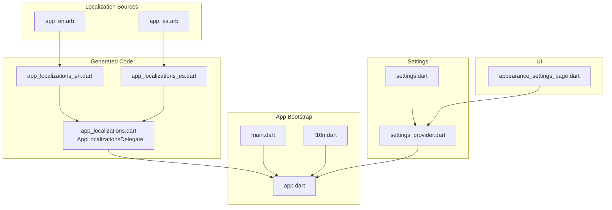
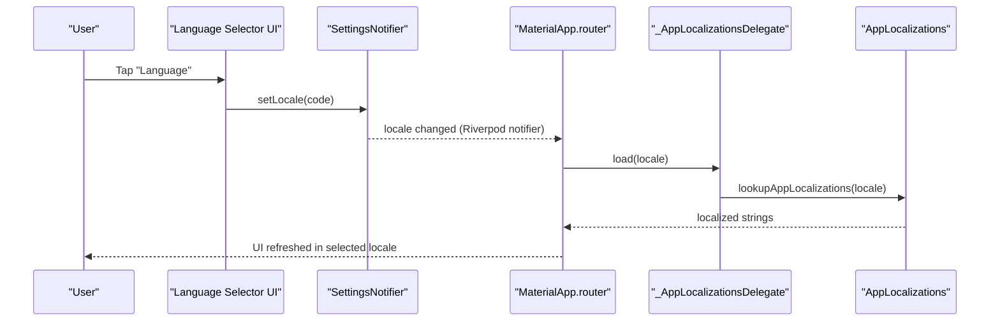
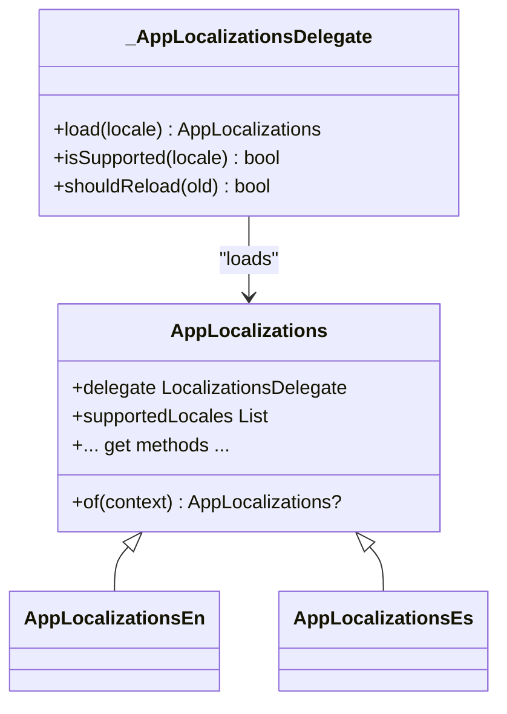
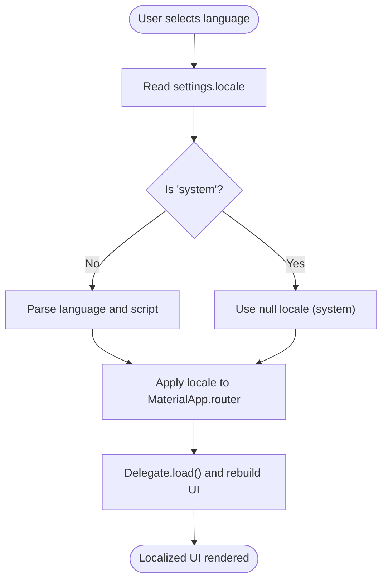
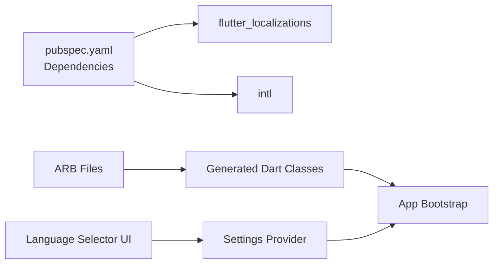

# Localization and Internationalization

<cite>
**Referenced Files in This Document**
- [app.dart](file://lib/app.dart)
- [main.dart](file://lib/main.dart)
- [app_localizations.dart](file://lib/l10n/app_localizations.dart)
- [app_localizations_en.dart](file://lib/l10n/app_localizations_en.dart)
- [app_localizations_es.dart](file://lib/l10n/app_localizations_es.dart)
- [app_en.arb](file://lib/l10n/app_en.arb)
- [app_es.arb](file://lib/l10n/app_es.arb)
- [l10n.dart](file://lib/l10n/l10n.dart)
- [settings_provider.dart](file://lib/providers/settings_provider.dart)
- [settings.dart](file://lib/models/settings.dart)
- [appearance_settings_page.dart](file://lib/screens/settings/appearance_settings_page.dart)
- [pubspec.yaml](file://pubspec.yaml)
</cite>

## Table of Contents
1. [Introduction](#introduction)
2. [Project Structure](#project-structure)
3. [Core Components](#core-components)
4. [Architecture Overview](#architecture-overview)
5. [Detailed Component Analysis](#detailed-component-analysis)
6. [Dependency Analysis](#dependency-analysis)
7. [Performance Considerations](#performance-considerations)
8. [Troubleshooting Guide](#troubleshooting-guide)
9. [Conclusion](#conclusion)
10. [Appendices](#appendices)

## Introduction
This document explains the localization and internationalization (i18n/l10n) system used by the application. It covers the ARB file structure, translation management workflow, locale switching mechanisms, string interpolation and pluralization, date/time formatting considerations, right-to-left language support, and practical guidance for implementing translations in widgets, managing translation keys, adding new languages, validating translations, detecting missing translations, and maintaining localized content.

## Project Structure
The localization system is organized around:
- ARB source files that define translation keys and placeholders
- Generated Dart localization delegates and classes
- Application bootstrap wiring that sets supported locales and delegates
- Settings persistence for the selected locale
- UI components that expose language selection and apply locale changes

**Diagram sources**
- [app_en.arb:1-20](file://lib/l10n/app_en.arb#L1-L20)
- [app_es.arb:1-20](file://lib/l10n/app_es.arb#L1-L20)
- [app_localizations.dart:6423-6453](file://lib/l10n/app_localizations.dart#L6423-L6453)
- [app_localizations_en.dart:1-20](file://lib/l10n/app_localizations_en.dart#L1-L20)
- [app_localizations_es.dart:1-20](file://lib/l10n/app_localizations_es.dart#L1-L20)
- [main.dart:22-44](file://lib/main.dart#L22-L44)
- [app.dart:67-96](file://lib/app.dart#L67-L96)
- [l10n.dart:1-8](file://lib/l10n/l10n.dart#L1-L8)
- [settings_provider.dart:550-553](file://lib/providers/settings_provider.dart#L550-L553)
- [settings.dart:42-134](file://lib/models/settings.dart#L42-L134)
- [appearance_settings_page.dart:721-813](file://lib/screens/settings/appearance_settings_page.dart#L721-L813)

**Section sources**
- [pubspec.yaml:13-16](file://pubspec.yaml#L13-L16)
- [app_localizations.dart:6423-6453](file://lib/l10n/app_localizations.dart#L6423-L6453)
- [app.dart:67-96](file://lib/app.dart#L67-L96)
- [settings_provider.dart:550-553](file://lib/providers/settings_provider.dart#L550-L553)
- [settings.dart:42-134](file://lib/models/settings.dart#L42-L134)
- [appearance_settings_page.dart:721-813](file://lib/screens/settings/appearance_settings_page.dart#L721-L813)

## Core Components
- ARB translation files: Define translation keys, optional descriptions, and placeholders for interpolation.
- Generated localization delegates and classes: Provide strongly-typed accessors and pluralization helpers.
- App bootstrap: Registers localization delegates, supported locales, and applies the current locale.
- Settings provider: Persists and exposes the selected locale.
- UI language selector: Allows users to pick a language and triggers locale updates.

Key responsibilities:
- ARB files: Centralize translatable strings and placeholders.
- Generated classes: Offer compile-time safety and runtime localization.
- App bootstrap: Ensures the app renders with the correct locale and delegates.
- Settings: Stores the user’s language preference.
- UI: Triggers locale changes and refreshes the UI.

**Section sources**
- [app_en.arb:1-20](file://lib/l10n/app_en.arb#L1-L20)
- [app_es.arb:1-20](file://lib/l10n/app_es.arb#L1-L20)
- [app_localizations.dart:6423-6453](file://lib/l10n/app_localizations.dart#L6423-L6453)
- [app.dart:67-96](file://lib/app.dart#L67-L96)
- [settings_provider.dart:550-553](file://lib/providers/settings_provider.dart#L550-L553)
- [appearance_settings_page.dart:721-813](file://lib/screens/settings/appearance_settings_page.dart#L721-L813)

## Architecture Overview
The localization pipeline connects ARB sources to generated Dart classes and integrates with the app’s Material router and Riverpod settings provider.

**Diagram sources**
- [appearance_settings_page.dart:721-813](file://lib/screens/settings/appearance_settings_page.dart#L721-L813)
- [settings_provider.dart:550-553](file://lib/providers/settings_provider.dart#L550-L553)
- [app.dart:67-96](file://lib/app.dart#L67-L96)
- [app_localizations.dart:6423-6453](file://lib/l10n/app_localizations.dart#L6423-L6453)

## Detailed Component Analysis

### ARB File Structure and Translation Keys
- Each ARB file defines a set of translation keys and optional metadata.
- Keys map to human-readable strings in the target language.
- Placeholders are declared with typed metadata for interpolation.
- Descriptions help translators understand context.

Examples of keys and placeholders:
- Interpolation placeholders with types and descriptions
- Pluralization keys with ICU plural forms

**Section sources**
- [app_en.arb:160-168](file://lib/l10n/app_en.arb#L160-L168)
- [app_en.arb:261-269](file://lib/l10n/app_en.arb#L261-L269)
- [app_en.arb:795-791](file://lib/l10n/app_en.arb#L795-L791)
- [app_es.arb:152-160](file://lib/l10n/app_es.arb#L152-L160)
- [app_es.arb:261-269](file://lib/l10n/app_es.arb#L261-L269)
- [app_es.arb:783-791](file://lib/l10n/app_es.arb#L783-L791)

### Generated Localization Delegates and Classes
- The delegate loads the appropriate localization subclass based on the language code.
- Supported locales are explicitly declared.
- The delegate throws a clear error for unsupported locales.

**Diagram sources**
- [app_localizations.dart:64-96](file://lib/l10n/app_localizations.dart#L64-L96)
- [app_localizations.dart:6423-6453](file://lib/l10n/app_localizations.dart#L6423-L6453)
- [app_localizations_en.dart:1-20](file://lib/l10n/app_localizations_en.dart#L1-L20)
- [app_localizations_es.dart:1-20](file://lib/l10n/app_localizations_es.dart#L1-L20)

**Section sources**
- [app_localizations.dart:64-96](file://lib/l10n/app_localizations.dart#L64-L96)
- [app_localizations.dart:6423-6453](file://lib/l10n/app_localizations.dart#L6423-L6453)

### Locale Switching Mechanism
- The app reads the locale from settings and constructs a Locale object.
- If the user selects “System Default”, the app passes null to use the system locale.
- The app registers the localization delegates and supported locales.
- Changing the locale via settings triggers a rebuild and reloads localized strings.

**Diagram sources**
- [app.dart:67-96](file://lib/app.dart#L67-L96)
- [settings_provider.dart:550-553](file://lib/providers/settings_provider.dart#L550-L553)
- [settings.dart:134-134](file://lib/models/settings.dart#L134-L134)

**Section sources**
- [app.dart:67-96](file://lib/app.dart#L67-L96)
- [settings_provider.dart:550-553](file://lib/providers/settings_provider.dart#L550-L553)
- [settings.dart:134-134](file://lib/models/settings.dart#L134-L134)

### Implementing Translations in Widgets
- Use the extension accessor to get localized strings in widgets.
- For interpolated values, call the method with the required arguments.
- For pluralization, call the method that accepts a numeric argument.

Example patterns:
- Access localized strings via the extension
- Interpolate placeholders with typed values
- Use pluralization methods for counts

**Section sources**
- [l10n.dart:6-8](file://lib/l10n/l10n.dart#L6-L8)
- [app_en.arb:160-168](file://lib/l10n/app_en.arb#L160-L168)
- [app_es.arb:152-160](file://lib/l10n/app_es.arb#L152-L160)
- [app_localizations.dart:3464-3468](file://lib/l10n/app_localizations.dart#L3464-L3468)

### Managing Translation Keys
- Keys are defined in ARB files and mirrored in generated Dart classes.
- Placeholders are declared with types and optional descriptions to guide translators.
- Pluralization keys use ICU plural forms and are backed by generated methods.

Best practices:
- Keep keys descriptive and scoped to UI sections
- Use placeholders consistently across languages
- Prefer ICU plural forms for counts

**Section sources**
- [app_en.arb:1-20](file://lib/l10n/app_en.arb#L1-L20)
- [app_es.arb:1-20](file://lib/l10n/app_es.arb#L1-L20)
- [app_localizations.dart:3464-3468](file://lib/l10n/app_localizations.dart#L3464-L3468)

### Adding New Languages
Steps to add a new language:
- Create a new ARB file named app_{locale}.arb with translation keys and placeholders
- Run the localization generation tool to produce the Dart classes
- Update the supported locales list in the localization delegate
- Wire the language selector to include the new locale code

Validation:
- The delegate checks supported locales and throws a clear error for unsupported locales
- Ensure the new ARB file contains all required keys

**Section sources**
- [app_localizations.dart:6432-6432](file://lib/l10n/app_localizations.dart#L6432-L6432)
- [app_localizations.dart:6447-6452](file://lib/l10n/app_localizations.dart#L6447-L6452)

### String Interpolation and Pluralization
- Interpolation placeholders are declared in ARB with types and descriptions
- Generated methods accept typed parameters for safe interpolation
- Pluralization uses ICU plural forms and is exposed via generated methods

Examples:
- Interpolated placeholders with typed parameters
- Pluralization with ICU forms for counts

**Section sources**
- [app_en.arb:160-168](file://lib/l10n/app_en.arb#L160-L168)
- [app_en.arb:261-269](file://lib/l10n/app_en.arb#L261-L269)
- [app_en.arb:795-791](file://lib/l10n/app_en.arb#L795-L791)
- [app_localizations.dart:3464-3468](file://lib/l10n/app_localizations.dart#L3464-L3468)

### Date/Time Formatting
- The localization system relies on the intl package for pluralization and formatting
- Date/time formatting is typically handled by the intl DateFormat APIs
- Ensure locale-aware formatting is applied when displaying dates/times

Note: The codebase primarily demonstrates pluralization and interpolation. For date/time formatting, use the intl package’s formatting utilities with the current locale context.

**Section sources**
- [pubspec.yaml:16-16](file://pubspec.yaml#L16-L16)

### Right-to-Left Language Support
- The app’s Material configuration does not explicitly set text direction
- RTL support depends on Flutter’s default behavior and platform-specific configurations
- When adding RTL languages, test reading direction and adjust UI layouts accordingly

[No sources needed since this section provides general guidance]

## Dependency Analysis
The localization system depends on:
- flutter_localizations and intl for localization infrastructure
- Generated Dart classes for type-safe access
- Settings provider for persisted locale
- UI components for language selection

**Diagram sources**
- [pubspec.yaml:13-16](file://pubspec.yaml#L13-L16)
- [app_localizations.dart:64-96](file://lib/l10n/app_localizations.dart#L64-L96)
- [settings_provider.dart:550-553](file://lib/providers/settings_provider.dart#L550-L553)
- [appearance_settings_page.dart:721-813](file://lib/screens/settings/appearance_settings_page.dart#L721-L813)

**Section sources**
- [pubspec.yaml:13-16](file://pubspec.yaml#L13-L16)
- [app_localizations.dart:64-96](file://lib/l10n/app_localizations.dart#L64-L96)
- [settings_provider.dart:550-553](file://lib/providers/settings_provider.dart#L550-L553)
- [appearance_settings_page.dart:721-813](file://lib/screens/settings/appearance_settings_page.dart#L721-L813)

## Performance Considerations
- Keep ARB files minimal and avoid excessive duplication
- Use pluralization and placeholders to reduce string duplication
- Avoid heavy computations inside localized strings; precompute values when possible
- Ensure the localization delegate is not reloaded unnecessarily by avoiding frequent locale changes

[No sources needed since this section provides general guidance]

## Troubleshooting Guide
Common issues and resolutions:
- Unsupported locale error: The delegate throws a clear error for unsupported locales. Ensure the locale is included in supported locales and the ARB file exists.
- Missing translations: Verify that the ARB file contains the key and that the localization generation was run.
- Locale not applying: Confirm that the settings locale is persisted and that the app rebuilds with the new locale.

**Section sources**
- [app_localizations.dart:6447-6452](file://lib/l10n/app_localizations.dart#L6447-L6452)
- [settings_provider.dart:550-553](file://lib/providers/settings_provider.dart#L550-L553)
- [app.dart:67-96](file://lib/app.dart#L67-L96)

## Conclusion
The application’s localization system centers on ARB files, generated Dart classes, and a clear delegate-based architecture. It supports interpolation, pluralization, and locale switching driven by user preferences. By following the outlined workflows and best practices, teams can maintain accurate, scalable, and user-friendly localized experiences.

[No sources needed since this section summarizes without analyzing specific files]

## Appendices

### Example: Using Localized Strings in a Widget
- Access localized strings via the extension
- Pass interpolated values to methods that accept parameters
- Use pluralization methods for counts

**Section sources**
- [l10n.dart:6-8](file://lib/l10n/l10n.dart#L6-L8)
- [app_en.arb:160-168](file://lib/l10n/app_en.arb#L160-L168)
- [app_localizations.dart:3464-3468](file://lib/l10n/app_localizations.dart#L3464-L3468)

### Example: Implementing a Language Selector
- Present a list of supported locales
- Persist the selected locale via the settings provider
- Trigger a UI rebuild to apply the new locale

**Section sources**
- [appearance_settings_page.dart:721-813](file://lib/screens/settings/appearance_settings_page.dart#L721-L813)
- [settings_provider.dart:550-553](file://lib/providers/settings_provider.dart#L550-L553)
- [app.dart:67-96](file://lib/app.dart#L67-L96)