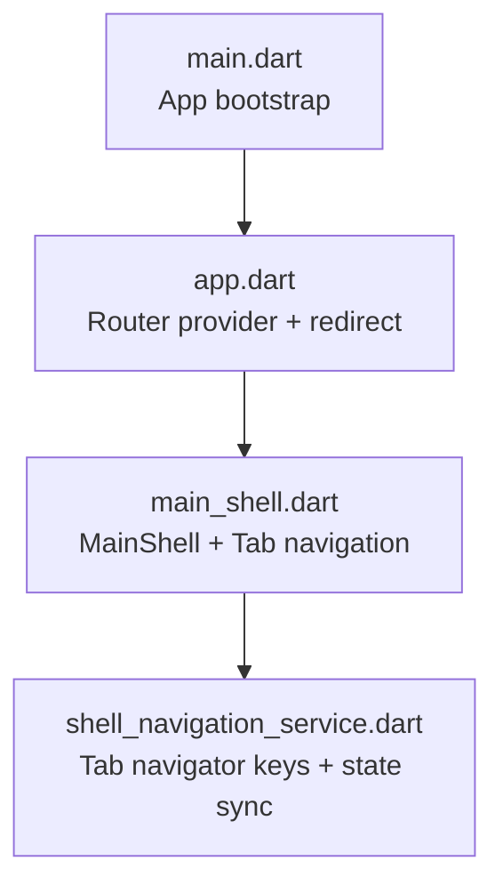
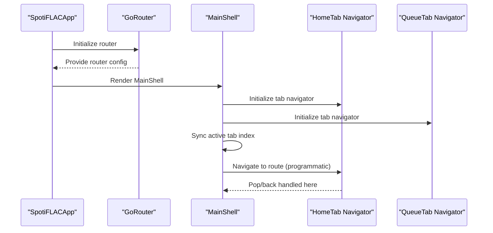
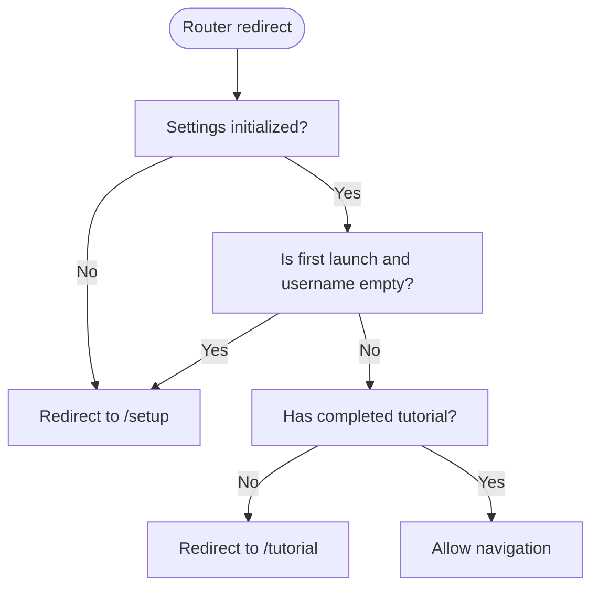
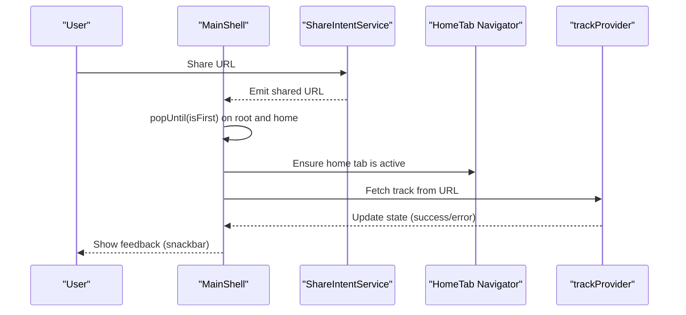
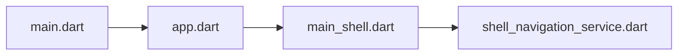

# Screens and Navigation

<cite>
**Referenced Files in This Document**
- [main.dart](file://lib/main.dart)
- [app.dart](file://lib/app.dart)
- [main_shell.dart](file://lib/screens/main_shell.dart)
- [shell_navigation_service.dart](file://lib/services/shell_navigation_service.dart)
</cite>

## Table of Contents
1. [Introduction](#introduction)
2. [Project Structure](#project-structure)
3. [Core Components](#core-components)
4. [Architecture Overview](#architecture-overview)
5. [Detailed Component Analysis](#detailed-component-analysis)
6. [Dependency Analysis](#dependency-analysis)
7. [Performance Considerations](#performance-considerations)
8. [Troubleshooting Guide](#troubleshooting-guide)
9. [Conclusion](#conclusion)

## Introduction
This document explains the screen architecture and navigation system of the application. It covers the main shell structure, tab navigation implementation, route configuration, screen lifecycle management, navigation state preservation, deep linking support, programmatic navigation, conditional routing, navigation guards, performance optimization, memory management during navigation, platform-specific navigation patterns, and the integration between screens and state management providers.

## Project Structure
The navigation stack is centered around a Flutter app bootstrapped in main.dart, configured via a Riverpod provider in app.dart, and rendered inside a Material 3 shell with tabbed navigation in main_shell.dart. A dedicated service coordinates tab-level navigation state.

**Diagram sources**
- [main.dart:22-44](file://lib/main.dart#L22-L44)
- [app.dart:13-52](file://lib/app.dart#L13-L52)
- [main_shell.dart:29-34](file://lib/screens/main_shell.dart#L29-L34)
- [shell_navigation_service.dart:3-32](file://lib/services/shell_navigation_service.dart#L3-L32)

**Section sources**
- [main.dart:22-44](file://lib/main.dart#L22-L44)
- [app.dart:13-52](file://lib/app.dart#L13-L52)
- [main_shell.dart:29-34](file://lib/screens/main_shell.dart#L29-L34)
- [shell_navigation_service.dart:3-32](file://lib/services/shell_navigation_service.dart#L3-L32)

## Core Components
- Application bootstrap and initialization:
  - Ensures Flutter binding is ready, initializes media backend, configures platform-specific database backend on desktop, sets up image cache policy, and wraps the app in a Riverpod ProviderScope.
- Router configuration:
  - Uses a Riverpod provider to construct a GoRouter with redirect logic, route definitions, and an error fallback to the main shell.
- Main shell and tab navigation:
  - Hosts two tabs (Home and Library) with a PageView and a glassmorphic bottom navigation bar. Each tab has its own Navigator keyed by ShellNavigationService.
- Navigation state coordination:
  - A singleton service maintains the active tab index and exposes helpers to navigate programmatically and access the active tab’s Navigator.

**Section sources**
- [main.dart:22-44](file://lib/main.dart#L22-L44)
- [app.dart:13-52](file://lib/app.dart#L13-L52)
- [main_shell.dart:29-34](file://lib/screens/main_shell.dart#L29-L34)
- [shell_navigation_service.dart:3-32](file://lib/services/shell_navigation_service.dart#L3-L32)

## Architecture Overview
The navigation architecture combines:
- A top-level router managed by Riverpod for global navigation and redirects.
- A shell-level tabbed interface with per-tab Navigator instances.
- A service that synchronizes the active tab and provides programmatic navigation helpers.

**Diagram sources**
- [app.dart:54-97](file://lib/app.dart#L54-L97)
- [app.dart:13-52](file://lib/app.dart#L13-L52)
- [main_shell.dart:29-34](file://lib/screens/main_shell.dart#L29-L34)
- [main_shell.dart:407-411](file://lib/screens/main_shell.dart#L407-L411)
- [shell_navigation_service.dart:16-31](file://lib/services/shell_navigation_service.dart#L16-L31)

## Detailed Component Analysis

### Router and Conditional Routing
- Redirect logic:
  - Redirects to setup, tutorial, or main shell depending on onboarding and tutorial completion flags.
  - Uses a settings notifier to refresh routing when settings change.
- Route definitions:
  - Root path renders the main shell.
  - Setup route supports an initial step via state.extra.
  - Tutorial route renders a tutorial screen.
- Error handling:
  - On route errors, falls back to the main shell.

**Diagram sources**
- [app.dart:13-52](file://lib/app.dart#L13-L52)

**Section sources**
- [app.dart:13-52](file://lib/app.dart#L13-L52)

### Main Shell and Tab Navigation
- Shell structure:
  - Maintains current tab index and a PageController for smooth page transitions.
  - Provides animated tab switching with a jump animation for non-adjacent jumps.
- Tab navigators:
  - Each tab has a dedicated Navigator keyed by ShellNavigationService.
  - Tab content is wrapped in a keep-alive page wrapper to preserve state across tab switches.
- Bottom navigation:
  - Glassmorphic NavigationBar with animated icons and badge indicators for queue counts.
- Back button handling:
  - Delegates back press to the root navigator, then the active tab navigator, then applies contextual logic (e.g., clearing search/recent access, dismissing keyboard, switching to home tab, double-tap exit).
- Deep linking:
  - Subscribes to share intents and routes shared URLs to the home tab, clears existing routes, and fetches track data.

**Diagram sources**
- [main_shell.dart:99-151](file://lib/screens/main_shell.dart#L99-L151)
- [main_shell.dart:302-405](file://lib/screens/main_shell.dart#L302-L405)

**Section sources**
- [main_shell.dart:29-34](file://lib/screens/main_shell.dart#L29-L34)
- [main_shell.dart:407-411](file://lib/screens/main_shell.dart#L407-L411)
- [main_shell.dart:473-524](file://lib/screens/main_shell.dart#L473-L524)
- [main_shell.dart:302-405](file://lib/screens/main_shell.dart#L302-L405)
- [main_shell.dart:99-151](file://lib/screens/main_shell.dart#L99-L151)

### Programmatic Navigation and Navigation Guards
- Programmatic navigation:
  - Use ShellNavigationService.activeTabNavigator() to target the active tab’s Navigator for push/pop operations.
  - Use ShellNavigationService.navigateToTab(index) to switch tabs programmatically.
- Navigation guards:
  - Back button handler prioritizes popping within the current tab, then the root navigator, then applies contextual logic before allowing app exit.
  - Deep-link handling ensures the app navigates to the home tab and clears prior routes before processing the incoming URL.

**Section sources**
- [shell_navigation_service.dart:22-31](file://lib/services/shell_navigation_service.dart#L22-L31)
- [main_shell.dart:302-405](file://lib/screens/main_shell.dart#L302-L405)
- [main_shell.dart:99-151](file://lib/screens/main_shell.dart#L99-L151)

### Screen Lifecycle Management and State Preservation
- Keep-Alive:
  - Tabs are wrapped in a keep-alive page wrapper to preserve state across tab switches.
- Focus management:
  - Unfocusing occurs on tab changes and back presses to avoid stale focus.
- Loading and content state:
  - Back navigation logic considers loading state, search content, and recent access visibility to decide whether to clear or dismiss content.

**Section sources**
- [main_shell.dart:630-649](file://lib/screens/main_shell.dart#L630-L649)
- [main_shell.dart:302-405](file://lib/screens/main_shell.dart#L302-L405)

### Integration Between Screens and State Management Providers
- Router provider:
  - A Riverpod provider constructs the GoRouter and watches settings for refresh.
- Settings-driven routing:
  - Redirects depend on settings values and a settings notifier.
- Shell-level state:
  - MainShell reads and updates providers (e.g., track provider) to reflect navigation outcomes (e.g., fetching a track from a shared URL).

**Section sources**
- [app.dart:13-52](file://lib/app.dart#L13-L52)
- [main_shell.dart:99-151](file://lib/screens/main_shell.dart#L99-L151)

## Dependency Analysis
The navigation system exhibits clear separation of concerns:
- main.dart initializes the app and environment.
- app.dart defines the router and integrates localization and theme.
- main_shell.dart implements the shell and tab navigation.
- shell_navigation_service.dart centralizes tab navigation state.

**Diagram sources**
- [main.dart:22-44](file://lib/main.dart#L22-L44)
- [app.dart:13-52](file://lib/app.dart#L13-L52)
- [main_shell.dart:29-34](file://lib/screens/main_shell.dart#L29-L34)
- [shell_navigation_service.dart:3-32](file://lib/services/shell_navigation_service.dart#L3-L32)

**Section sources**
- [main.dart:22-44](file://lib/main.dart#L22-L44)
- [app.dart:13-52](file://lib/app.dart#L13-L52)
- [main_shell.dart:29-34](file://lib/screens/main_shell.dart#L29-L34)
- [shell_navigation_service.dart:3-32](file://lib/services/shell_navigation_service.dart#L3-L32)

## Performance Considerations
- Image cache sizing:
  - The app configures image cache limits based on runtime profile to prevent excessive memory usage on constrained devices.
- Tab transitions:
  - Non-adjacent tab jumps use immediate jumps with a short transition animation to reduce jank.
- Keep-Alive:
  - Using a keep-alive wrapper prevents rebuilding heavy tab content on tab switches.
- Back press handling:
  - Early exits and targeted pops minimize unnecessary work when navigating out of the app.

**Section sources**
- [main.dart:76-82](file://lib/main.dart#L76-L82)
- [main_shell.dart:279-289](file://lib/screens/main_shell.dart#L279-L289)
- [main_shell.dart:630-649](file://lib/screens/main_shell.dart#L630-L649)

## Troubleshooting Guide
- Navigation does not switch tabs:
  - Verify the active tab navigator is retrieved via ShellNavigationService.activeTabNavigator().
- Back button does nothing:
  - Confirm the back handler logic is invoked and that the current tab navigator can handle maybePop().
- Deep links not processed:
  - Ensure the share intent listener is active and that the home tab is brought to the front before fetching track data.
- Excessive memory usage:
  - Confirm image cache limits are applied according to the runtime profile.

**Section sources**
- [shell_navigation_service.dart:22-26](file://lib/services/shell_navigation_service.dart#L22-L26)
- [main_shell.dart:302-405](file://lib/screens/main_shell.dart#L302-L405)
- [main_shell.dart:99-151](file://lib/screens/main_shell.dart#L99-L151)
- [main.dart:76-82](file://lib/main.dart#L76-L82)

## Conclusion
The navigation system combines a Riverpod-managed router with a shell-level tabbed interface and a centralized service for tab navigation state. It supports conditional routing, deep linking, robust back navigation, and state preservation across tabs. Performance and memory management are addressed through image cache tuning and keep-alive wrappers. The architecture cleanly separates routing, shell rendering, and tab coordination, enabling maintainable and scalable navigation behavior.