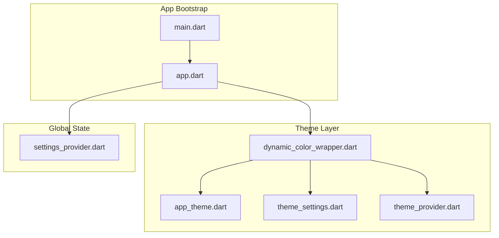
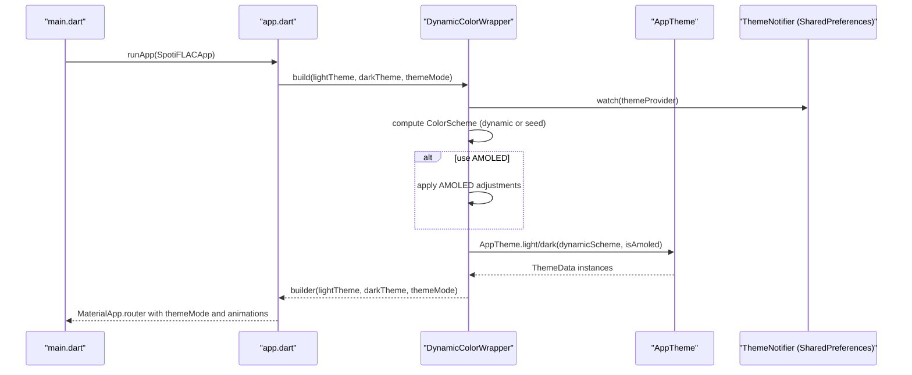
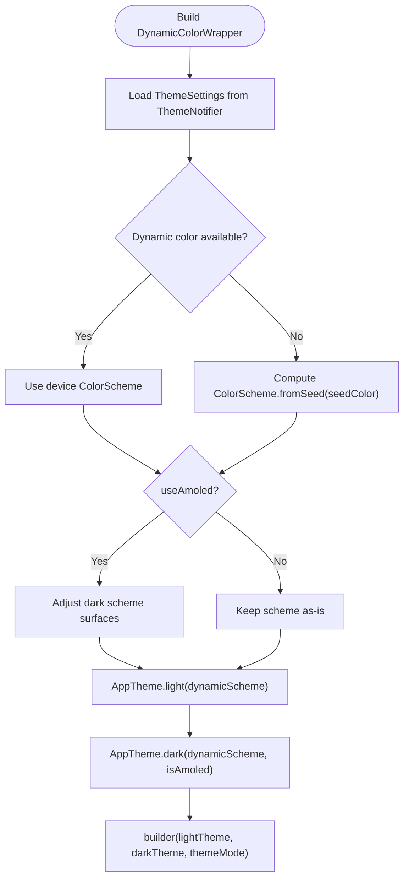
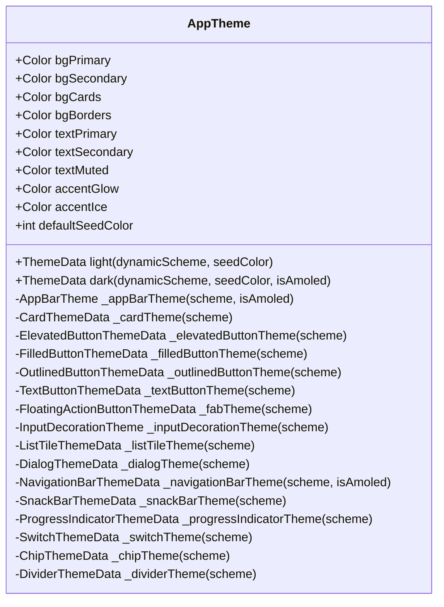
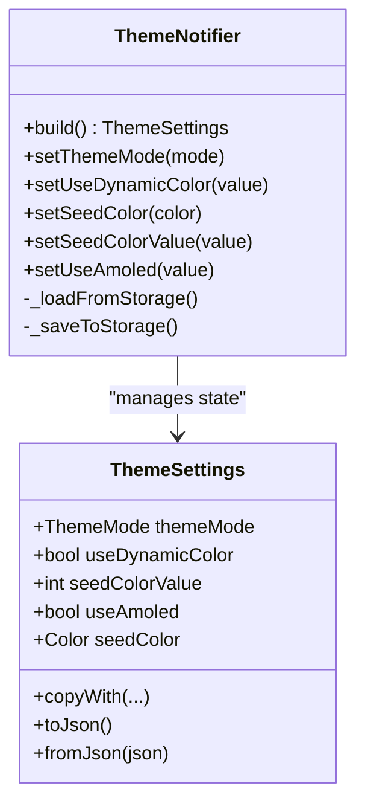
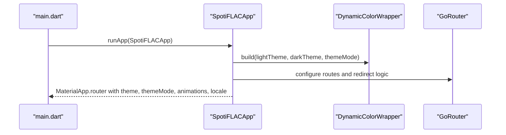
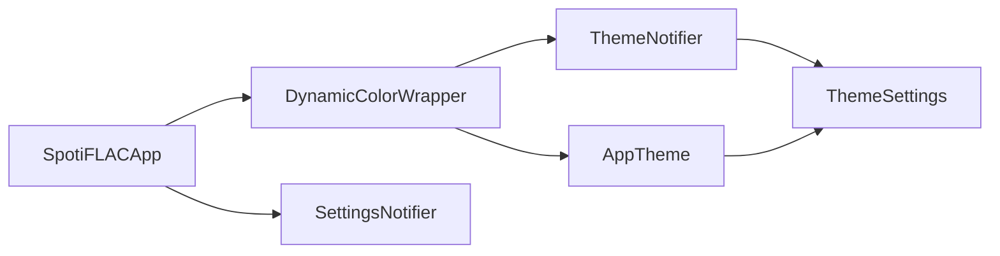

# Theme System and Styling

<cite>
**Referenced Files in This Document**
- [main.dart](file://lib/main.dart)
- [app.dart](file://lib/app.dart)
- [dynamic_color_wrapper.dart](file://lib/theme/dynamic_color_wrapper.dart)
- [app_theme.dart](file://lib/theme/app_theme.dart)
- [theme_settings.dart](file://lib/models/theme_settings.dart)
- [theme_provider.dart](file://lib/providers/theme_provider.dart)
- [settings_provider.dart](file://lib/providers/settings_provider.dart)
</cite>

## Table of Contents
1. [Introduction](#introduction)
2. [Project Structure](#project-structure)
3. [Core Components](#core-components)
4. [Architecture Overview](#architecture-overview)
5. [Detailed Component Analysis](#detailed-component-analysis)
6. [Dependency Analysis](#dependency-analysis)
7. [Performance Considerations](#performance-considerations)
8. [Troubleshooting Guide](#troubleshooting-guide)
9. [Conclusion](#conclusion)
10. [Appendices](#appendices)

## Introduction
This document explains the theme system and styling architecture of the application. It covers light/dark theme implementation, color palette management, typography, dynamic theme switching, customization options, platform-specific styling, accessibility considerations, internationalization styling, and performance implications of theme changes. The system integrates Material 3 theming with dynamic color support, AMOLED optimizations, and persistent theme preferences.

## Project Structure
The theme system spans several modules:
- Application bootstrap and routing live in the application entrypoint.
- The theme wrapper composes dynamic color and AMOLED adjustments.
- The theme builder defines Material 3 light and dark themes with consistent component styling.
- Theme settings and persistence are managed via a Riverpod notifier and shared preferences.
- Settings provider coordinates global app settings and localization.

**Diagram sources**
- [main.dart](file://lib/main.dart)
- [app.dart](file://lib/app.dart)
- [dynamic_color_wrapper.dart](file://lib/theme/dynamic_color_wrapper.dart)
- [app_theme.dart](file://lib/theme/app_theme.dart)
- [theme_settings.dart](file://lib/models/theme_settings.dart)
- [theme_provider.dart](file://lib/providers/theme_provider.dart)
- [settings_provider.dart](file://lib/providers/settings_provider.dart)

**Section sources**
- [main.dart](file://lib/main.dart)
- [app.dart](file://lib/app.dart)

## Core Components
- DynamicColorWrapper: Orchestrates dynamic color vs seed-based color schemes, applies AMOLED adjustments, and produces light/dark ThemeData instances for the app.
- AppTheme: Defines Material 3 light and dark themes, component-level theme overrides (AppBar, Buttons, Inputs, Lists, Dialogs, NavigationBar, SnackBars, ProgressIndicators, Switches, Chips, Dividers), and font family selection.
- ThemeSettings: Encapsulates theme mode, dynamic color flag, seed color, and AMOLED preference with serialization/deserialization helpers.
- ThemeNotifier: Riverpod notifier that loads, updates, and persists theme settings to shared preferences.
- SettingsNotifier: Global settings provider that also influences app localization and routing behavior.

Key responsibilities:
- Centralized theme composition and persistence.
- Dynamic color fallback to seed-based palettes.
- AMOLED black backgrounds with adjusted surface tones.
- Consistent Material 3 component styling across light/dark modes.
- Locale-aware app initialization.

**Section sources**
- [dynamic_color_wrapper.dart](file://lib/theme/dynamic_color_wrapper.dart)
- [app_theme.dart](file://lib/theme/app_theme.dart)
- [theme_settings.dart](file://lib/models/theme_settings.dart)
- [theme_provider.dart](file://lib/providers/theme_provider.dart)
- [settings_provider.dart](file://lib/providers/settings_provider.dart)

## Architecture Overview
The theme pipeline starts at app initialization, resolves theme settings, computes color schemes, builds ThemeData, and renders the app with animated transitions.

**Diagram sources**
- [main.dart](file://lib/main.dart)
- [app.dart](file://lib/app.dart)
- [dynamic_color_wrapper.dart](file://lib/theme/dynamic_color_wrapper.dart)
- [app_theme.dart](file://lib/theme/app_theme.dart)
- [theme_provider.dart](file://lib/providers/theme_provider.dart)

## Detailed Component Analysis

### DynamicColorWrapper
Responsibilities:
- Watches theme settings from the theme provider.
- Uses dynamic color when enabled and available; otherwise falls back to seed-based ColorScheme.fromSeed.
- Applies AMOLED adjustments to dark color schemes.
- Builds light and dark ThemeData via AppTheme and passes them to the builder callback.

Behavior highlights:
- Dynamic color detection via the dynamic color package.
- AMOLED dark theme uses pure black backgrounds and adjusted surface containers.
- ThemeMode is propagated to MaterialApp for system, light, or dark selection.

**Diagram sources**
- [dynamic_color_wrapper.dart](file://lib/theme/dynamic_color_wrapper.dart)
- [app_theme.dart](file://lib/theme/app_theme.dart)
- [theme_provider.dart](file://lib/providers/theme_provider.dart)

**Section sources**
- [dynamic_color_wrapper.dart](file://lib/theme/dynamic_color_wrapper.dart)

### AppTheme
Responsibilities:
- Produces ThemeData for light and dark modes.
- Defines Material 3 component themes: AppBar, Cards, Elevated/Filled/Outlined Buttons, TextButtons, FloatingActionButton, InputDecorator, ListTile, Dialog, NavigationBar, SnackBar, ProgressIndicator, Switch, Chip, Divider.
- Sets a consistent font family and optional AMOLED scaffold background.

Design notes:
- Rounded corners and subtle elevations for modern UI.
- Surface tint and on-surface contrast for accessibility.
- AMOLED mode overrides scaffold background and navigation bar surfaces.

**Diagram sources**
- [app_theme.dart](file://lib/theme/app_theme.dart)

**Section sources**
- [app_theme.dart](file://lib/theme/app_theme.dart)

### ThemeSettings and ThemeNotifier
Responsibilities:
- Persist and load theme preferences: ThemeMode, dynamic color toggle, seed color, AMOLED preference.
- Serialize to/from JSON-compatible maps keyed by predefined constants.
- Provide copyWith for immutable updates and save to SharedPreferences.

Persistence:
- Keys include theme mode, dynamic color flag, seed color integer, and AMOLED flag.
- Defaults favor system theme, dynamic color enabled, Spotify-like seed color, and AMOLED disabled.

**Diagram sources**
- [theme_settings.dart](file://lib/models/theme_settings.dart)
- [theme_provider.dart](file://lib/providers/theme_provider.dart)

**Section sources**
- [theme_settings.dart](file://lib/models/theme_settings.dart)
- [theme_provider.dart](file://lib/providers/theme_provider.dart)

### Integration with App Initialization
- The app initializes platform services and runs the main widget tree.
- SpotiFLACApp configures MaterialApp.router with themeMode, light/dark themes, and animation duration/curve.
- Localization is derived from settings and passed to MaterialApp.

**Diagram sources**
- [main.dart](file://lib/main.dart)
- [app.dart](file://lib/app.dart)
- [dynamic_color_wrapper.dart](file://lib/theme/dynamic_color_wrapper.dart)

**Section sources**
- [main.dart](file://lib/main.dart)
- [app.dart](file://lib/app.dart)

## Dependency Analysis
- DynamicColorWrapper depends on ThemeNotifier for settings and on AppTheme for ThemeData construction.
- AppTheme depends on ThemeSettings for seed color and AMOLED flags.
- SpotiFLACApp depends on DynamicColorWrapper and SettingsNotifier for locale and routing.
- SettingsNotifier manages localization and app lifecycle behavior.

**Diagram sources**
- [dynamic_color_wrapper.dart](file://lib/theme/dynamic_color_wrapper.dart)
- [app_theme.dart](file://lib/theme/app_theme.dart)
- [theme_settings.dart](file://lib/models/theme_settings.dart)
- [theme_provider.dart](file://lib/providers/theme_provider.dart)
- [app.dart](file://lib/app.dart)
- [settings_provider.dart](file://lib/providers/settings_provider.dart)

**Section sources**
- [dynamic_color_wrapper.dart](file://lib/theme/dynamic_color_wrapper.dart)
- [app_theme.dart](file://lib/theme/app_theme.dart)
- [theme_settings.dart](file://lib/models/theme_settings.dart)
- [theme_provider.dart](file://lib/providers/theme_provider.dart)
- [app.dart](file://lib/app.dart)
- [settings_provider.dart](file://lib/providers/settings_provider.dart)

## Performance Considerations
- Dynamic color computation occurs during build; keep rebuild scope minimal by watching only themeProvider.
- AMOLED adjustments modify color schemes; avoid unnecessary recomputation by toggling useAmoled sparingly.
- Theme animations (duration and curve) are configured for smooth transitions; keep durations reasonable to prevent jank.
- Image caching is tuned per platform/runtime profile; ensure theme changes do not trigger excessive asset reloads.
- Persisting theme settings avoids repeated parsing and reduces startup overhead.

[No sources needed since this section provides general guidance]

## Troubleshooting Guide
Common issues and resolutions:
- Dynamic color not applied: Verify dynamic color availability and that useDynamicColor is enabled. If unavailable, seed-based color scheme is used as intended.
- AMOLED not taking effect: Confirm useAmoled is enabled in ThemeSettings and that the dark theme is active.
- Theme changes not persisting: Ensure ThemeNotifier saves to SharedPreferences and that keys match expected constants.
- ThemeMode not switching: Confirm themeMode is set to the desired value and that the app rebuilds with the new mode.
- Locale conflicts: Ensure the locale setting is valid and supported; SpotiFLACApp derives locale from settings and passes it to MaterialApp.

**Section sources**
- [dynamic_color_wrapper.dart](file://lib/theme/dynamic_color_wrapper.dart)
- [theme_provider.dart](file://lib/providers/theme_provider.dart)
- [theme_settings.dart](file://lib/models/theme_settings.dart)
- [app.dart](file://lib/app.dart)

## Conclusion
The theme system combines dynamic color with seed-based fallbacks, AMOLED optimizations, and persistent preferences to deliver a cohesive, accessible, and performant theming experience across platforms. Material 3 component themes ensure consistent UI, while animation and localization integrate seamlessly with the theme pipeline.

[No sources needed since this section summarizes without analyzing specific files]

## Appendices

### Applying Themes to Widgets
- Use the provided ThemeData instances from DynamicColorWrapper to style widgets consistently.
- Prefer Material 3 component themes (AppBarTheme, ButtonThemeData, etc.) for uniformity.
- For custom widgets, derive colors from the current ColorScheme and apply appropriate contrast and sizing.

[No sources needed since this section provides general guidance]

### Creating Custom Themes
- Extend AppTheme to define additional theme variants (e.g., sepia, high contrast).
- Override component themes selectively to preserve global consistency.
- Persist custom preferences via ThemeNotifier and load them in DynamicColorWrapper.

[No sources needed since this section provides general guidance]

### Responsive Design Patterns
- Use MediaQuery to adapt spacing and typography at runtime.
- Leverage ThemeData’s font family and component paddings for scalable layouts.
- Avoid fixed sizes where possible; prefer flexible layouts with appropriate constraints.

[No sources needed since this section provides general guidance]

### Accessibility Features
- Ensure sufficient contrast between foreground and background colors across light/dark modes.
- Use Material 3’s semantic roles (primary, secondary, surface, error) to maintain accessible color mappings.
- Test dynamic color schemes with assistive technologies to confirm readability.

[No sources needed since this section provides general guidance]

### Internationalization Styling Considerations
- Right-to-left languages may require mirrored layouts; test with locale switching.
- Avoid hardcoded text direction in component themes; rely on inherited Directionality.
- Ensure iconography and alignment remain consistent across locales.

[No sources needed since this section provides general guidance]