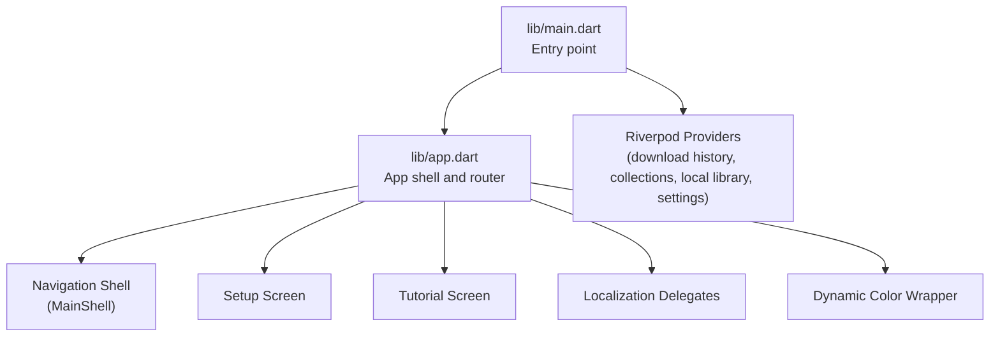
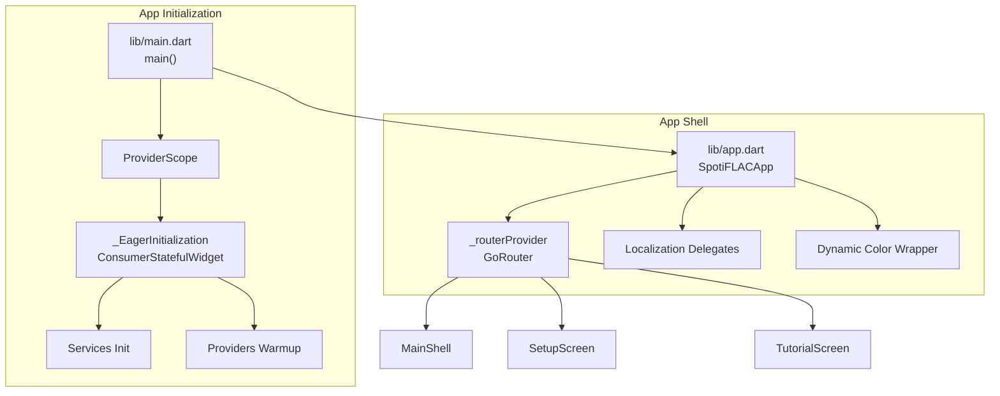
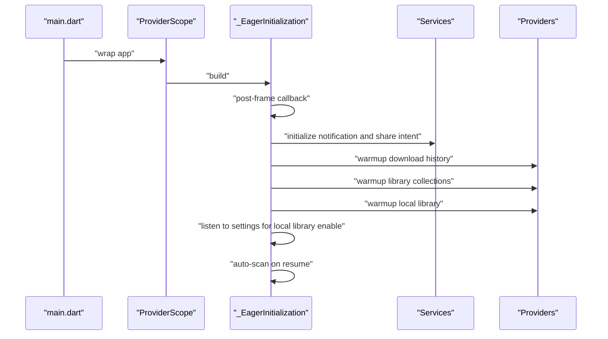
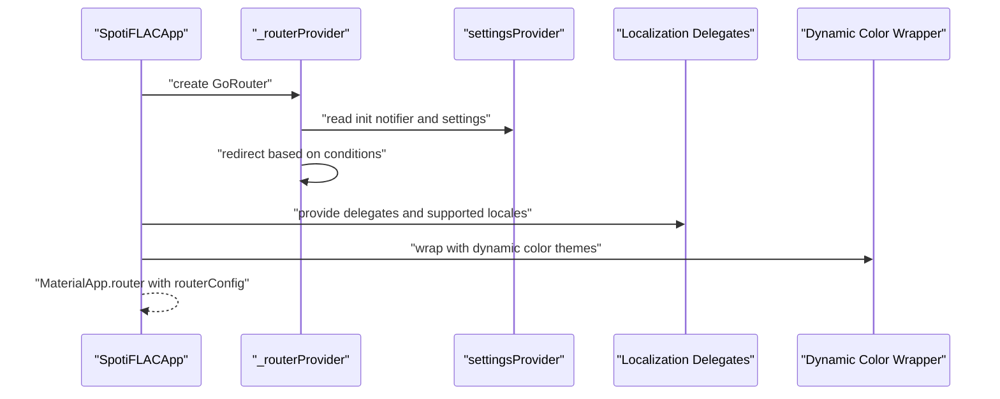
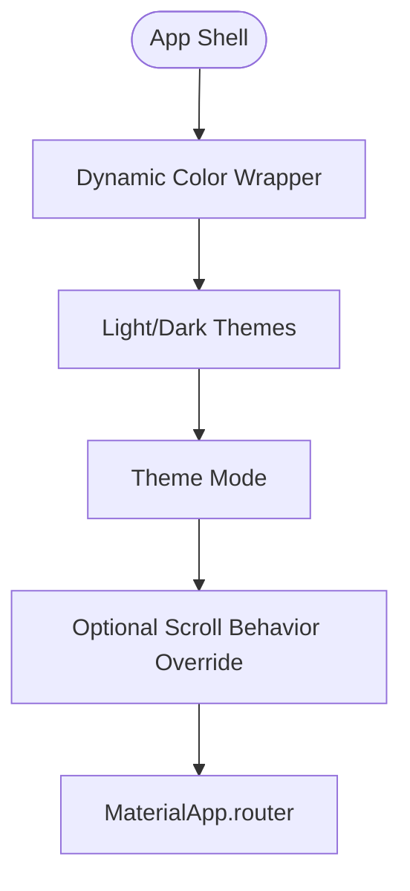
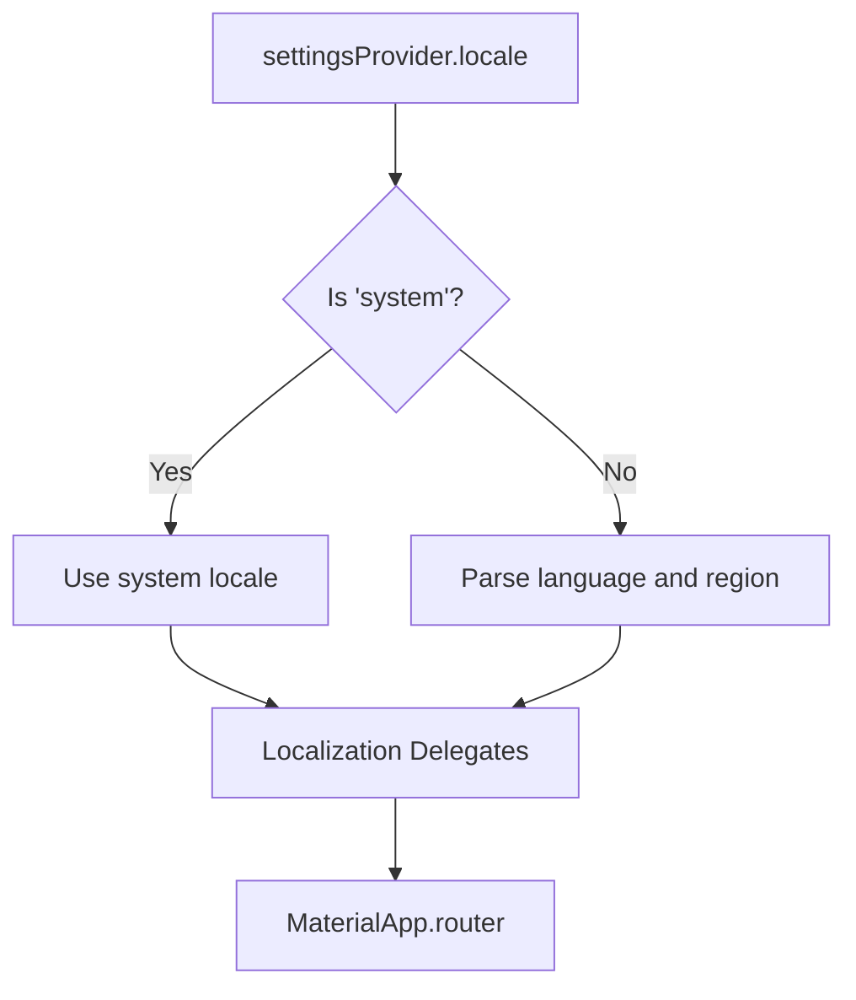
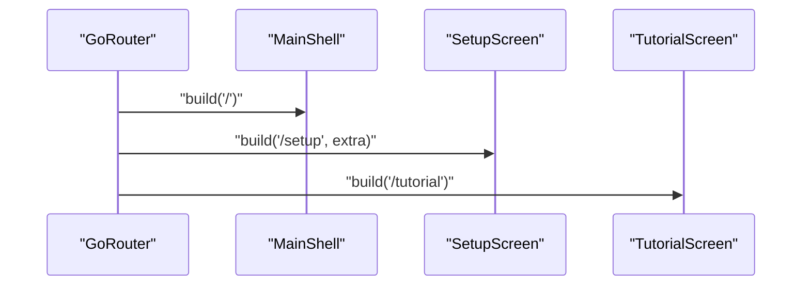
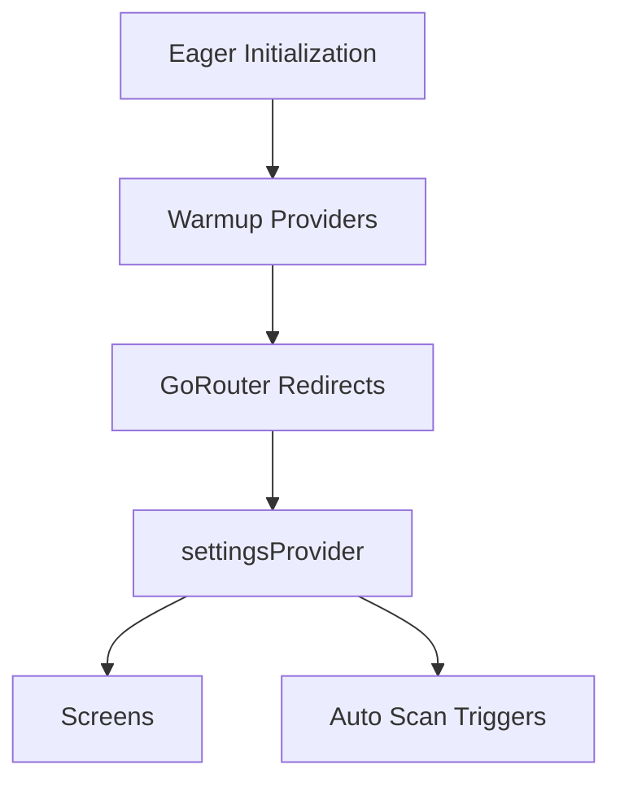
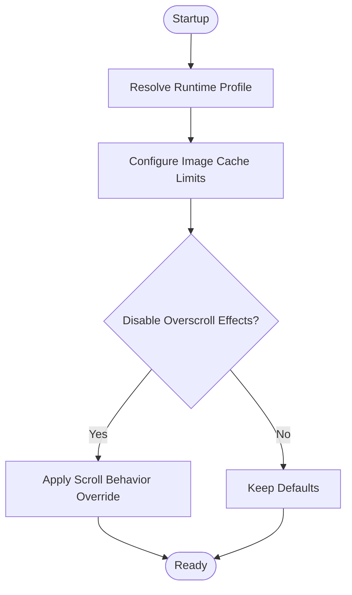
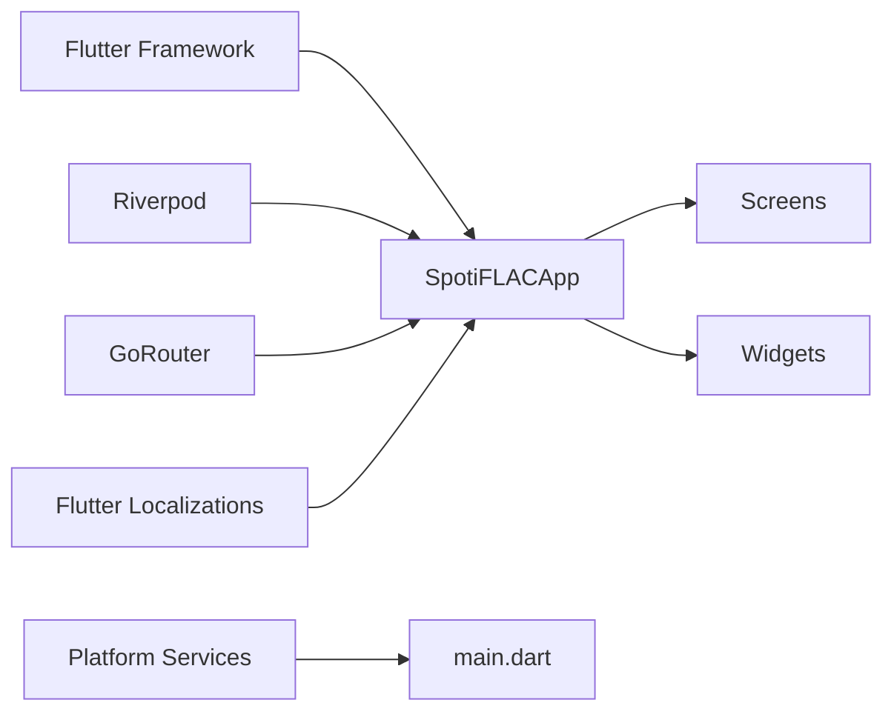

# UI Components and Widgets

<cite>
**Referenced Files in This Document**
- [main.dart](file://lib/main.dart)
- [app.dart](file://lib/app.dart)
</cite>

## Table of Contents
1. [Introduction](#introduction)
2. [Project Structure](#project-structure)
3. [Core Components](#core-components)
4. [Architecture Overview](#architecture-overview)
5. [Detailed Component Analysis](#detailed-component-analysis)
6. [Dependency Analysis](#dependency-analysis)
7. [Performance Considerations](#performance-considerations)
8. [Troubleshooting Guide](#troubleshooting-guide)
9. [Conclusion](#conclusion)
10. [Appendices](#appendices)

## Introduction
This document describes the UI component architecture and widget development patterns used in the application. It focuses on the widget hierarchy, reusable component patterns, custom widget implementations, theme system, localization setup, responsive design patterns, screen-to-widget relationships, navigation integration, state management via Riverpod, accessibility and cross-platform considerations, performance optimization for complex UI hierarchies, and testing strategies for widgets.

## Project Structure
The UI layer is organized around a small set of core files that bootstrap the app, configure routing, localization, theming, and initialization. The application initializes platform-specific services, configures Riverpod providers, and mounts a navigation shell that hosts the main screens.

**Diagram sources**
- [main.dart](file://lib/main.dart)
- [app.dart](file://lib/app.dart)

**Section sources**
- [main.dart](file://lib/main.dart)
- [app.dart](file://lib/app.dart)

## Core Components
- Application entry and initialization:
  - Ensures Flutter binding is initialized, initializes media backend, and configures platform-specific behavior.
  - Applies runtime profile adjustments for image caching and overscroll effects based on device capabilities.
  - Mounts the app inside a Riverpod ProviderScope and performs eager initialization of services and providers.
- App shell and navigation:
  - Defines a router with redirects based on settings and first-launch state.
  - Provides localized content using delegates and supported locales.
  - Wraps the app with a dynamic color theme provider and applies scroll behavior overrides.
- Screens:
  - Main shell screen and setup/tutorial screens are registered in the router and rendered conditionally based on app state.

Key responsibilities:
- Bootstrapping: [main.dart](file://lib/main.dart)
- Routing and localization: [app.dart](file://lib/app.dart)

**Section sources**
- [main.dart](file://lib/main.dart)
- [app.dart](file://lib/app.dart)

## Architecture Overview
The UI architecture centers on a single entry point that configures Riverpod providers, initializes services, and mounts a Material 3–based app shell. Navigation is handled by a router that guards routes based on settings and first-launch state. Localization and theming are configured at the app level and applied globally.

**Diagram sources**
- [main.dart](file://lib/main.dart)
- [app.dart](file://lib/app.dart)

## Detailed Component Analysis

### Entry Point and Eager Initialization
- Responsibilities:
  - Initialize platform-specific subsystems (media, database for desktop).
  - Resolve runtime profile for image cache sizing and overscroll behavior.
  - Mount Riverpod ProviderScope and schedule warmup of deferred providers.
  - Initialize services (notification, share intent, cover cache manager).
  - Manage lifecycle-aware auto-scan triggers for local library.
- Patterns:
  - Deferred provider warmup via timers to avoid blocking the UI thread.
  - Lifecycle observation to trigger scans when the app resumes.
  - Conditional initialization based on platform checks.

**Diagram sources**
- [main.dart](file://lib/main.dart)

**Section sources**
- [main.dart](file://lib/main.dart)

### App Shell, Routing, Localization, and Theming
- Responsibilities:
  - Define router with redirect logic based on settings and first-launch state.
  - Configure localization delegates and supported locales.
  - Apply dynamic color theming and theme mode.
  - Adjust scroll behavior based on runtime profile.
- Patterns:
  - Redirects ensure setup and tutorial screens are shown appropriately.
  - Locale resolution supports system locale or fixed language.
  - Theme animation duration and curve provide smooth transitions.

**Diagram sources**
- [app.dart](file://lib/app.dart)

**Section sources**
- [app.dart](file://lib/app.dart)

### Widget Hierarchy and Reusable Patterns
- The current codebase does not expose a dedicated widgets directory in the provided snapshot. However, the app’s structure indicates:
  - A navigation shell screen is mounted at the root route.
  - Setup and tutorial screens are conditionally shown based on settings.
  - The app relies on Material 3 components and Riverpod for state.
- Recommended patterns for building reusable widgets:
  - Stateless and stateful widgets that accept typed parameters for configuration.
  - Composition over inheritance: pass callbacks and child widgets rather than subclassing.
  - Use Riverpod selectors to subscribe to minimal slices of state.
  - Encapsulate layout and spacing via helper widgets or constants.

[No sources needed since this section provides general guidance]

### Custom Widget Implementations
- The codebase does not include a dedicated widgets directory in the provided snapshot. When implementing custom widgets:
  - Prefer immutable widgets with clear inputs and outputs.
  - Use Material 3 theming tokens for colors, typography, and shapes.
  - Provide fallbacks for missing data and handle loading states gracefully.
  - Expose a compact API surface and avoid leaking internal state.

[No sources needed since this section provides general guidance]

### Theme System
- The app wraps the router with a dynamic color wrapper and applies theme/darkTheme/themeMode.
- Scroll behavior can be disabled for specific devices to reduce visual overhead.
- Theme animations are configured for smooth transitions.

**Diagram sources**
- [app.dart](file://lib/app.dart)

**Section sources**
- [app.dart](file://lib/app.dart)

### Localization Setup
- Localization delegates include custom and global delegates for Material, Widgets, and Cupertino.
- Supported locales are provided by the app’s localization delegate.
- Locale selection resolves either to system locale or a fixed language based on settings.

**Diagram sources**
- [app.dart](file://lib/app.dart)

**Section sources**
- [app.dart](file://lib/app.dart)

### Responsive Design Patterns
- The app does not include explicit responsive breakpoints in the provided snapshot.
- General patterns:
  - Use flexible layouts with constraints and spacing tokens.
  - Prefer adaptive widgets and configurable paddings/margins.
  - Test on various screen sizes and orientations.

[No sources needed since this section provides general guidance]

### Screens and Widget Relationship
- The router builds three top-level screens:
  - Main shell screen at the root.
  - Setup screen with optional initial step.
  - Tutorial screen for onboarding.
- Screens are composed of reusable widgets and state managed by Riverpod providers.

**Diagram sources**
- [app.dart](file://lib/app.dart)

**Section sources**
- [app.dart](file://lib/app.dart)

### Navigation Integration and State Management
- Navigation is handled by a router provider that reacts to settings changes.
- Riverpod providers are warmed up during eager initialization to minimize first-load latency.
- Auto-scan triggers for local library are lifecycle-aware and gated by preferences.

**Diagram sources**
- [main.dart](file://lib/main.dart)
- [app.dart](file://lib/app.dart)

**Section sources**
- [main.dart](file://lib/main.dart)
- [app.dart](file://lib/app.dart)

### Accessibility Features
- The app uses Material 3 components, which include built-in accessibility support.
- Recommendations:
  - Ensure sufficient color contrast against backgrounds.
  - Provide meaningful labels for interactive elements.
  - Test with screen readers and dynamic type scaling.

[No sources needed since this section provides general guidance]

### Cross-Platform Widget Considerations
- The app initializes platform-specific backends and adjusts behavior for non-mobile platforms.
- Recommendations:
  - Use platform channels sparingly and abstract platform differences behind service interfaces.
  - Prefer Material 3 widgets for consistent UX across platforms.
  - Validate gestures and keyboard shortcuts on desktop.

[No sources needed since this section provides general guidance]

### Performance Optimization for Complex UI Hierarchies
- Image cache sizing and byte limits are configured at startup to prevent memory pressure.
- Overscroll effects can be disabled for devices where they cause overhead.
- Deferred provider warmup spreads initialization work across frames.

**Diagram sources**
- [main.dart](file://lib/main.dart)

**Section sources**
- [main.dart](file://lib/main.dart)

### Component Testing Strategies and Best Practices
- Widget tests:
  - Wrap tests with ProviderScope to provide Riverpod state.
  - Mock services and providers to isolate widget behavior.
  - Verify UI updates after state changes.
- Integration tests:
  - Test navigation flows and redirects.
  - Validate localization and theme switching.
- Best practices:
  - Keep widgets pure and test their rendering deterministically.
  - Use selectors to minimize rebuilds in tests.

[No sources needed since this section provides general guidance]

## Dependency Analysis
The UI layer depends on:
- Flutter framework for widgets and routing.
- Riverpod for state management.
- GoRouter for navigation.
- Flutter localization for i18n.
- Platform-specific services initialized at startup.

**Diagram sources**
- [main.dart](file://lib/main.dart)
- [app.dart](file://lib/app.dart)

**Section sources**
- [main.dart](file://lib/main.dart)
- [app.dart](file://lib/app.dart)

## Performance Considerations
- Image cache tuning prevents memory spikes on cover-heavy pages.
- Optional overscroll disabling reduces unnecessary animations on constrained devices.
- Deferred warmup of providers ensures snappy first frame.

[No sources needed since this section provides general guidance]

## Troubleshooting Guide
- If screens do not appear:
  - Verify router redirects and settings state.
  - Confirm that the main shell is mounted at the root route.
- If localization is incorrect:
  - Check settings locale value and supported locales.
- If theme changes do not apply:
  - Ensure dynamic color wrapper is present and theme mode is set.
- If navigation fails:
  - Inspect redirect logic and settings notifier.

**Section sources**
- [app.dart](file://lib/app.dart)
- [main.dart](file://lib/main.dart)

## Conclusion
The UI architecture is intentionally lean: a single entry point initializes services and providers, a router governs navigation with state-driven redirects, and the app shell applies theming and localization. While the current snapshot does not include a dedicated widgets directory, the foundation supports scalable widget development using Riverpod, Material 3, and modular screen composition.

[No sources needed since this section summarizes without analyzing specific files]

## Appendices
- Example widget composition patterns:
  - Pass configuration via constructor parameters.
  - Use Riverpod selectors to subscribe to minimal state slices.
  - Compose child widgets and callbacks for actions.
- Example styling approaches:
  - Use Material 3 color and typography tokens.
  - Centralize spacing and radius in constants.
- Example responsive patterns:
  - Use Flexible and LayoutBuilder for adaptive layouts.
  - Provide breakpoints via theme extensions or constants.

[No sources needed since this section provides general guidance]