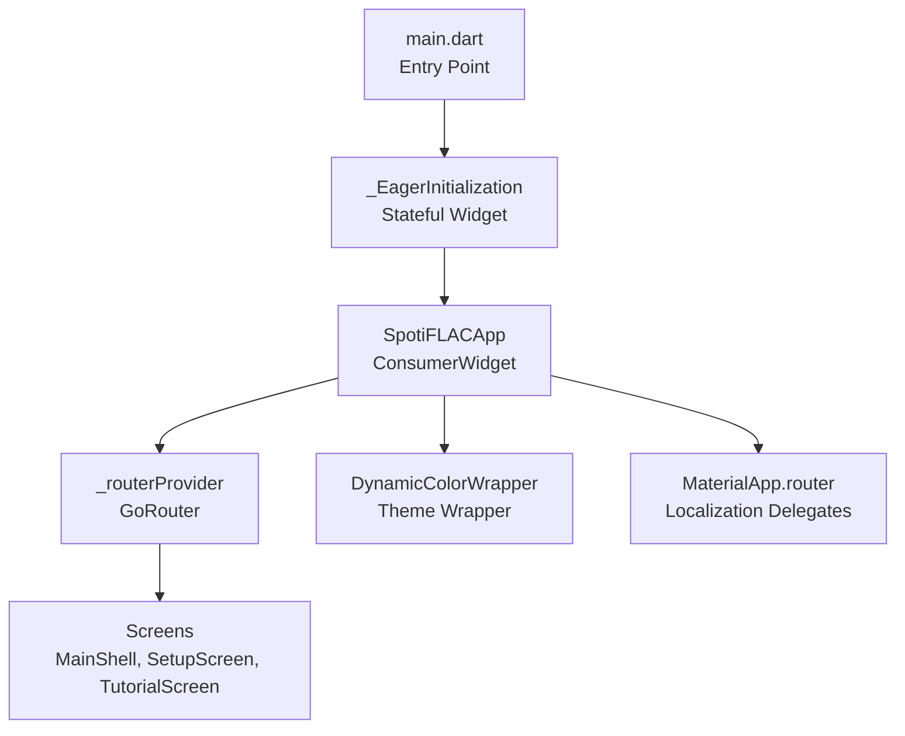
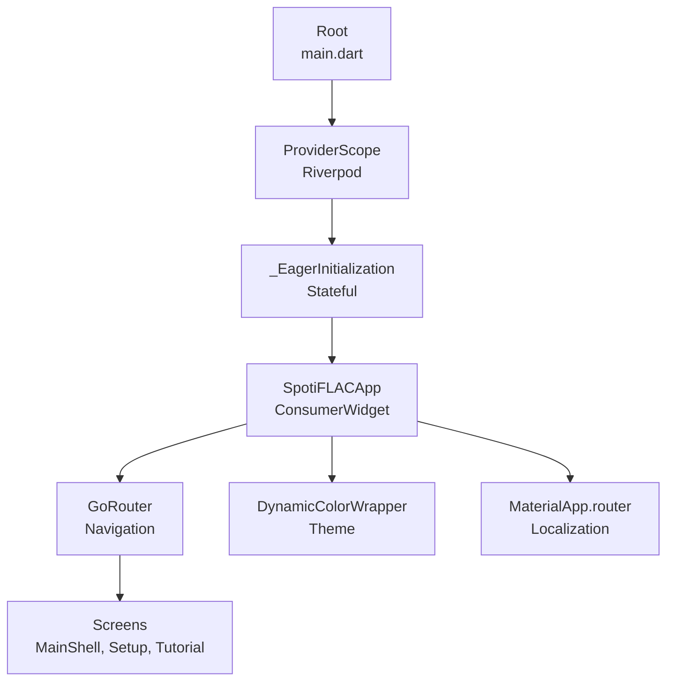
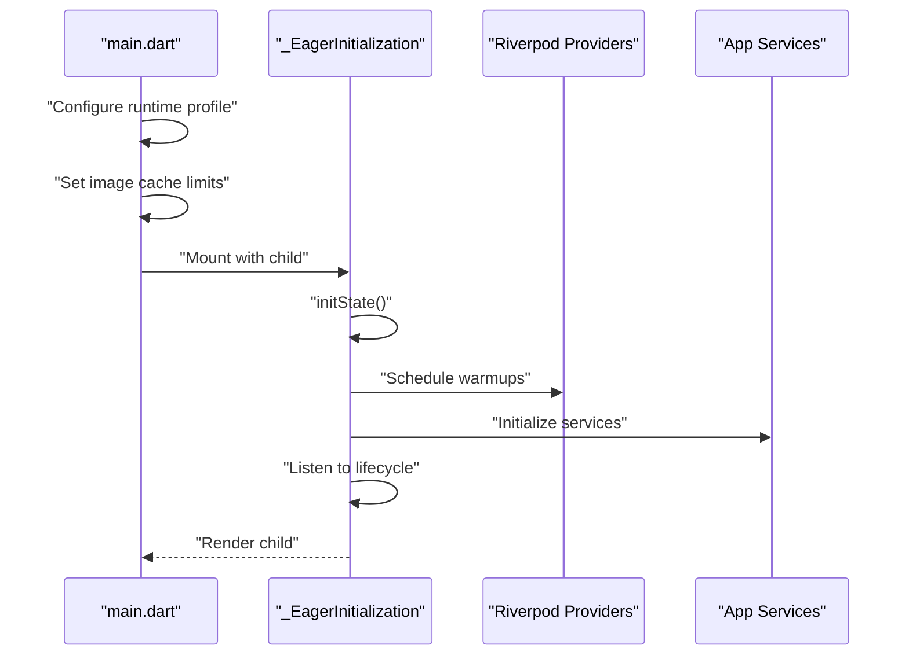
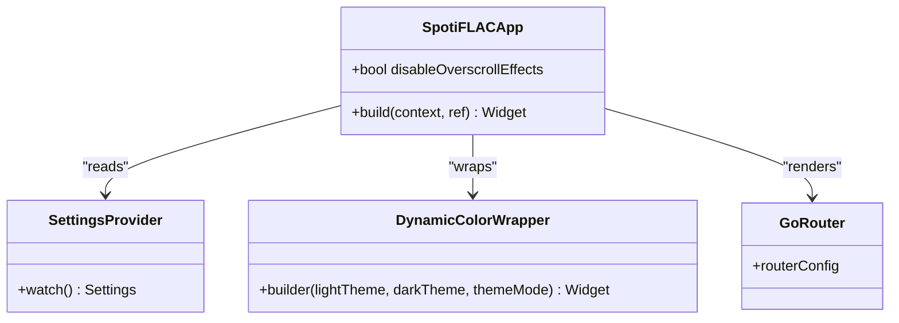
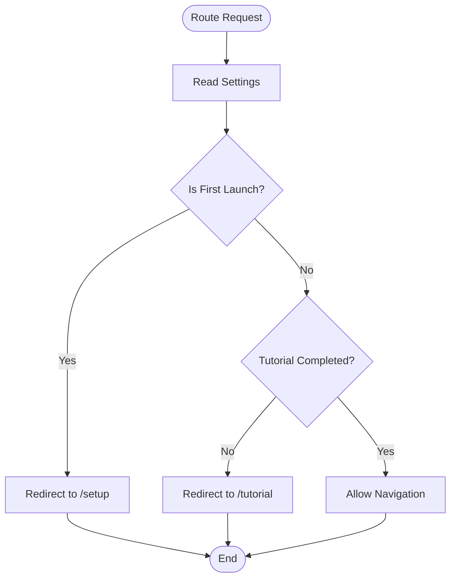
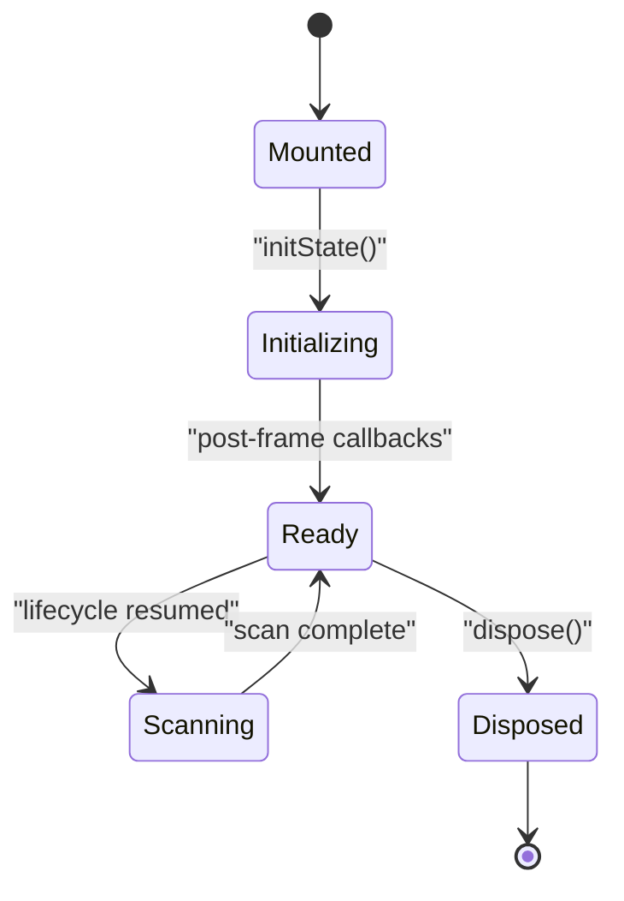
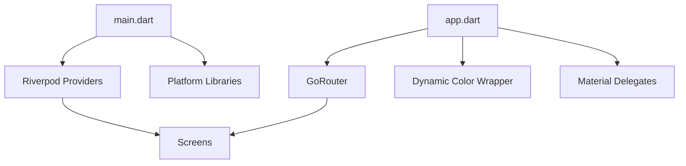

# Widget Architecture and Hierarchy

<cite>
**Referenced Files in This Document**
- [main.dart](file://lib/main.dart)
- [app.dart](file://lib/app.dart)
</cite>

## Table of Contents
1. [Introduction](#introduction)
2. [Project Structure](#project-structure)
3. [Core Components](#core-components)
4. [Architecture Overview](#architecture-overview)
5. [Detailed Component Analysis](#detailed-component-analysis)
6. [Dependency Analysis](#dependency-analysis)
7. [Performance Considerations](#performance-considerations)
8. [Troubleshooting Guide](#troubleshooting-guide)
9. [Conclusion](#conclusion)

## Introduction
This document explains the widget architecture and component hierarchy of the application, focusing on how the widget tree is structured, how stateful and stateless widgets interact, and how reusable component patterns are implemented. It also covers prop passing mechanisms, common widget types, lifecycle management, performance optimizations, testing strategies, debugging approaches, and best practices for maintaining a clean component architecture.

## Project Structure
The application entry point initializes platform-specific services, configures image caching, and mounts the main application shell. The application uses Riverpod for state management and GoRouter for navigation. The widget tree is composed of a top-level consumer widget that sets up routing, localization, theming, and scroll behavior.

**Diagram sources**
- [main.dart:22-44](file://lib/main.dart#L22-L44)
- [main.dart:96-286](file://lib/main.dart#L96-L286)
- [app.dart:13-52](file://lib/app.dart#L13-L52)
- [app.dart:54-97](file://lib/app.dart#L54-L97)

**Section sources**
- [main.dart:22-44](file://lib/main.dart#L22-L44)
- [main.dart:96-286](file://lib/main.dart#L96-L286)
- [app.dart:13-52](file://lib/app.dart#L13-L52)
- [app.dart:54-97](file://lib/app.dart#L54-L97)

## Core Components
- Entry point and initialization:
  - Ensures Flutter binding is initialized, initializes media backend, configures desktop database factory, and sets up image cache limits.
  - Mounts the application inside a Riverpod ProviderScope and wraps the app with an eager initialization widget to pre-warm providers and services.
- Application shell:
  - A ConsumerWidget that builds the MaterialApp.router with dynamic theming, scroll behavior, localization, and routing.
  - Uses a provider to supply a configured GoRouter with redirect logic based on settings and first-launch state.
- Navigation:
  - Routes include the main shell, setup screen, and tutorial screen, with redirect logic ensuring proper onboarding flow.

Key responsibilities:
- State management: Riverpod providers manage app-wide state and services.
- Routing: GoRouter handles navigation and route guards.
- Theming and localization: Dynamic color wrapper and material delegates provide theme switching and locale selection.
- Lifecycle: The eager initialization widget observes app lifecycle to trigger scans and warmup tasks.

**Section sources**
- [main.dart:22-44](file://lib/main.dart#L22-L44)
- [main.dart:96-286](file://lib/main.dart#L96-L286)
- [app.dart:13-52](file://lib/app.dart#L13-L52)
- [app.dart:54-97](file://lib/app.dart#L54-L97)

## Architecture Overview
The widget tree begins at the entry point, which configures the environment and mounts the application shell. The shell composes routing, theming, localization, and scroll behavior. The router navigates to different screens, which are built from stateless or stateful components depending on their needs.

**Diagram sources**
- [main.dart:35-43](file://lib/main.dart#L35-L43)
- [main.dart:96-286](file://lib/main.dart#L96-L286)
- [app.dart:54-97](file://lib/app.dart#L54-L97)

## Detailed Component Analysis

### Entry Point and Eager Initialization
- Purpose: Configure platform-specific services, initialize media and database backends, set image cache limits, and pre-warm providers and services.
- Behavior:
  - Resolves runtime profile based on device capabilities and adjusts image cache sizes accordingly.
  - Schedules deferred provider warmups to avoid blocking the UI thread.
  - Observes app lifecycle to conditionally trigger local library scans.
  - Initializes services such as cover cache manager, notifications, and share intent service.
- Stateful vs stateless:
  - The eager initialization widget is stateful because it manages timers, subscriptions, and lifecycle callbacks.
  - The child passed to it remains stateless and is simply rendered after initialization.

**Diagram sources**
- [main.dart:22-44](file://lib/main.dart#L22-L44)
- [main.dart:96-286](file://lib/main.dart#L96-L286)

**Section sources**
- [main.dart:22-44](file://lib/main.dart#L22-L44)
- [main.dart:96-286](file://lib/main.dart#L96-L286)

### Application Shell (ConsumerWidget)
- Purpose: Build the MaterialApp.router with dynamic theming, scroll behavior, localization, and routing.
- Prop passing:
  - Receives a flag to disable overscroll effects.
  - Reads settings via Riverpod to determine locale and theme mode.
- Composition:
  - Wraps the router with a dynamic color wrapper for theme switching.
  - Provides localization delegates and supported locales.
  - Applies scroll behavior based on runtime profile.

**Diagram sources**
- [app.dart:54-97](file://lib/app.dart#L54-L97)

**Section sources**
- [app.dart:54-97](file://lib/app.dart#L54-L97)

### Routing and Navigation
- Provider-based router:
  - A Riverpod provider creates a GoRouter with redirect logic based on settings and first-launch state.
  - Routes include the main shell, setup screen, and tutorial screen.
  - Redirect ensures users complete onboarding before accessing the main interface.
- Route parameters:
  - The setup route supports an initial step parameter passed via state.extra.

**Diagram sources**
- [app.dart:13-52](file://lib/app.dart#L13-L52)

**Section sources**
- [app.dart:13-52](file://lib/app.dart#L13-L52)

### Common Widget Types and Patterns
- Stateless widgets:
  - Used for static UI components and leaf nodes in the tree.
  - Examples include icon buttons, text labels, and containers that render based on props.
- Stateful widgets:
  - Used for components that manage internal state or observe system events.
  - Example: The eager initialization widget manages timers, subscriptions, and lifecycle callbacks.
- Consumer widgets:
  - Used for widgets that need to read Riverpod state without triggering rebuilds unless selected parts change.
  - Example: The application shell reads settings and theme preferences via a ConsumerWidget.

Prop passing mechanisms:
- Constructor parameters for immutable data.
- Riverpod selectors for selective state updates.
- Route parameters for navigation-driven data.

Widget composition patterns:
- Wrapper pattern: The application shell wraps the router and theme provider.
- Provider pattern: State is centralized in Riverpod providers and consumed via watch/listen.
- Conditional rendering: Redirect logic determines which screen to render based on settings.

**Section sources**
- [main.dart:96-286](file://lib/main.dart#L96-L286)
- [app.dart:54-97](file://lib/app.dart#L54-L97)

### Widget Lifecycle Management
- Initialization:
  - Eager initialization runs post-frame callbacks to avoid blocking the UI during startup.
  - Services and providers are warmed up asynchronously with staggered delays.
- App lifecycle:
  - The widget observes lifecycle changes to trigger local library scans when the app resumes.
- Disposal:
  - Timers and subscriptions are canceled in dispose to prevent leaks.

**Diagram sources**
- [main.dart:114-134](file://lib/main.dart#L114-L134)
- [main.dart:136-141](file://lib/main.dart#L136-L141)
- [main.dart:169-174](file://lib/main.dart#L169-L174)

**Section sources**
- [main.dart:114-134](file://lib/main.dart#L114-L134)
- [main.dart:136-141](file://lib/main.dart#L136-L141)
- [main.dart:169-174](file://lib/main.dart#L169-L174)

## Dependency Analysis
The application follows a layered architecture:
- Entry point depends on platform libraries and Riverpod.
- Application shell depends on routing, localization, theming, and settings providers.
- Routing depends on settings to enforce onboarding flow.
- Eager initialization depends on Riverpod for provider warmup and on settings for scan scheduling.

**Diagram sources**
- [main.dart:22-44](file://lib/main.dart#L22-L44)
- [app.dart:54-97](file://lib/app.dart#L54-L97)

**Section sources**
- [main.dart:22-44](file://lib/main.dart#L22-L44)
- [app.dart:54-97](file://lib/app.dart#L54-L97)

## Performance Considerations
- Image cache sizing:
  - Runtime profile adjusts image cache limits to prevent memory pressure on low-RAM devices.
- Deferred initialization:
  - Provider warmups are scheduled with delays to keep the UI responsive.
- Scroll behavior:
  - Overscroll effects can be disabled to reduce unnecessary animations on constrained devices.
- Service initialization:
  - Services are initialized concurrently to minimize startup time.

Best practices:
- Prefer ConsumerWidget for widgets that only read state.
- Use selectors to narrow rebuild scopes.
- Avoid heavy work in build methods; defer to initState or lifecycle callbacks.
- Use timers and subscriptions judiciously and cancel them in dispose.

**Section sources**
- [main.dart:46-82](file://lib/main.dart#L46-L82)
- [main.dart:143-174](file://lib/main.dart#L143-L174)
- [app.dart:63-65](file://lib/app.dart#L63-L65)

## Troubleshooting Guide
Common issues and resolutions:
- Navigation loops during onboarding:
  - Verify redirect logic in the router provider and ensure settings are properly initialized.
- Theme or locale not applying:
  - Confirm the dynamic color wrapper and localization delegates are correctly configured.
- Excessive memory usage:
  - Adjust image cache sizes via the runtime profile and monitor provider warmup delays.
- Background scans not triggering:
  - Check lifecycle observation and settings for auto-scan conditions.

Debugging tips:
- Use debug prints in lifecycle callbacks and provider warmup actions.
- Inspect mounted state before updating UI in asynchronous callbacks.
- Validate route parameters passed via state.extra.

**Section sources**
- [main.dart:136-141](file://lib/main.dart#L136-L141)
- [main.dart:193-233](file://lib/main.dart#L193-L233)
- [app.dart:17-31](file://lib/app.dart#L17-L31)

## Conclusion
The application’s widget architecture centers on a clear separation of concerns: the entry point configures the environment, the application shell composes routing and theming, and Riverpod manages state and services. Stateful widgets handle lifecycle-sensitive tasks, while ConsumerWidgets consume state efficiently. The routing system enforces a guided onboarding experience, and performance optimizations ensure responsiveness across devices. Following the patterns and best practices outlined here will help maintain a clean, scalable, and testable component architecture.