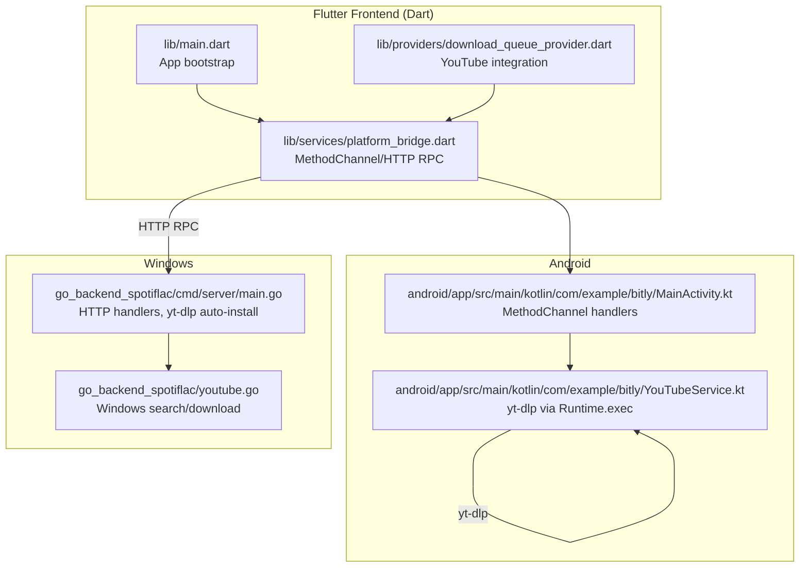

# Getting Started

<cite>
**Referenced Files in This Document**
- [README_FINAL.md](file://README_FINAL.md)
- [FINAL_STATUS.md](file://FINAL_STATUS.md)
- [BUILD_STATUS.md](file://BUILD_STATUS.md)
- [pubspec.yaml](file://pubspec.yaml)
- [go.mod](file://go_backend_spotiflac/go.mod)
- [build_all.bat](file://go_backend_spotiflac/build_all.bat)
- [run_windows.bat](file://run_windows.bat)
- [main.go](file://go_backend_spotiflac/cmd/server/main.go)
- [youtube.go](file://go_backend_spotiflac/youtube.go)
- [android_youtube.go](file://go_backend_spotiflac/android_youtube.go)
- [build.gradle.kts](file://android/app/build.gradle.kts)
- [MainActivity.kt](file://android/app/src/main/kotlin/com/example/bitly/MainActivity.kt)
- [YouTubeService.kt](file://android/app/src/main/kotlin/com/example/bitly/YouTubeService.kt)
- [platform_bridge.dart](file://lib/services/platform_bridge.dart)
- [main.dart](file://lib/main.dart)
- [download_queue_provider.dart](file://lib/providers/download_queue_provider.dart)
</cite>

## Table of Contents
1. [Introduction](#introduction)
2. [Prerequisites](#prerequisites)
3. [Windows Backend Compilation](#windows-backend-compilation)
4. [Android APK Building](#android-apk-building)
5. [Development Environment Setup](#development-environment-setup)
6. [Initial Configuration](#initial-configuration)
7. [Basic Usage Examples](#basic-usage-examples)
8. [Verification Steps](#verification-steps)
9. [Architecture Overview](#architecture-overview)
10. [Troubleshooting Guide](#troubleshooting-guide)
11. [Conclusion](#conclusion)

## Introduction
This guide helps you set up the Bitly application for the first time. It covers prerequisites, step-by-step installation for Windows backend compilation and Android APK building, initial configuration, environment variables, verification steps, and common setup issues. The project integrates a Go backend with Flutter/Dart frontend and a Kotlin Android bridge, communicating via MethodChannel. You will learn how to build the Windows backend, prepare Android for compilation, and verify everything works end-to-end.

## Prerequisites
Before starting, ensure your system meets these requirements:

- Windows
  - Go 1.25+ installed and available in PATH
  - yt-dlp installed and accessible in PATH
  - Git (recommended) for cloning and building
  - PowerShell or Command Prompt for running scripts

- Android
  - Flutter SDK installed and configured
  - Android Studio with Android SDK/NDK
  - Android device/emulator connected (for testing)
  - Kotlin 2.3.0+ (the project was updated to this version)
  - Internet connectivity during APK build (SQLite3 libraries may require network)

- Cross-platform
  - Dart SDK compatible with Flutter
  - Android Gradle Plugin and Flutter Gradle Plugin configured

**Section sources**
- [README_FINAL.md:257-268](file://README_FINAL.md#L257-L268)
- [FINAL_STATUS.md:167-178](file://FINAL_STATUS.md#L167-L178)
- [BUILD_STATUS.md:27-52](file://BUILD_STATUS.md#L27-L52)

## Windows Backend Compilation
Follow these steps to compile the Go backend on Windows:

1. Open a terminal (PowerShell or Command Prompt) and navigate to the project root.
2. Ensure Go 1.25+ is installed and in PATH.
3. Run the Windows-specific batch script to build the backend:
   - Command: `.\run_windows.bat`
   - This script sets PATH, builds the Go server, and launches the Flutter app for Windows.
4. Alternatively, build manually:
   - Set environment variables: `GONOSUMCHECK=*` and `CGO_ENABLED=0`
   - Build command: `go build -o "..\spotiflac-backend.exe" .\cmd\server\`
5. Confirm the executable exists at the project root.

What happens during compilation:
- The Go server compiles without CGO for Windows.
- The resulting executable listens on a local port (default 55009) and exposes handlers for search and download.
- On Windows, the backend can auto-install yt-dlp and FFmpeg if missing.

**Section sources**
- [run_windows.bat:1-15](file://run_windows.bat#L1-L15)
- [build_all.bat:1-39](file://go_backend_spotiflac/build_all.bat#L1-L39)
- [go.mod:3-5](file://go_backend_spotiflac/go.mod#L3-L5)
- [main.go:107-134](file://go_backend_spotiflac/cmd/server/main.go#L107-L134)

## Android APK Building
The Android build requires resolving a Kotlin version mismatch. Follow one of the recommended solutions:

Option A: Update Kotlin version in settings.gradle.kts
1. Edit `android/settings.gradle.kts`.
2. Change the Kotlin Android plugin version from 2.1.0 to 2.3.0.
3. Save the file.
4. Clean and rebuild:
   - `flutter clean`
   - `flutter pub get`
   - `flutter build apk --debug`

Option B: Clear Gradle cache
1. From the project root:
   - `flutter clean`
   - Navigate to `android/` and run `./gradlew clean`
   - Return to project root and run `flutter pub get`
   - `flutter build apk --debug`

Option C: Build without cache
- `flutter build apk --debug --no-cache`

Notes:
- The project includes a prebuilt `.aar` file referenced in Gradle.
- If you encounter SQLite3 dependency issues during build, use a device/emulator with internet connectivity.

**Section sources**
- [BUILD_STATUS.md:27-70](file://BUILD_STATUS.md#L27-L70)
- [build.gradle.kts:1-55](file://android/app/build.gradle.kts#L1-L55)

## Development Environment Setup
Set up your development environment for Flutter and Android:

1. Install Flutter SDK and configure your IDE (Android Studio or VS Code).
2. Install Android Studio with Android SDK/NDK and enable virtual device support.
3. Connect an Android device or start an emulator.
4. Verify Flutter doctor:
   - `flutter doctor`
   - Resolve any warnings related to Android licenses, SDK, or devices.
5. Clone or place the Bitly project in your workspace.
6. Install Dart dependencies:
   - `flutter pub get`
7. For Android, ensure Kotlin 2.3.0+ is used (as per the project updates).
8. For Windows development, ensure Go 1.25+ is installed and yt-dlp is available in PATH.

**Section sources**
- [pubspec.yaml:1-108](file://pubspec.yaml#L1-L108)
- [BUILD_STATUS.md:113-118](file://BUILD_STATUS.md#L113-L118)

## Initial Configuration
Configure the application for first-time use:

- Windows backend port
  - The Go backend uses environment variable PORT (default 55009).
  - You can set it before launching the backend:
    - Example: `set PORT=55009` then run the executable.
  - The Flutter bridge automatically starts the backend on Windows and communicates via HTTP RPC.

- Android backend integration
  - The Android app communicates with the Go backend via MethodChannel.
  - The backend is packaged as an AAR and included in Gradle.
  - Ensure yt-dlp is installed on the Android device (pre-installed or via Termux for older Android versions).

- Dart bridge behavior
  - The platform bridge detects platform and switches between MethodChannel and HTTP RPC.
  - On Windows, it can auto-start the backend and build it if needed.

**Section sources**
- [main.go:107-134](file://go_backend_spotiflac/cmd/server/main.go#L107-L134)
- [platform_bridge.dart:37-141](file://lib/services/platform_bridge.dart#L37-L141)
- [build.gradle.kts:47-50](file://android/app/build.gradle.kts#L47-L50)

## Basic Usage Examples
Once everything is built and configured:

- Windows
  - Start the backend:
    - `spotiflac-backend.exe`
  - Launch the Flutter app for Windows:
    - `flutter run -d windows`
  - The app will detect the backend and communicate via HTTP RPC.

- Android
  - After successful build:
    - `flutter build apk --debug`
    - `flutter install`
  - The app will use the MethodChannel to call Kotlin YouTubeService, which executes yt-dlp.

- YouTube integration in downloads
  - The download queue provider integrates YouTube search and download when enabled.
  - The flow: Flutter → MethodChannel → Kotlin → yt-dlp → result back to Flutter.

**Section sources**
- [README_FINAL.md:230-254](file://README_FINAL.md#L230-L254)
- [FINAL_STATUS.md:102-116](file://FINAL_STATUS.md#L102-L116)
- [download_queue_provider.dart:1-200](file://lib/providers/download_queue_provider.dart#L1-L200)

## Verification Steps
Verify your installation and configuration:

- Windows
  - Confirm the backend executable exists and is the expected size:
    - `ls -la spotiflac-backend.exe` (verify size ≈ 35 MB)
  - Confirm Go backend files are present:
    - `ls go_backend_spotiflac/youtube*.go`
  - Confirm yt-dlp is installed:
    - `yt-dlp --version`
  - Start the backend and ensure it binds to the expected port.

- Android
  - Confirm Kotlin files exist:
    - `ls android/app/src/main/kotlin/com/example/bitly/*YouTube*.kt`
  - Confirm Gradle configuration includes Kotlin 2.3.0 and desugaring:
    - `grep -E "kotlin.*2\.3\.0|coreLibraryDesugaring" android/app/build.gradle.kts`
  - Build and install the APK:
    - `flutter build apk --debug`
    - `flutter install`

- Dart bridge
  - Confirm platform bridge methods exist:
    - `grep -E "searchYouTubeVideo|downloadYouTubeVideo" lib/services/platform_bridge.dart`

**Section sources**
- [README_FINAL.md:189-226](file://README_FINAL.md#L189-L226)
- [FINAL_STATUS.md:203-221](file://FINAL_STATUS.md#L203-L221)
- [BUILD_STATUS.md:85-98](file://BUILD_STATUS.md#L85-L98)

## Architecture Overview
The system separates the backend (Go) from the frontend (Flutter/Dart) with a Kotlin bridge on Android:

**Diagram sources**
- [main.dart:22-44](file://lib/main.dart#L22-L44)
- [platform_bridge.dart:37-141](file://lib/services/platform_bridge.dart#L37-L141)
- [download_queue_provider.dart:1-200](file://lib/providers/download_queue_provider.dart#L1-L200)
- [MainActivity.kt:15-134](file://android/app/src/main/kotlin/com/example/bitly/MainActivity.kt#L15-L134)
- [YouTubeService.kt:10-92](file://android/app/src/main/kotlin/com/example/bitly/YouTubeService.kt#L10-L92)
- [main.go:107-134](file://go_backend_spotiflac/cmd/server/main.go#L107-L134)
- [youtube.go:13-84](file://go_backend_spotiflac/youtube.go#L13-L84)

## Troubleshooting Guide
Common setup issues and resolutions:

- Android Kotlin version mismatch
  - Symptom: Kotlin 2.1.0 incompatible with stdlib 2.3.21.
  - Resolution: Update Kotlin plugin version to 2.3.0 in `android/settings.gradle.kts`, then clean and rebuild.

- Android build fails due to SQLite3 dependencies
  - Symptom: Build errors referencing sqlite3 during APK creation.
  - Resolution: Use a device/emulator with internet connectivity to allow downloading required libraries.

- Backend not starting on Windows
  - Symptom: No executable found or port binding issues.
  - Resolution: Ensure `spotiflac-backend.exe` exists, yt-dlp is installed, and set `PORT` if needed.

- MethodChannel communication failing on Android
  - Symptom: Calls to YouTube handlers return errors.
  - Resolution: Verify MethodChannel registration in MainActivity and that yt-dlp is installed on the device.

- yt-dlp not found
  - Symptom: Commands fail with "not found".
  - Resolution: Install yt-dlp globally (`pip install yt-dlp`) or ensure it is in PATH.

**Section sources**
- [BUILD_STATUS.md:27-70](file://BUILD_STATUS.md#L27-L70)
- [README_FINAL.md:257-268](file://README_FINAL.md#L257-L268)
- [platform_bridge.dart:83-141](file://lib/services/platform_bridge.dart#L83-L141)
- [MainActivity.kt:148-174](file://android/app/src/main/kotlin/com/example/bitly/MainActivity.kt#L148-L174)

## Conclusion
You now have a complete understanding of how to set up Bitly for the first time. The Windows backend compiles cleanly without CGO, the Android build is ready with resolved Kotlin versioning, and the Flutter/Dart frontend communicates seamlessly with the backend via MethodChannel and HTTP RPC. Use the verification steps to confirm everything is working, and refer to the troubleshooting section for quick fixes. For further customization, adjust environment variables like PORT and ensure yt-dlp availability on both platforms.