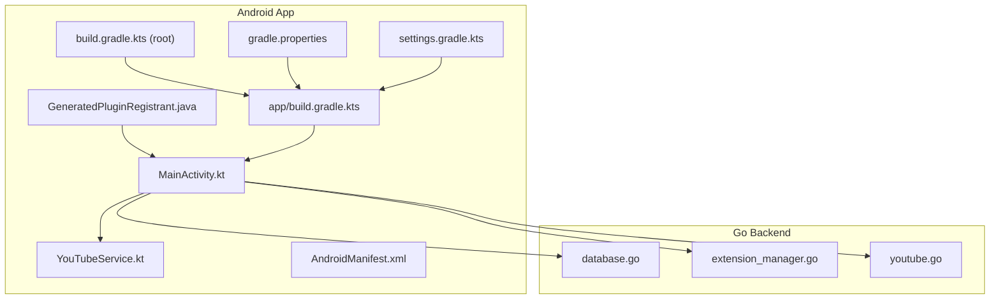
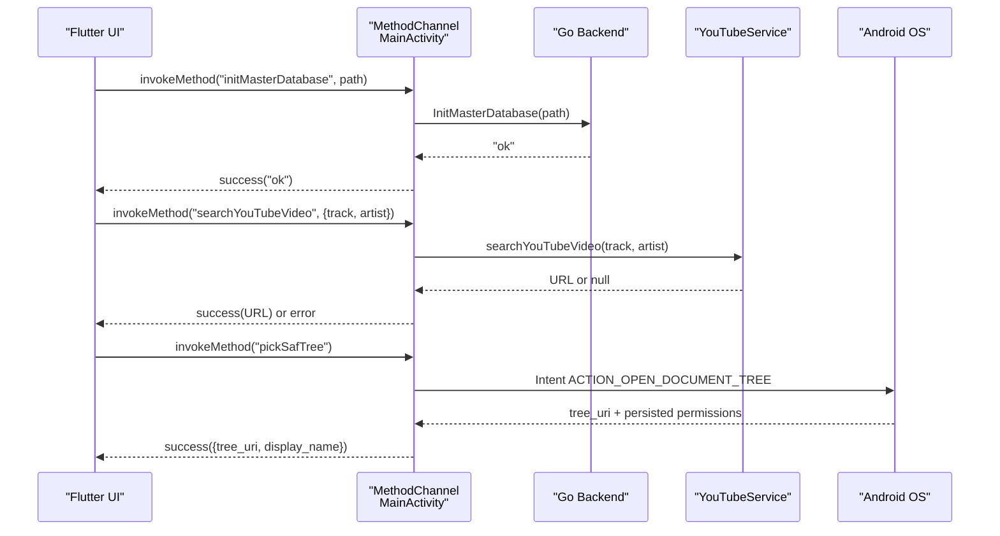
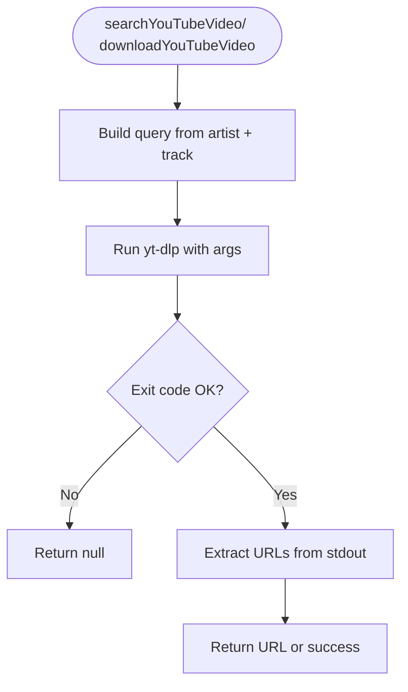
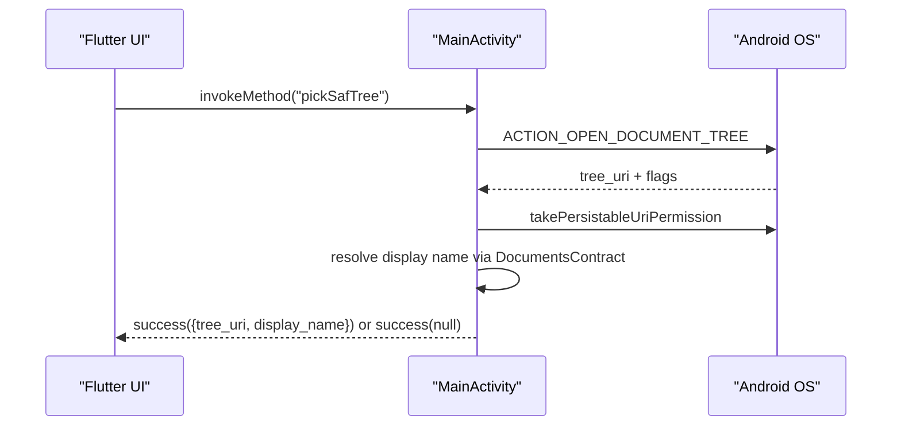
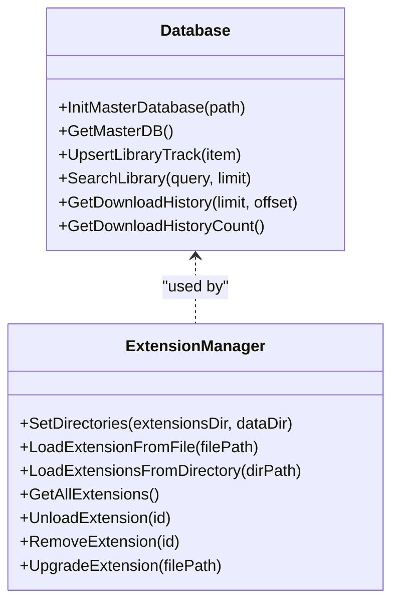
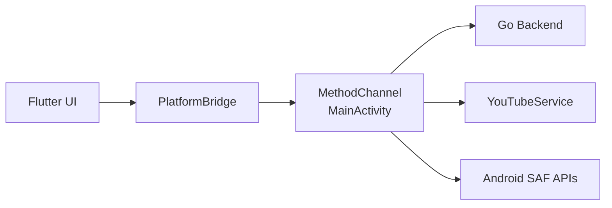
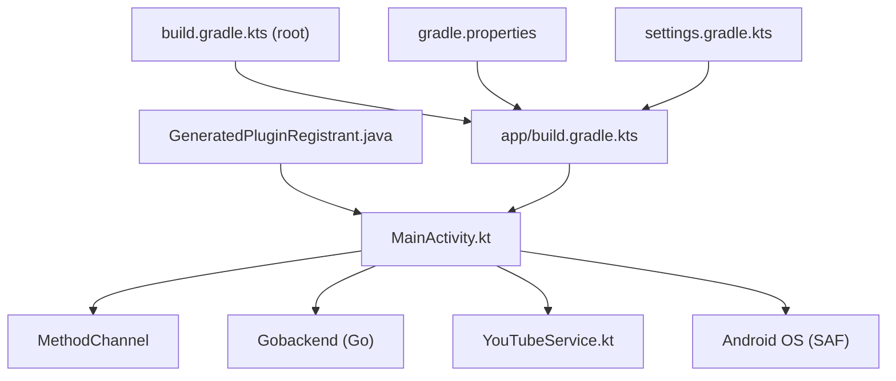

# Android Platform

<cite>
**Referenced Files in This Document**
- [MainActivity.kt](file://android/app/src/main/kotlin/com/example/bitly/MainActivity.kt)
- [YouTubeService.kt](file://android/app/src/main/kotlin/com/example/bitly/YouTubeService.kt)
- [AndroidManifest.xml](file://android/app/src/main/AndroidManifest.xml)
- [build.gradle.kts (app)](file://android/app/build.gradle.kts)
- [build.gradle.kts (root)](file://android/build.gradle.kts)
- [gradle.properties](file://android/gradle.properties)
- [settings.gradle.kts](file://android/settings.gradle.kts)
- [GeneratedPluginRegistrant.java](file://android/app/src/main/java/io/flutter/plugins/GeneratedPluginRegistrant.java)
- [platform_bridge.dart](file://lib/services/platform_bridge.dart)
- [youtube.go](file://go_backend_spotiflac/youtube.go)
- [database.go](file://go_backend_spotiflac/database.go)
- [extension_manager.go](file://go_backend_spotiflac/extension_manager.go)
</cite>

## Table of Contents
1. [Introduction](#introduction)
2. [Project Structure](#project-structure)
3. [Core Components](#core-components)
4. [Architecture Overview](#architecture-overview)
5. [Detailed Component Analysis](#detailed-component-analysis)
6. [Dependency Analysis](#dependency-analysis)
7. [Performance Considerations](#performance-considerations)
8. [Troubleshooting Guide](#troubleshooting-guide)
9. [Conclusion](#conclusion)
10. [Appendices](#appendices)

## Introduction
This document explains the Android platform integration for the project, focusing on the native Android implementation and MethodChannel communication. It covers the MainActivity setup, database operations, extension management, and YouTube service integration. It also documents Android-specific features such as the Storage Access Framework (SAF) tree picker, permission handling, and native storage access. Finally, it provides build configuration details, manifest permissions, Gradle setup, practical MethodChannel examples, error handling strategies, Android version compatibility, security considerations, and performance best practices.

## Project Structure
The Android module is organized under android/app and integrates with Flutter’s embedding. Key elements include:
- MainActivity.kt: Hosts the MethodChannel and delegates to the Go backend and YouTubeService.
- YouTubeService.kt: Provides yt-dlp-based video search and download capabilities.
- AndroidManifest.xml: Declares the main activity and queries.
- Gradle build files: Configure SDK levels, Java/Kotlin targets, and dependencies.
- GeneratedPluginRegistrant.java: Registers Flutter plugins used by the app.

**Diagram sources**
- [MainActivity.kt:15-133](file://android/app/src/main/kotlin/com/example/bitly/MainActivity.kt#L15-L133)
- [YouTubeService.kt:10-91](file://android/app/src/main/kotlin/com/example/bitly/YouTubeService.kt#L10-L91)
- [AndroidManifest.xml:1-48](file://android/app/src/main/AndroidManifest.xml#L1-L48)
- [GeneratedPluginRegistrant.java:17-138](file://android/app/src/main/java/io/flutter/plugins/GeneratedPluginRegistrant.java#L17-L138)
- [build.gradle.kts (app):1-55](file://android/app/build.gradle.kts#L1-L55)
- [build.gradle.kts (root):1-65](file://android/build.gradle.kts#L1-L65)
- [gradle.properties:1-7](file://android/gradle.properties#L1-L7)
- [settings.gradle.kts:1-27](file://android/settings.gradle.kts#L1-L27)
- [database.go:19-50](file://go_backend_spotiflac/database.go#L19-L50)
- [extension_manager.go:120-156](file://go_backend_spotiflac/extension_manager.go#L120-L156)
- [youtube.go:13-45](file://go_backend_spotiflac/youtube.go#L13-L45)

**Section sources**
- [MainActivity.kt:15-133](file://android/app/src/main/kotlin/com/example/bitly/MainActivity.kt#L15-L133)
- [YouTubeService.kt:10-91](file://android/app/src/main/kotlin/com/example/bitly/YouTubeService.kt#L10-L91)
- [AndroidManifest.xml:1-48](file://android/app/src/main/AndroidManifest.xml#L1-L48)
- [build.gradle.kts (app):1-55](file://android/app/build.gradle.kts#L1-L55)
- [build.gradle.kts (root):1-65](file://android/build.gradle.kts#L1-L65)
- [gradle.properties:1-7](file://android/gradle.properties#L1-L7)
- [settings.gradle.kts:1-27](file://android/settings.gradle.kts#L1-L27)
- [GeneratedPluginRegistrant.java:17-138](file://android/app/src/main/java/io/flutter/plugins/GeneratedPluginRegistrant.java#L17-L138)

## Core Components
- MainActivity: Implements FlutterActivity, sets up MethodChannel, routes calls to the Go backend, and handles SAF tree picker and YouTube operations.
- YouTubeService: Wraps yt-dlp commands for YouTube search and download, returning URLs or file paths.
- Go Backend: Provides database operations, extension management, and YouTube search/download via separate Go packages.

Key responsibilities:
- MethodChannel routing for database, settings, extension store, search, history, lyrics, SAF, and availability checks.
- SAF tree picker with persisted permissions and display name retrieval.
- YouTube search and download using yt-dlp with error logging and exit code handling.
- Background thread execution for long-running operations and main-thread result delivery.

**Section sources**
- [MainActivity.kt:15-133](file://android/app/src/main/kotlin/com/example/bitly/MainActivity.kt#L15-L133)
- [YouTubeService.kt:10-91](file://android/app/src/main/kotlin/com/example/bitly/YouTubeService.kt#L10-L91)
- [youtube.go:13-45](file://go_backend_spotiflac/youtube.go#L13-L45)
- [database.go:19-50](file://go_backend_spotiflac/database.go#L19-L50)
- [extension_manager.go:120-156](file://go_backend_spotiflac/extension_manager.go#L120-L156)

## Architecture Overview
The Android app communicates with the Flutter engine via MethodChannel. MainActivity registers a channel and dispatches requests to:
- The Go backend for database, extension, and metadata operations.
- YouTubeService for YouTube search and download.
- Android framework APIs for SAF and permissions.

**Diagram sources**
- [MainActivity.kt:23-133](file://android/app/src/main/kotlin/com/example/bitly/MainActivity.kt#L23-L133)
- [YouTubeService.kt:12-23](file://android/app/src/main/kotlin/com/example/bitly/YouTubeService.kt#L12-L23)
- [youtube.go:13-45](file://go_backend_spotiflac/youtube.go#L13-L45)

## Detailed Component Analysis

### MainActivity: MethodChannel Setup and Routing
- Channel name: com.zarz.spotiflac/backend
- Uses a single-thread executor and main Looper handler to marshal results back to Flutter safely.
- Routes methods to:
  - Database and settings: initMasterDatabase, loadAppSettings, saveAppSettings.
  - Extension system: initExtensionSystem, getInstalledExtensions, initExtensionStore, getStoreExtensions, setDownloadFallbackExtensionIds.
  - Search and YouTube: searchTracksWithMetadataProviders, searchYouTubeVideo, downloadYouTubeVideo, downloadByStrategy.
  - History and collections: getDownloadHistory, getDownloadHistoryCount, getAllCollections, getPendingDownloadQueueRows.
  - Lyrics and sync: setLyricsProviders, setLyricsFetchOptions, setNetworkCompatibilityOptions.
  - SAF and storage utils: pickSafTree, ensureYtDlp, checkAvailability.

Error handling:
- Catches exceptions during JSON execution and returns BACKEND_ERROR with message.
- YouTube operations return YOUTUBE_ERROR with specific messages.

SAF tree picker:
- Launches ACTION_OPEN_DOCUMENT_TREE with read/write and persistable URI permissions.
- Persists permissions across reboots and resolves display name via DocumentsContract.
- Returns a map with tree_uri and display_name or null on cancellation.

YouTube operations:
- Delegates to YouTubeService and posts results on the main thread.

**Section sources**
- [MainActivity.kt:15-133](file://android/app/src/main/kotlin/com/example/bitly/MainActivity.kt#L15-L133)
- [MainActivity.kt:147-173](file://android/app/src/main/kotlin/com/example/bitly/MainActivity.kt#L147-L173)
- [MainActivity.kt:175-218](file://android/app/src/main/kotlin/com/example/bitly/MainActivity.kt#L175-L218)
- [MainActivity.kt:220-242](file://android/app/src/main/kotlin/com/example/bitly/MainActivity.kt#L220-L242)

### YouTubeService: Video Search and Download
- Searches YouTube videos using yt-dlp with height-limited formats and playlist skipping.
- Downloads videos with merged output format and returns the resulting file path if present.
- Executes yt-dlp via Runtime.exec, captures stdout/stderr, and interprets exit codes (0 or 1 acceptable).
- Logs diagnostics and returns null on failure.

**Diagram sources**
- [YouTubeService.kt:12-23](file://android/app/src/main/kotlin/com/example/bitly/YouTubeService.kt#L12-L23)
- [YouTubeService.kt:25-52](file://android/app/src/main/kotlin/com/example/bitly/YouTubeService.kt#L25-L52)
- [YouTubeService.kt:54-90](file://android/app/src/main/kotlin/com/example/bitly/YouTubeService.kt#L54-L90)

**Section sources**
- [YouTubeService.kt:10-91](file://android/app/src/main/kotlin/com/example/bitly/YouTubeService.kt#L10-L91)
- [youtube.go:13-45](file://go_backend_spotiflac/youtube.go#L13-L45)

### SAF Tree Picker Implementation
- Launches ACTION_OPEN_DOCUMENT_TREE with optional title on supported versions.
- Persists read/write permissions for long-term access.
- Resolves display name via DocumentsContract and returns a structured result map.
- Handles user cancellation by returning success(null).

**Diagram sources**
- [MainActivity.kt:175-218](file://android/app/src/main/kotlin/com/example/bitly/MainActivity.kt#L175-L218)
- [MainActivity.kt:220-242](file://android/app/src/main/kotlin/com/example/bitly/MainActivity.kt#L220-L242)

**Section sources**
- [MainActivity.kt:175-218](file://android/app/src/main/kotlin/com/example/bitly/MainActivity.kt#L175-L218)
- [MainActivity.kt:220-242](file://android/app/src/main/kotlin/com/example/bitly/MainActivity.kt#L220-L242)

### Database Operations and Extension Management
- Database initialization and performance tuning (WAL, synchronous, cache size, busy timeout).
- Extension manager with directory creation, loading/unloading, validation, and runtime lifecycle.
- Go backend exposes JSON-based APIs for database operations and extension management.

**Diagram sources**
- [database.go:19-50](file://go_backend_spotiflac/database.go#L19-L50)
- [database.go:52-118](file://go_backend_spotiflac/database.go#L52-L118)
- [extension_manager.go:141-156](file://go_backend_spotiflac/extension_manager.go#L141-L156)
- [extension_manager.go:158-294](file://go_backend_spotiflac/extension_manager.go#L158-L294)

**Section sources**
- [database.go:19-50](file://go_backend_spotiflac/database.go#L19-L50)
- [extension_manager.go:120-156](file://go_backend_spotiflac/extension_manager.go#L120-L156)
- [extension_manager.go:158-294](file://go_backend_spotiflac/extension_manager.go#L158-L294)

### Conceptual Overview
The Flutter UI invokes PlatformBridge, which routes calls to either:
- MethodChannel on Android (MainActivity).
- HTTP RPC on desktop backends.

On Android, MainActivity delegates to:
- Go backend for heavy operations (database, extensions, downloads).
- YouTubeService for YouTube search/download.
- Android OS for SAF and permissions.

**Diagram sources**
- [platform_bridge.dart:37-53](file://lib/services/platform_bridge.dart#L37-L53)
- [MainActivity.kt:23-133](file://android/app/src/main/kotlin/com/example/bitly/MainActivity.kt#L23-L133)
- [YouTubeService.kt:10-91](file://android/app/src/main/kotlin/com/example/bitly/YouTubeService.kt#L10-L91)

**Section sources**
- [platform_bridge.dart:37-53](file://lib/services/platform_bridge.dart#L37-L53)

## Dependency Analysis
- MainActivity depends on:
  - MethodChannel for Flutter interop.
  - Gobackend (Go backend) for database and extension operations.
  - YouTubeService for YouTube search/download.
  - Android OS for SAF and permissions.
- GeneratedPluginRegistrant registers Flutter plugins used by the app.
- Gradle builds define compile/target SDK levels, Java 17 compatibility, and dependencies.

**Diagram sources**
- [MainActivity.kt:15-133](file://android/app/src/main/kotlin/com/example/bitly/MainActivity.kt#L15-L133)
- [YouTubeService.kt:10-91](file://android/app/src/main/kotlin/com/example/bitly/YouTubeService.kt#L10-L91)
- [GeneratedPluginRegistrant.java:17-138](file://android/app/src/main/java/io/flutter/plugins/GeneratedPluginRegistrant.java#L17-L138)
- [build.gradle.kts (app):1-55](file://android/app/build.gradle.kts#L1-L55)
- [build.gradle.kts (root):1-65](file://android/build.gradle.kts#L1-L65)
- [gradle.properties:1-7](file://android/gradle.properties#L1-L7)
- [settings.gradle.kts:1-27](file://android/settings.gradle.kts#L1-L27)

**Section sources**
- [GeneratedPluginRegistrant.java:17-138](file://android/app/src/main/java/io/flutter/plugins/GeneratedPluginRegistrant.java#L17-L138)
- [build.gradle.kts (app):1-55](file://android/app/build.gradle.kts#L1-L55)
- [build.gradle.kts (root):1-65](file://android/build.gradle.kts#L1-L65)
- [gradle.properties:1-7](file://android/gradle.properties#L1-L7)
- [settings.gradle.kts:1-27](file://android/settings.gradle.kts#L1-L27)

## Performance Considerations
- Background execution: MainActivity executes long-running tasks on a single-thread executor and posts results on the main Looper to keep UI responsive.
- SQLite tuning: WAL mode, NORMAL synchronous, 64MB cache, and busy timeout reduce contention and improve throughput.
- yt-dlp exit code handling: Treats exit code 1 as success to tolerate partial outputs.
- JSON decoding: Large payloads are decoded in the background to avoid blocking the UI thread.
- Plugin registration: GeneratedPluginRegistrant ensures only necessary plugins are registered.

[No sources needed since this section provides general guidance]

## Troubleshooting Guide
Common issues and resolutions:
- BACKEND_ERROR: Indicates failures in Go backend calls; check logs and arguments passed via MethodChannel.
- YOUTUBE_ERROR: Search/download failures; verify yt-dlp availability and network connectivity.
- SAF_ERROR: Permission or URI issues; ensure ACTION_OPEN_DOCUMENT_TREE returned a URI and persisted permissions were granted.
- Port conflicts (desktop backend): PlatformBridge attempts multiple ports; check logs for binding errors.

**Section sources**
- [MainActivity.kt:135-145](file://android/app/src/main/kotlin/com/example/bitly/MainActivity.kt#L135-L145)
- [MainActivity.kt:147-173](file://android/app/src/main/kotlin/com/example/bitly/MainActivity.kt#L147-L173)
- [MainActivity.kt:175-218](file://android/app/src/main/kotlin/com/example/bitly/MainActivity.kt#L175-L218)
- [platform_bridge.dart:102-141](file://lib/services/platform_bridge.dart#L102-L141)

## Conclusion
The Android platform integration leverages a robust MethodChannel architecture to delegate heavy work to the Go backend while exposing essential Android capabilities like SAF and YouTube search/download. The design emphasizes safety (executor and main-thread marshalling), performance (SQLite tuning and background JSON decoding), and maintainability (clear separation of concerns and plugin registration).

[No sources needed since this section summarizes without analyzing specific files]

## Appendices

### Build Configuration Details
- Compile and target SDK levels are derived from Flutter configuration.
- Java 17 compatibility enforced via desugaring and Gradle JVM settings.
- Dependencies include spotiflac.aar and coreLibraryDesugaring.
- Gradle properties tune memory and daemon behavior.

**Section sources**
- [build.gradle.kts (app):8-36](file://android/app/build.gradle.kts#L8-L36)
- [build.gradle.kts (app):47-50](file://android/app/build.gradle.kts#L47-L50)
- [build.gradle.kts (root):12-22](file://android/build.gradle.kts#L12-L22)
- [gradle.properties:1-7](file://android/gradle.properties#L1-L7)

### Manifest Permissions and Queries
- MainActivity declared in AndroidManifest.xml with hardware acceleration and theme metadata.
- Queries block declares PROCESS_TEXT support for text processing.

**Section sources**
- [AndroidManifest.xml:8-34](file://android/app/src/main/AndroidManifest.xml#L8-L34)
- [AndroidManifest.xml:41-46](file://android/app/src/main/AndroidManifest.xml#L41-L46)

### Practical MethodChannel Examples
- Database initialization: pass a path string argument to initMasterDatabase.
- Settings: loadAppSettings returns JSON; saveAppSettings accepts JSON settings.
- Extension store: initExtensionStore with cache directory; getStoreExtensions with force refresh flag.
- Search: searchTracksWithMetadataProviders with query, limit, and include_extensions.
- YouTube: searchYouTubeVideo and downloadYouTubeVideo with track and artist names.
- History: getDownloadHistory with limit/offset; getDownloadHistoryCount returns integer.
- Lyrics: setLyricsProviders and setLyricsFetchOptions with JSON strings.
- Network options: setNetworkCompatibilityOptions with allow_http and insecure_tls booleans.
- SAF: pickSafTree returns tree_uri and display_name; resolveSafFile resolves file paths.

**Section sources**
- [MainActivity.kt:29-133](file://android/app/src/main/kotlin/com/example/bitly/MainActivity.kt#L29-L133)

### Android Version Compatibility
- SAF tree picker uses EXTRA_TITLE on Android O+.
- Persistable URI permissions require Android N+.
- Java 17 bytecode requires modern Android Gradle Plugin and JDK 17.

**Section sources**
- [MainActivity.kt:181-183](file://android/app/src/main/kotlin/com/example/bitly/MainActivity.kt#L181-L183)
- [build.gradle.kts (app):17-25](file://android/app/build.gradle.kts#L17-L25)
- [build.gradle.kts (root):34-44](file://android/build.gradle.kts#L34-L44)

### Security Considerations
- yt-dlp is executed as a subprocess; ensure trusted inputs and sanitize queries.
- SAF permissions are persisted; handle revoked permissions gracefully.
- Network compatibility options allow HTTP and insecure TLS; enable only when necessary.

**Section sources**
- [YouTubeService.kt:54-90](file://android/app/src/main/kotlin/com/example/bitly/YouTubeService.kt#L54-L90)
- [MainActivity.kt:116-128](file://android/app/src/main/kotlin/com/example/bitly/MainActivity.kt#L116-L128)