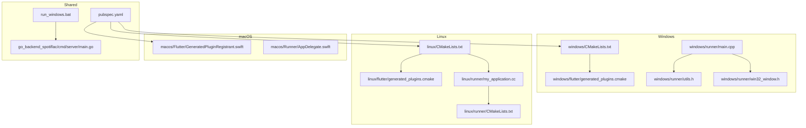
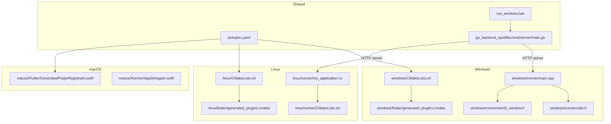
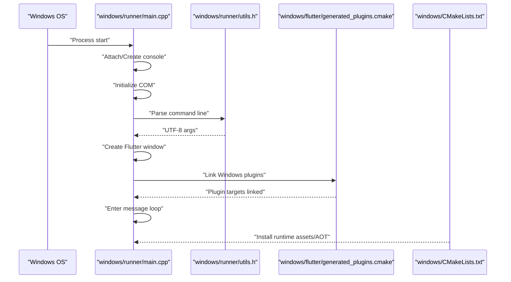
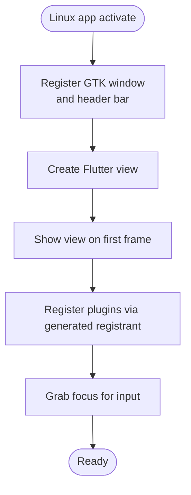
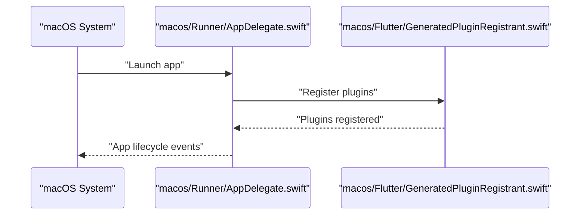
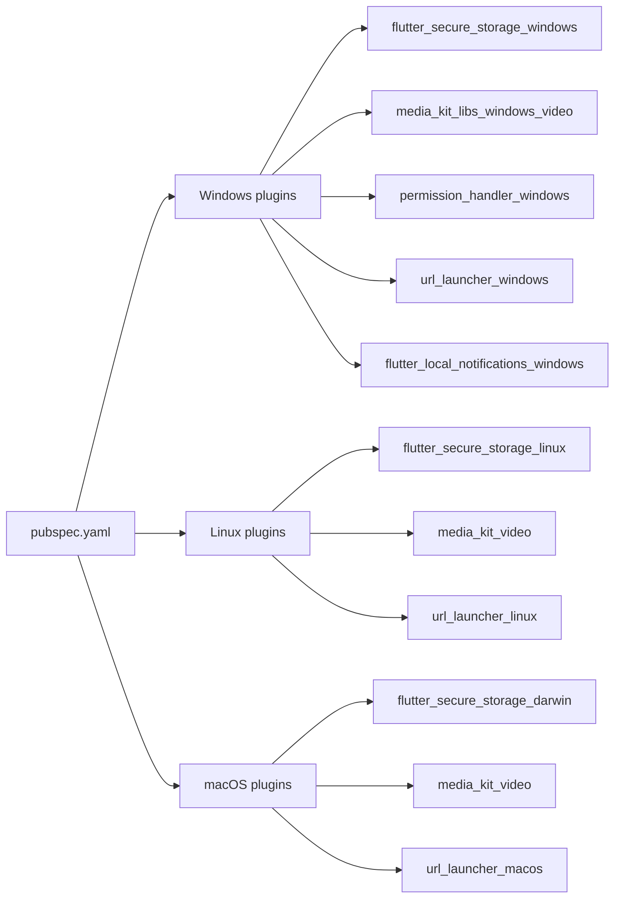
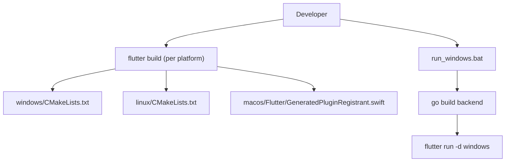
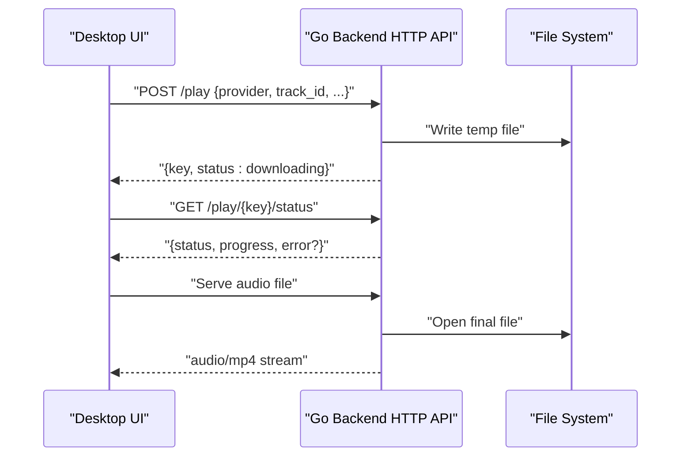
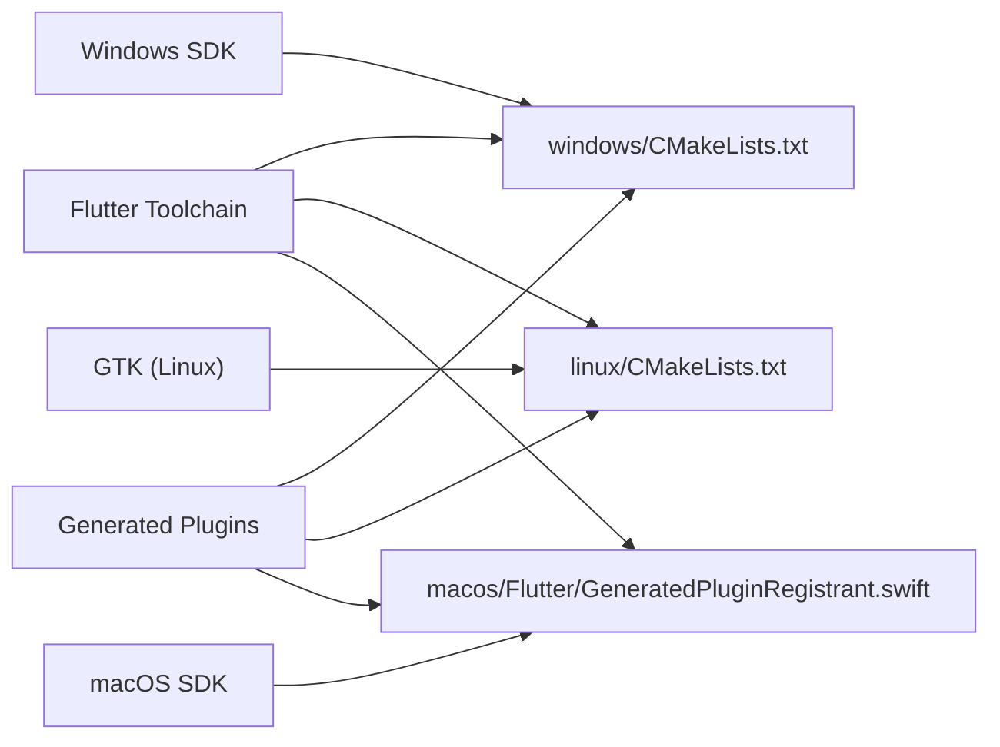

# Desktop Platforms

<cite>
**Referenced Files in This Document**
- [windows/CMakeLists.txt](file://windows/CMakeLists.txt)
- [linux/CMakeLists.txt](file://linux/CMakeLists.txt)
- [macos/Flutter/GeneratedPluginRegistrant.swift](file://macos/Flutter/GeneratedPluginRegistrant.swift)
- [windows/flutter/generated_plugins.cmake](file://windows/flutter/generated_plugins.cmake)
- [linux/flutter/generated_plugins.cmake](file://linux/flutter/generated_plugins.cmake)
- [windows/runner/main.cpp](file://windows/runner/main.cpp)
- [windows/runner/utils.h](file://windows/runner/utils.h)
- [windows/runner/win32_window.h](file://windows/runner/win32_window.h)
- [linux/runner/my_application.cc](file://linux/runner/my_application.cc)
- [linux/runner/CMakeLists.txt](file://linux/runner/CMakeLists.txt)
- [macos/Runner/AppDelegate.swift](file://macos/Runner/AppDelegate.swift)
- [pubspec.yaml](file://pubspec.yaml)
- [run_windows.bat](file://run_windows.bat)
- [go_backend_spotiflac/cmd/server/main.go](file://go_backend_spotiflac/cmd/server/main.go)
</cite>

## Table of Contents
1. [Introduction](#introduction)
2. [Project Structure](#project-structure)
3. [Core Components](#core-components)
4. [Architecture Overview](#architecture-overview)
5. [Detailed Component Analysis](#detailed-component-analysis)
6. [Dependency Analysis](#dependency-analysis)
7. [Performance Considerations](#performance-considerations)
8. [Troubleshooting Guide](#troubleshooting-guide)
9. [Conclusion](#conclusion)
10. [Appendices](#appendices)

## Introduction
This document explains the desktop platform integration for Windows, Linux, and macOS within the project. It covers the CMake build system configuration, platform-specific plugin registration, and desktop-specific features. It also documents cross-platform considerations, file system access patterns, native desktop integrations, build automation, distribution packaging, and platform-specific deployment strategies. Practical examples demonstrate desktop communication, file handling, and system integration, along with security considerations and platform optimizations.

## Project Structure
The desktop platforms are organized under dedicated folders per OS, each containing:
- Platform-specific CMake build files
- Generated plugin registration entries
- Native runner entry points and windowing utilities
- Application lifecycle and integration hooks

**Diagram sources**
- [windows/CMakeLists.txt:1-109](file://windows/CMakeLists.txt#L1-L109)
- [linux/CMakeLists.txt:1-129](file://linux/CMakeLists.txt#L1-L129)
- [macos/Flutter/GeneratedPluginRegistrant.swift:1-43](file://macos/Flutter/GeneratedPluginRegistrant.swift#L1-L43)
- [windows/flutter/generated_plugins.cmake:1-35](file://windows/flutter/generated_plugins.cmake#L1-L35)
- [linux/flutter/generated_plugins.cmake:1-30](file://linux/flutter/generated_plugins.cmake#L1-L30)
- [windows/runner/main.cpp:1-44](file://windows/runner/main.cpp#L1-L44)
- [windows/runner/utils.h:1-20](file://windows/runner/utils.h#L1-L20)
- [windows/runner/win32_window.h:1-103](file://windows/runner/win32_window.h#L1-L103)
- [linux/runner/my_application.cc:1-145](file://linux/runner/my_application.cc#L1-L145)
- [linux/runner/CMakeLists.txt:1-27](file://linux/runner/CMakeLists.txt#L1-L27)
- [macos/Runner/AppDelegate.swift:1-14](file://macos/Runner/AppDelegate.swift#L1-L14)
- [pubspec.yaml:1-108](file://pubspec.yaml#L1-L108)
- [run_windows.bat:1-15](file://run_windows.bat#L1-L15)
- [go_backend_spotiflac/cmd/server/main.go:1-1456](file://go_backend_spotiflac/cmd/server/main.go#L1-L1456)

**Section sources**
- [windows/CMakeLists.txt:1-109](file://windows/CMakeLists.txt#L1-L109)
- [linux/CMakeLists.txt:1-129](file://linux/CMakeLists.txt#L1-L129)
- [macos/Flutter/GeneratedPluginRegistrant.swift:1-43](file://macos/Flutter/GeneratedPluginRegistrant.swift#L1-L43)
- [windows/flutter/generated_plugins.cmake:1-35](file://windows/flutter/generated_plugins.cmake#L1-L35)
- [linux/flutter/generated_plugins.cmake:1-30](file://linux/flutter/generated_plugins.cmake#L1-L30)
- [windows/runner/main.cpp:1-44](file://windows/runner/main.cpp#L1-L44)
- [windows/runner/utils.h:1-20](file://windows/runner/utils.h#L1-L20)
- [windows/runner/win32_window.h:1-103](file://windows/runner/win32_window.h#L1-L103)
- [linux/runner/my_application.cc:1-145](file://linux/runner/my_application.cc#L1-L145)
- [linux/runner/CMakeLists.txt:1-27](file://linux/runner/CMakeLists.txt#L1-L27)
- [macos/Runner/AppDelegate.swift:1-14](file://macos/Runner/AppDelegate.swift#L1-L14)
- [pubspec.yaml:1-108](file://pubspec.yaml#L1-L108)
- [run_windows.bat:1-15](file://run_windows.bat#L1-L15)
- [go_backend_spotiflac/cmd/server/main.go:1-1456](file://go_backend_spotiflac/cmd/server/main.go#L1-L1456)

## Core Components
- Cross-platform Flutter dependencies and desktop plugins are declared in the shared Flutter manifest.
- Platform-specific CMake files define build configuration, installation, and plugin bundling.
- Platform runners initialize the Flutter engine and integrate with native desktop APIs.
- A Go-based backend provides desktop-native capabilities such as audio processing and downloads.

Key responsibilities:
- Windows: Win32 windowing, console attachment, plugin registration via generated CMake.
- Linux: GTK application lifecycle, plugin registration, relocatable bundle installation.
- macOS: Plugin registration via Swift, Flutter app lifecycle hooks.
- Shared: Plugin ecosystem, storage, permissions, notifications, and media playback.

**Section sources**
- [pubspec.yaml:9-71](file://pubspec.yaml#L9-L71)
- [windows/CMakeLists.txt:48-109](file://windows/CMakeLists.txt#L48-L109)
- [linux/CMakeLists.txt:49-129](file://linux/CMakeLists.txt#L49-L129)
- [macos/Flutter/GeneratedPluginRegistrant.swift:25-42](file://macos/Flutter/GeneratedPluginRegistrant.swift#L25-L42)
- [windows/flutter/generated_plugins.cmake:5-35](file://windows/flutter/generated_plugins.cmake#L5-L35)
- [linux/flutter/generated_plugins.cmake:5-30](file://linux/flutter/generated_plugins.cmake#L5-L30)

## Architecture Overview
The desktop architecture integrates Flutter’s engine with platform-specific runners and a native Go backend for advanced tasks.

**Diagram sources**
- [windows/runner/main.cpp:1-44](file://windows/runner/main.cpp#L1-L44)
- [windows/runner/utils.h:1-20](file://windows/runner/utils.h#L1-L20)
- [windows/runner/win32_window.h:1-103](file://windows/runner/win32_window.h#L1-L103)
- [windows/CMakeLists.txt:1-109](file://windows/CMakeLists.txt#L1-L109)
- [windows/flutter/generated_plugins.cmake:1-35](file://windows/flutter/generated_plugins.cmake#L1-L35)
- [linux/runner/my_application.cc:1-145](file://linux/runner/my_application.cc#L1-L145)
- [linux/CMakeLists.txt:1-129](file://linux/CMakeLists.txt#L1-L129)
- [linux/runner/CMakeLists.txt:1-27](file://linux/runner/CMakeLists.txt#L1-L27)
- [linux/flutter/generated_plugins.cmake:1-30](file://linux/flutter/generated_plugins.cmake#L1-L30)
- [macos/Flutter/GeneratedPluginRegistrant.swift:1-43](file://macos/Flutter/GeneratedPluginRegistrant.swift#L1-L43)
- [macos/Runner/AppDelegate.swift:1-14](file://macos/Runner/AppDelegate.swift#L1-L14)
- [pubspec.yaml:1-108](file://pubspec.yaml#L1-L108)
- [run_windows.bat:1-15](file://run_windows.bat#L1-L15)
- [go_backend_spotiflac/cmd/server/main.go:107-134](file://go_backend_spotiflac/cmd/server/main.go#L107-L134)

## Detailed Component Analysis

### Windows Desktop Integration
- Build system: CMake defines configurations, compiler flags, and installation steps. It installs runtime libraries, ICU data, Flutter assets, and AOT binaries for non-Debug builds.
- Plugin registration: The generated CMake lists Windows plugins and links them into the binary, bundling required libraries.
- Runner: The Win32 entry initializes COM, attaches a console when available, creates a Flutter window, and runs the Windows message loop.
- Utilities: Helpers provide UTF-8 conversion and command-line parsing for robust argument handling.
- Windowing: A Win32 window class abstracts DPI awareness, sizing, and message routing.

**Diagram sources**
- [windows/runner/main.cpp:8-43](file://windows/runner/main.cpp#L8-L43)
- [windows/runner/utils.h:7-17](file://windows/runner/utils.h#L7-L17)
- [windows/flutter/generated_plugins.cmake:24-29](file://windows/flutter/generated_plugins.cmake#L24-L29)
- [windows/CMakeLists.txt:65-109](file://windows/CMakeLists.txt#L65-L109)

**Section sources**
- [windows/CMakeLists.txt:13-109](file://windows/CMakeLists.txt#L13-L109)
- [windows/flutter/generated_plugins.cmake:5-35](file://windows/flutter/generated_plugins.cmake#L5-L35)
- [windows/runner/main.cpp:8-43](file://windows/runner/main.cpp#L8-L43)
- [windows/runner/utils.h:7-17](file://windows/runner/utils.h#L7-L17)
- [windows/runner/win32_window.h:13-103](file://windows/runner/win32_window.h#L13-L103)

### Linux Desktop Integration
- Build system: CMake configures GTK dependencies, sets RPATH for bundled libraries, and produces a relocatable bundle with install rules.
- Plugin registration: The generated CMake lists Linux plugins and bundles their libraries into the bundle.
- Application lifecycle: GTK application initialization, window creation, header bar selection based on desktop environment, and plugin registration during activation.
- Runner target: Links Flutter and GTK, exposing the application ID via a compile-time definition.

**Diagram sources**
- [linux/runner/my_application.cc:24-77](file://linux/runner/my_application.cc#L24-L77)
- [linux/runner/CMakeLists.txt:9-27](file://linux/runner/CMakeLists.txt#L9-L27)

**Section sources**
- [linux/CMakeLists.txt:16-129](file://linux/CMakeLists.txt#L16-L129)
- [linux/flutter/generated_plugins.cmake:5-30](file://linux/flutter/generated_plugins.cmake#L5-L30)
- [linux/runner/my_application.cc:24-77](file://linux/runner/my_application.cc#L24-L77)
- [linux/runner/CMakeLists.txt:9-27](file://linux/runner/CMakeLists.txt#L9-L27)

### macOS Desktop Integration
- Plugin registration: Swift-generated plugin registrar imports and registers macOS plugins with the Flutter registry.
- Application lifecycle: The AppDelegate extends Flutter’s macOS app delegate, controlling termination behavior and secure restorable state.

**Diagram sources**
- [macos/Runner/AppDelegate.swift:5-13](file://macos/Runner/AppDelegate.swift#L5-L13)
- [macos/Flutter/GeneratedPluginRegistrant.swift:25-42](file://macos/Flutter/GeneratedPluginRegistrant.swift#L25-L42)

**Section sources**
- [macos/Flutter/GeneratedPluginRegistrant.swift:25-42](file://macos/Flutter/GeneratedPluginRegistrant.swift#L25-L42)
- [macos/Runner/AppDelegate.swift:5-13](file://macos/Runner/AppDelegate.swift#L5-L13)

### Cross-Platform Desktop Features and Integrations
- Shared dependencies: Storage, preferences, secure storage, path provider, connectivity, permissions, file picker, sharing, notifications, media playback, and FFmpeg integration are declared in the shared manifest.
- Desktop-specific plugins:
  - Windows: Secure storage, video, permissions, URL launcher, local notifications, JNI.
  - Linux: Secure storage, video, URL launcher, JNI.
  - macOS: Many plugins imported and registered via Swift.

**Diagram sources**
- [pubspec.yaml:23-71](file://pubspec.yaml#L23-L71)
- [windows/flutter/generated_plugins.cmake:5-15](file://windows/flutter/generated_plugins.cmake#L5-L15)
- [linux/flutter/generated_plugins.cmake:5-11](file://linux/flutter/generated_plugins.cmake#L5-L11)
- [macos/Flutter/GeneratedPluginRegistrant.swift:8-23](file://macos/Flutter/GeneratedPluginRegistrant.swift#L8-L23)

**Section sources**
- [pubspec.yaml:23-71](file://pubspec.yaml#L23-L71)
- [windows/flutter/generated_plugins.cmake:5-15](file://windows/flutter/generated_plugins.cmake#L5-L15)
- [linux/flutter/generated_plugins.cmake:5-11](file://linux/flutter/generated_plugins.cmake#L5-L11)
- [macos/Flutter/GeneratedPluginRegistrant.swift:8-23](file://macos/Flutter/GeneratedPluginRegistrant.swift#L8-L23)

### Desktop Security and Sandboxing Considerations
- Permissions: The project uses a permissions handler to request and manage platform permissions on each OS.
- Secure storage: OS-backed secure storage plugins are used for credentials and sensitive data persistence.
- Network and external tools: The Go backend manages external tool availability and network compatibility options, ensuring safe fallbacks and controlled execution.

Recommendations:
- Request only necessary permissions at runtime.
- Store secrets via OS secure storage APIs.
- Validate and sanitize all external inputs and paths.
- Prefer sandbox-friendly APIs and avoid unsafe system calls.

**Section sources**
- [pubspec.yaml:44-26](file://pubspec.yaml#L44-L26)
- [windows/flutter/generated_plugins.cmake:8-11](file://windows/flutter/generated_plugins.cmake#L8-L11)
- [linux/flutter/generated_plugins.cmake:7-7](file://linux/flutter/generated_plugins.cmake#L7-L7)
- [go_backend_spotiflac/cmd/server/main.go:107-134](file://go_backend_spotiflac/cmd/server/main.go#L107-L134)

### File System Access Patterns and Native Integrations
- Paths: The path provider and path packages are used for cross-platform path handling.
- Local storage: Shared preferences and SQLite are used for structured data.
- Media and playback: MediaKit and platform-specific video libraries enable in-app streaming.
- File picker: The file picker plugin allows users to select files across platforms.
- Notifications: Local notifications integrate with the OS notification center.

**Section sources**
- [pubspec.yaml:24-67](file://pubspec.yaml#L24-L67)

### Build Automation and Distribution Packaging
- Windows:
  - CMake installs runtime libraries, ICU data, Flutter assets, and AOT binaries for non-Debug builds.
  - A batch script builds the Go backend and launches the Flutter app on Windows.
- Linux:
  - CMake produces a relocatable bundle with install rules and RPATH for bundled libraries.
- macOS:
  - Plugins are registered via Swift; the app lifecycle is managed by the AppDelegate.

**Diagram sources**
- [windows/CMakeLists.txt:65-109](file://windows/CMakeLists.txt#L65-L109)
- [linux/CMakeLists.txt:81-129](file://linux/CMakeLists.txt#L81-L129)
- [run_windows.bat:3-14](file://run_windows.bat#L3-L14)
- [go_backend_spotiflac/cmd/server/main.go:6-11](file://go_backend_spotiflac/cmd/server/main.go#L6-L11)

**Section sources**
- [windows/CMakeLists.txt:65-109](file://windows/CMakeLists.txt#L65-L109)
- [linux/CMakeLists.txt:81-129](file://linux/CMakeLists.txt#L81-L129)
- [run_windows.bat:3-14](file://run_windows.bat#L3-L14)
- [go_backend_spotiflac/cmd/server/main.go:6-11](file://go_backend_spotiflac/cmd/server/main.go#L6-L11)

### Practical Examples: Desktop Platform Communication and File Handling
- Desktop-to-Go backend communication:
  - The Go backend exposes an HTTP API for search, playback initiation, status checks, and file serving.
  - The Windows/Linux runners embed or communicate with the backend process to orchestrate downloads and playback.
- File handling:
  - Temporary directories are used for intermediate files; “ready” files are moved to a designated folder after processing.
  - The backend supports serving downloaded files to the desktop app.

**Diagram sources**
- [go_backend_spotiflac/cmd/server/main.go:136-270](file://go_backend_spotiflac/cmd/server/main.go#L136-L270)

**Section sources**
- [go_backend_spotiflac/cmd/server/main.go:136-270](file://go_backend_spotiflac/cmd/server/main.go#L136-L270)

## Dependency Analysis
The desktop build depends on:
- Flutter toolchain and platform-specific plugins
- GTK on Linux
- Windows SDK and Visual Studio toolchain
- macOS frameworks and Swift toolchain

**Diagram sources**
- [windows/CMakeLists.txt:49-51](file://windows/CMakeLists.txt#L49-L51)
- [linux/CMakeLists.txt:54-55](file://linux/CMakeLists.txt#L54-L55)
- [macos/Flutter/GeneratedPluginRegistrant.swift:8-23](file://macos/Flutter/GeneratedPluginRegistrant.swift#L8-L23)
- [windows/flutter/generated_plugins.cmake:24-29](file://windows/flutter/generated_plugins.cmake#L24-L29)
- [linux/flutter/generated_plugins.cmake:19-24](file://linux/flutter/generated_plugins.cmake#L19-L24)

**Section sources**
- [windows/CMakeLists.txt:49-51](file://windows/CMakeLists.txt#L49-L51)
- [linux/CMakeLists.txt:54-55](file://linux/CMakeLists.txt#L54-L55)
- [macos/Flutter/GeneratedPluginRegistrant.swift:8-23](file://macos/Flutter/GeneratedPluginRegistrant.swift#L8-L23)
- [windows/flutter/generated_plugins.cmake:24-29](file://windows/flutter/generated_plugins.cmake#L24-L29)
- [linux/flutter/generated_plugins.cmake:19-24](file://linux/flutter/generated_plugins.cmake#L19-L24)

## Performance Considerations
- Windows:
  - Compiler flags and warning policies are configured for stricter builds.
  - AOT libraries are installed for non-Debug builds to reduce startup overhead.
- Linux:
  - Release builds enable optimizations; RPATH ensures efficient loading of bundled libraries.
- macOS:
  - Plugin registration via Swift minimizes runtime overhead.
- General:
  - Use platform-specific video libraries and media frameworks for efficient decoding and playback.
  - Minimize disk I/O by caching frequently accessed assets and using temporary directories efficiently.

**Section sources**
- [windows/CMakeLists.txt:40-46](file://windows/CMakeLists.txt#L40-L46)
- [windows/CMakeLists.txt:105-109](file://windows/CMakeLists.txt#L105-L109)
- [linux/CMakeLists.txt:42-47](file://linux/CMakeLists.txt#L42-L47)
- [linux/CMakeLists.txt:17-17](file://linux/CMakeLists.txt#L17-L17)
- [linux/runner/CMakeLists.txt:17-17](file://linux/runner/CMakeLists.txt#L17-L17)

## Troubleshooting Guide
- Windows console and arguments:
  - If the console does not attach, ensure the process is launched from a terminal or with a debugger attached.
  - Verify UTF-8 conversion and command-line parsing helpers.
- Windows plugin linkage:
  - Confirm that generated plugin CMake lists and links all intended plugins.
- Linux bundle and GTK:
  - Ensure GTK development packages are installed and the application ID matches the desktop environment expectations.
  - Verify RPATH and bundle relocation behavior.
- macOS plugin registration:
  - Confirm that all required plugins are imported and registered in the generated registrar.
- Go backend:
  - Ensure the backend is built and reachable on the expected port.
  - Verify external tool availability (e.g., FFmpeg) and network compatibility options.

**Section sources**
- [windows/runner/main.cpp:10-14](file://windows/runner/main.cpp#L10-L14)
- [windows/runner/utils.h:11-17](file://windows/runner/utils.h#L11-L17)
- [windows/flutter/generated_plugins.cmake:24-29](file://windows/flutter/generated_plugins.cmake#L24-L29)
- [linux/CMakeLists.txt:16-17](file://linux/CMakeLists.txt#L16-L17)
- [linux/runner/my_application.cc:134-144](file://linux/runner/my_application.cc#L134-L144)
- [macos/Flutter/GeneratedPluginRegistrant.swift:25-42](file://macos/Flutter/GeneratedPluginRegistrant.swift#L25-L42)
- [run_windows.bat:3-14](file://run_windows.bat#L3-L14)
- [go_backend_spotiflac/cmd/server/main.go:107-134](file://go_backend_spotiflac/cmd/server/main.go#L107-L134)

## Conclusion
The desktop integration leverages platform-specific build systems and runners while maintaining a shared Flutter dependency model. Windows benefits from Win32 windowing and plugin bundling, Linux from GTK integration and relocatable bundles, and macOS from Swift-based plugin registration. The Go backend provides robust desktop-native capabilities for media processing and downloads. Following the outlined practices ensures secure, performant, and maintainable desktop deployments across Windows, Linux, and macOS.

## Appendices
- Platform-specific build and install steps are defined in each OS’s CMake files.
- Plugin ecosystems differ per platform; consult the generated plugin CMake files for exact plugin lists and linking behavior.
- The shared Flutter manifest enumerates all desktop-capable dependencies.