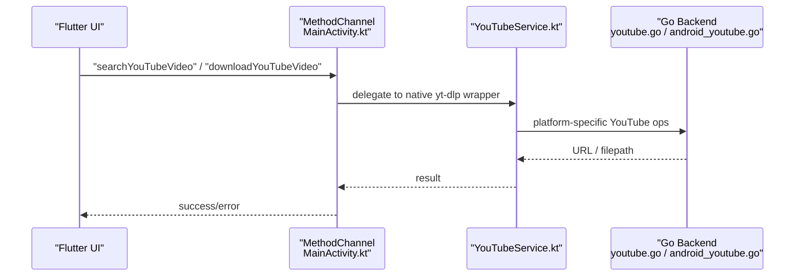
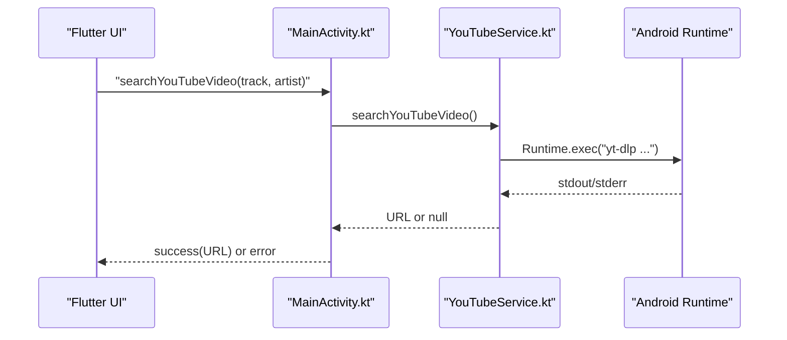
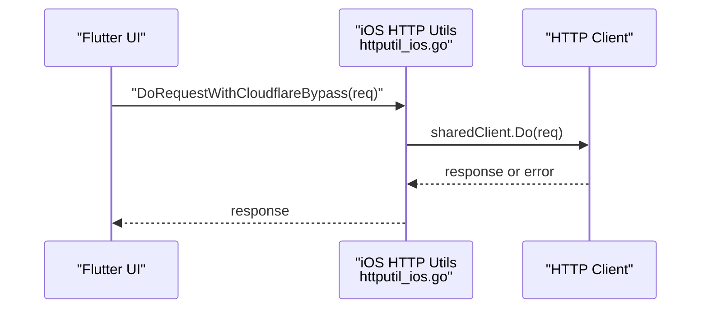
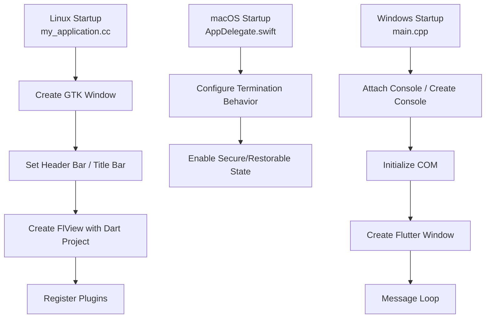
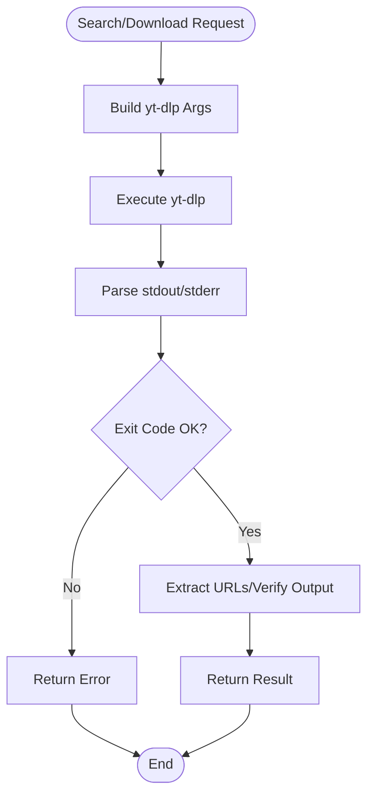
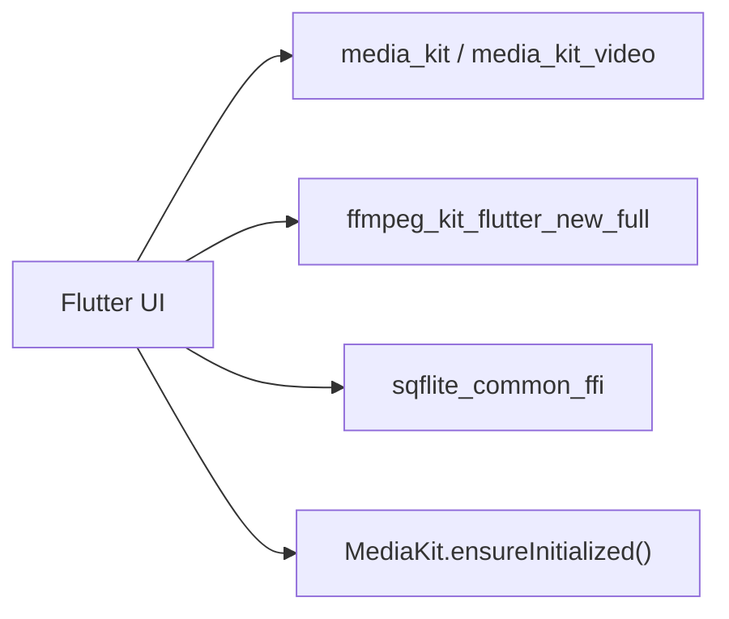
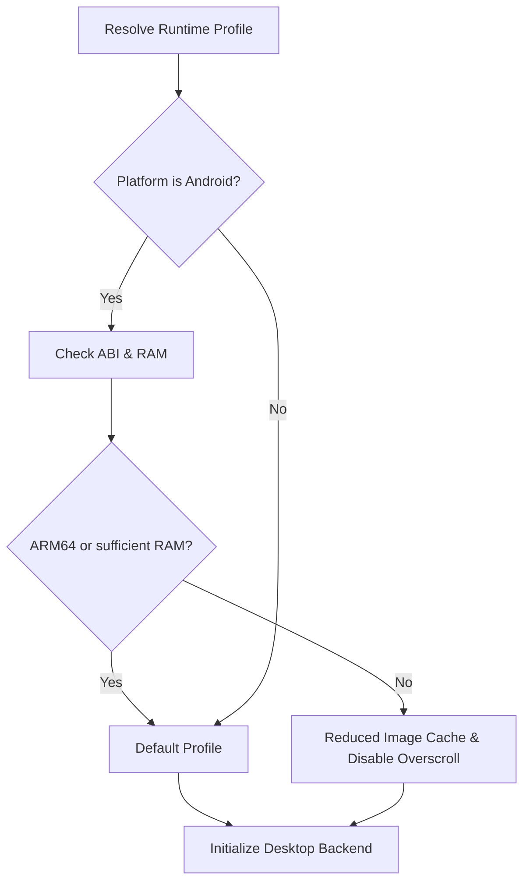
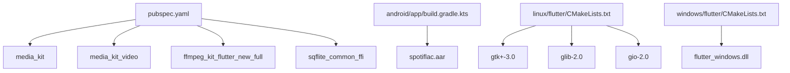

# Platform Integration

<cite>
**Referenced Files in This Document**
- [lib/main.dart](file://lib/main.dart)
- [android/app/src/main/kotlin/com/example/bitly/MainActivity.kt](file://android/app/src/main/kotlin/com/example/bitly/MainActivity.kt)
- [android/app/src/main/kotlin/com/example/bitly/YouTubeService.kt](file://android/app/src/main/kotlin/com/example/bitly/YouTubeService.kt)
- [android/app/src/main/AndroidManifest.xml](file://android/app/src/main/AndroidManifest.xml)
- [android/app/build.gradle.kts](file://android/app/build.gradle.kts)
- [ios/Runner/AppDelegate.swift](file://ios/Runner/AppDelegate.swift)
- [ios/Runner/Info.plist](file://ios/Runner/Info.plist)
- [ios/Flutter/AppFrameworkInfo.plist](file://ios/Flutter/AppFrameworkInfo.plist)
- [linux/runner/my_application.cc](file://linux/runner/my_application.cc)
- [linux/flutter/CMakeLists.txt](file://linux/flutter/CMakeLists.txt)
- [macos/Runner/AppDelegate.swift](file://macos/Runner/AppDelegate.swift)
- [macos/Runner/Info.plist](file://macos/Runner/Info.plist)
- [windows/runner/main.cpp](file://windows/runner/main.cpp)
- [windows/flutter/CMakeLists.txt](file://windows/flutter/CMakeLists.txt)
- [go_backend_spotiflac/youtube.go](file://go_backend_spotiflac/youtube.go)
- [go_backend_spotiflac/android_youtube.go](file://go_backend_spotiflac/android_youtube.go)
- [go_backend_spotiflac/httputil_ios.go](file://go_backend_spotiflac/httputil_ios.go)
- [pubspec.yaml](file://pubspec.yaml)
</cite>

## Table of Contents
1. [Introduction](#introduction)
2. [Project Structure](#project-structure)
3. [Core Components](#core-components)
4. [Architecture Overview](#architecture-overview)
5. [Detailed Component Analysis](#detailed-component-analysis)
6. [Dependency Analysis](#dependency-analysis)
7. [Performance Considerations](#performance-considerations)
8. [Troubleshooting Guide](#troubleshooting-guide)
9. [Conclusion](#conclusion)
10. [Appendices](#appendices)

## Introduction
This document explains the platform integration strategy for a cross-platform application targeting Android, iOS, Windows, Linux, and macOS. It covers native platform implementations, Flutter MethodChannel communication on Android, platform-specific features, YouTube service integration, native audio processing capabilities, build configurations, deployment procedures, and platform-specific considerations. Practical examples demonstrate platform communication, native feature access, and cross-platform abstractions.

## Project Structure
The project follows a Flutter-centric architecture with platform-specific host apps and a shared Dart application. Platform backends are implemented in Go and invoked through native bridges on each platform. The Android host integrates a dedicated YouTube service and SAF storage picker. Desktop platforms (Linux/macOS/Windows) initialize the backend and media stack differently.

```mermaid
graph TB
subgraph "Flutter App"
A["lib/main.dart"]
end
subgraph "Android Host"
B["android/app/src/main/kotlin/com/example/bitly/MainActivity.kt"]
C["android/app/src/main/kotlin/com/example/bitly/YouTubeService.kt"]
D["android/app/src/main/AndroidManifest.xml"]
E["android/app/build.gradle.kts"]
end
subgraph "iOS Host"
F["ios/Runner/AppDelegate.swift"]
G["ios/Runner/Info.plist"]
H["ios/Flutter/AppFrameworkInfo.plist"]
end
subgraph "Linux Host"
I["linux/runner/my_application.cc"]
J["linux/flutter/CMakeLists.txt"]
end
subgraph "macOS Host"
K["macos/Runner/AppDelegate.swift"]
L["macos/Runner/Info.plist"]
end
subgraph "Windows Host"
M["windows/runner/main.cpp"]
N["windows/flutter/CMakeLists.txt"]
end
subgraph "Go Backend"
O["go_backend_spotiflac/youtube.go"]
P["go_backend_spotiflac/android_youtube.go"]
Q["go_backend_spotiflac/httputil_ios.go"]
end
A --> B
A --> F
A --> I
A --> K
A --> M
B --> C
B --> O
P --> O
Q --> O
```

**Diagram sources**
- [lib/main.dart:22-44](file://lib/main.dart#L22-L44)
- [android/app/src/main/kotlin/com/example/bitly/MainActivity.kt:15-134](file://android/app/src/main/kotlin/com/example/bitly/MainActivity.kt#L15-L134)
- [android/app/src/main/kotlin/com/example/bitly/YouTubeService.kt:10-92](file://android/app/src/main/kotlin/com/example/bitly/YouTubeService.kt#L10-L92)
- [android/app/src/main/AndroidManifest.xml:1-48](file://android/app/src/main/AndroidManifest.xml#L1-L48)
- [android/app/build.gradle.kts:1-55](file://android/app/build.gradle.kts#L1-L55)
- [ios/Runner/AppDelegate.swift:5-12](file://ios/Runner/AppDelegate.swift#L5-L12)
- [ios/Runner/Info.plist:1-50](file://ios/Runner/Info.plist#L1-L50)
- [ios/Flutter/AppFrameworkInfo.plist](file://ios/Flutter/AppFrameworkInfo.plist)
- [linux/runner/my_application.cc:24-77](file://linux/runner/my_application.cc#L24-L77)
- [linux/flutter/CMakeLists.txt:1-89](file://linux/flutter/CMakeLists.txt#L1-L89)
- [macos/Runner/AppDelegate.swift:5-12](file://macos/Runner/AppDelegate.swift#L5-L12)
- [macos/Runner/Info.plist:1-33](file://macos/Runner/Info.plist#L1-L33)
- [windows/runner/main.cpp:8-42](file://windows/runner/main.cpp#L8-L42)
- [windows/flutter/CMakeLists.txt:1-110](file://windows/flutter/CMakeLists.txt#L1-L110)
- [go_backend_spotiflac/youtube.go:13-83](file://go_backend_spotiflac/youtube.go#L13-L83)
- [go_backend_spotiflac/android_youtube.go:13-83](file://go_backend_spotiflac/android_youtube.go#L13-L83)
- [go_backend_spotiflac/httputil_ios.go:9-20](file://go_backend_spotiflac/httputil_ios.go#L9-L20)

**Section sources**
- [lib/main.dart:22-44](file://lib/main.dart#L22-L44)
- [android/app/src/main/kotlin/com/example/bitly/MainActivity.kt:15-134](file://android/app/src/main/kotlin/com/example/bitly/MainActivity.kt#L15-L134)
- [android/app/src/main/kotlin/com/example/bitly/YouTubeService.kt:10-92](file://android/app/src/main/kotlin/com/example/bitly/YouTubeService.kt#L10-L92)
- [android/app/src/main/AndroidManifest.xml:1-48](file://android/app/src/main/AndroidManifest.xml#L1-L48)
- [android/app/build.gradle.kts:1-55](file://android/app/build.gradle.kts#L1-L55)
- [ios/Runner/AppDelegate.swift:5-12](file://ios/Runner/AppDelegate.swift#L5-L12)
- [ios/Runner/Info.plist:1-50](file://ios/Runner/Info.plist#L1-L50)
- [ios/Flutter/AppFrameworkInfo.plist](file://ios/Flutter/AppFrameworkInfo.plist)
- [linux/runner/my_application.cc:24-77](file://linux/runner/my_application.cc#L24-L77)
- [linux/flutter/CMakeLists.txt:1-89](file://linux/flutter/CMakeLists.txt#L1-L89)
- [macos/Runner/AppDelegate.swift:5-12](file://macos/Runner/AppDelegate.swift#L5-L12)
- [macos/Runner/Info.plist:1-33](file://macos/Runner/Info.plist#L1-L33)
- [windows/runner/main.cpp:8-42](file://windows/runner/main.cpp#L8-L42)
- [windows/flutter/CMakeLists.txt:1-110](file://windows/flutter/CMakeLists.txt#L1-L110)
- [go_backend_spotiflac/youtube.go:13-83](file://go_backend_spotiflac/youtube.go#L13-L83)
- [go_backend_spotiflac/android_youtube.go:13-83](file://go_backend_spotiflac/android_youtube.go#L13-L83)
- [go_backend_spotiflac/httputil_ios.go:9-20](file://go_backend_spotiflac/httputil_ios.go#L9-L20)

## Core Components
- Cross-platform entrypoint initializes platform-specific backend and media stack.
- Android host implements MethodChannel handlers for database, settings, extension store, search, YouTube operations, SAF picker, and availability checks.
- Android YouTube service wraps yt-dlp commands for search and download.
- iOS host registers plugins and sets up Info.plist for supported orientations and display name.
- Linux/macOS/Windows hosts initialize GTK/WIN32 windowing and Flutter views.
- Go backend provides platform-specific YouTube search/download and iOS Cloudflare bypass client.

**Section sources**
- [lib/main.dart:22-44](file://lib/main.dart#L22-L44)
- [android/app/src/main/kotlin/com/example/bitly/MainActivity.kt:27-134](file://android/app/src/main/kotlin/com/example/bitly/MainActivity.kt#L27-L134)
- [android/app/src/main/kotlin/com/example/bitly/YouTubeService.kt:12-52](file://android/app/src/main/kotlin/com/example/bitly/YouTubeService.kt#L12-L52)
- [ios/Runner/AppDelegate.swift:5-12](file://ios/Runner/AppDelegate.swift#L5-L12)
- [linux/runner/my_application.cc:24-77](file://linux/runner/my_application.cc#L24-L77)
- [macos/Runner/AppDelegate.swift:5-12](file://macos/Runner/AppDelegate.swift#L5-L12)
- [windows/runner/main.cpp:8-42](file://windows/runner/main.cpp#L8-L42)
- [go_backend_spotiflac/youtube.go:13-83](file://go_backend_spotiflac/youtube.go#L13-L83)
- [go_backend_spotiflac/android_youtube.go:13-83](file://go_backend_spotiflac/android_youtube.go#L13-L83)
- [go_backend_spotiflac/httputil_ios.go:9-20](file://go_backend_spotiflac/httputil_ios.go#L9-L20)

## Architecture Overview
The application uses Flutter’s MethodChannel on Android to communicate with a Go backend. On non-Android platforms, the app initializes a desktop backend and media stack. iOS leverages a shared HTTP client for Cloudflare bypass. Desktop platforms manage native windows and plugin registration.

**Diagram sources**
- [android/app/src/main/kotlin/com/example/bitly/MainActivity.kt:148-174](file://android/app/src/main/kotlin/com/example/bitly/MainActivity.kt#L148-L174)
- [android/app/src/main/kotlin/com/example/bitly/YouTubeService.kt:12-52](file://android/app/src/main/kotlin/com/example/bitly/YouTubeService.kt#L12-L52)
- [go_backend_spotiflac/youtube.go:13-83](file://go_backend_spotiflac/youtube.go#L13-L83)
- [go_backend_spotiflac/android_youtube.go:13-83](file://go_backend_spotiflac/android_youtube.go#L13-L83)

## Detailed Component Analysis

### Android Host Integration
- MethodChannel channel name and handler dispatch methods for database, settings, extension store, search, YouTube, history/collections, lyrics/sync, SAF picker, yt-dlp ensure, and availability checks.
- Background execution uses a single-thread executor; UI updates on main thread handler.
- YouTube search and download are delegated to a dedicated YouTubeService that runs yt-dlp and returns URLs/paths.
- SAF folder picker uses ACTION_OPEN_DOCUMENT_TREE with persisted URI permissions and display name resolution.

**Diagram sources**
- [android/app/src/main/kotlin/com/example/bitly/MainActivity.kt:148-160](file://android/app/src/main/kotlin/com/example/bitly/MainActivity.kt#L148-L160)
- [android/app/src/main/kotlin/com/example/bitly/YouTubeService.kt:12-23](file://android/app/src/main/kotlin/com/example/bitly/YouTubeService.kt#L12-L23)

**Section sources**
- [android/app/src/main/kotlin/com/example/bitly/MainActivity.kt:27-134](file://android/app/src/main/kotlin/com/example/bitly/MainActivity.kt#L27-L134)
- [android/app/src/main/kotlin/com/example/bitly/YouTubeService.kt:12-52](file://android/app/src/main/kotlin/com/example/bitly/YouTubeService.kt#L12-L52)
- [android/app/src/main/AndroidManifest.xml:1-48](file://android/app/src/main/AndroidManifest.xml#L1-L48)
- [android/app/build.gradle.kts:27-36](file://android/app/build.gradle.kts#L27-L36)

### iOS Host Integration
- AppDelegate registers plugins and defers to Flutter’s lifecycle.
- Info.plist defines supported orientations, display name, and launch storyboard.
- iOS-specific HTTP utilities provide a shared client and Cloudflare bypass for requests.

**Diagram sources**
- [go_backend_spotiflac/httputil_ios.go:13-20](file://go_backend_spotiflac/httputil_ios.go#L13-L20)

**Section sources**
- [ios/Runner/AppDelegate.swift:5-12](file://ios/Runner/AppDelegate.swift#L5-L12)
- [ios/Runner/Info.plist:25-47](file://ios/Runner/Info.plist#L25-L47)
- [ios/Flutter/AppFrameworkInfo.plist](file://ios/Flutter/AppFrameworkInfo.plist)
- [go_backend_spotiflac/httputil_ios.go:9-20](file://go_backend_spotiflac/httputil_ios.go#L9-L20)

### Desktop Host Integrations
- Linux: GTK window creation, header bar behavior detection, and Flutter view integration.
- macOS: FlutterAppDelegate with secure/restorable state and termination behavior.
- Windows: Win32 window creation, console attachment, COM initialization, and message loop.

**Diagram sources**
- [linux/runner/my_application.cc:24-77](file://linux/runner/my_application.cc#L24-L77)
- [macos/Runner/AppDelegate.swift:5-12](file://macos/Runner/AppDelegate.swift#L5-L12)
- [windows/runner/main.cpp:8-42](file://windows/runner/main.cpp#L8-L42)

**Section sources**
- [linux/runner/my_application.cc:24-77](file://linux/runner/my_application.cc#L24-L77)
- [linux/flutter/CMakeLists.txt:24-69](file://linux/flutter/CMakeLists.txt#L24-L69)
- [macos/Runner/AppDelegate.swift:5-12](file://macos/Runner/AppDelegate.swift#L5-L12)
- [macos/Runner/Info.plist:23-31](file://macos/Runner/Info.plist#L23-L31)
- [windows/runner/main.cpp:8-42](file://windows/runner/main.cpp#L8-L42)
- [windows/flutter/CMakeLists.txt:18-41](file://windows/flutter/CMakeLists.txt#L18-L41)

### YouTube Service Integration
- Android: Dedicated YouTubeService executes yt-dlp to fetch video URLs and download files, returning absolute paths when available.
- Non-Android: Go backend provides identical YouTube search/download logic with platform-specific build tags.

**Diagram sources**
- [android/app/src/main/kotlin/com/example/bitly/YouTubeService.kt:54-90](file://android/app/src/main/kotlin/com/example/bitly/YouTubeService.kt#L54-L90)
- [go_backend_spotiflac/youtube.go:13-83](file://go_backend_spotiflac/youtube.go#L13-L83)
- [go_backend_spotiflac/android_youtube.go:13-83](file://go_backend_spotiflac/android_youtube.go#L13-L83)

**Section sources**
- [android/app/src/main/kotlin/com/example/bitly/YouTubeService.kt:12-52](file://android/app/src/main/kotlin/com/example/bitly/YouTubeService.kt#L12-L52)
- [go_backend_spotiflac/youtube.go:13-83](file://go_backend_spotiflac/youtube.go#L13-L83)
- [go_backend_spotiflac/android_youtube.go:13-83](file://go_backend_spotiflac/android_youtube.go#L13-L83)

### Native Audio Processing Capabilities
- Flutter dependencies include media players and FFmpeg for audio/video processing and conversion.
- Desktop initialization uses MediaKit and FFI-enabled SQLite for persistence.

**Diagram sources**
- [pubspec.yaml:64-67](file://pubspec.yaml#L64-L67)
- [pubspec.yaml:60-61](file://pubspec.yaml#L60-L61)
- [pubspec.yaml:29](file://pubspec.yaml#L29)
- [lib/main.dart:24](file://lib/main.dart#L24)

**Section sources**
- [pubspec.yaml:60-67](file://pubspec.yaml#L60-L67)
- [pubspec.yaml:29](file://pubspec.yaml#L29)
- [lib/main.dart:24](file://lib/main.dart#L24)

### Platform-Specific Optimizations
- Android runtime profile adjusts image cache and overscroll effects based on ABI and RAM characteristics.
- Desktop backends are initialized conditionally on non-Android platforms.

**Diagram sources**
- [lib/main.dart:46-74](file://lib/main.dart#L46-L74)
- [lib/main.dart:29](file://lib/main.dart#L29)

**Section sources**
- [lib/main.dart:46-74](file://lib/main.dart#L46-L74)
- [lib/main.dart:29](file://lib/main.dart#L29)

## Dependency Analysis
- Flutter dependencies define platform capabilities and media/audio tooling.
- Android Gradle config sets SDK versions and includes a local AAR dependency.
- Desktop CMakeLists integrate Flutter tooling and system libraries.

**Diagram sources**
- [pubspec.yaml:60-67](file://pubspec.yaml#L60-L67)
- [pubspec.yaml:29](file://pubspec.yaml#L29)
- [android/app/build.gradle.kts:48](file://android/app/build.gradle.kts#L48)
- [linux/flutter/CMakeLists.txt:24-69](file://linux/flutter/CMakeLists.txt#L24-L69)
- [windows/flutter/CMakeLists.txt:18-41](file://windows/flutter/CMakeLists.txt#L18-L41)

**Section sources**
- [pubspec.yaml:60-67](file://pubspec.yaml#L60-L67)
- [pubspec.yaml:29](file://pubspec.yaml#L29)
- [android/app/build.gradle.kts:48](file://android/app/build.gradle.kts#L48)
- [linux/flutter/CMakeLists.txt:24-69](file://linux/flutter/CMakeLists.txt#L24-L69)
- [windows/flutter/CMakeLists.txt:18-41](file://windows/flutter/CMakeLists.txt#L18-L41)

## Performance Considerations
- Android runtime profile reduces memory pressure on low-RAM devices and arm32-only devices.
- MediaKit initialization ensures efficient decoding/encoding on desktop platforms.
- yt-dlp is executed with constrained quality and playlist flags to balance speed and compatibility.
- SAF picker persists URI permissions to avoid repeated user prompts.

[No sources needed since this section provides general guidance]

## Troubleshooting Guide
- MethodChannel errors bubble up from native execution; check backend method availability and JSON serialization expectations.
- yt-dlp failures return combined output for diagnostics; verify yt-dlp installation and network access.
- SAF picker requires user consent; handle cancellation and missing URIs gracefully.
- Desktop initialization depends on proper Flutter tool backend generation and system libraries.

**Section sources**
- [android/app/src/main/kotlin/com/example/bitly/MainActivity.kt:136-146](file://android/app/src/main/kotlin/com/example/bitly/MainActivity.kt#L136-L146)
- [android/app/src/main/kotlin/com/example/bitly/YouTubeService.kt:54-90](file://android/app/src/main/kotlin/com/example/bitly/YouTubeService.kt#L54-L90)
- [android/app/src/main/kotlin/com/example/bitly/MainActivity.kt:189-219](file://android/app/src/main/kotlin/com/example/bitly/MainActivity.kt#L189-L219)

## Conclusion
The platform integration leverages Flutter’s cross-platform UI with native bridges for platform-specific tasks. Android uses MethodChannel and a dedicated YouTube service backed by yt-dlp, while iOS benefits from a shared HTTP client for robust network access. Desktop platforms initialize native windows and media stacks, and the Go backend provides consistent YouTube operations across platforms. Build configurations and CMake toolchains ensure reliable compilation and packaging for each target.

[No sources needed since this section summarizes without analyzing specific files]

## Appendices

### Build and Deployment Procedures
- Android: Configure SDK/NDK versions, enable desugaring, and include local AAR. Use Flutter Gradle plugin and default debug signing for quick runs.
- iOS: Register plugins via AppDelegate and ensure Info.plist supports required orientations and display name.
- Linux: Link GTK/GLib/GIO via pkg-config; Flutter tool generates ephemeral headers and libraries.
- macOS: Configure Info.plist deployment target and application metadata; use FlutterMacOS lifecycle.
- Windows: Initialize COM, attach console, and run message loop; link Flutter Windows DLL.

**Section sources**
- [android/app/build.gradle.kts:8-45](file://android/app/build.gradle.kts#L8-L45)
- [android/app/src/main/AndroidManifest.xml:1-48](file://android/app/src/main/AndroidManifest.xml#L1-L48)
- [ios/Runner/AppDelegate.swift:5-12](file://ios/Runner/AppDelegate.swift#L5-L12)
- [ios/Runner/Info.plist:25-47](file://ios/Runner/Info.plist#L25-L47)
- [linux/flutter/CMakeLists.txt:24-69](file://linux/flutter/CMakeLists.txt#L24-L69)
- [macos/Runner/Info.plist:23-31](file://macos/Runner/Info.plist#L23-L31)
- [windows/runner/main.cpp:8-42](file://windows/runner/main.cpp#L8-L42)

### Platform-Specific Considerations
- Android: SAF permissions require persisted URI grants; yt-dlp must be available on PATH.
- iOS: Cloudflare bypass relies on a shared HTTP client and appropriate user agent handling.
- Desktop: Ensure Flutter tool backend generation completes; system libraries must be present for GTK/Windows.

**Section sources**
- [android/app/src/main/kotlin/com/example/bitly/MainActivity.kt:189-219](file://android/app/src/main/kotlin/com/example/bitly/MainActivity.kt#L189-L219)
- [android/app/src/main/kotlin/com/example/bitly/YouTubeService.kt:54-90](file://android/app/src/main/kotlin/com/example/bitly/YouTubeService.kt#L54-L90)
- [go_backend_spotiflac/httputil_ios.go:9-20](file://go_backend_spotiflac/httputil_ios.go#L9-L20)
- [linux/flutter/CMakeLists.txt:24-69](file://linux/flutter/CMakeLists.txt#L24-L69)
- [windows/flutter/CMakeLists.txt:18-41](file://windows/flutter/CMakeLists.txt#L18-L41)