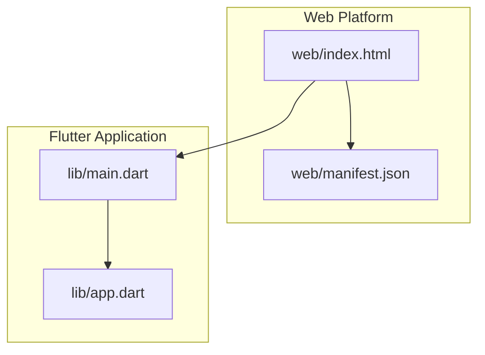
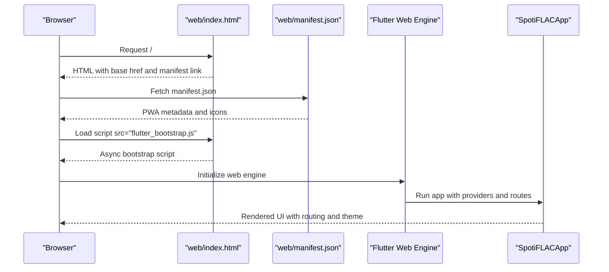
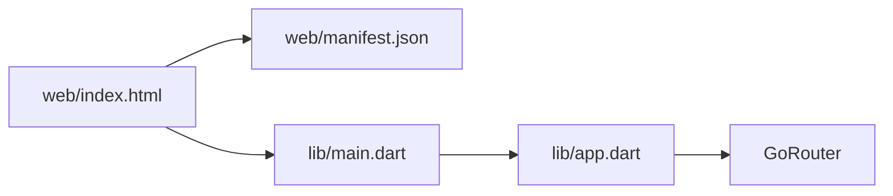

# Web Platform

<cite>
**Referenced Files in This Document**
- [web/index.html](file://web/index.html)
- [web/manifest.json](file://web/manifest.json)
- [lib/main.dart](file://lib/main.dart)
- [lib/app.dart](file://lib/app.dart)
- [pubspec.yaml](file://pubspec.yaml)
- [analysis_options.yaml](file://analysis_options.yaml)
</cite>

## Table of Contents
1. [Introduction](#introduction)
2. [Project Structure](#project-structure)
3. [Core Components](#core-components)
4. [Architecture Overview](#architecture-overview)
5. [Detailed Component Analysis](#detailed-component-analysis)
6. [Dependency Analysis](#dependency-analysis)
7. [Performance Considerations](#performance-considerations)
8. [Troubleshooting Guide](#troubleshooting-guide)
9. [Conclusion](#conclusion)
10. [Appendices](#appendices)

## Introduction
This document explains how the Bitly project integrates with the web platform as a Progressive Web App (PWA). It covers the web-specific HTML structure, manifest configuration, browser compatibility considerations, service worker implementation, and deployment strategies. It also outlines web-specific features, offline capabilities, responsive design considerations, security implications, CORS handling, and browser-specific optimizations.

## Project Structure
The web platform integration is primarily defined by two files under the web directory:
- web/index.html: The HTML shell that loads the Flutter web bootstrap script and registers the PWA manifest.
- web/manifest.json: The PWA manifest that defines app metadata, display mode, theme colors, orientation, and icon sets.

These files are complemented by the Flutter application entry point and routing logic, which are platform-agnostic but influence how the app behaves on the web.

**Diagram sources**
- [web/index.html:1-39](file://web/index.html#L1-L39)
- [web/manifest.json:1-36](file://web/manifest.json#L1-L36)
- [lib/main.dart:22-44](file://lib/main.dart#L22-L44)
- [lib/app.dart:54-97](file://lib/app.dart#L54-L97)

**Section sources**
- [web/index.html:1-39](file://web/index.html#L1-L39)
- [web/manifest.json:1-36](file://web/manifest.json#L1-L36)
- [lib/main.dart:22-44](file://lib/main.dart#L22-L44)
- [lib/app.dart:54-97](file://lib/app.dart#L54-L97)

## Core Components
- HTML Shell (web/index.html)
  - Provides the base href placeholder for Flutter’s build-time base-href replacement.
  - Registers iOS meta tags and Apple touch icons for improved installability on iOS Safari.
  - Declares the favicon and links to the PWA manifest.
  - Loads the Flutter web bootstrap script asynchronously.

- PWA Manifest (web/manifest.json)
  - Defines app name, short name, start URL, standalone display mode, theme/background colors, orientation, and icon sets including maskable variants.
  - Ensures consistent branding and installability across browsers.

- Application Entry Point (lib/main.dart)
  - Initializes Flutter bindings and media subsystems.
  - On non-Android/iOS platforms, initializes the FFI SQLite factory and desktop backend bridge.
  - Sets up Riverpod providers and eager initialization routines for services and extensions.

- Routing and App Shell (lib/app.dart)
  - Configures routing with GoRouter, including redirects for setup and tutorial flows.
  - Wraps the app in a Material router with localization, theme, and scroll behavior.

**Section sources**
- [web/index.html:17-36](file://web/index.html#L17-L36)
- [web/manifest.json:1-36](file://web/manifest.json#L1-L36)
- [lib/main.dart:22-44](file://lib/main.dart#L22-L44)
- [lib/app.dart:13-52](file://lib/app.dart#L13-L52)

## Architecture Overview
The web architecture centers on the HTML shell loading the Flutter web engine, which then renders the Flutter app. The PWA manifest enables installation and native-like behavior in supported browsers. The app’s routing and provider initialization occur within the Flutter framework.

**Diagram sources**
- [web/index.html:17-36](file://web/index.html#L17-L36)
- [web/manifest.json:1-36](file://web/manifest.json#L1-L36)
- [lib/main.dart:22-44](file://lib/main.dart#L22-L44)
- [lib/app.dart:54-97](file://lib/app.dart#L54-L97)

## Detailed Component Analysis

### HTML Shell (web/index.html)
Key responsibilities:
- Base href placeholder for correct asset resolution when hosted under a subpath.
- iOS meta tags and Apple touch icon for installability on iOS Safari.
- Favicon declaration for tab/window identity.
- Link to manifest.json enabling PWA installation.
- Asynchronous loading of the Flutter bootstrap script.

Best practices:
- Ensure the base href is correctly replaced during Flutter builds using the --base-href flag.
- Keep the manifest link element present for PWA registration.

**Section sources**
- [web/index.html:17-36](file://web/index.html#L17-L36)

### PWA Manifest (web/manifest.json)
Key fields and implications:
- name and short_name define the app’s identity in install prompts and dock/taskbar.
- start_url "." ensures the app opens at the root route.
- display "standalone" provides a native app-like experience.
- theme_color and background_color unify UI theming across browsers.
- orientation "portrait-primary" constrains orientation for mobile UX.
- prefer_related_applications false indicates no native app preference.
- icons array includes fixed and maskable PNG icons for various sizes.

Offline and caching:
- The manifest itself does not define runtime caching; it signals installability.
- Offline behavior depends on service worker implementation and caching strategies configured elsewhere in the build pipeline.

**Section sources**
- [web/manifest.json:1-36](file://web/manifest.json#L1-L36)

### Application Entry Point (lib/main.dart)
Highlights:
- Ensures Flutter binding initialization and media subsystem readiness.
- On non-Android/iOS platforms, initializes the FFI SQLite factory and desktop backend bridge.
- Configures image cache sizing to balance memory usage and performance.
- Eager initialization of services, notifications, sharing intents, and extensions.

Implications for web:
- The desktop backend bridge and FFI initialization are platform-specific and do not apply to web builds.
- Image cache configuration remains relevant for reducing memory pressure on web clients.

**Section sources**
- [lib/main.dart:22-44](file://lib/main.dart#L22-L44)
- [lib/main.dart:76-82](file://lib/main.dart#L76-L82)
- [lib/main.dart:235-280](file://lib/main.dart#L235-L280)

### Routing and App Shell (lib/app.dart)
Highlights:
- Router configuration with redirects for setup, tutorial, and initial launch flows.
- Localization and theme wrapping via DynamicColorWrapper.
- Scroll behavior customization controlled by a runtime flag.

Implications for web:
- The router and theme configuration are platform-agnostic and apply to web.
- Responsive design relies on Flutter widgets and Material theming; ensure viewport and layout constraints are appropriate for web.

**Section sources**
- [lib/app.dart:13-52](file://lib/app.dart#L13-L52)
- [lib/app.dart:54-97](file://lib/app.dart#L54-L97)

### Service Worker Implementation
Observation:
- No explicit service worker file is present in the repository’s web directory.
- The project relies on Flutter Web’s default service worker generation and caching behavior.

Recommendations:
- Add a custom service worker for deterministic offline caching, push notifications, and precise cache control.
- Implement cache-first or stale-while-revalidate strategies for assets and API responses.
- Register the service worker after the app initializes and handle update cycles gracefully.

[No sources needed since this section provides general guidance]

### Browser Compatibility Considerations
- iOS Safari: The HTML includes iOS meta tags and Apple touch icons to improve installability and home screen appearance.
- Edge/Chrome: Ensure the manifest is served with correct MIME types and the icons are accessible.
- Orientation: The manifest specifies portrait-primary; test responsiveness across devices and orientations.

**Section sources**
- [web/index.html:23-27](file://web/index.html#L23-L27)
- [web/manifest.json:9](file://web/manifest.json#L9)

### Web-Specific Features
- Installability: The manifest and HTML shell enable PWA installation on supported browsers.
- Theme and Icons: Consistent theming via theme_color/background_color and icon sets.
- Offline Behavior: Determined by service worker and caching strategy; currently not explicitly defined in the repository.

**Section sources**
- [web/manifest.json:1-36](file://web/manifest.json#L1-L36)
- [web/index.html:23-33](file://web/index.html#L23-L33)

### Deployment Strategies and Hosting Requirements
- Static Hosting: Serve web/index.html and the compiled Flutter assets from a static host.
- Base Path: Use Flutter’s --base-href flag to match the hosting subpath.
- MIME Types: Ensure .json and image assets are served with correct MIME types.
- HTTPS: Prefer HTTPS for secure features like service workers, background sync, and push notifications.

[No sources needed since this section provides general guidance]

### Progressive Enhancement Techniques
- Feature Detection: Gracefully degrade features when unsupported (e.g., background sync).
- Lazy Loading: Defer non-critical resources and initialize heavy services after the initial render.
- Responsive Layouts: Use Flutter widgets and constraints to adapt to varying screen sizes.

[No sources needed since this section provides general guidance]

### Practical Examples of Web Platform Communication
- Asset Loading: The HTML shell loads the Flutter bootstrap script; ensure assets are built and deployed correctly.
- Manifest Registration: The browser fetches manifest.json; verify accessibility and correctness.
- Routing: The app uses GoRouter; ensure deep linking works with web history.

**Section sources**
- [web/index.html:36](file://web/index.html#L36)
- [web/manifest.json:1-36](file://web/manifest.json#L1-L36)
- [lib/app.dart:13-52](file://lib/app.dart#L13-L52)

### Offline Capabilities
- Current State: Not explicitly defined in the repository.
- Recommended Approach: Implement a service worker with a caching strategy tailored to the app’s assets and data needs.

[No sources needed since this section provides general guidance]

### Responsive Design Considerations
- Orientation: The manifest enforces portrait-primary; test across devices.
- Layout: Use Flutter’s responsive widgets and constraints; ensure proper viewport settings.

**Section sources**
- [web/manifest.json:9](file://web/manifest.json#L9)

### Security Implications, CORS Handling, and Browser Optimizations
- CORS: Configure server-side CORS policies for external APIs used by the app.
- HTTPS: Enforce HTTPS for production deployments.
- Content Security Policy (CSP): Consider CSP headers to mitigate script injection risks.
- Browser Optimizations: Enable compression, leverage browser caching, and minimize bundle size.

[No sources needed since this section provides general guidance]

## Dependency Analysis
The web platform relies on:
- Flutter Web engine for rendering.
- HTML shell and manifest for PWA registration.
- Application entry point for initialization and routing.

**Diagram sources**
- [web/index.html:17-36](file://web/index.html#L17-L36)
- [web/manifest.json:1-36](file://web/manifest.json#L1-L36)
- [lib/main.dart:22-44](file://lib/main.dart#L22-L44)
- [lib/app.dart:13-52](file://lib/app.dart#L13-L52)

**Section sources**
- [web/index.html:17-36](file://web/index.html#L17-L36)
- [web/manifest.json:1-36](file://web/manifest.json#L1-L36)
- [lib/main.dart:22-44](file://lib/main.dart#L22-L44)
- [lib/app.dart:13-52](file://lib/app.dart#L13-L52)

## Performance Considerations
- Bundle Size: Minimize dependencies and split code where possible.
- Image Cache: Adjust cache sizes to balance memory usage and perceived performance.
- Lazy Initialization: Defer heavy tasks until after the initial render.

**Section sources**
- [lib/main.dart:76-82](file://lib/main.dart#L76-L82)

## Troubleshooting Guide
- PWA Not Installing:
  - Verify manifest.json is served with correct MIME type and is accessible.
  - Confirm icons are present and reachable.
- Incorrect Base Path:
  - Ensure the base href is set correctly during build using --base-href.
- Service Worker Issues:
  - Check browser console for service worker registration errors.
  - Validate that the service worker is being served and updated properly.

[No sources needed since this section provides general guidance]

## Conclusion
The Bitly project includes the essential building blocks for a PWA on the web: an HTML shell with a manifest link and a PWA manifest. The application entry point and routing logic are platform-agnostic and integrate seamlessly with Flutter Web. To achieve robust offline behavior, installability, and optimal performance, consider implementing a custom service worker, optimizing assets, and ensuring secure hosting with proper CORS and CSP configurations.

## Appendices
- Linting and Analysis: The project uses Flutter lints and excludes legacy directories from analysis.

**Section sources**
- [analysis_options.yaml:10-33](file://analysis_options.yaml#L10-L33)