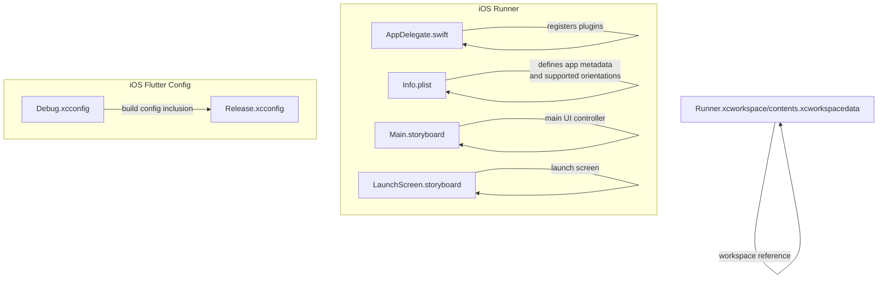
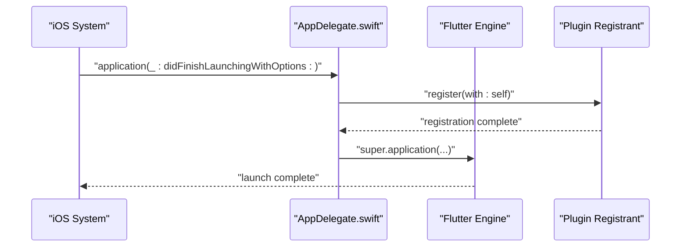
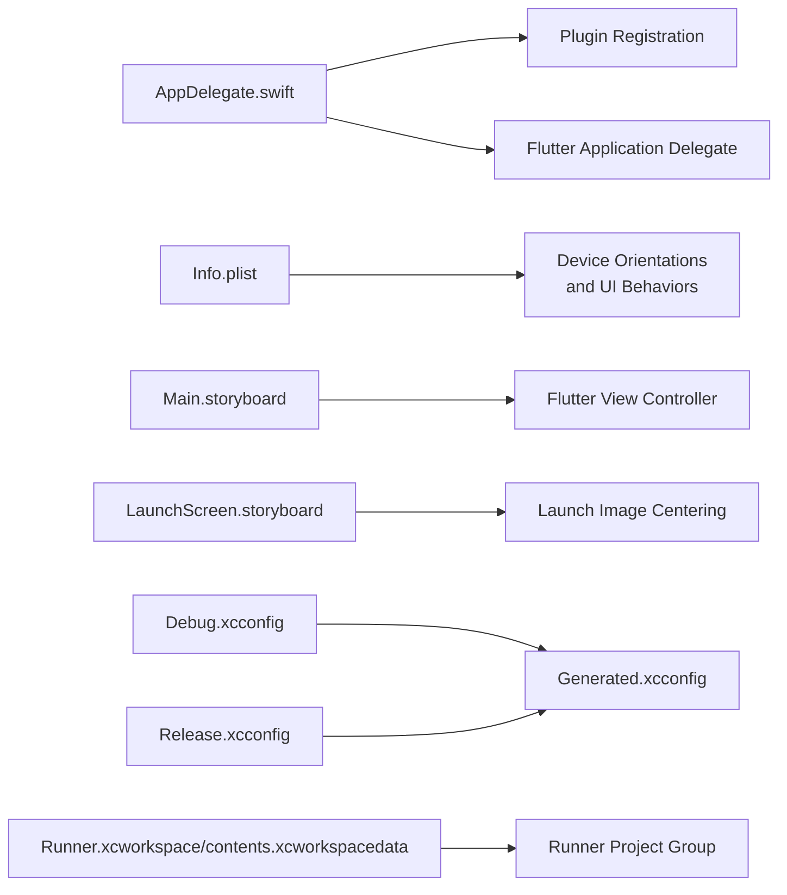

# iOS Platform

<cite>
**Referenced Files in This Document**
- [AppDelegate.swift](file://ios/Runner/AppDelegate.swift)
- [Info.plist](file://ios/Runner/Info.plist)
- [Main.storyboard](file://ios/Runner/Base.lproj/Main.storyboard)
- [LaunchScreen.storyboard](file://ios/Runner/Base.lproj/LaunchScreen.storyboard)
- [Debug.xcconfig](file://ios/Flutter/Debug.xcconfig)
- [Release.xcconfig](file://ios/Flutter/Release.xcconfig)
- [Runner.xcworkspace contents](file://ios/Runner.xcworkspace/contents.xcworkspacedata)
</cite>

## Table of Contents
1. [Introduction](#introduction)
2. [Project Structure](#project-structure)
3. [Core Components](#core-components)
4. [Architecture Overview](#architecture-overview)
5. [Detailed Component Analysis](#detailed-component-analysis)
6. [Dependency Analysis](#dependency-analysis)
7. [Performance Considerations](#performance-considerations)
8. [Troubleshooting Guide](#troubleshooting-guide)
9. [Conclusion](#conclusion)

## Introduction
This document explains the iOS platform integration for the project, focusing on Swift implementation and iOS-specific features. It covers the AppDelegate configuration, Info.plist settings, iOS app lifecycle management, deployment considerations, and platform-specific UI/UX behaviors visible in the repository. It also outlines iOS version compatibility, background processing limitations, and security-related configuration present in the workspace.

## Project Structure
The iOS integration is organized under the ios/Runner directory and the ios/Flutter configuration. Key elements include:
- Application entry point and lifecycle handling via AppDelegate.swift
- Application metadata and supported orientations via Info.plist
- Storyboards for launch and main UI via Main.storyboard and LaunchScreen.storyboard
- Build configuration via Debug.xcconfig and Release.xcconfig
- Xcode workspace reference via Runner.xcworkspace/contents.xcworkspacedata

**Diagram sources**
- [AppDelegate.swift](file://ios/Runner/AppDelegate.swift)
- [Info.plist](file://ios/Runner/Info.plist)
- [Main.storyboard](file://ios/Runner/Base.lproj/Main.storyboard)
- [LaunchScreen.storyboard](file://ios/Runner/Base.lproj/LaunchScreen.storyboard)
- [Debug.xcconfig](file://ios/Flutter/Debug.xcconfig)
- [Release.xcconfig](file://ios/Flutter/Release.xcconfig)
- [Runner.xcworkspace contents](file://ios/Runner.xcworkspace/contents.xcworkspacedata)

**Section sources**
- [AppDelegate.swift](file://ios/Runner/AppDelegate.swift)
- [Info.plist](file://ios/Runner/Info.plist)
- [Main.storyboard](file://ios/Runner/Base.lproj/Main.storyboard)
- [LaunchScreen.storyboard](file://ios/Runner/Base.lproj/LaunchScreen.storyboard)
- [Debug.xcconfig](file://ios/Flutter/Debug.xcconfig)
- [Release.xcconfig](file://ios/Flutter/Release.xcconfig)
- [Runner.xcworkspace contents](file://ios/Runner.xcworkspace/contents.xcworkspacedata)

## Core Components
- AppDelegate.swift
  - Defines the application lifecycle entry point and registers plugins with the Flutter engine during launch.
  - Provides the standard iOS application delegate method for launch completion.
  - Reference: [AppDelegate.swift](file://ios/Runner/AppDelegate.swift)

- Info.plist
  - Declares bundle identifiers, display name, and versioning metadata.
  - Specifies supported device orientations for iPhone and iPad.
  - Enables indirect input events and frame duration behavior suitable for modern iOS devices.
  - Reference: [Info.plist](file://ios/Runner/Info.plist)

- Storyboards
  - Main.storyboard defines the primary Flutter view controller as the initial scene.
  - LaunchScreen.storyboard defines the launch screen layout and centering constraints.
  - References:
    - [Main.storyboard](file://ios/Runner/Base.lproj/Main.storyboard)
    - [LaunchScreen.storyboard](file://ios/Runner/Base.lproj/LaunchScreen.storyboard)

- Build Configuration
  - Debug.xcconfig and Release.xcconfig include Generated.xcconfig, establishing shared build settings for the Runner target.
  - References:
    - [Debug.xcconfig](file://ios/Flutter/Debug.xcconfig)
    - [Release.xcconfig](file://ios/Flutter/Release.xcconfig)

**Section sources**
- [AppDelegate.swift](file://ios/Runner/AppDelegate.swift)
- [Info.plist](file://ios/Runner/Info.plist)
- [Main.storyboard](file://ios/Runner/Base.lproj/Main.storyboard)
- [LaunchScreen.storyboard](file://ios/Runner/Base.lproj/LaunchScreen.storyboard)
- [Debug.xcconfig](file://ios/Flutter/Debug.xcconfig)
- [Release.xcconfig](file://ios/Flutter/Release.xcconfig)

## Architecture Overview
The iOS app integrates with Flutter through the AppDelegate, which registers plugins and defers to the Flutter application delegate for lifecycle handling. Storyboards define the initial UI scenes, while Info.plist controls metadata and device orientation support.

**Diagram sources**
- [AppDelegate.swift](file://ios/Runner/AppDelegate.swift)

**Section sources**
- [AppDelegate.swift](file://ios/Runner/AppDelegate.swift)

## Detailed Component Analysis

### AppDelegate Configuration
- Purpose: Initialize the Flutter engine and register plugins during application launch.
- Lifecycle hook: Overrides the standard iOS launch method to ensure plugin registration occurs before the app proceeds.
- Implementation pattern: Minimal override to preserve Flutter defaults while ensuring plugin readiness.
- References:
  - [AppDelegate.swift](file://ios/Runner/AppDelegate.swift)

**Section sources**
- [AppDelegate.swift](file://ios/Runner/AppDelegate.swift)

### Info.plist Settings
- Bundle and Versioning: Declares development region, executable, bundle identifier, short version string, and build number.
- App Metadata: Provides display name and bundle name.
- Device Support:
  - Requires iPhone OS (LSRequiresIPhoneOS).
  - Supports portrait and landscape orientations for iPhone.
  - Supports portrait, upside-down portrait, and both landscape orientations for iPad.
- UI Behavior:
  - Disables minimum frame duration on iPhone for smoother animations.
  - Enables indirect input events for enhanced touch responsiveness.
- References:
  - [Info.plist](file://ios/Runner/Info.plist)

**Section sources**
- [Info.plist](file://ios/Runner/Info.plist)

### iOS App Lifecycle Management
- Initial Scene Definition: Main.storyboard sets the initial view controller to a Flutter view controller, aligning with Flutter’s default integration.
- Launch Screen: LaunchScreen.storyboard centers the launch image and constrains it to the center of the view.
- References:
  - [Main.storyboard](file://ios/Runner/Base.lproj/Main.storyboard)
  - [LaunchScreen.storyboard](file://ios/Runner/Base.lproj/LaunchScreen.storyboard)

**Section sources**
- [Main.storyboard](file://ios/Runner/Base.lproj/Main.storyboard)
- [LaunchScreen.storyboard](file://ios/Runner/Base.lproj/LaunchScreen.storyboard)

### iOS Deployment and Build Configuration
- Workspace Reference: Runner.xcworkspace/contents.xcworkspacedata points to the Runner project group, indicating the Xcode workspace structure.
- Build Configurations: Debug.xcconfig and Release.xcconfig include Generated.xcconfig, ensuring consistent build settings across configurations.
- References:
  - [Runner.xcworkspace contents](file://ios/Runner.xcworkspace/contents.xcworkspacedata)
  - [Debug.xcconfig](file://ios/Flutter/Debug.xcconfig)
  - [Release.xcconfig](file://ios/Flutter/Release.xcconfig)

**Section sources**
- [Runner.xcworkspace contents](file://ios/Runner.xcworkspace/contents.xcworkspacedata)
- [Debug.xcconfig](file://ios/Flutter/Debug.xcconfig)
- [Release.xcconfig](file://ios/Flutter/Release.xcconfig)

### iOS-Specific Permissions, Entitlements, and Capabilities
- Current State in Repository: No iOS entitlements files are present in the repository snapshot. macOS entitlements exist but are not applicable to iOS targets.
- Recommendations:
  - Add an entitlements file for the iOS Runner target if network access, background modes, or hardware features are required.
  - Enable capabilities in Xcode (e.g., Push Notifications, Background Modes) and mirror them in the entitlements file.
  - Keep entitlements synchronized with App Store requirements and security policies.
- Notes:
  - Entitlements are typically managed in Xcode project settings and exported to an .entitlements file; ensure the Runner target links to the correct entitlements file.

[No sources needed since this section provides general guidance]

### iOS Version Compatibility and Platform Capabilities
- Orientation Support: Info.plist explicitly lists supported orientations for iPhone and iPad, enabling appropriate UI layouts across form factors.
- Indirect Input Events: Enabled to improve responsiveness on compatible devices.
- Frame Duration Control: Minimum frame duration disabled on iPhone to allow smoother rendering on supported devices.
- References:
  - [Info.plist](file://ios/Runner/Info.plist)

**Section sources**
- [Info.plist](file://ios/Runner/Info.plist)

### iOS Security Features and Background Processing Limitations
- Sandboxing and Network Access:
  - The macOS entitlements demonstrate sandboxing and network server permissions, which are illustrative of Apple platform security posture.
  - For iOS, ensure the entitlements file (if used) aligns with the app’s runtime needs and complies with App Store review guidelines.
- Background Processing:
  - iOS enforces strict background execution limits. Use appropriate background modes only when justified by the app’s functionality and documented in the entitlements.
- References:
  - [DebugProfile.entitlements (macOS)](file://macos/Runner/DebugProfile.entitlements)
  - [Release.entitlements (macOS)](file://macos/Runner/Release.entitlements)

**Section sources**
- [DebugProfile.entitlements (macOS)](file://macos/Runner/DebugProfile.entitlements)
- [Release.entitlements (macOS)](file://macos/Runner/Release.entitlements)

### Platform-Specific UI/UX Considerations
- Launch Experience: LaunchScreen.storyboard centers the launch image and uses Auto Layout constraints for consistent presentation across devices.
- Main UI Controller: Main.storyboard sets the initial controller to a Flutter view controller, ensuring the Flutter engine renders the app UI immediately after launch.
- References:
  - [LaunchScreen.storyboard](file://ios/Runner/Base.lproj/LaunchScreen.storyboard)
  - [Main.storyboard](file://ios/Runner/Base.lproj/Main.storyboard)

**Section sources**
- [LaunchScreen.storyboard](file://ios/Runner/Base.lproj/LaunchScreen.storyboard)
- [Main.storyboard](file://ios/Runner/Base.lproj/Main.storyboard)

## Dependency Analysis
The iOS integration depends on Flutter’s application delegate and plugin registration mechanism. Build configuration files include generated settings to maintain consistency across environments.

**Diagram sources**
- [AppDelegate.swift](file://ios/Runner/AppDelegate.swift)
- [Info.plist](file://ios/Runner/Info.plist)
- [Main.storyboard](file://ios/Runner/Base.lproj/Main.storyboard)
- [LaunchScreen.storyboard](file://ios/Runner/Base.lproj/LaunchScreen.storyboard)
- [Debug.xcconfig](file://ios/Flutter/Debug.xcconfig)
- [Release.xcconfig](file://ios/Flutter/Release.xcconfig)
- [Runner.xcworkspace contents](file://ios/Runner.xcworkspace/contents.xcworkspacedata)

**Section sources**
- [AppDelegate.swift](file://ios/Runner/AppDelegate.swift)
- [Info.plist](file://ios/Runner/Info.plist)
- [Main.storyboard](file://ios/Runner/Base.lproj/Main.storyboard)
- [LaunchScreen.storyboard](file://ios/Runner/Base.lproj/LaunchScreen.storyboard)
- [Debug.xcconfig](file://ios/Flutter/Debug.xcconfig)
- [Release.xcconfig](file://ios/Flutter/Release.xcconfig)
- [Runner.xcworkspace contents](file://ios/Runner.xcworkspace/contents.xcworkspacedata)

## Performance Considerations
- Frame Rate and Responsiveness:
  - Info.plist disables minimum frame duration on iPhone and enables indirect input events, supporting smoother animations and responsive input handling.
- UI Rendering:
  - LaunchScreen.storyboard uses centered constraints to minimize layout thrashing during startup.
- Build Consistency:
  - Debug.xcconfig and Release.xcconfig include Generated.xcconfig, ensuring consistent build-time settings across environments.
- References:
  - [Info.plist](file://ios/Runner/Info.plist)
  - [LaunchScreen.storyboard](file://ios/Runner/Base.lproj/LaunchScreen.storyboard)
  - [Debug.xcconfig](file://ios/Flutter/Debug.xcconfig)
  - [Release.xcconfig](file://ios/Flutter/Release.xcconfig)

**Section sources**
- [Info.plist](file://ios/Runner/Info.plist)
- [LaunchScreen.storyboard](file://ios/Runner/Base.lproj/LaunchScreen.storyboard)
- [Debug.xcconfig](file://ios/Flutter/Debug.xcconfig)
- [Release.xcconfig](file://ios/Flutter/Release.xcconfig)

## Troubleshooting Guide
- Plugin Registration Issues:
  - Ensure AppDelegate registers plugins during launch and defers to the Flutter application delegate for lifecycle handling.
  - Reference: [AppDelegate.swift](file://ios/Runner/AppDelegate.swift)
- Orientation Problems:
  - Verify supported orientations in Info.plist match the intended UX for iPhone and iPad.
  - Reference: [Info.plist](file://ios/Runner/Info.plist)
- Launch Screen Not Appearing:
  - Confirm LaunchScreen.storyboard defines the initial view controller and constraints for the launch image.
  - Reference: [LaunchScreen.storyboard](file://ios/Runner/Base.lproj/LaunchScreen.storyboard)
- Build Configuration Mismatch:
  - Confirm Debug.xcconfig and Release.xcconfig include Generated.xcconfig and that the workspace references the Runner project group.
  - References:
    - [Debug.xcconfig](file://ios/Flutter/Debug.xcconfig)
    - [Release.xcconfig](file://ios/Flutter/Release.xcconfig)
    - [Runner.xcworkspace contents](file://ios/Runner.xcworkspace/contents.xcworkspacedata)

**Section sources**
- [AppDelegate.swift](file://ios/Runner/AppDelegate.swift)
- [Info.plist](file://ios/Runner/Info.plist)
- [LaunchScreen.storyboard](file://ios/Runner/Base.lproj/LaunchScreen.storyboard)
- [Debug.xcconfig](file://ios/Flutter/Debug.xcconfig)
- [Release.xcconfig](file://ios/Flutter/Release.xcconfig)
- [Runner.xcworkspace contents](file://ios/Runner.xcworkspace/contents.xcworkspacedata)

## Conclusion
The iOS integration leverages Flutter’s standard AppDelegate pattern, minimal overrides, and conventional Info.plist and storyboard configurations. The repository demonstrates explicit support for device orientations, launch screen layout, and UI responsiveness settings. For production deployments, ensure entitlements and capabilities align with the app’s runtime needs and App Store requirements, and maintain consistent build configuration across environments.