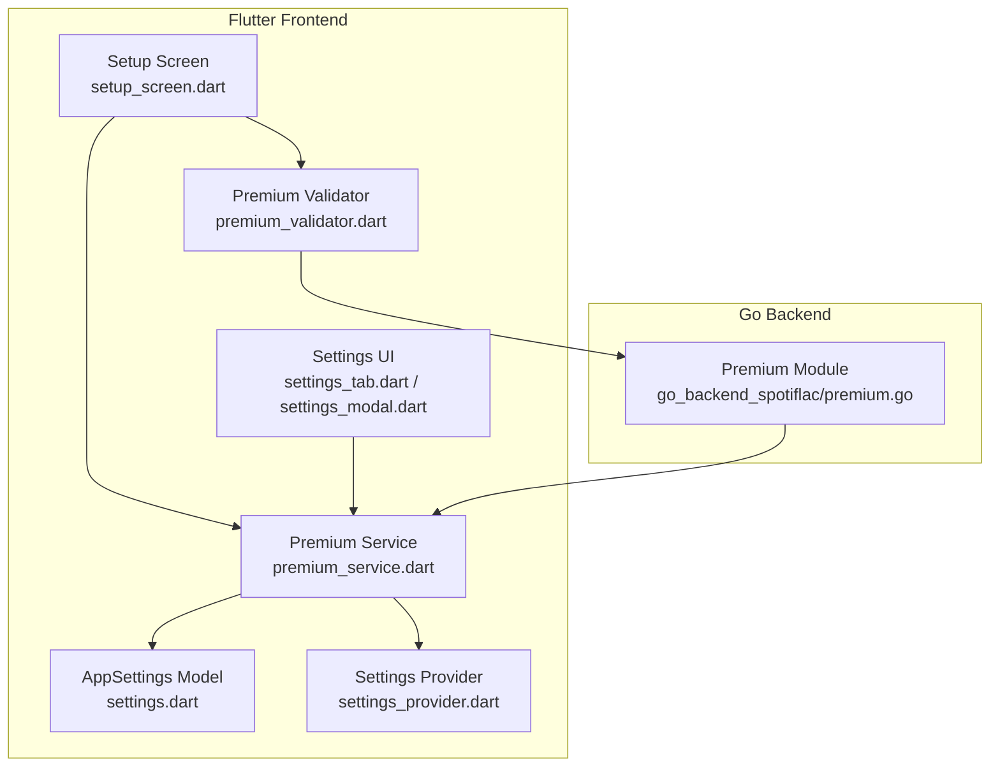
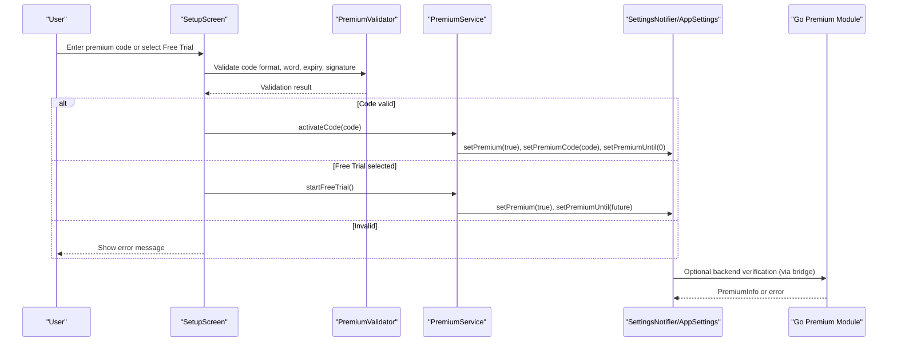
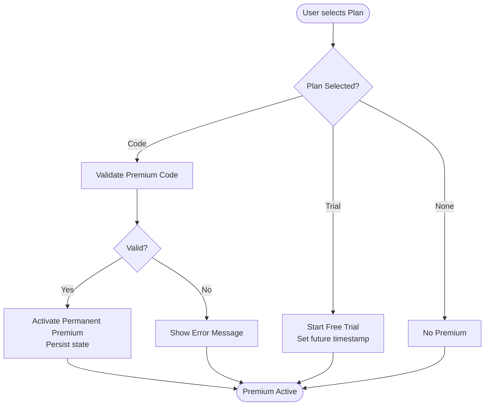
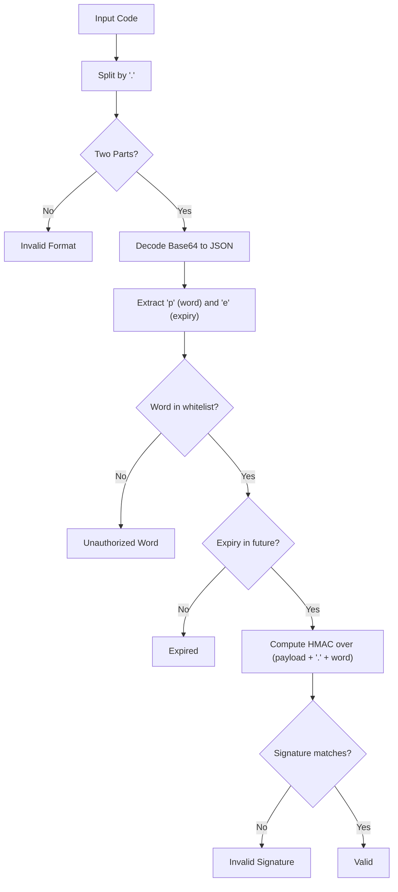
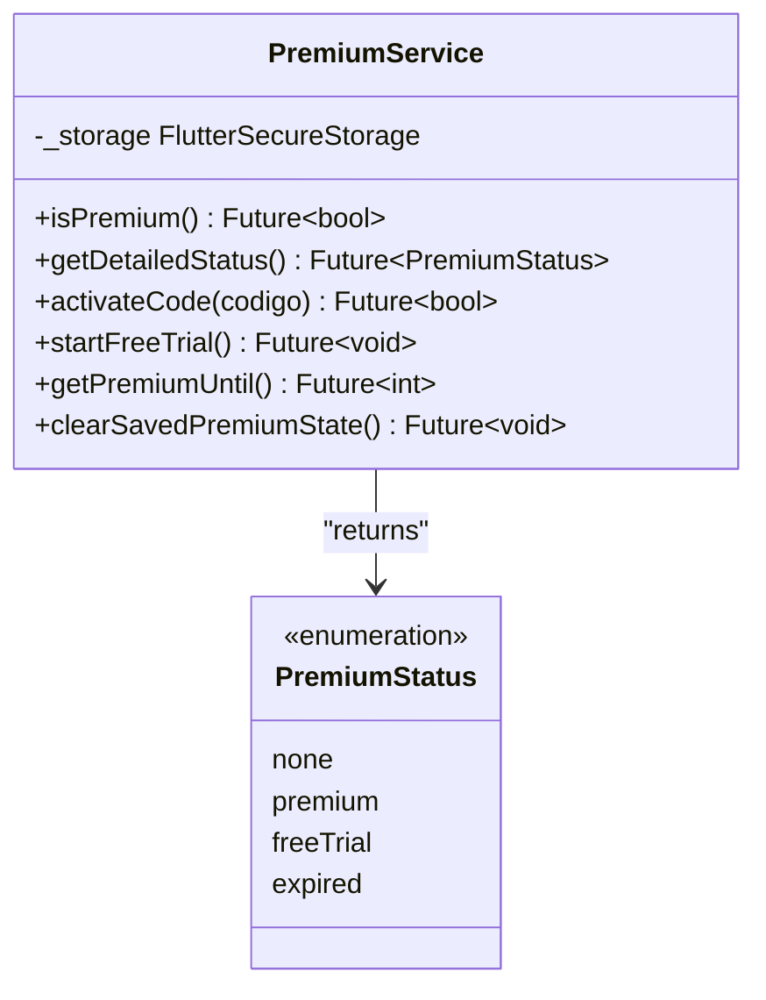
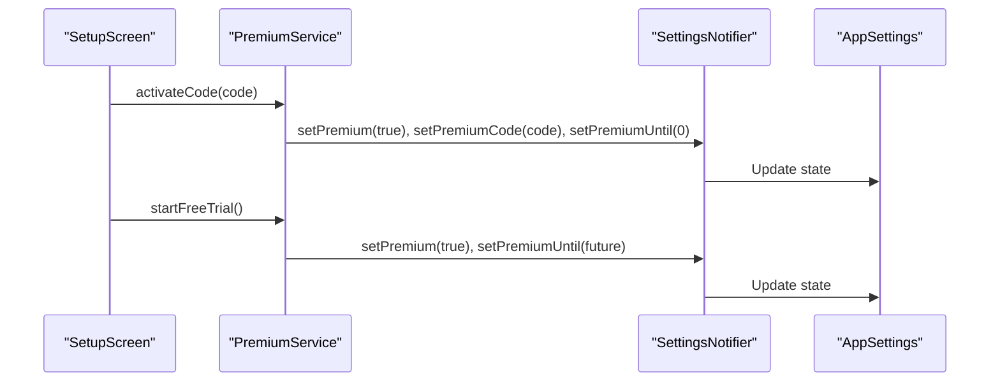
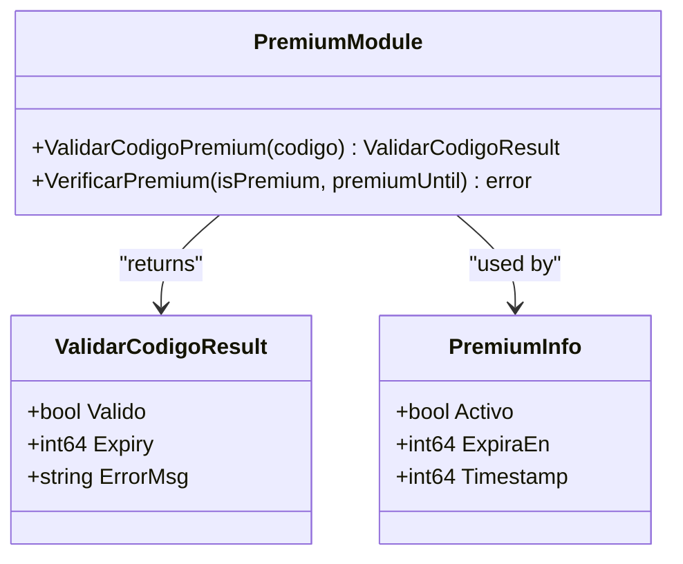
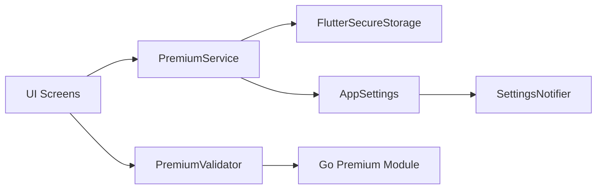

# Premium and Monetization

<cite>
**Referenced Files in This Document**
- [premium.go](file://go_backend_spotiflac/premium.go)
- [premium_service.dart](file://lib/services/premium_service.dart)
- [premium_validator.dart](file://lib/services/premium_validator.dart)
- [setup_screen.dart](file://lib/screens/setup_screen.dart)
- [settings_tab.dart](file://lib/screens/settings/settings_tab.dart)
- [settings_modal.dart](file://lib/widgets/settings_modal.dart)
- [settings.dart](file://lib/models/settings.dart)
- [settings_provider.dart](file://lib/providers/settings_provider.dart)
- [app.dart](file://lib/app.dart)
- [main.dart](file://lib/main.dart)
- [premium_keys.dart](file://premium_keys.dart)
- [bitlyCodes.py](file://scripts/bitlyCodes.py)
</cite>

## Table of Contents
1. [Introduction](#introduction)
2. [Project Structure](#project-structure)
3. [Core Components](#core-components)
4. [Architecture Overview](#architecture-overview)
5. [Detailed Component Analysis](#detailed-component-analysis)
6. [Dependency Analysis](#dependency-analysis)
7. [Performance Considerations](#performance-considerations)
8. [Troubleshooting Guide](#troubleshooting-guide)
9. [Conclusion](#conclusion)
10. [Appendices](#appendices)

## Introduction
This document explains the premium features and monetization system implemented in the application. It covers the premium activation flow, subscription-like mechanics, feature gating, and the internal premium key validation scheme. It also documents the premium service architecture, integration with the main application, and highlights security considerations for premium key validation and anti-tampering measures.

The system currently implements:
- Premium activation via a locally validated premium key
- A free trial period stored locally
- Feature gating based on premium status
- Local persistence of premium state and username
- A Go backend module that validates premium keys and enforces expiration checks

## Project Structure
The premium and monetization logic spans the Flutter frontend and a Go backend module:
- Frontend services and UI handle user onboarding, premium selection, and feature gating
- Backend module performs cryptographic verification of premium keys and manages premium info
- Shared settings model persists premium-related state across sessions

**Diagram sources**
- [setup_screen.dart](file://lib/screens/setup_screen.dart)
- [settings_tab.dart](file://lib/screens/settings/settings_tab.dart)
- [settings_modal.dart](file://lib/widgets/settings_modal.dart)
- [premium_service.dart](file://lib/services/premium_service.dart)
- [premium_validator.dart](file://lib/services/premium_validator.dart)
- [settings.dart](file://lib/models/settings.dart)
- [settings_provider.dart](file://lib/providers/settings_provider.dart)
- [premium.go](file://go_backend_spotiflac/premium.go)

**Section sources**
- [setup_screen.dart](file://lib/screens/setup_screen.dart)
- [settings_tab.dart](file://lib/screens/settings/settings_tab.dart)
- [settings_modal.dart](file://lib/widgets/settings_modal.dart)
- [premium_service.dart](file://lib/services/premium_service.dart)
- [premium_validator.dart](file://lib/services/premium_validator.dart)
- [settings.dart](file://lib/models/settings.dart)
- [settings_provider.dart](file://lib/providers/settings_provider.dart)
- [premium.go](file://go_backend_spotiflac/premium.go)

## Core Components
- Premium activation and free trial management:
  - PremiumService stores and retrieves premium state, usernames, and premium codes
  - Free trial is activated by setting a future timestamp in milliseconds
- Premium key validation:
  - PremiumValidator verifies the key format, embedded word, expiration, and HMAC signature
  - Validation mirrors backend logic for consistency
- Premium gating:
  - Feature availability depends on premium status and remaining trial time
- Settings persistence:
  - AppSettings holds premium flags and timestamps; SettingsNotifier writes to persistent storage

**Section sources**
- [premium_service.dart](file://lib/services/premium_service.dart)
- [premium_validator.dart](file://lib/services/premium_validator.dart)
- [settings.dart](file://lib/models/settings.dart)
- [settings_provider.dart](file://lib/providers/settings_provider.dart)

## Architecture Overview
The premium system integrates UI, service, validation, and backend components. The flow begins in the setup screen where users enter a premium code or opt into a free trial. The PremiumService coordinates persistence and status updates, while PremiumValidator ensures the code’s integrity. The Go backend module provides complementary validation and premium info structures.

**Diagram sources**
- [setup_screen.dart](file://lib/screens/setup_screen.dart)
- [premium_validator.dart](file://lib/services/premium_validator.dart)
- [premium_service.dart](file://lib/services/premium_service.dart)
- [settings_provider.dart](file://lib/providers/settings_provider.dart)
- [settings.dart](file://lib/models/settings.dart)
- [premium.go](file://go_backend_spotiflac/premium.go)

## Detailed Component Analysis

### Premium Activation and Free Trial
- Onboarding flow:
  - Users can enter a premium code or choose a free trial
  - Upon successful code validation, PremiumService activates permanent premium
  - Free trial sets a future timestamp; PremiumService clears the saved code
- Status resolution:
  - PremiumService determines whether the user is premium, on trial, expired, or none
  - Expiration is checked against current milliseconds

**Diagram sources**
- [setup_screen.dart](file://lib/screens/setup_screen.dart)
- [premium_service.dart](file://lib/services/premium_service.dart)

**Section sources**
- [setup_screen.dart](file://lib/screens/setup_screen.dart)
- [premium_service.dart](file://lib/services/premium_service.dart)

### Premium Key Validation
- Key format: two parts separated by a dot — base64-encoded payload and signature
- Payload decoding and parsing:
  - Normalize URL-safe base64 to standard base64 and decode JSON
  - Extract word and expiry fields
- Authorization and expiration:
  - Word must match a predefined whitelist
  - Expiry must be in the future
- Signature verification:
  - Compute HMAC-SHA256 over the concatenation of the base64 payload and the word
  - Compare with the provided signature (URL-safe base64, normalized)

**Diagram sources**
- [premium_validator.dart](file://lib/services/premium_validator.dart)
- [premium.go](file://go_backend_spotiflac/premium.go)
- [bitlyCodes.py](file://scripts/bitlyCodes.py)

**Section sources**
- [premium_validator.dart](file://lib/services/premium_validator.dart)
- [premium.go](file://go_backend_spotiflac/premium.go)
- [bitlyCodes.py](file://scripts/bitlyCodes.py)

### Premium Service and Persistence
- Storage keys:
  - Premium flag, expiration timestamp, username, and premium code are persisted
- Status enumeration:
  - none, premium, freeTrial, expired
- Methods:
  - isPremium(), getDetailedStatus(), activateCode(), startFreeTrial(), getPremiumUntil(), clearSavedPremiumState()

**Diagram sources**
- [premium_service.dart](file://lib/services/premium_service.dart)

**Section sources**
- [premium_service.dart](file://lib/services/premium_service.dart)

### Feature Gating and UI Integration
- Setup screen:
  - Validates code input and auto-navigates upon success
  - Activates premium or starts free trial accordingly
- Settings UI:
  - Displays remaining trial time or “trial used” information
  - Shows premium badge and related controls

**Diagram sources**
- [setup_screen.dart](file://lib/screens/setup_screen.dart)
- [premium_service.dart](file://lib/services/premium_service.dart)
- [settings_provider.dart](file://lib/providers/settings_provider.dart)
- [settings.dart](file://lib/models/settings.dart)

**Section sources**
- [setup_screen.dart](file://lib/screens/setup_screen.dart)
- [settings_tab.dart](file://lib/screens/settings/settings_tab.dart)
- [settings_modal.dart](file://lib/widgets/settings_modal.dart)
- [settings_provider.dart](file://lib/providers/settings_provider.dart)
- [settings.dart](file://lib/models/settings.dart)

### Go Backend Premium Module
- Exposes:
  - Premium key validation result structure
  - HMAC-based signature generation
  - PremiumInfo structure for backend-side premium state
  - Verification function to enforce premium gating based on flags and timestamps
- Security note:
  - Secret key is embedded in the backend module; treat as sensitive during distribution

**Diagram sources**
- [premium.go](file://go_backend_spotiflac/premium.go)

**Section sources**
- [premium.go](file://go_backend_spotiflac/premium.go)

### Public Key Reference
- A public key constant exists in the project, likely intended for asymmetric operations or compatibility with external systems. Its presence suggests potential future expansion toward asymmetric cryptography or secure communication channels.

**Section sources**
- [premium_keys.dart](file://premium_keys.dart)

## Dependency Analysis
- UI depends on PremiumService for state transitions and on PremiumValidator for code verification
- PremiumService persists state via FlutterSecureStorage and updates SettingsNotifier/AppSettings
- PremiumValidator mirrors backend logic to ensure consistent validation across platforms
- Go backend module complements frontend validation and provides premium info structures

**Diagram sources**
- [setup_screen.dart](file://lib/screens/setup_screen.dart)
- [premium_service.dart](file://lib/services/premium_service.dart)
- [premium_validator.dart](file://lib/services/premium_validator.dart)
- [settings.dart](file://lib/models/settings.dart)
- [settings_provider.dart](file://lib/providers/settings_provider.dart)
- [premium.go](file://go_backend_spotiflac/premium.go)

**Section sources**
- [setup_screen.dart](file://lib/screens/setup_screen.dart)
- [premium_service.dart](file://lib/services/premium_service.dart)
- [premium_validator.dart](file://lib/services/premium_validator.dart)
- [settings_provider.dart](file://lib/providers/settings_provider.dart)
- [settings.dart](file://lib/models/settings.dart)
- [premium.go](file://go_backend_spotiflac/premium.go)

## Performance Considerations
- Local validation avoids network latency for premium checks
- Frequent UI updates for trial countdown rely on periodic timers; keep intervals reasonable to balance accuracy and battery usage
- Avoid redundant validations by caching validation results per session

## Troubleshooting Guide
Common issues and resolutions:
- Invalid code format:
  - Ensure the code has exactly two parts separated by a dot
- Unauthorized word:
  - Only approved words are accepted; confirm the payload contains an allowed word
- Expired code:
  - Expiry is checked against current UTC seconds; ensure device time is accurate
- Invalid signature:
  - Recompute HMAC over the exact concatenation of base64 payload and word; mismatches indicate tampering or corruption
- Trial expiration:
  - PremiumService compares milliseconds; ensure the future timestamp is correctly set and not in the past
- Auto-restore:
  - PremiumService attempts to restore premium from saved code or username; verify storage keys and values

Operational tips:
- Use the provided script to validate codes during development
- Monitor SettingsNotifier/AppSettings persistence for corruption and reset if necessary

**Section sources**
- [premium_validator.dart](file://lib/services/premium_validator.dart)
- [premium_service.dart](file://lib/services/premium_service.dart)
- [settings_provider.dart](file://lib/providers/settings_provider.dart)
- [bitlyCodes.py](file://scripts/bitlyCodes.py)

## Conclusion
The premium and monetization system combines local validation, secure storage, and UI-driven onboarding to deliver a streamlined subscription-like experience. While the current implementation focuses on code-based activation and free trials, the architecture supports future enhancements such as asymmetric cryptography and backend-driven subscriptions. Robust validation and secure storage practices help maintain integrity and user trust.

## Appendices

### Practical Examples

- Example: Premium activation via code
  - User enters a valid code in the setup screen
  - PremiumValidator confirms format, word, expiry, and signature
  - PremiumService persists premium=true and clears the trial timestamp
  - SettingsNotifier updates AppSettings and triggers UI refresh

- Example: Free trial activation
  - User selects the free trial option
  - PremiumService sets premium=true and a future timestamp
  - Settings UI displays remaining trial time with a countdown

- Example: Premium gating
  - Feature availability checks PremiumService.isPremium()
  - If expired, prompt reactivation or trial extension

- Example: Revenue tracking and monetization strategies
  - Current code does not integrate with payment processors
  - To support monetization, replace code-based activation with:
    - Backend verification via a secure API
    - Subscription management through a third-party provider
    - Revenue tracking tied to subscription events
  - Maintain backward compatibility by keeping local validation for offline checks

[No sources needed since this section provides general guidance]