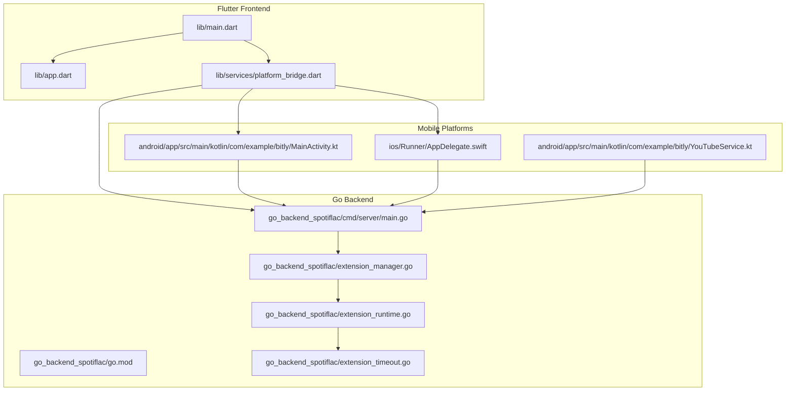
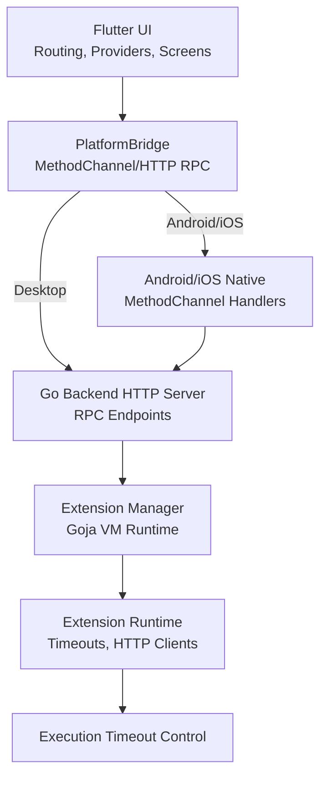
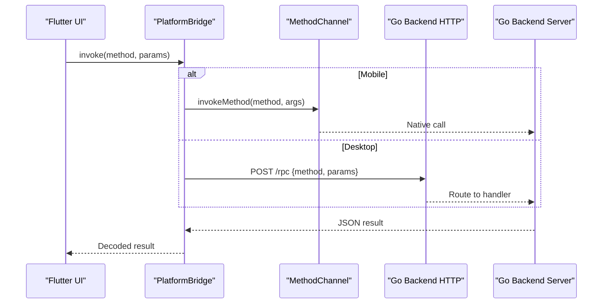
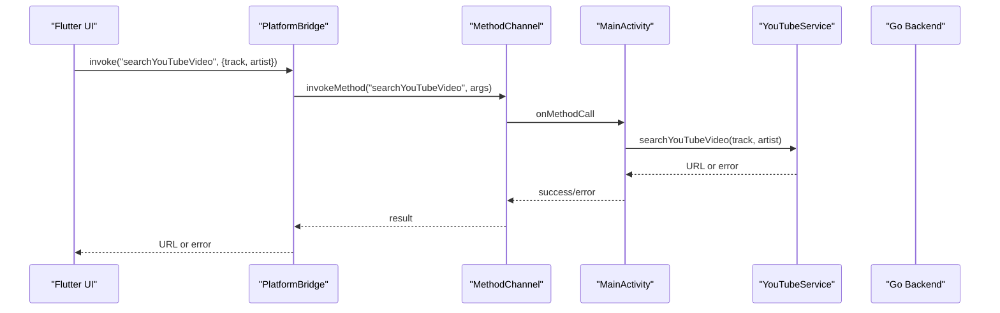
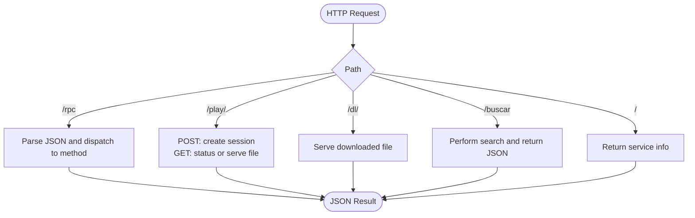
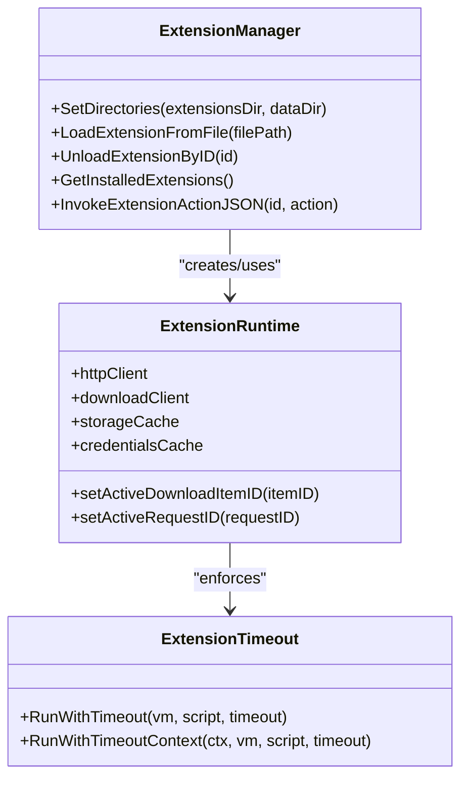
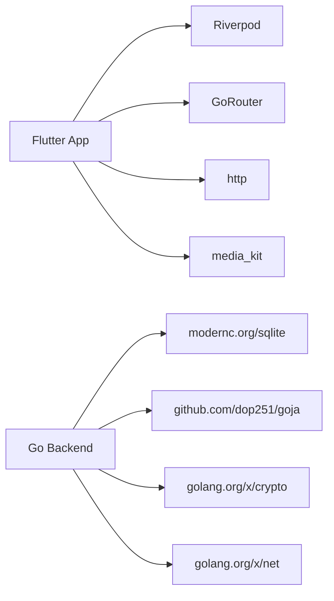

# Architecture Overview

<cite>
**Referenced Files in This Document**
- [lib/main.dart](file://lib/main.dart)
- [lib/app.dart](file://lib/app.dart)
- [lib/services/platform_bridge.dart](file://lib/services/platform_bridge.dart)
- [android/app/src/main/kotlin/com/example/bitly/MainActivity.kt](file://android/app/src/main/kotlin/com/example/bitly/MainActivity.kt)
- [android/app/src/main/kotlin/com/example/bitly/YouTubeService.kt](file://android/app/src/main/kotlin/com/example/bitly/YouTubeService.kt)
- [ios/Runner/AppDelegate.swift](file://ios/Runner/AppDelegate.swift)
- [go_backend_spotiflac/cmd/server/main.go](file://go_backend_spotiflac/cmd/server/main.go)
- [go_backend_spotiflac/go.mod](file://go_backend_spotiflac/go.mod)
- [go_backend_spotiflac/extension_manager.go](file://go_backend_spotiflac/extension_manager.go)
- [go_backend_spotiflac/extension_runtime.go](file://go_backend_spotiflac/extension_runtime.go)
- [go_backend_spotiflac/extension_timeout.go](file://go_backend_spotiflac/extension_timeout.go)
- [pubspec.yaml](file://pubspec.yaml)
</cite>

## Table of Contents
1. [Introduction](#introduction)
2. [Project Structure](#project-structure)
3. [Core Components](#core-components)
4. [Architecture Overview](#architecture-overview)
5. [Detailed Component Analysis](#detailed-component-analysis)
6. [Dependency Analysis](#dependency-analysis)
7. [Performance Considerations](#performance-considerations)
8. [Troubleshooting Guide](#troubleshooting-guide)
9. [Conclusion](#conclusion)

## Introduction
This document describes the hybrid Flutter-Go architecture of the Bitly system. The Flutter frontend provides the UI and user interactions, while the Go backend handles intensive tasks such as downloads, metadata enrichment, lyrics fetching, extension management, and platform-specific integrations. Communication between the UI and backend is achieved through:
- MethodChannel on mobile (Android/iOS) for native interop
- HTTP RPC on desktop platforms (Windows/Linux/macOS) for process-local server communication
- JavaScript VM for extension runtime capabilities

The document explains the separation of concerns, communication patterns, system context, and technical trade-offs.

## Project Structure
The repository is organized into:
- Flutter application (UI, routing, providers, services)
- Android/iOS native modules (MethodChannel handlers, platform services)
- Go backend server (HTTP RPC, extension runtime, platform integrations)
- Desktop build and packaging (Windows, Linux, macOS)

**Diagram sources**
- [lib/main.dart:22-44](file://lib/main.dart#L22-L44)
- [lib/app.dart:13-52](file://lib/app.dart#L13-L52)
- [lib/services/platform_bridge.dart:37-53](file://lib/services/platform_bridge.dart#L37-L53)
- [android/app/src/main/kotlin/com/example/bitly/MainActivity.kt:23-133](file://android/app/src/main/kotlin/com/example/bitly/MainActivity.kt#L23-L133)
- [ios/Runner/AppDelegate.swift:5-12](file://ios/Runner/AppDelegate.swift#L5-L12)
- [android/app/src/main/kotlin/com/example/bitly/YouTubeService.kt:10-52](file://android/app/src/main/kotlin/com/example/bitly/YouTubeService.kt#L10-L52)
- [go_backend_spotiflac/cmd/server/main.go:107-134](file://go_backend_spotiflac/cmd/server/main.go#L107-L134)
- [go_backend_spotiflac/go.mod:1-39](file://go_backend_spotiflac/go.mod#L1-L39)
- [go_backend_spotiflac/extension_manager.go:120-139](file://go_backend_spotiflac/extension_manager.go#L120-L139)
- [go_backend_spotiflac/extension_runtime.go:84-147](file://go_backend_spotiflac/extension_runtime.go#L84-L147)
- [go_backend_spotiflac/extension_timeout.go:22-118](file://go_backend_spotiflac/extension_timeout.go#L22-L118)

**Section sources**
- [lib/main.dart:22-44](file://lib/main.dart#L22-L44)
- [lib/app.dart:13-52](file://lib/app.dart#L13-L52)
- [lib/services/platform_bridge.dart:37-53](file://lib/services/platform_bridge.dart#L37-L53)
- [android/app/src/main/kotlin/com/example/bitly/MainActivity.kt:23-133](file://android/app/src/main/kotlin/com/example/bitly/MainActivity.kt#L23-L133)
- [ios/Runner/AppDelegate.swift:5-12](file://ios/Runner/AppDelegate.swift#L5-L12)
- [android/app/src/main/kotlin/com/example/bitly/YouTubeService.kt:10-52](file://android/app/src/main/kotlin/com/example/bitly/YouTubeService.kt#L10-L52)
- [go_backend_spotiflac/cmd/server/main.go:107-134](file://go_backend_spotiflac/cmd/server/main.go#L107-L134)
- [go_backend_spotiflac/go.mod:1-39](file://go_backend_spotiflac/go.mod#L1-L39)
- [go_backend_spotiflac/extension_manager.go:120-139](file://go_backend_spotiflac/extension_manager.go#L120-L139)
- [go_backend_spotiflac/extension_runtime.go:84-147](file://go_backend_spotiflac/extension_runtime.go#L84-L147)
- [go_backend_spotiflac/extension_timeout.go:22-118](file://go_backend_spotiflac/extension_timeout.go#L22-L118)

## Core Components
- Flutter UI and Routing
  - Application bootstrap initializes platform-specific services and sets up routing and localization.
  - The app uses Riverpod for state management and navigation via GoRouter.

- Platform Bridge
  - Provides unified invocation to backend via MethodChannel (mobile) or HTTP RPC (desktop).
  - Implements caching, in-flight request deduplication, and event streams for progress updates.

- Go Backend Server
  - HTTP server exposing RPC endpoints for core features (downloads, metadata, lyrics, extension management).
  - Embedded extension runtime powered by a JavaScript VM with timeouts and sandboxing.

- Mobile Platform Integrations
  - Android MethodChannel handlers for database, settings, extension store, search, YouTube operations, SAF storage, and network compatibility.
  - Android YouTubeService wraps yt-dlp for video search and download.

- iOS Platform Integration
  - Minimal AppDelegate registration for Flutter plugins.

**Section sources**
- [lib/main.dart:22-44](file://lib/main.dart#L22-L44)
- [lib/app.dart:13-52](file://lib/app.dart#L13-L52)
- [lib/services/platform_bridge.dart:37-53](file://lib/services/platform_bridge.dart#L37-L53)
- [go_backend_spotiflac/cmd/server/main.go:107-134](file://go_backend_spotiflac/cmd/server/main.go#L107-L134)
- [android/app/src/main/kotlin/com/example/bitly/MainActivity.kt:23-133](file://android/app/src/main/kotlin/com/example/bitly/MainActivity.kt#L23-L133)
- [android/app/src/main/kotlin/com/example/bitly/YouTubeService.kt:10-52](file://android/app/src/main/kotlin/com/example/bitly/YouTubeService.kt#L10-L52)
- [ios/Runner/AppDelegate.swift:5-12](file://ios/Runner/AppDelegate.swift#L5-L12)

## Architecture Overview
The system follows a hybrid architecture:
- UI layer (Flutter) orchestrates user actions and displays results.
- Bridge layer abstracts platform differences and routes requests to the backend.
- Backend processing (Go) executes heavy workloads and manages extension lifecycles.
- Platform-specific implementations (Android/iOS) integrate native capabilities.

**Diagram sources**
- [lib/services/platform_bridge.dart:37-53](file://lib/services/platform_bridge.dart#L37-L53)
- [android/app/src/main/kotlin/com/example/bitly/MainActivity.kt:23-133](file://android/app/src/main/kotlin/com/example/bitly/MainActivity.kt#L23-L133)
- [go_backend_spotiflac/cmd/server/main.go:107-134](file://go_backend_spotiflac/cmd/server/main.go#L107-L134)
- [go_backend_spotiflac/extension_manager.go:120-139](file://go_backend_spotiflac/extension_manager.go#L120-L139)
- [go_backend_spotiflac/extension_runtime.go:84-147](file://go_backend_spotiflac/extension_runtime.go#L84-L147)
- [go_backend_spotiflac/extension_timeout.go:22-118](file://go_backend_spotiflac/extension_timeout.go#L22-L118)

## Detailed Component Analysis

### Flutter UI Layer
- Initialization and eager setup
  - Initializes media engine, SQLite FFI on desktop, and configures image cache based on runtime profile.
  - Eagerly initializes services, extensions, and deferred providers to improve perceived performance.

- Routing and localization
  - Uses GoRouter with redirect logic based on settings and tutorial state.
  - Supports dynamic color themes and configurable locales.

**Section sources**
- [lib/main.dart:22-44](file://lib/main.dart#L22-L44)
- [lib/main.dart:46-94](file://lib/main.dart#L46-L94)
- [lib/main.dart:96-287](file://lib/main.dart#L96-L287)
- [lib/app.dart:13-52](file://lib/app.dart#L13-L52)

### Platform Bridge Layer
- Unified invocation
  - Chooses MethodChannel on mobile or HTTP RPC on desktop.
  - Encodes RPC requests as JSON with method and params.

- Desktop backend lifecycle
  - Detects platform, kills orphaned backend processes, finds or builds backend executable, starts HTTP server on an available port, and logs stderr/stdout.

- Caching and concurrency
  - Implements in-memory and persistent caches for availability and metadata lookups with TTL and deduplication.
  - Manages in-flight requests per scope and cancels extension requests when needed.

- Event streams
  - On mobile, listens to broadcast streams for download progress.
  - On desktop, polls progress endpoints periodically.

**Diagram sources**
- [lib/services/platform_bridge.dart:44-81](file://lib/services/platform_bridge.dart#L44-L81)
- [lib/services/platform_bridge.dart:83-141](file://lib/services/platform_bridge.dart#L83-L141)
- [android/app/src/main/kotlin/com/example/bitly/MainActivity.kt:26-132](file://android/app/src/main/kotlin/com/example/bitly/MainActivity.kt#L26-L132)
- [go_backend_spotiflac/cmd/server/main.go:359-385](file://go_backend_spotiflac/cmd/server/main.go#L359-L385)

**Section sources**
- [lib/services/platform_bridge.dart:37-53](file://lib/services/platform_bridge.dart#L37-L53)
- [lib/services/platform_bridge.dart:55-81](file://lib/services/platform_bridge.dart#L55-L81)
- [lib/services/platform_bridge.dart:83-141](file://lib/services/platform_bridge.dart#L83-L141)
- [lib/services/platform_bridge.dart:218-236](file://lib/services/platform_bridge.dart#L218-L236)
- [lib/services/platform_bridge.dart:618-637](file://lib/services/platform_bridge.dart#L618-L637)

### Android/iOS Native Platform Integrations
- Android MainActivity MethodChannel
  - Handles database initialization, settings, extension store, search, YouTube operations, SAF tree picker, and network compatibility options.
  - Executes backend calls on a single-thread executor and posts results on the main thread.

- Android YouTubeService
  - Wraps yt-dlp to search and download YouTube videos using command-line invocations and parses outputs.

- iOS AppDelegate
  - Registers Flutter plugins for native interoperability.

**Diagram sources**
- [android/app/src/main/kotlin/com/example/bitly/MainActivity.kt:62-78](file://android/app/src/main/kotlin/com/example/bitly/MainActivity.kt#L62-L78)
- [android/app/src/main/kotlin/com/example/bitly/MainActivity.kt:147-173](file://android/app/src/main/kotlin/com/example/bitly/MainActivity.kt#L147-L173)
- [android/app/src/main/kotlin/com/example/bitly/YouTubeService.kt:12-23](file://android/app/src/main/kotlin/com/example/bitly/YouTubeService.kt#L12-L23)

**Section sources**
- [android/app/src/main/kotlin/com/example/bitly/MainActivity.kt:23-133](file://android/app/src/main/kotlin/com/example/bitly/MainActivity.kt#L23-L133)
- [android/app/src/main/kotlin/com/example/bitly/YouTubeService.kt:10-52](file://android/app/src/main/kotlin/com/example/bitly/YouTubeService.kt#L10-L52)
- [ios/Runner/AppDelegate.swift:5-12](file://ios/Runner/AppDelegate.swift#L5-L12)

### Go Backend Server
- HTTP server and RPC
  - Exposes endpoints for index, search, RPC, play, and download.
  - RPC endpoint dispatches method calls to backend functions.

- Playback and downloads
  - Creates temporary sessions, triggers downloads asynchronously, and serves audio files when ready.

- Dependencies and modules
  - Uses sqlite, goja (JavaScript VM), and other libraries for extension runtime and audio metadata.

**Diagram sources**
- [go_backend_spotiflac/cmd/server/main.go:124-134](file://go_backend_spotiflac/cmd/server/main.go#L124-L134)
- [go_backend_spotiflac/cmd/server/main.go:359-385](file://go_backend_spotiflac/cmd/server/main.go#L359-L385)
- [go_backend_spotiflac/cmd/server/main.go:136-270](file://go_backend_spotiflac/cmd/server/main.go#L136-L270)
- [go_backend_spotiflac/cmd/server/main.go:272-286](file://go_backend_spotiflac/cmd/server/main.go#L272-L286)
- [go_backend_spotiflac/cmd/server/main.go:297-347](file://go_backend_spotiflac/cmd/server/main.go#L297-L347)
- [go_backend_spotiflac/cmd/server/main.go:288-295](file://go_backend_spotiflac/cmd/server/main.go#L288-L295)

**Section sources**
- [go_backend_spotiflac/cmd/server/main.go:107-134](file://go_backend_spotiflac/cmd/server/main.go#L107-L134)
- [go_backend_spotiflac/cmd/server/main.go:359-385](file://go_backend_spotiflac/cmd/server/main.go#L359-L385)
- [go_backend_spotiflac/cmd/server/main.go:136-270](file://go_backend_spotiflac/cmd/server/main.go#L136-L270)
- [go_backend_spotiflac/cmd/server/main.go:272-286](file://go_backend_spotiflac/cmd/server/main.go#L272-L286)
- [go_backend_spotiflac/cmd/server/main.go:297-347](file://go_backend_spotiflac/cmd/server/main.go#L297-L347)
- [go_backend_spotiflac/cmd/server/main.go:288-295](file://go_backend_spotiflac/cmd/server/main.go#L288-L295)
- [go_backend_spotiflac/go.mod:1-39](file://go_backend_spotiflac/go.mod#L1-L39)

### Extension System (Go Backend)
- Extension manager
  - Loads extensions from ZIP packages, validates manifests, initializes VMs, and registers APIs.
  - Manages runtime state, settings, and storage.

- Extension runtime
  - Provides HTTP clients, cookie jars, storage, and credentials management.
  - Enforces timeouts and cancellation for JavaScript execution.

**Diagram sources**
- [go_backend_spotiflac/extension_manager.go:120-139](file://go_backend_spotiflac/extension_manager.go#L120-L139)
- [go_backend_spotiflac/extension_manager.go:158-200](file://go_backend_spotiflac/extension_manager.go#L158-L200)
- [go_backend_spotiflac/extension_runtime.go:84-147](file://go_backend_spotiflac/extension_runtime.go#L84-L147)
- [go_backend_spotiflac/extension_timeout.go:22-118](file://go_backend_spotiflac/extension_timeout.go#L22-L118)

**Section sources**
- [go_backend_spotiflac/extension_manager.go:120-139](file://go_backend_spotiflac/extension_manager.go#L120-L139)
- [go_backend_spotiflac/extension_manager.go:158-200](file://go_backend_spotiflac/extension_manager.go#L158-L200)
- [go_backend_spotiflac/extension_runtime.go:84-147](file://go_backend_spotiflac/extension_runtime.go#L84-L147)
- [go_backend_spotiflac/extension_timeout.go:22-118](file://go_backend_spotiflac/extension_timeout.go#L22-L118)

### Conceptual Overview
- Hybrid architecture rationale
  - Flutter provides cross-platform UI with reactive state management.
  - Go backend encapsulates CPU-intensive tasks, network operations, and extension runtime.
  - Platform bridges enable native integrations where required (e.g., SAF on Android, yt-dlp).

- Communication patterns
  - Mobile: MethodChannel for synchronous calls and broadcast streams for progress.
  - Desktop: HTTP RPC to a local backend process with polling fallback.
  - Extensions: JavaScript VM with timeouts and sandboxed HTTP clients.

[No sources needed since this section doesn't analyze specific files]

## Dependency Analysis
- Flutter dependencies
  - Includes Riverpod, GoRouter, media_kit, http, connectivity_plus, shared_preferences, sqflite, and others for UI, networking, persistence, and media playback.

- Go backend modules
  - sqlite for persistence, goja for JavaScript VM, and crypto/text/net for HTTP and TLS.

**Diagram sources**
- [pubspec.yaml:9-78](file://pubspec.yaml#L9-L78)
- [go_backend_spotiflac/go.mod:7-18](file://go_backend_spotiflac/go.mod#L7-L18)

**Section sources**
- [pubspec.yaml:9-78](file://pubspec.yaml#L9-L78)
- [go_backend_spotiflac/go.mod:7-18](file://go_backend_spotiflac/go.mod#L7-L18)

## Performance Considerations
- Caching and deduplication
  - Metadata and availability lookups are cached with TTL and persisted to SharedPreferences to reduce backend calls.

- Concurrency and threading
  - Android MethodChannel handlers execute on a single-thread executor and post results on the main thread to avoid UI jank.

- Streaming and polling
  - Mobile uses broadcast streams for progress; desktop polls endpoints to simulate real-time updates.

- Resource constraints
  - Desktop SQLite FFI is initialized on non-mobile platforms; image cache sizes are tuned based on runtime profiles.

[No sources needed since this section provides general guidance]

## Troubleshooting Guide
- Desktop backend startup
  - If the backend fails to start, check for port conflicts, missing executables, or build failures. The bridge logs stderr/stdout and attempts to kill orphaned processes on Windows.

- MethodChannel errors
  - Android handlers catch exceptions and return structured errors. Verify channel method names and argument types.

- Extension timeouts
  - JavaScript execution enforces timeouts and panics are handled gracefully. Long-running operations should respect configured limits.

**Section sources**
- [lib/services/platform_bridge.dart:83-141](file://lib/services/platform_bridge.dart#L83-L141)
- [android/app/src/main/kotlin/com/example/bitly/MainActivity.kt:135-145](file://android/app/src/main/kotlin/com/example/bitly/MainActivity.kt#L135-L145)
- [go_backend_spotiflac/extension_timeout.go:22-118](file://go_backend_spotiflac/extension_timeout.go#L22-L118)

## Conclusion
The Bitly system leverages a robust hybrid architecture: Flutter for UI and state, a Go backend for heavy processing and extension runtime, and platform bridges for native integrations. The design balances performance, maintainability, and scalability across mobile and desktop environments. MethodChannel and HTTP RPC provide consistent communication abstractions, while caching, concurrency controls, and timeouts ensure reliability and responsiveness.

[No sources needed since this section summarizes without analyzing specific files]