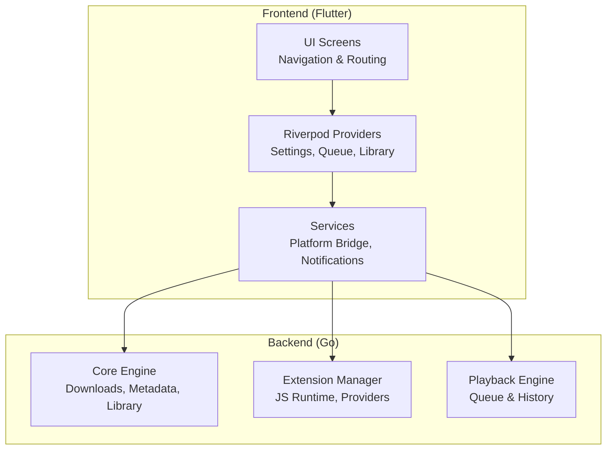
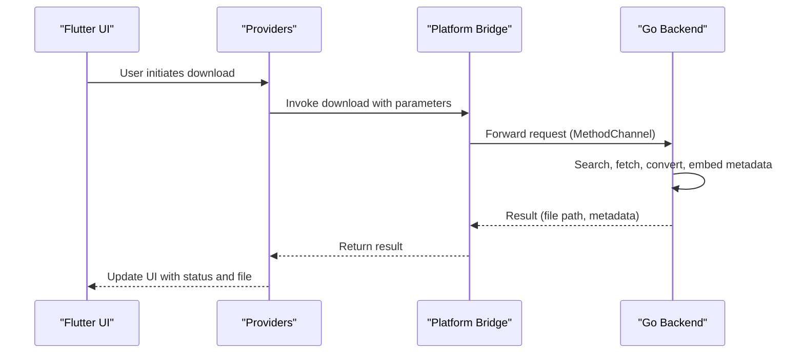
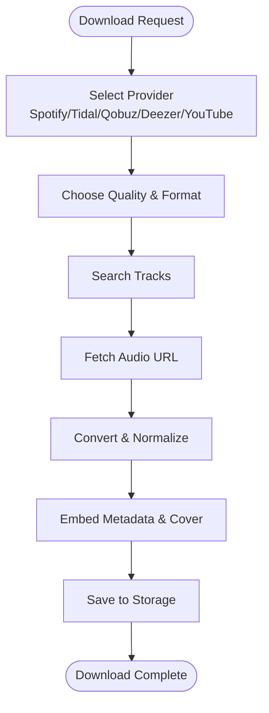
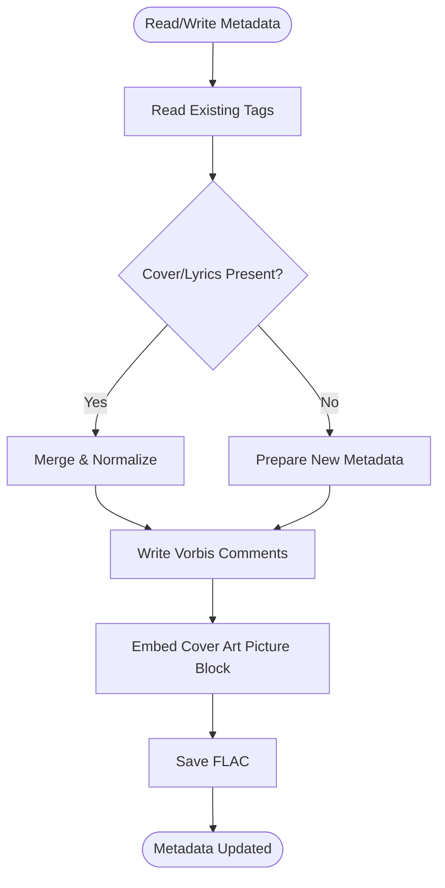
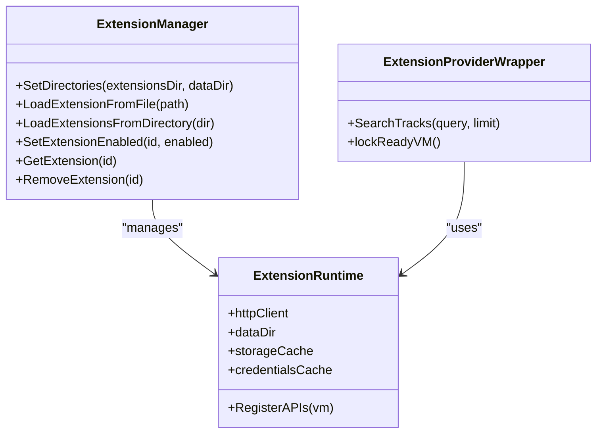
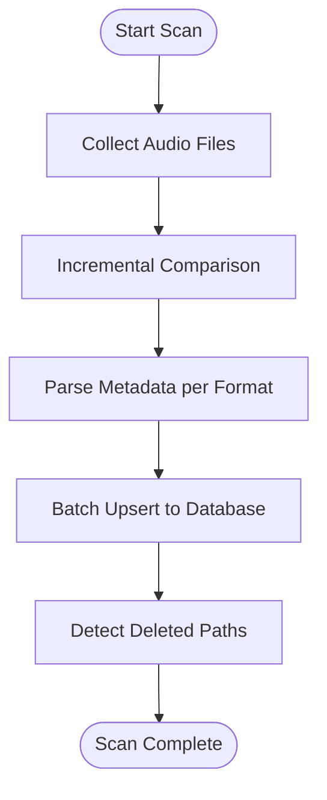
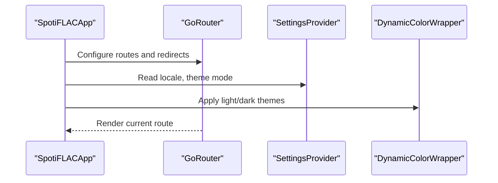
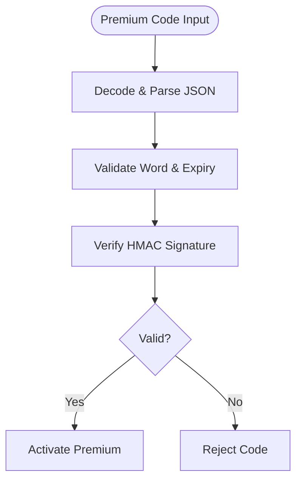
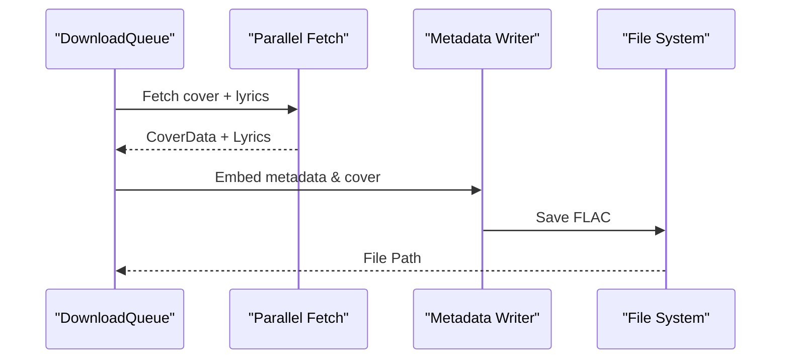
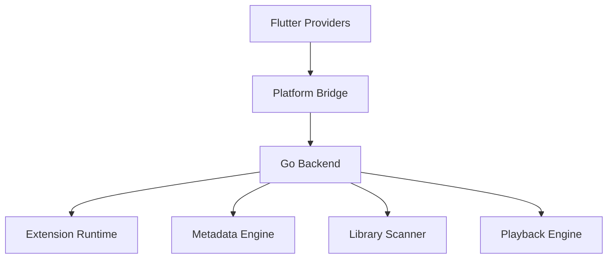

# Core Features Overview

<cite>
**Referenced Files in This Document**
- [README_FINAL.md](file://README_FINAL.md)
- [app.dart](file://lib/app.dart)
- [main.dart](file://lib/main.dart)
- [extension_manager.go](file://go_backend_spotiflac/extension_manager.go)
- [extension_runtime.go](file://go_backend_spotiflac/extension_runtime.go)
- [extension_providers.go](file://go_backend_spotiflac/extension_providers.go)
- [metadata.go](file://go_backend_spotiflac/metadata.go)
- [library_scan.go](file://go_backend_spotiflac/library_scan.go)
- [premium.go](file://go_backend_spotiflac/premium.go)
- [parallel.go](file://go_backend_spotiflac/parallel.go)
- [playback.go](file://go_backend_spotiflac/playback.go)
- [download_queue_provider.dart](file://lib/providers/download_queue_provider.dart)
- [settings_provider.dart](file://lib/providers/settings_provider.dart)
</cite>

## Table of Contents
1. [Introduction](#introduction)
2. [Project Structure](#project-structure)
3. [Core Components](#core-components)
4. [Architecture Overview](#architecture-overview)
5. [Detailed Component Analysis](#detailed-component-analysis)
6. [Dependency Analysis](#dependency-analysis)
7. [Performance Considerations](#performance-considerations)
8. [Troubleshooting Guide](#troubleshooting-guide)
9. [Conclusion](#conclusion)

## Introduction
This document presents the core features overview of Bitly, focusing on the primary functionality and capabilities. It covers the audio download system supporting multiple streaming platforms, metadata management, the extension system for custom audio providers, library management, user interface features, premium capabilities, batch processing, and queue management. Practical workflows and use cases are included to help users understand how these features work together.

## Project Structure
Bitly follows a clear separation between the frontend (Flutter/Dart) and the backend (Go). The frontend handles UI, routing, settings, and user interactions, while the backend manages downloads, metadata, library scanning, extensions, and playback. Communication occurs via a platform bridge and method channels.

**Diagram sources**
- [app.dart:13-52](file://lib/app.dart#L13-L52)
- [main.dart:22-44](file://lib/main.dart#L22-L44)
- [extension_manager.go:120-139](file://go_backend_spotiflac/extension_manager.go#L120-L139)
- [playback.go:41-71](file://go_backend_spotiflac/playback.go#L41-L71)

**Section sources**
- [README_FINAL.md:99-133](file://README_FINAL.md#L99-L133)
- [app.dart:13-52](file://lib/app.dart#L13-L52)
- [main.dart:22-44](file://lib/main.dart#L22-L44)

## Core Components
- Audio Download System: Supports multiple streaming platforms and integrates YouTube video downloads when configured.
- Metadata Management: Extracts cover art, lyrics, and embeds tags into audio files.
- Extension System: Provides a JavaScript runtime for custom audio providers and plugins.
- Library Management: Scans local libraries, detects duplicates, and maintains metadata.
- User Interface: Tabbed navigation, settings management, and theme support.
- Premium Features: Validation and verification of premium subscriptions.
- Batch Processing & Queue Management: Parallel fetching and playback queue orchestration.

**Section sources**
- [README_FINAL.md:136-158](file://README_FINAL.md#L136-L158)
- [metadata.go:104-129](file://go_backend_spotiflac/metadata.go#L104-L129)
- [extension_manager.go:120-139](file://go_backend_spotiflac/extension_manager.go#L120-L139)
- [library_scan.go:15-57](file://go_backend_spotiflac/library_scan.go#L15-L57)
- [app.dart:54-98](file://lib/app.dart#L54-L98)
- [premium.go:27-92](file://go_backend_spotiflac/premium.go#L27-L92)
- [parallel.go:35-85](file://go_backend_spotiflac/parallel.go#L35-L85)
- [playback.go:10-25](file://go_backend_spotiflac/playback.go#L10-L25)

## Architecture Overview
The system architecture separates concerns across frontend and backend layers. The Flutter app initializes providers, manages routing, and interacts with the Go backend through a platform bridge. The backend orchestrates downloads, metadata embedding, library scanning, extension loading, and playback.

**Diagram sources**
- [main.dart:22-44](file://lib/main.dart#L22-L44)
- [download_queue_provider.dart:1-50](file://lib/providers/download_queue_provider.dart#L1-L50)
- [README_FINAL.md:114-133](file://README_FINAL.md#L114-L133)

## Detailed Component Analysis

### Audio Download System
- Multi-platform support: Integrates with Spotify, Tidal, Qobuz, Deezer, and YouTube.
- Quality selection: Allows choosing formats and qualities during download.
- Format conversion: Converts outputs to desired formats (e.g., FLAC) and embeds metadata.
- YouTube integration: Uses yt-dlp for video search and download on both Android and Windows.

**Diagram sources**
- [extension_providers.go:19-51](file://go_backend_spotiflac/extension_providers.go#L19-L51)
- [parallel.go:35-85](file://go_backend_spotiflac/parallel.go#L35-L85)
- [README_FINAL.md:136-158](file://README_FINAL.md#L136-L158)

**Section sources**
- [extension_providers.go:19-51](file://go_backend_spotiflac/extension_providers.go#L19-L51)
- [parallel.go:35-85](file://go_backend_spotiflac/parallel.go#L35-L85)
- [README_FINAL.md:136-158](file://README_FINAL.md#L136-L158)

### Metadata Management System
- Cover art extraction and embedding: Detects MIME type, builds picture blocks, and writes to FLAC.
- Lyrics integration: Fetches lyrics from multiple sources and embeds synchronized lyrics.
- Tag embedding: Writes Vorbis comments and supports artist tag modes (joined vs. split).

**Diagram sources**
- [metadata.go:131-189](file://go_backend_spotiflac/metadata.go#L131-L189)
- [metadata.go:242-324](file://go_backend_spotiflac/metadata.go#L242-L324)
- [metadata.go:782-800](file://go_backend_spotiflac/metadata.go#L782-L800)

**Section sources**
- [metadata.go:104-129](file://go_backend_spotiflac/metadata.go#L104-L129)
- [metadata.go:131-189](file://go_backend_spotiflac/metadata.go#L131-L189)
- [metadata.go:242-324](file://go_backend_spotiflac/metadata.go#L242-L324)
- [metadata.go:782-800](file://go_backend_spotiflac/metadata.go#L782-L800)

### Extension System for Custom Audio Providers
- JavaScript runtime: Sandboxed JS execution with HTTP, storage, credentials, file, and FFmpeg APIs.
- Provider wrappers: Extendable provider model with capability declarations and replacement support.
- Lifecycle: Load, initialize with settings, enable/disable, and teardown with cleanup hooks.

**Diagram sources**
- [extension_manager.go:120-139](file://go_backend_spotiflac/extension_manager.go#L120-L139)
- [extension_runtime.go:84-112](file://go_backend_spotiflac/extension_runtime.go#L84-L112)
- [extension_providers.go:523-533](file://go_backend_spotiflac/extension_providers.go#L523-L533)

**Section sources**
- [extension_manager.go:120-139](file://go_backend_spotiflac/extension_manager.go#L120-L139)
- [extension_runtime.go:424-533](file://go_backend_spotiflac/extension_runtime.go#L424-L533)
- [extension_providers.go:523-533](file://go_backend_spotiflac/extension_providers.go#L523-L533)

### Library Management Features
- Local library scanning: Walks supported audio formats, incremental scans, and batch saves.
- Duplicate detection: Deduplicates by ISRC and name/artist pairs.
- Playlist support: Managed through collections and history databases.

**Diagram sources**
- [library_scan.go:90-130](file://go_backend_spotiflac/library_scan.go#L90-L130)
- [library_scan.go:186-325](file://go_backend_spotiflac/library_scan.go#L186-L325)
- [library_scan.go:646-662](file://go_backend_spotiflac/library_scan.go#L646-L662)

**Section sources**
- [library_scan.go:15-57](file://go_backend_spotiflac/library_scan.go#L15-L57)
- [library_scan.go:90-130](file://go_backend_spotiflac/library_scan.go#L90-L130)
- [library_scan.go:186-325](file://go_backend_spotiflac/library_scan.go#L186-L325)

### User Interface Features
- Tabbed navigation: Router-based navigation with setup and tutorial flows.
- Settings management: Comprehensive settings provider with migrations and synchronization to backend.
- Theme support: Dynamic color wrapper with theme mode and animation.

**Diagram sources**
- [app.dart:13-52](file://lib/app.dart#L13-L52)
- [app.dart:54-98](file://lib/app.dart#L54-L98)
- [settings_provider.dart:44-127](file://lib/providers/settings_provider.dart#L44-L127)

**Section sources**
- [app.dart:13-52](file://lib/app.dart#L13-L52)
- [app.dart:54-98](file://lib/app.dart#L54-L98)
- [settings_provider.dart:44-127](file://lib/providers/settings_provider.dart#L44-L127)

### Premium Features
- Code validation: Validates premium codes with HMAC signatures and expiry checks.
- Premium verification: Ensures active premium period and revocation handling.

**Diagram sources**
- [premium.go:27-92](file://go_backend_spotiflac/premium.go#L27-L92)
- [premium.go:112-126](file://go_backend_spotiflac/premium.go#L112-L126)

**Section sources**
- [premium.go:27-92](file://go_backend_spotiflac/premium.go#L27-L92)
- [premium.go:112-126](file://go_backend_spotiflac/premium.go#L112-L126)

### Batch Processing and Queue Management
- Parallel fetching: Downloads cover art and lyrics concurrently.
- Playback queue: Manages play/pause/seek, shuffle/repeat, and history.

**Diagram sources**
- [parallel.go:35-85](file://go_backend_spotiflac/parallel.go#L35-L85)
- [metadata.go:131-189](file://go_backend_spotiflac/metadata.go#L131-L189)

**Section sources**
- [parallel.go:35-85](file://go_backend_spotiflac/parallel.go#L35-L85)
- [metadata.go:131-189](file://go_backend_spotiflac/metadata.go#L131-L189)

## Dependency Analysis
The frontend depends on Riverpod for state management and platform bridges for backend communication. The backend exposes extension APIs and playback state to the frontend.

**Diagram sources**
- [main.dart:11-21](file://lib/main.dart#L11-L21)
- [extension_runtime.go:424-533](file://go_backend_spotiflac/extension_runtime.go#L424-L533)
- [playback.go:41-71](file://go_backend_spotiflac/playback.go#L41-L71)

**Section sources**
- [main.dart:11-21](file://lib/main.dart#L11-L21)
- [extension_runtime.go:424-533](file://go_backend_spotiflac/extension_runtime.go#L424-L533)
- [playback.go:41-71](file://go_backend_spotiflac/playback.go#L41-L71)

## Performance Considerations
- Image caching: Configurable memory cache sizes and overscroll effects for mobile devices.
- Incremental library scans: Skips unchanged files and batches database upserts.
- Concurrency: Parallel cover and lyrics fetching reduces latency.
- Sequential downloads: Optional forced sequential processing for stability.

**Section sources**
- [main.dart:76-82](file://lib/main.dart#L76-L82)
- [library_scan.go:227-280](file://go_backend_spotiflac/library_scan.go#L227-L280)
- [parallel.go:35-85](file://go_backend_spotiflac/parallel.go#L35-L85)
- [settings_provider.dart:461-465](file://lib/providers/settings_provider.dart#L461-L465)

## Troubleshooting Guide
- Premium validation failures: Check code format, word validity, and expiration.
- Extension load errors: Verify .spotiflac-ext packages, presence of manifest.json and index.js, and version comparisons.
- Library scan issues: Confirm supported formats, permissions, and cancellation handling.
- Playback queue anomalies: Validate repeat/shuffle states and queue indices.

**Section sources**
- [premium.go:27-92](file://go_backend_spotiflac/premium.go#L27-L92)
- [extension_manager.go:158-294](file://go_backend_spotiflac/extension_manager.go#L158-L294)
- [library_scan.go:138-162](file://go_backend_spotiflac/library_scan.go#L138-L162)
- [playback.go:74-172](file://go_backend_spotiflac/playback.go#L74-L172)

## Conclusion
Bitly delivers a robust audio ecosystem with multi-platform downloads, rich metadata management, a flexible extension system, comprehensive library scanning, and a polished UI with theme support. Premium features, batch processing, and queue management round out a powerful toolkit for audio enthusiasts and power users.