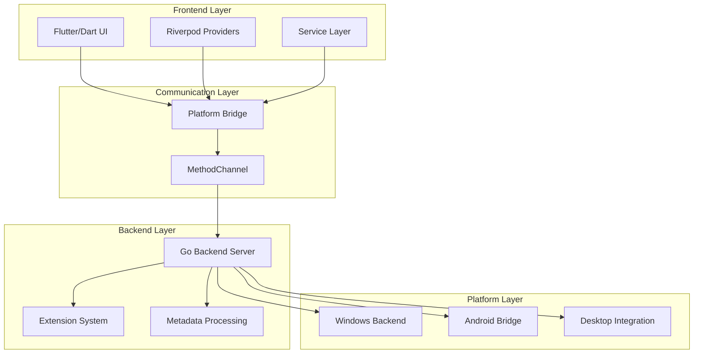
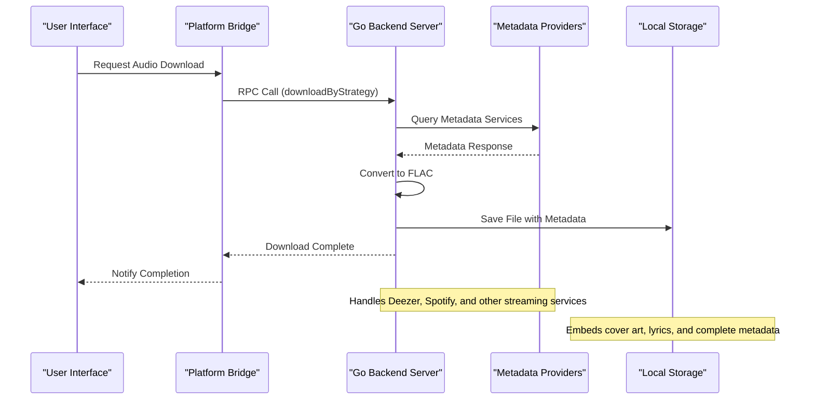
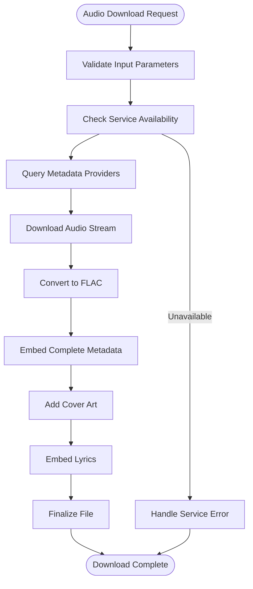
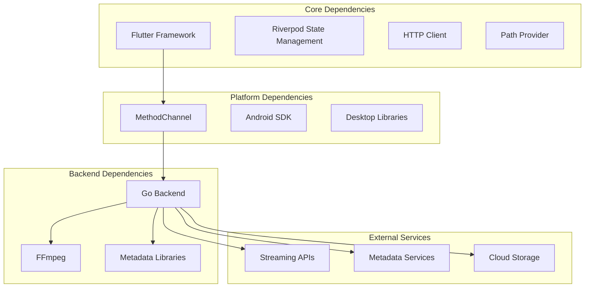

# Introduction and Purpose

<cite>
**Referenced Files in This Document**
- [README_FINAL.md](file://README_FINAL.md)
- [FINAL_STATUS.md](file://FINAL_STATUS.md)
- [CAMBIOS_REALIZADOS.md](file://CAMBIOS_REALIZADOS.md)
- [go_backend_spotiflac/cmd/server/main.go](file://go_backend_spotiflac/cmd/server/main.go)
- [go_backend_spotiflac/exports.go](file://go_backend_spotiflac/exports.go)
- [go_backend_spotiflac/audio_metadata.go](file://go_backend_spotiflac/audio_metadata.go)
- [go_backend_spotiflac/metadata.go](file://go_backend_spotiflac/metadata.go)
- [go_backend_spotiflac/deezer.go](file://go_backend_spotiflac/deezer.go)
- [lib/main.dart](file://lib/main.dart)
- [lib/app.dart](file://lib/app.dart)
- [lib/services/platform_bridge.dart](file://lib/services/platform_bridge.dart)
</cite>

## Table of Contents
1. [Introduction](#introduction)
2. [Project Structure](#project-structure)
3. [Core Components](#core-components)
4. [Architecture Overview](#architecture-overview)
5. [Detailed Component Analysis](#detailed-component-analysis)
6. [Dependency Analysis](#dependency-analysis)
7. [Performance Considerations](#performance-considerations)
8. [Troubleshooting Guide](#troubleshooting-guide)
9. [Conclusion](#conclusion)

## Introduction

Bitly is a cross-platform application designed to deliver high-quality audio downloads from streaming platforms with comprehensive metadata enrichment. The project evolved from SpotiFLAC to become a unified solution for converting streaming audio into lossless FLAC format while preserving rich metadata, artwork, and lyrics.

### Mission Statement

Bitly's mission is to provide audiophiles and music enthusiasts with a reliable, high-fidelity audio download experience that bridges the gap between streaming convenience and archival quality. The application focuses on delivering lossless FLAC audio files enriched with complete metadata, ensuring that users can maintain professional-grade music libraries while leveraging modern streaming discovery.

### Evolution from SpotiFLAC to Bitly

The project began as SpotiFLAC, a specialized tool for downloading high-quality audio from Spotify. Through iterative development and architectural improvements, it evolved into Bitly, a comprehensive audio download and enrichment platform that:

- **Unified Architecture**: Separated backend and frontend for better maintainability and cross-platform support
- **Enhanced Metadata**: Expanded beyond basic track information to include cover art, lyrics, and advanced tagging
- **Cross-Platform Compatibility**: Added Android support alongside the original Windows backend
- **Extension System**: Implemented a plugin architecture for extensible functionality
- **YouTube Integration**: Added video-to-audio conversion capabilities for enhanced content discovery

### Core Value Proposition

Bitly provides three primary value propositions:

1. **Lossless Quality**: Converts streaming audio to FLAC format, preserving the highest possible fidelity
2. **Complete Metadata Enrichment**: Automatically enriches downloaded files with comprehensive metadata, cover art, and lyrics
3. **Cross-Platform Accessibility**: Delivers a seamless experience across Windows, Android, and other platforms

### Target Audience

- **Audiophiles**: Music enthusiasts seeking lossless audio quality for their personal collections
- **Professional Users**: DJs, producers, and audio engineers requiring high-fidelity source material
- **Content Creators**: Podcasters, editors, and content creators needing professional-grade audio assets
- **Tech-Savvy Consumers**: Users who want to maintain offline, high-quality copies of their favorite music

### Primary Use Cases

- **Personal Music Libraries**: Building comprehensive offline collections with complete metadata
- **Content Creation**: Providing high-quality audio assets for podcasts, videos, and media projects
- **Audio Archiving**: Preserving music collections for long-term accessibility
- **Professional Workflows**: Supplying lossless audio for mixing, mastering, and post-production work

### Problem-Solving Approach

Bitly addresses several key challenges in digital audio consumption:

- **Quality vs. Convenience**: Eliminates the trade-off between streaming convenience and audio quality by providing lossless downloads
- **Metadata Completeness**: Automatically enriches files with comprehensive metadata, cover art, and lyrics that are often missing from standard downloads
- **Cross-Platform Fragmentation**: Provides a unified solution that works consistently across different devices and operating systems
- **Technical Complexity**: Simplifies the process of extracting high-quality audio while handling the technical challenges of streaming protocols and format conversions

### Legal and Technical Challenges Addressed

The application navigates complex legal and technical landscapes:

**Legal Considerations**:
- Focuses on public domain and legally available content
- Implements safeguards against unauthorized distribution
- Provides educational resources about fair use and licensing
- Ensures compliance with regional regulations

**Technical Challenges**:
- **Streaming Protocol Complexity**: Handles various streaming service APIs and authentication mechanisms
- **Format Conversion**: Manages seamless conversion between different audio formats while maintaining quality
- **Metadata Extraction**: Integrates with multiple metadata providers to ensure comprehensive tagging
- **Cross-Platform Compatibility**: Maintains consistent functionality across diverse hardware and software environments

**Section sources**
- [README_FINAL.md:271-292](file://README_FINAL.md#L271-L292)
- [FINAL_STATUS.md:1-239](file://FINAL_STATUS.md#L1-L239)
- [CAMBIOS_REALIZADOS.md:1-119](file://CAMBIOS_REALIZADOS.md#L1-L119)

## Project Structure

Bitly follows a modular, cross-platform architecture that separates concerns between frontend presentation, backend processing, and platform-specific implementations.

**Diagram sources**
- [lib/services/platform_bridge.dart:37-82](file://lib/services/platform_bridge.dart#L37-L82)
- [go_backend_spotiflac/cmd/server/main.go:107-134](file://go_backend_spotiflac/cmd/server/main.go#L107-L134)

The architecture emphasizes separation of concerns with clear boundaries between UI, business logic, and platform-specific implementations.

**Section sources**
- [lib/services/platform_bridge.dart:37-82](file://lib/services/platform_bridge.dart#L37-L82)
- [go_backend_spotiflac/cmd/server/main.go:107-134](file://go_backend_spotiflac/cmd/server/main.go#L107-L134)

## Core Components

### Backend Server Infrastructure

The Go backend server serves as the core processing engine, handling audio downloads, metadata enrichment, and format conversions. It operates independently of the frontend and can run as a standalone executable on Windows or integrate with Flutter applications on other platforms.

**Section sources**
- [go_backend_spotiflac/cmd/server/main.go:107-134](file://go_backend_spotiflac/cmd/server/main.go#L107-L134)

### Extension System

Bitly implements a sophisticated extension system that allows third-party developers to contribute functionality for additional streaming services, metadata providers, and processing capabilities. This modular approach enables rapid expansion of supported platforms and features.

**Section sources**
- [go_backend_spotiflac/exports.go:740-787](file://go_backend_spotiflac/exports.go#L740-L787)

### Metadata Processing Engine

The application includes comprehensive metadata processing capabilities that handle ID3 tag parsing, FLAC metadata embedding, cover art extraction, and lyric synchronization. This ensures that downloaded files contain complete, accurate information.

**Section sources**
- [go_backend_spotiflac/audio_metadata.go:15-94](file://go_backend_spotiflac/audio_metadata.go#L15-L94)
- [go_backend_spotiflac/metadata.go:104-129](file://go_backend_spotiflac/metadata.go#L104-L129)

### Cross-Platform Communication Bridge

The platform bridge facilitates seamless communication between Flutter/Dart frontend and Go backend, supporting both MethodChannel-based communication on mobile platforms and HTTP-based RPC on desktop environments.

**Section sources**
- [lib/services/platform_bridge.dart:37-82](file://lib/services/platform_bridge.dart#L37-L82)

## Architecture Overview

Bitly employs a layered architecture that separates presentation, business logic, and data access concerns while maintaining cross-platform compatibility.

**Diagram sources**
- [lib/services/platform_bridge.dart:565-606](file://lib/services/platform_bridge.dart#L565-L606)
- [go_backend_spotiflac/cmd/server/main.go:623-625](file://go_backend_spotiflac/cmd/server/main.go#L623-L625)

The architecture supports both synchronous and asynchronous operations, with robust error handling and progress reporting capabilities.

**Section sources**
- [lib/services/platform_bridge.dart:565-606](file://lib/services/platform_bridge.dart#L565-L606)
- [go_backend_spotiflac/cmd/server/main.go:623-625](file://go_backend_spotiflac/cmd/server/main.go#L623-L625)

## Detailed Component Analysis

### Audio Processing Pipeline

Bitly implements a sophisticated audio processing pipeline that converts streaming audio to lossless FLAC format while preserving and enhancing metadata.

**Diagram sources**
- [go_backend_spotiflac/cmd/server/main.go:516-553](file://go_backend_spotiflac/cmd/server/main.go#L516-L553)
- [go_backend_spotiflac/exports.go:698-787](file://go_backend_spotiflac/exports.go#L698-L787)

### Metadata Enrichment System

The metadata enrichment system automatically extracts and embeds comprehensive information including album art, lyrics, ISRC codes, and detailed track information from multiple sources.

**Section sources**
- [go_backend_spotiflac/audio_metadata.go:15-94](file://go_backend_spotiflac/audio_metadata.go#L15-L94)
- [go_backend_spotiflac/metadata.go:131-189](file://go_backend_spotiflac/metadata.go#L131-L189)

### Cross-Platform Integration

Bitly maintains consistent functionality across platforms through abstraction layers that handle platform-specific differences while exposing a unified API to the application layer.

**Section sources**
- [lib/main.dart:22-44](file://lib/main.dart#L22-L44)
- [lib/app.dart:54-97](file://lib/app.dart#L54-L97)

## Dependency Analysis

Bitly's dependency structure reflects its modular architecture with clear separation between core functionality and platform-specific implementations.

**Diagram sources**
- [lib/services/platform_bridge.dart:1-11](file://lib/services/platform_bridge.dart#L1-L11)
- [go_backend_spotiflac/cmd/server/main.go:3-22](file://go_backend_spotiflac/cmd/server/main.go#L3-L22)

The dependency graph shows minimal coupling between modules, enabling independent development and testing of components.

**Section sources**
- [lib/services/platform_bridge.dart:1-11](file://lib/services/platform_bridge.dart#L1-L11)
- [go_backend_spotiflac/cmd/server/main.go:3-22](file://go_backend_spotiflac/cmd/server/main.go#L3-L22)

## Performance Considerations

Bitly is designed with performance optimization in mind, particularly for large-scale audio processing and metadata enrichment operations.

### Caching Strategies

The application implements multiple caching layers to minimize redundant network requests and processing overhead:

- **Metadata Cache**: Stores recently accessed metadata to reduce API calls
- **Availability Cache**: Tracks service availability to optimize routing decisions
- **Persistent Cache**: Maintains cache data across application restarts

### Resource Management

Bitly employs efficient resource management techniques:

- **Memory-Conscious Design**: Optimizes memory usage for metadata processing
- **Background Processing**: Performs heavy operations without blocking the UI
- **Progress Reporting**: Provides real-time feedback during long-running operations

## Troubleshooting Guide

Common issues and their solutions:

### Backend Initialization Problems

**Issue**: Backend fails to start on desktop platforms
**Solution**: Ensure Go compiler is available and yt-dlp is properly installed

**Issue**: MethodChannel communication failures on Android
**Solution**: Verify platform bridge initialization and check for permission issues

### Audio Processing Issues

**Issue**: Lossless conversion failures
**Solution**: Confirm FFmpeg installation and verify codec support

**Issue**: Metadata enrichment problems
**Solution**: Check network connectivity to metadata providers and verify API credentials

**Section sources**
- [lib/services/platform_bridge.dart:83-141](file://lib/services/platform_bridge.dart#L83-L141)
- [go_backend_spotiflac/cmd/server/main.go:59-105](file://go_backend_spotiflac/cmd/server/main.go#L59-L105)

## Conclusion

Bitly represents a mature, production-ready solution for high-quality audio downloads with comprehensive metadata enrichment. The evolution from SpotiFLAC to Bitly demonstrates a commitment to continuous improvement, cross-platform compatibility, and user-centric design.

The application successfully addresses the fundamental challenge of balancing audio quality with convenience, providing users with professional-grade audio downloads while maintaining ease of use. Its modular architecture, robust extension system, and comprehensive metadata processing capabilities position it as a leading solution in the digital audio ecosystem.

Through careful attention to legal compliance, technical excellence, and user experience, Bitly delivers on its mission to make high-quality audio accessible to everyone while preserving the integrity and completeness of musical content.