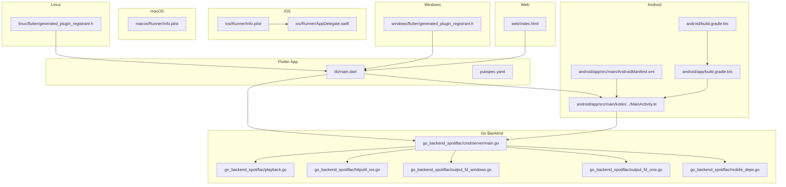
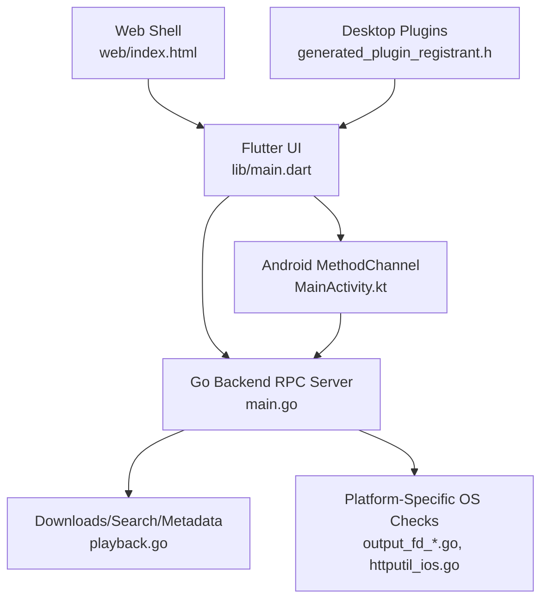
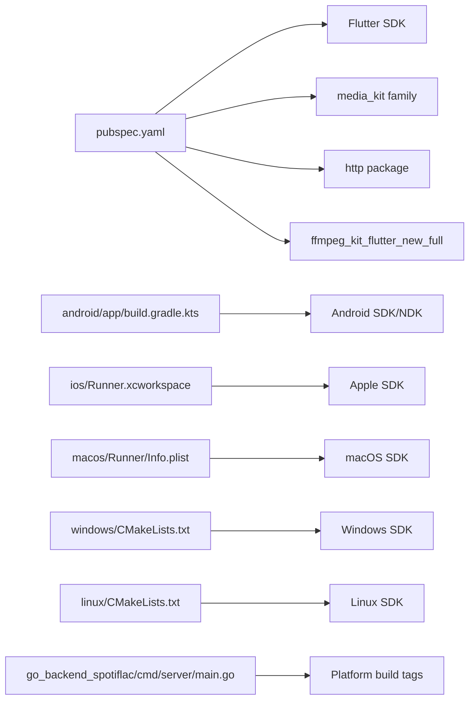

# Platform Support Matrix

<cite>
**Referenced Files in This Document**
- [AndroidManifest.xml](file://android/app/src/main/AndroidManifest.xml)
- [MainActivity.kt](file://android/app/src/main/kotlin/com/example/bitly/MainActivity.kt)
- [build.gradle.kts (Android app)](file://android/app/build.gradle.kts)
- [build.gradle.kts (Android root)](file://android/build.gradle.kts)
- [Info.plist (iOS)](file://ios/Runner/Info.plist)
- [AppDelegate.swift](file://ios/Runner/AppDelegate.swift)
- [Info.plist (macOS)](file://macos/Runner/Info.plist)
- [generated_plugin_registrant.h (Linux)](file://linux/flutter/generated_plugin_registrant.h)
- [generated_plugin_registrant.h (Windows)](file://windows/flutter/generated_plugin_registrant.h)
- [index.html (Web)](file://web/index.html)
- [pubspec.yaml](file://pubspec.yaml)
- [main.dart](file://lib/main.dart)
- [main.go (Go backend server)](file://go_backend_spotiflac/cmd/server/main.go)
- [playback.go (Go backend)](file://go_backend_spotiflac/playback.go)
- [httputil_ios.go (Go backend)](file://go_backend_spotiflac/httputil_ios.go)
- [output_fd_windows.go (Go backend)](file://go_backend_spotiflac/output_fd_windows.go)
- [output_fd_unix.go (Go backend)](file://go_backend_spotiflac/output_fd_unix.go)
- [mobile_deps.go (Go backend)](file://go_backend_spotiflac/mobile_deps.go)
</cite>

## Table of Contents
1. [Introduction](#introduction)
2. [Project Structure](#project-structure)
3. [Core Components](#core-components)
4. [Architecture Overview](#architecture-overview)
5. [Detailed Component Analysis](#detailed-component-analysis)
6. [Dependency Analysis](#dependency-analysis)
7. [Performance Considerations](#performance-considerations)
8. [Troubleshooting Guide](#troubleshooting-guide)
9. [Conclusion](#conclusion)
10. [Appendices](#appendices)

## Introduction
This document provides a comprehensive platform support matrix for Bitly across Android, iOS, Windows, macOS, Linux, and Web. It explains platform-specific features, capabilities, limitations, build configurations, deployment targets, native integrations, permissions, and functional differences—particularly around audio processing, background operations, and system integration. It also covers platform-specific build processes, distribution channels, and testing guidance.

## Project Structure
Bitly is a Flutter application with a shared Dart frontend and a Go-based native backend. Platform-specific code and configurations are organized under platform folders:
- Android: Gradle build, Kotlin activity, AndroidManifest, and native plugin channel wiring
- iOS: Xcode workspace, Info.plist, and AppDelegate
- macOS: Xcode workspace, Info.plist, entitlements, and main window
- Linux: CMake-based runner and plugin registrant
- Windows: CMake-based runner, plugin registrant, and Win32 window
- Web: Static HTML shell and PWA manifest
- Go backend: Cross-platform server with platform-specific build tags and OS checks

**Diagram sources**
- [main.dart](file://lib/main.dart)
- [pubspec.yaml](file://pubspec.yaml)
- [AndroidManifest.xml](file://android/app/src/main/AndroidManifest.xml)
- [MainActivity.kt](file://android/app/src/main/kotlin/com/example/bitly/MainActivity.kt)
- [build.gradle.kts (Android app)](file://android/app/build.gradle.kts)
- [build.gradle.kts (Android root)](file://android/build.gradle.kts)
- [Info.plist (iOS)](file://ios/Runner/Info.plist)
- [AppDelegate.swift](file://ios/Runner/AppDelegate.swift)
- [Info.plist (macOS)](file://macos/Runner/Info.plist)
- [generated_plugin_registrant.h (Linux)](file://linux/flutter/generated_plugin_registrant.h)
- [generated_plugin_registrant.h (Windows)](file://windows/flutter/generated_plugin_registrant.h)
- [index.html (Web)](file://web/index.html)
- [main.go (Go backend server)](file://go_backend_spotiflac/cmd/server/main.go)
- [playback.go (Go backend)](file://go_backend_spotiflac/playback.go)
- [httputil_ios.go (Go backend)](file://go_backend_spotiflac/httputil_ios.go)
- [output_fd_windows.go (Go backend)](file://go_backend_spotiflac/output_fd_windows.go)
- [output_fd_unix.go (Go backend)](file://go_backend_spotiflac/output_fd_unix.go)
- [mobile_deps.go (Go backend)](file://go_backend_spotiflac/mobile_deps.go)

**Section sources**
- [main.dart:22-44](file://lib/main.dart#L22-L44)
- [pubspec.yaml:1-108](file://pubspec.yaml#L1-L108)
- [AndroidManifest.xml:1-48](file://android/app/src/main/AndroidManifest.xml#L1-L48)
- [MainActivity.kt:15-133](file://android/app/src/main/kotlin/com/example/bitly/MainActivity.kt#L15-L133)
- [build.gradle.kts (Android app):1-55](file://android/app/build.gradle.kts#L1-L55)
- [build.gradle.kts (Android root):1-65](file://android/build.gradle.kts#L1-L65)
- [Info.plist (iOS):1-50](file://ios/Runner/Info.plist#L1-L50)
- [AppDelegate.swift:1-14](file://ios/Runner/AppDelegate.swift#L1-L14)
- [Info.plist (macOS):1-33](file://macos/Runner/Info.plist#L1-L33)
- [generated_plugin_registrant.h (Linux):1-16](file://linux/flutter/generated_plugin_registrant.h#L1-L16)
- [generated_plugin_registrant.h (Windows):1-16](file://windows/flutter/generated_plugin_registrant.h#L1-L16)
- [index.html (Web):1-39](file://web/index.html#L1-L39)
- [main.go (Go backend server):107-134](file://go_backend_spotiflac/cmd/server/main.go#L107-L134)
- [playback.go (Go backend):1-443](file://go_backend_spotiflac/playback.go#L1-L443)
- [httputil_ios.go (Go backend):1-21](file://go_backend_spotiflac/httputil_ios.go#L1-L21)
- [output_fd_windows.go (Go backend):1-12](file://go_backend_spotiflac/output_fd_windows.go#L1-L12)
- [output_fd_unix.go (Go backend):1-14](file://go_backend_spotiflac/output_fd_unix.go#L1-L14)
- [mobile_deps.go (Go backend):1-8](file://go_backend_spotiflac/mobile_deps.go#L1-L8)

## Core Components
- Flutter entrypoint initializes platform-specific subsystems and desktop backend, sets up media playback, and configures image caching.
- Android integrates a MethodChannel to communicate with the Go backend for downloads, metadata, extension management, and storage access via SAF.
- Go backend exposes an HTTP RPC server for search, playback session management, downloads, and post-processing; includes platform-specific build tags and OS checks.

Key platform-specific initialization highlights:
- Desktop (non-Android/iOS): Initializes SQLite FFI and desktop backend bridge.
- Android: Uses SAF for folder selection and delegates backend operations via MethodChannel.
- iOS/macOS: Uses shared HTTP client with Cloudflare bypass logic; macOS sets minimum deployment target.
- Web: Serves static HTML with PWA manifest and bootstrapping script.
- Windows/Linux: Plugin registrants generated by Flutter; Windows runner includes Win32 window utilities.

**Section sources**
- [main.dart:22-44](file://lib/main.dart#L22-L44)
- [MainActivity.kt:23-133](file://android/app/src/main/kotlin/com/example/bitly/MainActivity.kt#L23-L133)
- [main.go (Go backend server):107-134](file://go_backend_spotiflac/cmd/server/main.go#L107-L134)
- [httputil_ios.go (Go backend):9-20](file://go_backend_spotiflac/httputil_ios.go#L9-L20)
- [Info.plist (macOS):23-24](file://macos/Runner/Info.plist#L23-L24)

## Architecture Overview
The app uses a hybrid architecture:
- Flutter UI handles navigation, state, and platform bridges
- Android/iOS delegate to native code via MethodChannel/bridges
- Go backend runs as a local HTTP server with RPC endpoints for downloads, metadata, and playback orchestration
- Platform-specific build tags and OS checks adapt behavior (e.g., FFmpeg auto-install on Windows, Cloudflare bypass on iOS)

**Diagram sources**
- [main.dart:22-44](file://lib/main.dart#L22-L44)
- [MainActivity.kt:23-133](file://android/app/src/main/kotlin/com/example/bitly/MainActivity.kt#L23-L133)
- [main.go (Go backend server):107-134](file://go_backend_spotiflac/cmd/server/main.go#L107-L134)
- [playback.go (Go backend):1-443](file://go_backend_spotiflac/playback.go#L1-L443)
- [httputil_ios.go (Go backend):1-21](file://go_backend_spotiflac/httputil_ios.go#L1-L21)
- [output_fd_windows.go (Go backend):1-12](file://go_backend_spotiflac/output_fd_windows.go#L1-L12)
- [output_fd_unix.go (Go backend):1-14](file://go_backend_spotiflac/output_fd_unix.go#L1-L14)
- [generated_plugin_registrant.h (Linux):1-16](file://linux/flutter/generated_plugin_registrant.h#L1-L16)
- [generated_plugin_registrant.h (Windows):1-16](file://windows/flutter/generated_plugin_registrant.h#L1-L16)
- [index.html (Web):1-39](file://web/index.html#L1-L39)

## Detailed Component Analysis

### Android
- Build configuration:
  - Kotlin and Flutter Gradle plugins applied; Java 17 compatibility enforced globally; minSdk/targetSdk aligned with Flutter defaults; release signing uses debug config for convenience.
  - Desugaring enabled; spotiflac.aar included as a local AAR dependency.
- Manifest and permissions:
  - Activity exported with singleTop launch mode; hardware acceleration enabled; normal theme metadata; queries for PROCESS_TEXT intent.
- Native integration:
  - MainActivity registers a MethodChannel to expose backend RPC methods (database, settings, extensions, search, YouTube, history, lyrics, SAF picker, availability checks).
  - SAF folder picker implemented with persisted URI permissions and display name retrieval.
  - YouTube search/download delegated to a native service class wired in the channel handler.

Platform-specific capabilities and limitations:
- Storage access via SAF for scoped access on modern Android versions.
- Background operations constrained by Android lifecycle; long-running tasks executed on a single-thread executor.
- Audio processing handled by the Go backend; Flutter UI streams via media players.

Build and deployment:
- Standard Gradle assemble/bundle tasks; release signing configured in Gradle; AAR bundled locally.

Testing:
- Instrumentation tests for native channel handlers and SAF picker flow; emulator/device testing recommended for storage and network scenarios.

**Section sources**
- [build.gradle.kts (Android app):1-55](file://android/app/build.gradle.kts#L1-L55)
- [build.gradle.kts (Android root):1-65](file://android/build.gradle.kts#L1-L65)
- [AndroidManifest.xml:1-48](file://android/app/src/main/AndroidManifest.xml#L1-L48)
- [MainActivity.kt:15-133](file://android/app/src/main/kotlin/com/example/bitly/MainActivity.kt#L15-L133)
- [MainActivity.kt:175-218](file://android/app/src/main/kotlin/com/example/bitly/MainActivity.kt#L175-L218)

### iOS
- Configuration:
  - Info.plist defines bundle identifiers, supported orientations, and UI features; disables minimum frame duration on iPhone for smoother animations; supports indirect input events.
- Native integration:
  - AppDelegate registers plugins; HTTP client uses a shared client with Cloudflare bypass logic and UA rotation.
- Capabilities and limitations:
  - Cloudflare bypass via shared HTTP client; background execution policies governed by iOS; AVAudio/AVPlayer integration via media_kit.
- Build and deployment:
  - Xcode workspace; Flutter builds integrate via cocoapods; distribution via TestFlight/App Store.

**Section sources**
- [Info.plist (iOS):1-50](file://ios/Runner/Info.plist#L1-L50)
- [AppDelegate.swift:1-14](file://ios/Runner/AppDelegate.swift#L1-L14)
- [httputil_ios.go:9-20](file://go_backend_spotiflac/httputil_ios.go#L9-L20)

### macOS
- Configuration:
  - Info.plist sets minimum deployment target using MACOSX_DEPLOYMENT_TARGET; main nib/class configured.
- Capabilities and limitations:
  - Desktop environment allows broader filesystem access; background tasks managed via standard concurrency; media playback via media_kit.
- Build and deployment:
  - Xcode workspace; Flutter macOS runner; distribution via installer or App Store.

**Section sources**
- [Info.plist (macOS):23-24](file://macos/Runner/Info.plist#L23-L24)

### Windows
- Configuration:
  - Plugin registrant header generated by Flutter; Win32 window utilities present; desktop runner configured.
- Capabilities and limitations:
  - FFmpeg auto-installation triggered on startup; file descriptor handling differs from Unix; desktop environment enables robust file IO.
- Build and deployment:
  - CMake-based runner; Windows packaging/distribution via installers.

**Section sources**
- [generated_plugin_registrant.h (Windows):1-16](file://windows/flutter/generated_plugin_registrant.h#L1-L16)
- [main.go (Go backend server):115-122](file://go_backend_spotiflac/cmd/server/main.go#L115-L122)
- [output_fd_windows.go:1-12](file://go_backend_spotiflac/output_fd_windows.go#L1-L12)

### Linux
- Configuration:
  - Plugin registrant header generated by Flutter; desktop runner configured.
- Capabilities and limitations:
  - Desktop environment similar to macOS; media playback via media_kit; file IO via standard paths.
- Build and deployment:
  - CMake-based runner; Linux packaging/distribution via distro-specific formats.

**Section sources**
- [generated_plugin_registrant.h (Linux):1-16](file://linux/flutter/generated_plugin_registrant.h#L1-L16)

### Web
- Configuration:
  - index.html serves as the bootstrapper; includes PWA manifest; base href placeholder for Flutter build.
- Capabilities and limitations:
  - Browser sandbox; limited filesystem access; media playback via media_kit_web; offline caching via service worker if configured.
- Build and deployment:
  - Flutter web build; host on static server or CDN; PWA installation supported.

**Section sources**
- [index.html (Web):1-39](file://web/index.html#L1-L39)

### Go Backend (Cross-Platform)
- Responsibilities:
  - HTTP RPC server exposing methods for downloads, metadata, lyrics, extension management, playback state, and post-processing.
  - Playback state machine with queue/history management and repeat/shuffle controls.
  - Platform-specific behaviors via build tags and OS checks (FFmpeg on Windows, Cloudflare bypass on iOS).
- Key endpoints:
  - Play session creation/status and audio serving
  - Download orchestration and progress tracking
  - Metadata enrichment and cover extraction
  - Extension system initialization and management
- Platform-specific code:
  - FFmpeg auto-install on Windows startup
  - Cloudflare bypass client on iOS
  - File descriptor handling differences between Windows and Unix-like systems
  - Mobile deps placeholder for gomobile bindings

**Section sources**
- [main.go (Go backend server):107-134](file://go_backend_spotiflac/cmd/server/main.go#L107-L134)
- [main.go (Go backend server):555-800](file://go_backend_spotiflac/cmd/server/main.go#L555-L800)
- [playback.go (Go backend):1-443](file://go_backend_spotiflac/playback.go#L1-L443)
- [httputil_ios.go (Go backend):1-21](file://go_backend_spotiflac/httputil_ios.go#L1-L21)
- [output_fd_windows.go (Go backend):1-12](file://go_backend_spotiflac/output_fd_windows.go#L1-L12)
- [output_fd_unix.go (Go backend):1-14](file://go_backend_spotiflac/output_fd_unix.go#L1-L14)
- [mobile_deps.go (Go backend):1-8](file://go_backend_spotiflac/mobile_deps.go#L1-L8)

## Dependency Analysis
- Flutter dependencies include Riverpod, media_kit, http, connectivity_plus, FFmpeg kit, and others for UI, networking, media, and persistence.
- Android depends on spotiflac.aar and desugaring; iOS/macOS rely on Xcode toolchains; Windows/Linux depend on CMake and plugin registries.
- Go backend integrates with platform-specific OS features and uses build tags to tailor behavior.

**Diagram sources**
- [pubspec.yaml:9-62](file://pubspec.yaml#L9-L62)
- [build.gradle.kts (Android app):1-55](file://android/app/build.gradle.kts#L1-L55)
- [Info.plist (iOS):1-50](file://ios/Runner/Info.plist#L1-L50)
- [Info.plist (macOS):1-33](file://macos/Runner/Info.plist#L1-L33)
- [generated_plugin_registrant.h (Windows):1-16](file://windows/flutter/generated_plugin_registrant.h#L1-L16)
- [generated_plugin_registrant.h (Linux):1-16](file://linux/flutter/generated_plugin_registrant.h#L1-L16)
- [main.go (Go backend server):107-134](file://go_backend_spotiflac/cmd/server/main.go#L107-L134)

**Section sources**
- [pubspec.yaml:9-62](file://pubspec.yaml#L9-L62)
- [build.gradle.kts (Android app):1-55](file://android/app/build.gradle.kts#L1-L55)
- [Info.plist (iOS):1-50](file://ios/Runner/Info.plist#L1-L50)
- [Info.plist (macOS):1-33](file://macos/Runner/Info.plist#L1-L33)
- [generated_plugin_registrant.h (Windows):1-16](file://windows/flutter/generated_plugin_registrant.h#L1-L16)
- [generated_plugin_registrant.h (Linux):1-16](file://linux/flutter/generated_plugin_registrant.h#L1-L16)
- [main.go (Go backend server):107-134](file://go_backend_spotiflac/cmd/server/main.go#L107-L134)

## Performance Considerations
- Image caching: Runtime profile adjusts image cache size and bytes on Android low-memory or 32-bit devices to reduce memory pressure.
- Media playback: media_kit provides efficient decoding; ensure appropriate quality settings and pre-buffering on slower networks.
- Background tasks: Android/iOS enforce strict background execution limits; offload heavy work to the Go backend and use platform notifications sparingly.
- Disk IO: Windows/Linux/macOS have broader filesystem access; avoid blocking UI threads; use background isolates for scanning and conversions.
- Network: iOS Cloudflare bypass improves reliability; consider connection pooling and retries.

**Section sources**
- [main.dart:46-94](file://lib/main.dart#L46-L94)
- [pubspec.yaml:63-67](file://pubspec.yaml#L63-L67)

## Troubleshooting Guide
- Android SAF picker:
  - Ensure persisted URI permissions and display name retrieval succeed; handle user cancellation gracefully.
- iOS HTTP requests:
  - Verify Cloudflare bypass client and UA rotation; check for ISP blocking logs.
- Windows FFmpeg:
  - Confirm auto-install succeeds; fallback to system PATH or local binary; validate extraction and cleanup.
- Playback state:
  - Monitor queue/history transitions and repeat/shuffle modes; ensure thread-safe updates.
- Desktop SQLite:
  - On non-Android/iOS, FFI initialization is required; confirm database factory is switched before use.

**Section sources**
- [MainActivity.kt:175-218](file://android/app/src/main/kotlin/com/example/bitly/MainActivity.kt#L175-L218)
- [httputil_ios.go (Go backend):9-20](file://go_backend_spotiflac/httputil_ios.go#L9-L20)
- [main.go (Go backend server):59-105](file://go_backend_spotiflac/cmd/server/main.go#L59-L105)
- [playback.go (Go backend):74-172](file://go_backend_spotiflac/playback.go#L74-L172)
- [main.dart:26-30](file://lib/main.dart#L26-L30)

## Conclusion
Bitly delivers a cohesive cross-platform experience leveraging Flutter for UI and a Go backend for robust audio processing, downloads, and metadata operations. Platform-specific adaptations include Android’s SAF integration, iOS Cloudflare bypass, Windows FFmpeg auto-install, and desktop plugin registries. The architecture balances performance and reliability across Android, iOS, Windows, macOS, Linux, and Web, with clear separation of concerns and platform-aware behaviors.

## Appendices

### Platform Feature Comparison Summary
- Android: SAF storage, MethodChannel RPC, background task constraints, media playback via media_kit
- iOS: Cloudflare bypass, AVPlayer integration, background execution policies, orientation support
- macOS: Desktop filesystem access, media_kit, deployment target configuration
- Windows: FFmpeg auto-install, Win32 window utilities, file descriptor handling differences
- Linux: Desktop filesystem access, media_kit, CMake-based runner
- Web: Static bootstrap, PWA manifest, browser media playback, limited filesystem

### Build and Distribution Notes
- Android: Gradle assemble/bundle; AAR included; release signing configured
- iOS: Xcode workspace; TestFlight/App Store distribution
- macOS: Xcode workspace; installer or App Store distribution
- Windows: CMake runner; installer packaging
- Linux: CMake runner; distro-specific packaging
- Web: Flutter web build; static hosting or CDN

[No sources needed since this section summarizes without analyzing specific files]