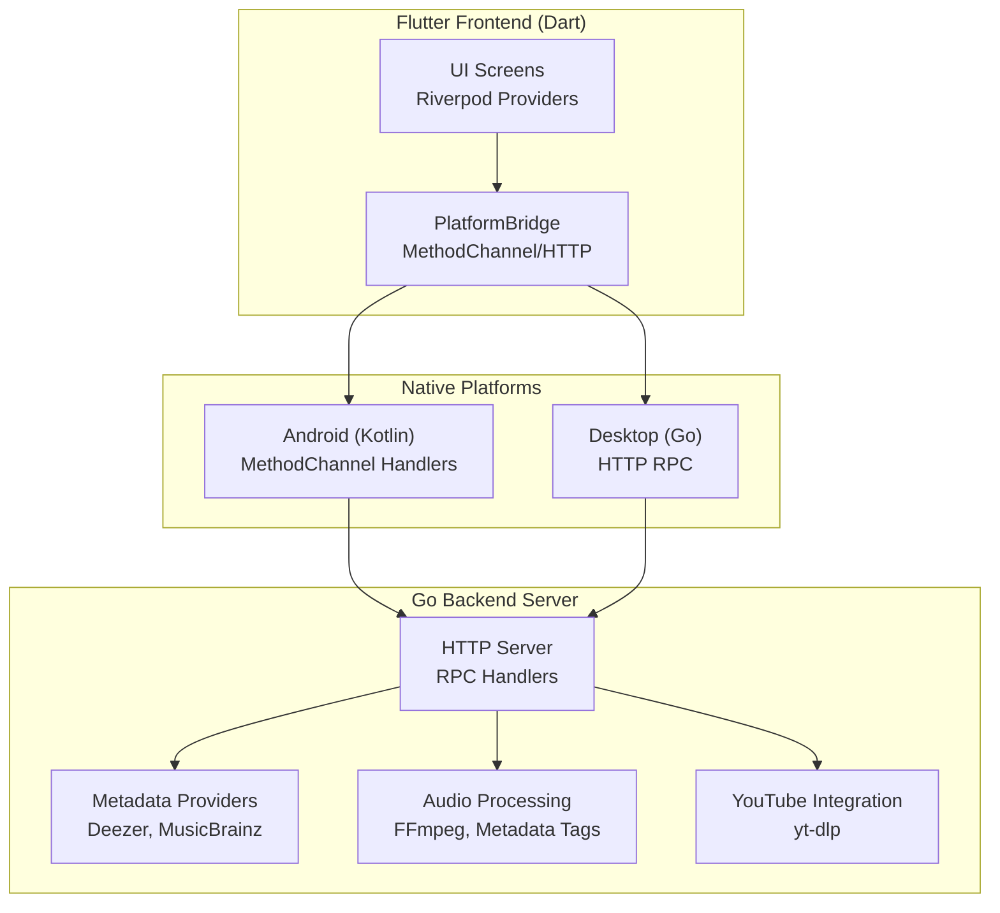
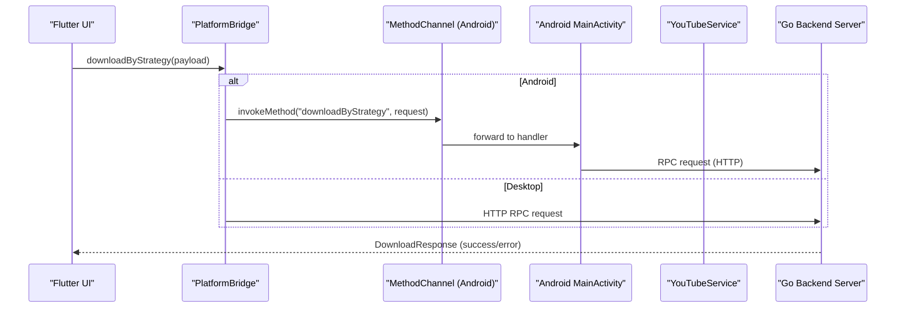
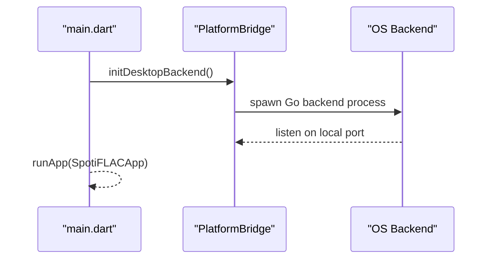
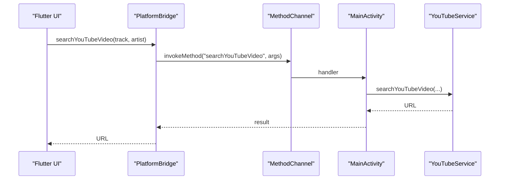
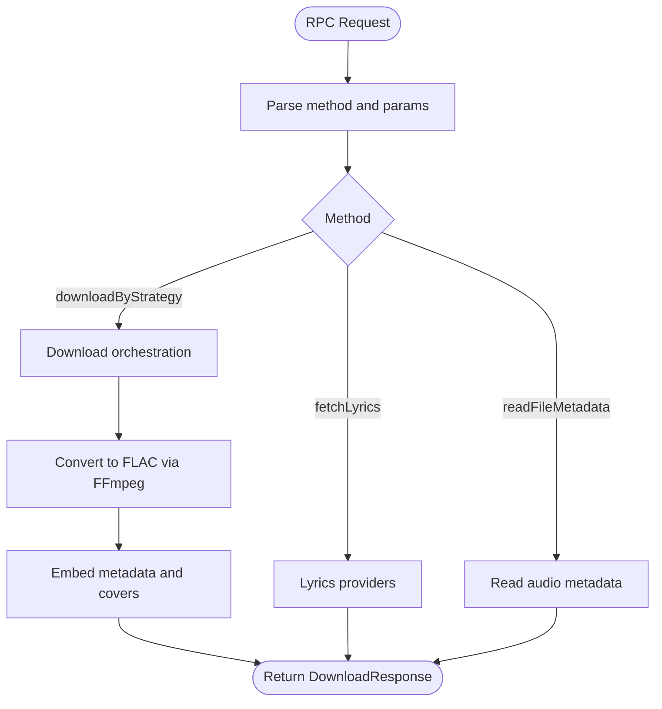
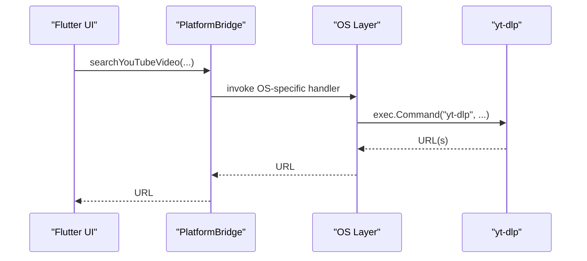
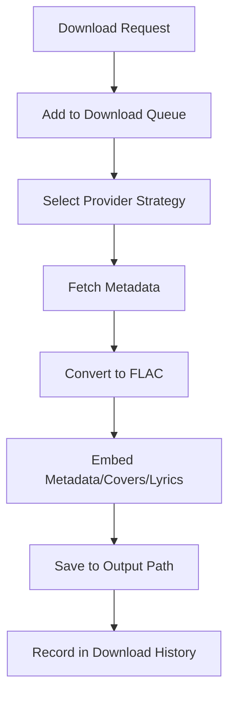
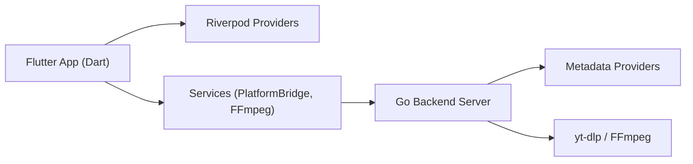

# Project Overview

<cite>
**Referenced Files in This Document**
- [README_FINAL.md](file://README_FINAL.md)
- [pubspec.yaml](file://pubspec.yaml)
- [lib/main.dart](file://lib/main.dart)
- [lib/services/platform_bridge.dart](file://lib/services/platform_bridge.dart)
- [android/app/src/main/kotlin/com/example/bitly/MainActivity.kt](file://android/app/src/main/kotlin/com/example/bitly/MainActivity.kt)
- [android/app/src/main/kotlin/com/example/bitly/YouTubeService.kt](file://android/app/src/main/kotlin/com/example/bitly/YouTubeService.kt)
- [go_backend_spotiflac/cmd/server/main.go](file://go_backend_spotiflac/cmd/server/main.go)
- [go_backend_spotiflac/exports.go](file://go_backend_spotiflac/exports.go)
- [go_backend_spotiflac/deezer.go](file://go_backend_spotiflac/deezer.go)
- [go_backend_spotiflac/audio_metadata.go](file://go_backend_spotiflac/audio_metadata.go)
- [go_backend_spotiflac/youtube.go](file://go_backend_spotiflac/youtube.go)
- [go_backend_spotiflac/android_youtube.go](file://go_backend_spotiflac/android_youtube.go)
- [lib/providers/download_queue_provider.dart](file://lib/providers/download_queue_provider.dart)
</cite>

## Table of Contents
1. [Introduction](#introduction)
2. [Project Structure](#project-structure)
3. [Core Components](#core-components)
4. [Architecture Overview](#architecture-overview)
5. [Detailed Component Analysis](#detailed-component-analysis)
6. [Dependency Analysis](#dependency-analysis)
7. [Performance Considerations](#performance-considerations)
8. [Troubleshooting Guide](#troubleshooting-guide)
9. [Conclusion](#conclusion)

## Introduction
Bitly is a cross-platform audio download application designed to retrieve high-quality audio content from streaming platforms such as Spotify, Tidal, Qobuz, and Deezer, and convert them to FLAC format with rich metadata enrichment. The application follows a hybrid architecture:
- Flutter frontend (Dart) for the user interface and orchestration
- Go backend server for heavy lifting: metadata retrieval, provider integrations, audio processing, and container conversion
- Native platform integrations for Android (Kotlin) and desktop (Go) to execute external tools like yt-dlp and FFmpeg

The system emphasizes separation of concerns: the Flutter frontend communicates with the Go backend via MethodChannel on mobile and HTTP RPC on desktop, ensuring platform-specific optimizations while keeping the core logic in Go.

## Project Structure
At a high level, the repository is organized into:
- Flutter application under lib/ with screens, providers, services, and UI widgets
- Android integration under android/ with Kotlin services and MethodChannel handlers
- Go backend under go_backend_spotiflac/ implementing HTTP server, metadata providers, audio processing, and platform-specific YouTube wrappers
- Platform-specific executables and assets under web/, windows/, linux/, macos/, and ios/

**Diagram sources**
- [lib/main.dart:22-44](file://lib/main.dart#L22-L44)
- [lib/services/platform_bridge.dart:37-82](file://lib/services/platform_bridge.dart#L37-L82)
- [android/app/src/main/kotlin/com/example/bitly/MainActivity.kt:15-134](file://android/app/src/main/kotlin/com/example/bitly/MainActivity.kt#L15-L134)
- [go_backend_spotiflac/cmd/server/main.go:107-134](file://go_backend_spotiflac/cmd/server/main.go#L107-L134)

**Section sources**
- [README_FINAL.md:19-50](file://README_FINAL.md#L19-L50)
- [pubspec.yaml:1-108](file://pubspec.yaml#L1-L108)

## Core Components
- Flutter Frontend (Dart)
  - Initializes platform-specific backend, sets up Riverpod providers, and manages UI state
  - Uses PlatformBridge to route requests to either MethodChannel (Android) or HTTP RPC (desktop)
  - Orchestrates downloads, metadata enrichment, and post-processing through providers

- Go Backend Server
  - Exposes HTTP endpoints and an RPC dispatcher for metadata search, download orchestration, and post-processing
  - Integrates with Deezer and other metadata providers, performs container conversion, and enriches audio metadata
  - Provides platform-specific YouTube wrappers for Android and desktop

- Android Integration (Kotlin)
  - Implements MethodChannel handlers for backend commands
  - Wraps YouTube search and download using yt-dlp via ProcessBuilder
  - Manages SAF tree picker and storage permissions

- Desktop Integration (Go)
  - Starts the Go backend server automatically on supported desktop platforms
  - Handles FFmpeg availability and yt-dlp installation

Practical examples:
- Download a track by strategy: the frontend invokes downloadByStrategy through PlatformBridge, which routes to the Go backend’s RPC dispatcher. The backend coordinates provider selection, metadata enrichment, and conversion to FLAC.
- YouTube integration: when enabled, the frontend calls searchYouTubeVideo and downloadYouTubeVideo via MethodChannel on Android or HTTP RPC on desktop, which internally executes yt-dlp to locate and merge a suitable video stream.

**Section sources**
- [lib/main.dart:22-44](file://lib/main.dart#L22-L44)
- [lib/services/platform_bridge.dart:565-606](file://lib/services/platform_bridge.dart#L565-L606)
- [android/app/src/main/kotlin/com/example/bitly/MainActivity.kt:63-83](file://android/app/src/main/kotlin/com/example/bitly/MainActivity.kt#L63-L83)
- [go_backend_spotiflac/cmd/server/main.go:555-800](file://go_backend_spotiflac/cmd/server/main.go#L555-L800)

## Architecture Overview
The architecture separates UI, business logic, and platform-specific integrations:
- Flutter UI delegates to PlatformBridge
- PlatformBridge selects MethodChannel (Android) or HTTP RPC (desktop)
- Android: MainActivity forwards calls to Go backend via MethodChannel; YouTubeService executes yt-dlp
- Desktop: PlatformBridge starts the Go backend server and sends RPC requests
- Go backend: HTTP server exposes endpoints and RPC dispatcher; orchestrates metadata providers and audio processing

**Diagram sources**
- [lib/services/platform_bridge.dart:565-606](file://lib/services/platform_bridge.dart#L565-L606)
- [android/app/src/main/kotlin/com/example/bitly/MainActivity.kt:80-83](file://android/app/src/main/kotlin/com/example/bitly/MainActivity.kt#L80-L83)
- [go_backend_spotiflac/cmd/server/main.go:555-650](file://go_backend_spotiflac/cmd/server/main.go#L555-L650)

## Detailed Component Analysis

### Flutter Frontend Orchestration
- Initialization
  - Ensures platform-specific initialization (MediaKit, desktop backend startup)
  - Sets up Riverpod providers for download queue, library, settings, and extensions
- PlatformBridge
  - Supports dual transport: MethodChannel (Android) and HTTP RPC (desktop)
  - Provides typed wrappers for backend operations (download, metadata, lyrics, SAF storage)
  - Includes caching and event streams for progress reporting

**Diagram sources**
- [lib/main.dart:22-44](file://lib/main.dart#L22-L44)
- [lib/services/platform_bridge.dart:83-141](file://lib/services/platform_bridge.dart#L83-L141)

**Section sources**
- [lib/main.dart:22-44](file://lib/main.dart#L22-L44)
- [lib/services/platform_bridge.dart:37-82](file://lib/services/platform_bridge.dart#L37-L82)

### Android Integration (Kotlin)
- MainActivity MethodChannel handlers
  - Routes frontend requests to Go backend methods (database, extensions, search, download, SAF)
  - Executes YouTube search and download via YouTubeService
- YouTubeService
  - Runs yt-dlp to search and download video streams
  - Returns URLs or file paths to the frontend

**Diagram sources**
- [android/app/src/main/kotlin/com/example/bitly/MainActivity.kt:69-79](file://android/app/src/main/kotlin/com/example/bitly/MainActivity.kt#L69-L79)
- [android/app/src/main/kotlin/com/example/bitly/YouTubeService.kt:12-23](file://android/app/src/main/kotlin/com/example/bitly/YouTubeService.kt#L12-L23)

**Section sources**
- [android/app/src/main/kotlin/com/example/bitly/MainActivity.kt:15-134](file://android/app/src/main/kotlin/com/example/bitly/MainActivity.kt#L15-L134)
- [android/app/src/main/kotlin/com/example/bitly/YouTubeService.kt:1-92](file://android/app/src/main/kotlin/com/example/bitly/YouTubeService.kt#L1-L92)

### Go Backend Server
- HTTP server and RPC dispatcher
  - Handles endpoints for search, download, playback, and metadata operations
  - Dispatches method calls to backend functions (e.g., downloadByStrategy, metadata enrichment)
- Metadata providers
  - Deezer client with caching and parallel ISRC lookups
  - MusicBrainz integration for genre and album artist resolution
- Audio processing
  - FFmpeg-based conversion to FLAC with quality probing and metadata embedding
  - ID3/MP3 metadata parsing and tag extraction

**Diagram sources**
- [go_backend_spotiflac/cmd/server/main.go:555-800](file://go_backend_spotiflac/cmd/server/main.go#L555-L800)
- [go_backend_spotiflac/exports.go:158-263](file://go_backend_spotiflac/exports.go#L158-L263)
- [go_backend_spotiflac/audio_metadata.go:15-38](file://go_backend_spotiflac/audio_metadata.go#L15-L38)

**Section sources**
- [go_backend_spotiflac/cmd/server/main.go:107-134](file://go_backend_spotiflac/cmd/server/main.go#L107-L134)
- [go_backend_spotiflac/exports.go:18-31](file://go_backend_spotiflac/exports.go#L18-L31)
- [go_backend_spotiflac/deezer.go:304-540](file://go_backend_spotiflac/deezer.go#L304-L540)
- [go_backend_spotiflac/audio_metadata.go:54-94](file://go_backend_spotiflac/audio_metadata.go#L54-L94)

### YouTube Integration (Cross-Platform)
- Desktop (Go)
  - Uses yt-dlp via exec.Command to search and download video streams
- Android (Kotlin)
  - Uses yt-dlp via ProcessBuilder inside YouTubeService
- Both flows return a playable URL or file path to the frontend

**Diagram sources**
- [go_backend_spotiflac/youtube.go:13-45](file://go_backend_spotiflac/youtube.go#L13-L45)
- [go_backend_spotiflac/android_youtube.go:13-45](file://go_backend_spotiflac/android_youtube.go#L13-L45)
- [android/app/src/main/kotlin/com/example/bitly/YouTubeService.kt:54-90](file://android/app/src/main/kotlin/com/example/bitly/YouTubeService.kt#L54-L90)

**Section sources**
- [go_backend_spotiflac/youtube.go:13-83](file://go_backend_spotiflac/youtube.go#L13-L83)
- [go_backend_spotiflac/android_youtube.go:13-83](file://go_backend_spotiflac/android_youtube.go#L13-L83)
- [android/app/src/main/kotlin/com/example/bitly/YouTubeService.kt:12-52](file://android/app/src/main/kotlin/com/example/bitly/YouTubeService.kt#L12-L52)

### Download Queue and Post-Processing
- DownloadQueue provider coordinates download requests, manages history, and triggers post-processing
- Post-processing includes metadata enrichment, cover embedding, and optional lyrics embedding
- FLAC conversion is performed using FFmpeg with quality parameters

**Diagram sources**
- [lib/providers/download_queue_provider.dart:565-606](file://lib/providers/download_queue_provider.dart#L565-L606)
- [go_backend_spotiflac/exports.go:698-787](file://go_backend_spotiflac/exports.go#L698-L787)

**Section sources**
- [lib/providers/download_queue_provider.dart:1-200](file://lib/providers/download_queue_provider.dart#L1-L200)
- [go_backend_spotiflac/exports.go:698-787](file://go_backend_spotiflac/exports.go#L698-L787)

## Dependency Analysis
- Flutter dependencies (pubspec.yaml)
  - UI: Riverpod, media_kit, cached_network_image
  - Storage: sqflite, shared_preferences, flutter_secure_storage
  - Networking: http, connectivity_plus
  - Utilities: ffmpeg_kit_flutter_new_full for audio conversion
- Android dependencies
  - MethodChannel for Flutter-Go communication
  - yt-dlp executed via ProcessBuilder
- Go backend dependencies
  - HTTP server, JSON marshalling, exec.Command for yt-dlp and FFmpeg
  - Deezer and MusicBrainz clients for metadata

**Diagram sources**
- [pubspec.yaml:9-71](file://pubspec.yaml#L9-L71)
- [lib/services/platform_bridge.dart:37-82](file://lib/services/platform_bridge.dart#L37-L82)
- [go_backend_spotiflac/cmd/server/main.go:107-134](file://go_backend_spotiflac/cmd/server/main.go#L107-L134)

**Section sources**
- [pubspec.yaml:1-108](file://pubspec.yaml#L1-L108)

## Performance Considerations
- Caching
  - Deezer client caches search results, albums, artists, and ISRC mappings with TTL and eviction policies
- Parallelism
  - Parallel ISRC lookups and album track count fetching reduce latency
- Quality probing
  - FFmpeg-based probing avoids unnecessary conversions and ensures accurate metadata
- Streaming vs. conversion
  - On-device streaming via media_kit reduces local storage overhead during playback

[No sources needed since this section provides general guidance]

## Troubleshooting Guide
- Desktop backend not starting
  - PlatformBridge attempts to kill orphaned instances, find or build the backend executable, and spawn it on an available port
- yt-dlp not found
  - Ensure yt-dlp is installed and available in PATH; the backend can auto-install on Windows
- FFmpeg not found
  - The backend can download FFmpeg on Windows; otherwise ensure FFmpeg is installed and in PATH
- Android YouTube search fails
  - Verify yt-dlp is accessible in the Android environment and network connectivity is available
- MethodChannel errors
  - Confirm handler registration in MainActivity and proper argument passing

**Section sources**
- [lib/services/platform_bridge.dart:83-141](file://lib/services/platform_bridge.dart#L83-L141)
- [go_backend_spotiflac/cmd/server/main.go:59-105](file://go_backend_spotiflac/cmd/server/main.go#L59-L105)
- [android/app/src/main/kotlin/com/example/bitly/MainActivity.kt:136-146](file://android/app/src/main/kotlin/com/example/bitly/MainActivity.kt#L136-L146)

## Conclusion
Bitly delivers a robust, cross-platform solution for downloading high-quality audio from multiple streaming platforms and converting them to FLAC with enriched metadata. Its hybrid architecture cleanly separates the Flutter UI from the Go backend, enabling platform-specific optimizations while maintaining a unified core. The system integrates yt-dlp for YouTube content, FFmpeg for conversion, and Deezer/MusicBrainz for metadata, providing a scalable foundation for future enhancements.