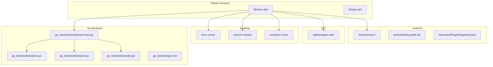
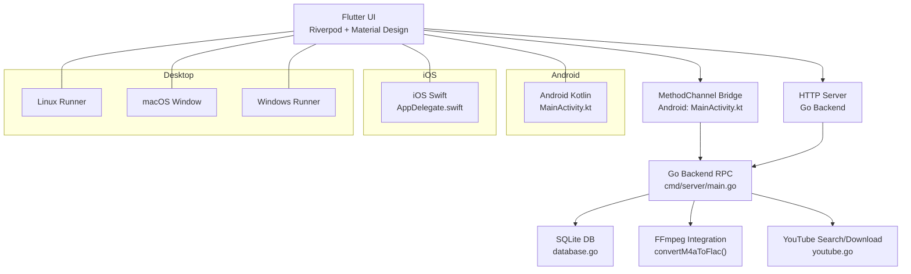
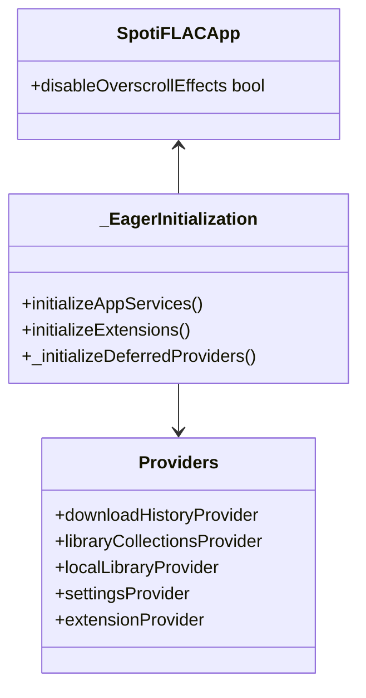
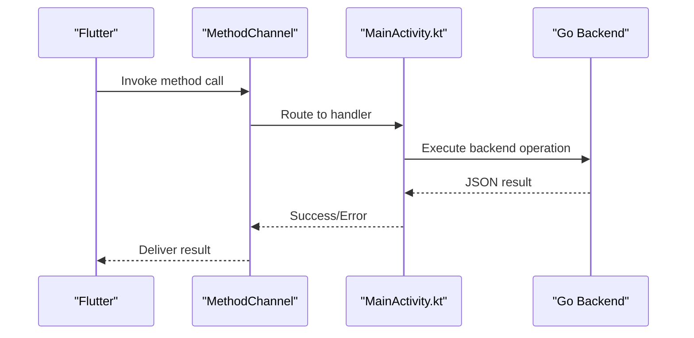
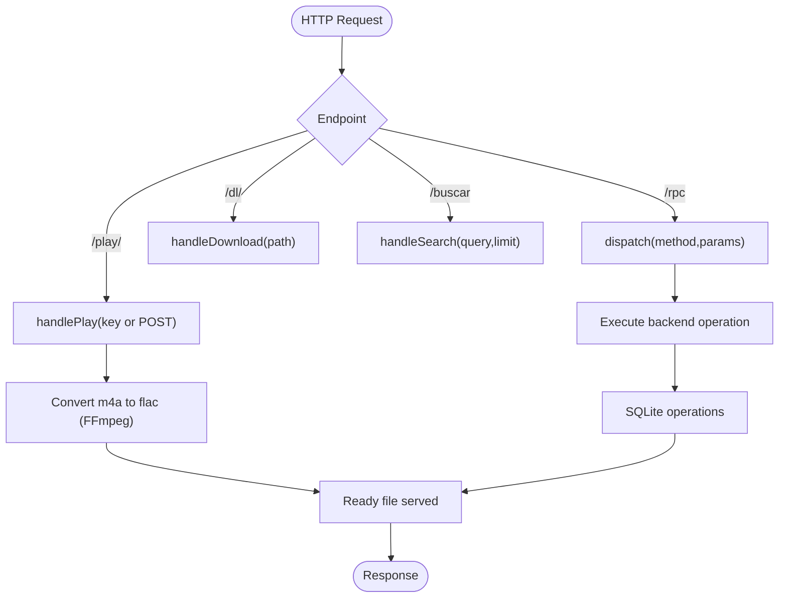
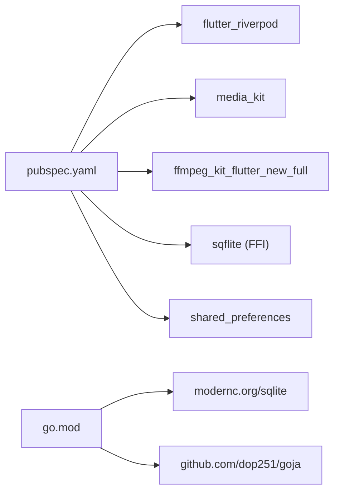

# Technology Stack

<cite>
**Referenced Files in This Document**
- [pubspec.yaml](file://pubspec.yaml)
- [main.dart](file://lib/main.dart)
- [lib/app.dart](file://lib/app.dart)
- [android/build.gradle.kts](file://android/build.gradle.kts)
- [android/app/src/main/kotlin/com/example/bitly/MainActivity.kt](file://android/app/src/main/kotlin/com/example/bitly/MainActivity.kt)
- [android/app/src/main/java/io/flutter/plugins/GeneratedPluginRegistrant.java](file://android/app/src/main/java/io/flutter/plugins/GeneratedPluginRegistrant.java)
- [ios/Runner/AppDelegate.swift](file://ios/Runner/AppDelegate.swift)
- [linux/runner/my_application.cc](file://linux/runner/my_application.cc)
- [macos/Runner/MainFlutterWindow.swift](file://macos/Runner/MainFlutterWindow.swift)
- [windows/runner/main.cpp](file://windows/runner/main.cpp)
- [go_backend_spotiflac/cmd/server/main.go](file://go_backend_spotiflac/cmd/server/main.go)
- [go_backend_spotiflac/go.mod](file://go_backend_spotiflac/go.mod)
- [go_backend_spotiflac/database.go](file://go_backend_spotiflac/database.go)
- [go_backend_spotiflac/playback.go](file://go_backend_spotiflac/playback.go)
- [go_backend_spotiflac/youtube.go](file://go_backend_spotiflac/youtube.go)
- [go_backend_spotiflac/mobile_deps.go](file://go_backend_spotiflac/mobile_deps.go)
</cite>

## Table of Contents
1. [Introduction](#introduction)
2. [Project Structure](#project-structure)
3. [Core Components](#core-components)
4. [Architecture Overview](#architecture-overview)
5. [Detailed Component Analysis](#detailed-component-analysis)
6. [Dependency Analysis](#dependency-analysis)
7. [Performance Considerations](#performance-considerations)
8. [Troubleshooting Guide](#troubleshooting-guide)
9. [Conclusion](#conclusion)

## Introduction
This document describes the technology stack used by Bitly, focusing on multi-platform development across Flutter/Dart, Go backend services, and native platform integrations. It covers frontend state management (Riverpod), UI frameworks (Material Design widgets), backend HTTP server and SQLite persistence, native Android and iOS implementations, and desktop targets (Linux/macOS/Windows). It also documents key third-party libraries such as MediaKit for playback, sqflite FFI for database, shared_preferences for configuration, and go_js_lib via goja for JavaScript VM capabilities. Version requirements, compatibility considerations, and rationale for technology choices are included to guide maintainers and contributors.

## Project Structure
The repository follows a multi-platform Flutter project layout with platform-specific folders and a dedicated Go backend module:
- Flutter application root with pubspec dependencies and main entry point
- Android and iOS native integration via platform channels and plugin registration
- Desktop targets (Linux/macOS/Windows) with platform-specific runners
- Go backend module providing HTTP server, SQLite operations, and media-related utilities

**Diagram sources**
- [lib/main.dart:22-44](file://lib/main.dart#L22-L44)
- [android/app/src/main/kotlin/com/example/bitly/MainActivity.kt:23-133](file://android/app/src/main/kotlin/com/example/bitly/MainActivity.kt#L23-L133)
- [ios/Runner/AppDelegate.swift:5-12](file://ios/Runner/AppDelegate.swift#L5-L12)
- [linux/runner/my_application.cc:24-77](file://linux/runner/my_application.cc#L24-L77)
- [macos/Runner/MainFlutterWindow.swift:4-14](file://macos/Runner/MainFlutterWindow.swift#L4-L14)
- [windows/runner/main.cpp:8-33](file://windows/runner/main.cpp#L8-L33)
- [go_backend_spotiflac/cmd/server/main.go:107-134](file://go_backend_spotiflac/cmd/server/main.go#L107-L134)
- [go_backend_spotiflac/go.mod:1-39](file://go_backend_spotiflac/go.mod#L1-L39)

**Section sources**
- [lib/main.dart:22-44](file://lib/main.dart#L22-L44)
- [android/build.gradle.kts:1-65](file://android/build.gradle.kts#L1-L65)
- [ios/Runner/AppDelegate.swift:5-12](file://ios/Runner/AppDelegate.swift#L5-L12)
- [linux/runner/my_application.cc:24-77](file://linux/runner/my_application.cc#L24-L77)
- [macos/Runner/MainFlutterWindow.swift:4-14](file://macos/Runner/MainFlutterWindow.swift#L4-L14)
- [windows/runner/main.cpp:8-33](file://windows/runner/main.cpp#L8-L33)
- [go_backend_spotiflac/cmd/server/main.go:107-134](file://go_backend_spotiflac/cmd/server/main.go#L107-L134)

## Core Components
- Flutter/Dart frontend with Riverpod state management, Material Design widgets, and cross-platform UI.
- Go backend HTTP server exposing RPC endpoints, integrating FFmpeg for audio conversion, and managing SQLite databases.
- Native Android Kotlin for platform channels and SAF integration; iOS Swift for app lifecycle; desktop C++ runners for Linux/macOS/Windows.
- Key libraries: MediaKit for playback, sqflite FFI for database, shared_preferences for configuration, and go_js_lib via goja for JavaScript VM.

**Section sources**
- [pubspec.yaml:9-108](file://pubspec.yaml#L9-L108)
- [lib/main.dart:1-287](file://lib/main.dart#L1-L287)
- [go_backend_spotiflac/cmd/server/main.go:107-134](file://go_backend_spotiflac/cmd/server/main.go#L107-L134)

## Architecture Overview
The system architecture centers on a Flutter frontend communicating with a Go backend via HTTP and MethodChannel bridges. The backend manages SQLite storage, orchestrates downloads and conversions, and exposes playback state. Native platforms integrate via platform channels and plugin registries.

**Diagram sources**
- [lib/main.dart:22-44](file://lib/main.dart#L22-L44)
- [android/app/src/main/kotlin/com/example/bitly/MainActivity.kt:23-133](file://android/app/src/main/kotlin/com/example/bitly/MainActivity.kt#L23-L133)
- [go_backend_spotiflac/cmd/server/main.go:107-134](file://go_backend_spotiflac/cmd/server/main.go#L107-L134)
- [go_backend_spotiflac/database.go:19-50](file://go_backend_spotiflac/database.go#L19-L50)
- [go_backend_spotiflac/playback.go:10-71](file://go_backend_spotiflac/playback.go#L10-L71)
- [go_backend_spotiflac/youtube.go:13-45](file://go_backend_spotiflac/youtube.go#L13-L45)

## Detailed Component Analysis

### Flutter/Dart Frontend Stack
- SDK and UI: Flutter SDK 3.10.0, Material Design widgets, dynamic color support.
- State management: Riverpod with ProviderScope and deferred provider warmup.
- Persistence and storage: shared_preferences, flutter_secure_storage, path_provider, sqflite (FFI) for desktop.
- Networking and media: http, connectivity_plus, ffmpeg_kit_flutter_new_full, media_kit and related video plugins.
- Utilities: url_launcher, device_info_plus, share_plus, receive_sharing_intent, logger.
- Initialization: MediaKit ensureInitialized, sqflite FFI initialization on non-mobile platforms, runtime profile selection for Android.

**Diagram sources**
- [lib/main.dart:35-43](file://lib/main.dart#L35-L43)
- [lib/main.dart:96-286](file://lib/main.dart#L96-L286)

**Section sources**
- [pubspec.yaml:6-108](file://pubspec.yaml#L6-L108)
- [lib/main.dart:22-44](file://lib/main.dart#L22-L44)
- [lib/main.dart:46-94](file://lib/main.dart#L46-L94)
- [lib/main.dart:235-280](file://lib/main.dart#L235-L280)

### Android Platform Integration
- MethodChannel bridge: com.zarz.spotiflac/backend routes backend RPC calls from Flutter to Go backend.
- SAF integration: folder picker with persisted permissions and display name retrieval.
- Plugin registration: GeneratedPluginRegistrant wires Flutter plugins including media_kit, ffmpeg_kit, sqflite, and others.
- Build configuration: Gradle sets Java/Kotlin 17 compatibility globally and forces Kotlin version.

**Diagram sources**
- [android/app/src/main/kotlin/com/example/bitly/MainActivity.kt:23-133](file://android/app/src/main/kotlin/com/example/bitly/MainActivity.kt#L23-L133)
- [android/app/src/main/java/io/flutter/plugins/GeneratedPluginRegistrant.java:17-138](file://android/app/src/main/java/io/flutter/plugins/GeneratedPluginRegistrant.java#L17-L138)

**Section sources**
- [android/app/src/main/kotlin/com/example/bitly/MainActivity.kt:15-133](file://android/app/src/main/kotlin/com/example/bitly/MainActivity.kt#L15-L133)
- [android/app/src/main/java/io/flutter/plugins/GeneratedPluginRegistrant.java:17-138](file://android/app/src/main/java/io/flutter/plugins/GeneratedPluginRegistrant.java#L17-L138)
- [android/build.gradle.kts:6-46](file://android/build.gradle.kts#L6-L46)

### iOS Platform Integration
- AppDelegate registers plugins and initializes Flutter engine lifecycle.
- No explicit backend channel wiring shown; backend is expected to be reachable via HTTP.

**Section sources**
- [ios/Runner/AppDelegate.swift:5-12](file://ios/Runner/AppDelegate.swift#L5-L12)

### Desktop Platforms (Linux/macOS/Windows)
- Linux: GTK-based runner with header bar and background color configuration.
- macOS: NSWindow-based Flutter controller setup.
- Windows: Win32 window with console attachment and message loop.

**Section sources**
- [linux/runner/my_application.cc:24-77](file://linux/runner/my_application.cc#L24-L77)
- [macos/Runner/MainFlutterWindow.swift:4-14](file://macos/Runner/MainFlutterWindow.swift#L4-L14)
- [windows/runner/main.cpp:8-33](file://windows/runner/main.cpp#L8-L33)

### Go Backend Server
- HTTP server with handlers for index, search, RPC, play, and download endpoints.
- FFmpeg integration: auto-download and extraction on Windows; conversion from m4a to flac.
- SQLite operations: WAL mode, cache tuning, batch upserts, and history queries.
- Playback state machine: queue management, shuffle/repeat modes, seek, and history tracking.
- YouTube utilities: yt-dlp search and download for non-Android builds.

**Diagram sources**
- [go_backend_spotiflac/cmd/server/main.go:124-134](file://go_backend_spotiflac/cmd/server/main.go#L124-L134)
- [go_backend_spotiflac/cmd/server/main.go:516-553](file://go_backend_spotiflac/cmd/server/main.go#L516-L553)
- [go_backend_spotiflac/database.go:19-50](file://go_backend_spotiflac/database.go#L19-L50)

**Section sources**
- [go_backend_spotiflac/cmd/server/main.go:107-134](file://go_backend_spotiflac/cmd/server/main.go#L107-L134)
- [go_backend_spotiflac/cmd/server/main.go:516-553](file://go_backend_spotiflac/cmd/server/main.go#L516-L553)
- [go_backend_spotiflac/database.go:19-50](file://go_backend_spotiflac/database.go#L19-L50)
- [go_backend_spotiflac/playback.go:10-71](file://go_backend_spotiflac/playback.go#L10-L71)
- [go_backend_spotiflac/youtube.go:13-45](file://go_backend_spotiflac/youtube.go#L13-L45)

## Dependency Analysis
- Flutter dependencies pinned via pubspec.yaml, including Riverpod, media_kit, ffmpeg_kit_flutter_new_full, sqflite FFI, and shared_preferences.
- Android Gradle enforces Java/Kotlin 17 and resolves Kotlin version conflicts.
- Go backend uses modernc.org/sqlite for embedded database and goja for JavaScript VM integration.
- Platform plugin registrations are auto-generated and wired in Android.

**Diagram sources**
- [pubspec.yaml:9-108](file://pubspec.yaml#L9-L108)
- [go_backend_spotiflac/go.mod:7-18](file://go_backend_spotiflac/go.mod#L7-L18)

**Section sources**
- [pubspec.yaml:9-108](file://pubspec.yaml#L9-L108)
- [go_backend_spotiflac/go.mod:7-18](file://go_backend_spotiflac/go.mod#L7-L18)

## Performance Considerations
- Flutter image cache sizing and overscroll effects are tuned per runtime profile, especially for low-RAM or 32-bit Android devices.
- SQLite performance tuned with WAL mode, NORMAL sync, 64MB cache, and busy timeout to reduce contention.
- FFmpeg conversion prioritizes bundled executable on Windows and falls back to system ffmpeg; conversion uses compression level 8 for FLAC.
- MediaKit initialization is centralized to ensure video decoding libraries are loaded before playback.

[No sources needed since this section provides general guidance]

## Troubleshooting Guide
- FFmpeg not found on Windows: The backend attempts to download and extract ffmpeg.exe automatically; ensure network access and disk write permissions.
- SQLite busy errors: The backend sets busy_timeout to mitigate concurrent writes; avoid long-running transactions from Dart side.
- MethodChannel errors: Verify channel name and handler registration in MainActivity.kt; ensure executor and handler are used consistently.
- MediaKit initialization failures: Ensure MediaKit.ensureInitialized is called during app startup, particularly on desktop where FFI is used.

**Section sources**
- [go_backend_spotiflac/cmd/server/main.go:59-105](file://go_backend_spotiflac/cmd/server/main.go#L59-L105)
- [go_backend_spotiflac/database.go:32-37](file://go_backend_spotiflac/database.go#L32-L37)
- [android/app/src/main/kotlin/com/example/bitly/MainActivity.kt:135-145](file://android/app/src/main/kotlin/com/example/bitly/MainActivity.kt#L135-L145)
- [lib/main.dart:24-24](file://lib/main.dart#L24-L24)

## Conclusion
Bitly employs a cohesive multi-platform stack: Flutter/Dart for the UI and orchestration, Riverpod for scalable state management, and Material Design for consistent cross-platform experiences. The Go backend provides robust HTTP APIs, SQLite-backed persistence, FFmpeg-based audio conversion, and playback state management. Native Android and iOS integrations leverage MethodChannel bridges and plugin registries, while desktop targets are supported via platform-specific runners. The chosen technologies balance performance, maintainability, and cross-platform reach, with explicit measures for resource-constrained environments and reliable media handling.