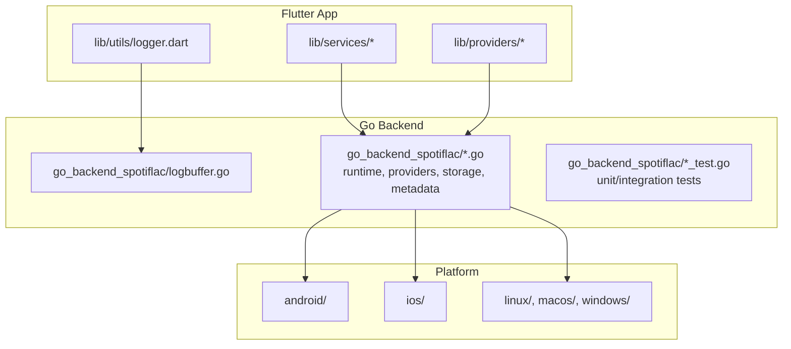
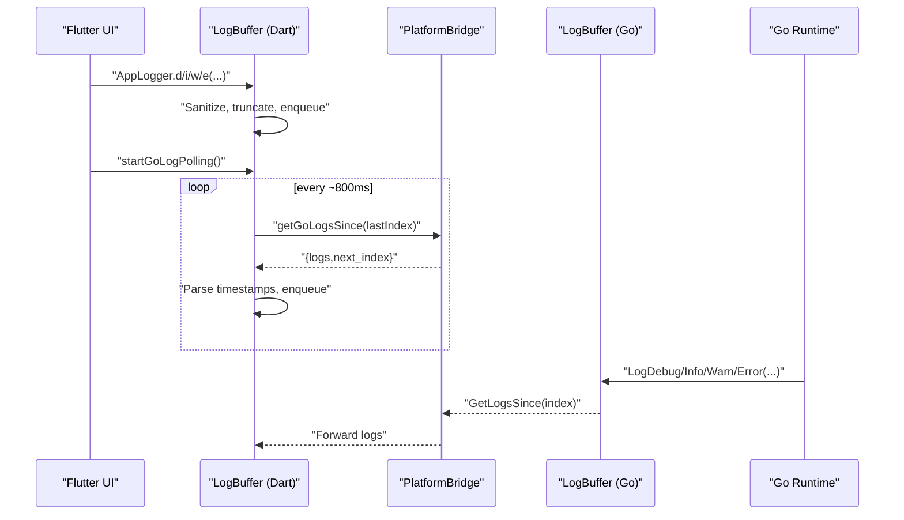
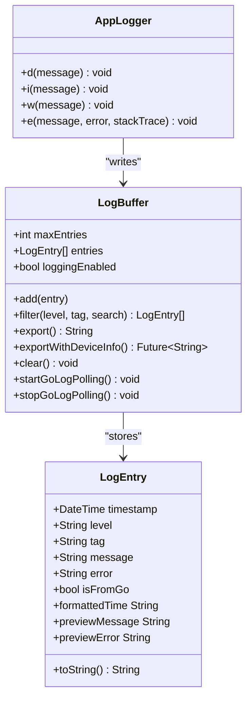
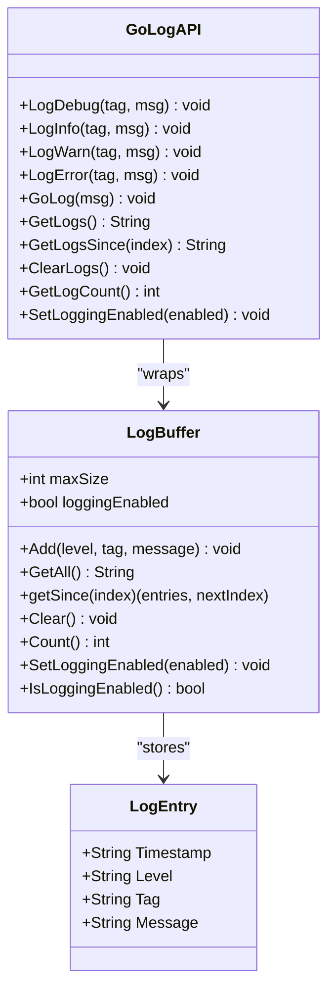
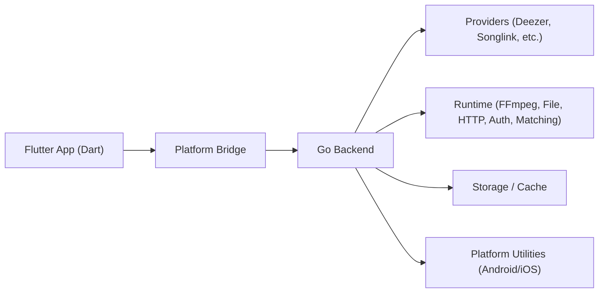

# Testing and Quality Assurance

<cite>
**Referenced Files in This Document**
- [pubspec.yaml](file://pubspec.yaml)
- [analysis_options.yaml](file://analysis_options.yaml)
- [logger.dart](file://lib/utils/logger.dart)
- [logbuffer.go](file://go_backend_spotiflac/logbuffer.go)
- [coverage_test_helpers_test.go](file://go_backend_spotiflac/coverage_test_helpers_test.go)
- [exports_supplement_test.go](file://go_backend_spotiflac/exports_supplement_test.go)
- [extension_runtime_binary_test.go](file://go_backend_spotiflac/extension_runtime_binary_test.go)
- [extension_runtime_storage_test.go](file://go_backend_spotiflac/extension_runtime_storage_test.go)
- [extension_runtime_http.go](file://go_backend_spotiflac/extension_runtime_http.go)
- [extension_runtime_file.go](file://go_backend_spotiflac/extension_runtime_file.go)
- [extension_runtime_polyfills.go](file://go_backend_spotiflac/extension_runtime_polyfills.go)
- [extension_runtime_utils.go](file://go_backend_spotiflac/extension_runtime_utils.go)
- [extension_runtime_auth.go](file://go_backend_spotiflac/extension_runtime_auth.go)
- [extension_runtime_matching.go](file://go_backend_spotiflac/extension_runtime_matching.go)
- [extension_runtime_ffmpeg.go](file://go_backend_spotiflac/extension_runtime_ffmpeg.go)
- [extension_runtime.go](file://go_backend_spotiflac/extension_runtime.go)
- [extension_providers.go](file://go_backend_spotiflac/extension_providers.go)
- [extension_manager.go](file://go_backend_spotiflac/extension_manager.go)
- [extension_store.go](file://go_backend_spotiflac/extension_store.go)
- [mobile_deps.go](file://go_backend_spotiflac/mobile_deps.go)
- [progress.go](file://go_backend_spotiflac/progress.go)
- [progress_test.go](file://go_backend_spotiflac/progress_test.go)
- [library_scan.go](file://go_backend_spotiflac/library_scan.go)
- [library_scan_test.go](file://go_backend_spotiflac/library_scan_test.go)
- [download_validation.go](file://go_backend_spotiflac/download_validation.go)
- [filename.go](file://go_backend_spotiflac/filename.go)
- [filename_test.go](file://go_backend_spotiflac/filename_test.go)
- [audio_metadata.go](file://go_backend_spotiflac/audio_metadata.go)
- [audio_metadata_cache_test.go](file://go_backend_spotiflac/audio_metadata_cache_test.go)
- [audio_metadata_mp3_test.go](file://go_backend_spotiflac/audio_metadata_mp3_test.go)
- [audio_metadata_supplement_test.go](file://go_backend_spotiflac/audio_metadata_supplement_test.go)
- [deezer.go](file://go_backend_spotiflac/deezer.go)
- [deezer_supplement_test.go](file://go_backend_spotiflac/deezer_supplement_test.go)
- [songlink.go](file://go_backend_spotiflac/songlink.go)
- [songlink_test.go](file://go_backend_spotiflac/songlink_test.go)
- [playback.go](file://go_backend_spotiflac/playback.go)
- [playback_exports.go](file://go_backend_spotiflac/playback_exports.go)
- [premium.go](file://go_backend_spotiflac/premium.go)
- [yt-dlp installer](file://go_backend_spotiflac/ytdlp_installer.go)
- [android_youtube.go](file://go_backend_spotiflac/android_youtube.go)
- [httputil.go](file://go_backend_spotiflac/httputil.go)
- [httputil_ios.go](file://go_backend_spotiflac/httputil_ios.go)
- [httputil_utls.go](file://go_backend_spotiflac/httputil_utls.go)
- [metadata_types.go](file://go_backend_spotiflac/metadata_types.go)
- [metadata_artist_tags_test.go](file://go_backend_spotiflac/metadata_artist_tags_test.go)
- [metadata_m4a_quality_test.go](file://go_backend_spotiflac/metadata_m4a_quality_test.go)
- [title_match_utils.go](file://go_backend_spotiflac/title_match_utils.go)
- [title_match_utils_test.go](file://go_backend_spotiflac/title_match_utils_test.go)
- [build_log.txt](file://build_log.txt)
- [build_log_2.txt](file://build_log_2.txt)
- [build_log_3.txt](file://build_log_3.txt)
- [error_log.txt](file://error_log.txt)
- [go.mod](file://go_backend_spotiflac/go.mod)
</cite>

## Table of Contents
1. [Introduction](#introduction)
2. [Project Structure](#project-structure)
3. [Core Components](#core-components)
4. [Architecture Overview](#architecture-overview)
5. [Detailed Component Analysis](#detailed-component-analysis)
6. [Dependency Analysis](#dependency-analysis)
7. [Performance Considerations](#performance-considerations)
8. [Troubleshooting Guide](#troubleshooting-guide)
9. [Conclusion](#conclusion)
10. [Appendices](#appendices)

## Introduction
This document defines a comprehensive testing and quality assurance (QA) strategy for a multi-layered system spanning Flutter (Dart), Go backend, and platform-specific components (Android/iOS). It covers unit and integration testing approaches, platform-specific testing methodologies, logging and error reporting, performance testing, continuous integration and automated pipelines, and quality metrics. The goal is to ensure reliability, maintainability, and consistent user experience across platforms while leveraging existing logging and test helpers present in the repository.

## Project Structure
The project is organized into:
- Flutter application (Dart) under lib/, with utilities and services supporting the UI and platform bridge.
- Go backend under go_backend_spotiflac/, containing core logic, runtime extensions, providers, storage, and platform utilities.
- Platform-specific folders (android/, ios/, linux/, macos/, windows/) for native builds and tests.
- Build logs and error artifacts aiding QA triage and regression detection.

**Diagram sources**
- [logger.dart](file://lib/utils/logger.dart)
- [logbuffer.go](file://go_backend_spotiflac/logbuffer.go)

**Section sources**
- [pubspec.yaml](file://pubspec.yaml)
- [analysis_options.yaml](file://analysis_options.yaml)

## Core Components
This section outlines the QA-relevant components and their roles in testing and observability.

- Flutter logging and buffering:
  - Centralized logging with sensitive data redaction and filtering.
  - Periodic polling of Go backend logs via platform bridge.
  - Exportable log summaries with device and app metadata.

- Go backend logging and buffering:
  - Thread-safe in-memory log buffer with configurable capacity.
  - Automatic log level inference from message content.
  - Sensitive data sanitization and JSON export APIs.

- Test helpers and coverage scaffolding:
  - Go test helpers to provision temporary extension manifests and settings for coverage scenarios.
  - Extensive suite of *_test.go files covering runtime, storage, metadata, providers, and platform utilities.

- Platform utilities:
  - HTTP utilities for Android and iOS, including TLS customization.
  - FFmpeg integration and yt-dlp installer for media operations.

**Section sources**
- [logger.dart](file://lib/utils/logger.dart)
- [logbuffer.go](file://go_backend_spotiflac/logbuffer.go)
- [coverage_test_helpers_test.go](file://go_backend_spotiflac/coverage_test_helpers_test.go)
- [httputil.go](file://go_backend_spotiflac/httputil.go)
- [httputil_ios.go](file://go_backend_spotiflac/httputil_ios.go)
- [httputil_utls.go](file://go_backend_spotiflac/httputil_utls.go)
- [extension_runtime_ffmpeg.go](file://go_backend_spotiflac/extension_runtime_ffmpeg.go)
- [ytdlp_installer.go](file://go_backend_spotiflac/ytdlp_installer.go)

## Architecture Overview
The testing and QA architecture integrates Flutter UI and services with the Go backend through a platform bridge. Logging flows bidirectionally: Flutter captures Dart logs and polls Go logs; Go captures Go logs and exposes them to Flutter.

**Diagram sources**
- [logger.dart](file://lib/utils/logger.dart)
- [logbuffer.go](file://go_backend_spotiflac/logbuffer.go)

## Detailed Component Analysis

### Flutter Logging and Buffering
Key capabilities:
- Redaction of tokens, keys, and bearer tokens in messages.
- Filtering by level/tag/search.
- Export with device and app metadata.
- Polling Go logs periodically and merging into a unified buffer.

**Diagram sources**
- [logger.dart](file://lib/utils/logger.dart)

**Section sources**
- [logger.dart](file://lib/utils/logger.dart)

### Go Backend Logging and Buffering
Key capabilities:
- Thread-safe ring-buffer with capacity limit.
- Sanitization of sensitive data.
- Automatic log level inference from message content.
- APIs to fetch logs since a given index and clear buffers.

**Diagram sources**
- [logbuffer.go](file://go_backend_spotiflac/logbuffer.go)

**Section sources**
- [logbuffer.go](file://go_backend_spotiflac/logbuffer.go)

### Unit Testing Approaches (Go)
Recommended unit testing patterns derived from existing *_test.go files:
- Use table-driven tests for metadata parsing, filename normalization, provider priority, and matching utilities.
- Mock external dependencies via test helpers (e.g., temporary extension manifests and settings).
- Validate sensitive data handling by asserting redacted outputs.
- Verify concurrency safety for shared buffers and runtime components.

Practical examples (paths):
- Coverage scaffolding for extension loading and settings: [coverage_test_helpers_test.go](file://go_backend_spotiflac/coverage_test_helpers_test.go)
- Provider priority and settings persistence: [exports_supplement_test.go](file://go_backend_spotiflac/exports_supplement_test.go)
- Binary/runtime operations: [extension_runtime_binary_test.go](file://go_backend_spotiflac/extension_runtime_binary_test.go)
- Storage operations: [extension_runtime_storage_test.go](file://go_backend_spotiflac/extension_runtime_storage_test.go)
- Metadata caching and MP3 parsing: [audio_metadata_cache_test.go](file://go_backend_spotiflac/audio_metadata_cache_test.go), [audio_metadata_mp3_test.go](file://go_backend_spotiflac/audio_metadata_mp3_test.go), [audio_metadata_supplement_test.go](file://go_backend_spotiflac/audio_metadata_supplement_test.go)
- Filename normalization: [filename_test.go](file://go_backend_spotiflac/filename_test.go)
- Progress tracking: [progress_test.go](file://go_backend_spotiflac/progress_test.go)
- Library scanning: [library_scan_test.go](file://go_backend_spotiflac/library_scan_test.go)
- Deezer provider: [deezer_supplement_test.go](file://go_backend_spotiflac/deezer_supplement_test.go)
- Songlink integration: [songlink_test.go](file://go_backend_spotiflac/songlink_test.go)
- Artist tags and M4A quality: [metadata_artist_tags_test.go](file://go_backend_spotiflac/metadata_artist_tags_test.go), [metadata_m4a_quality_test.go](file://go_backend_spotiflac/metadata_m4a_quality_test.go)
- Title matching: [title_match_utils_test.go](file://go_backend_spotiflac/title_match_utils_test.go)

**Section sources**
- [coverage_test_helpers_test.go](file://go_backend_spotiflac/coverage_test_helpers_test.go)
- [exports_supplement_test.go](file://go_backend_spotiflac/exports_supplement_test.go)
- [extension_runtime_binary_test.go](file://go_backend_spotiflac/extension_runtime_binary_test.go)
- [extension_runtime_storage_test.go](file://go_backend_spotiflac/extension_runtime_storage_test.go)
- [audio_metadata_cache_test.go](file://go_backend_spotiflac/audio_metadata_cache_test.go)
- [audio_metadata_mp3_test.go](file://go_backend_spotiflac/audio_metadata_mp3_test.go)
- [audio_metadata_supplement_test.go](file://go_backend_spotiflac/audio_metadata_supplement_test.go)
- [filename_test.go](file://go_backend_spotiflac/filename_test.go)
- [progress_test.go](file://go_backend_spotiflac/progress_test.go)
- [library_scan_test.go](file://go_backend_spotiflac/library_scan_test.go)
- [deezer_supplement_test.go](file://go_backend_spotiflac/deezer_supplement_test.go)
- [songlink_test.go](file://go_backend_spotiflac/songlink_test.go)
- [metadata_artist_tags_test.go](file://go_backend_spotiflac/metadata_artist_tags_test.go)
- [metadata_m4a_quality_test.go](file://go_backend_spotiflac/metadata_m4a_quality_test.go)
- [title_match_utils_test.go](file://go_backend_spotiflac/title_match_utils_test.go)

### Integration Testing Patterns (Go)
Patterns observed in existing tests:
- Use temporary directories and JSON fixtures to simulate provider configurations and extension settings.
- Validate cross-cutting concerns like fallback providers, priority ordering, and settings persistence.
- Exercise provider-specific flows (Deezer, Songlink) and ensure robustness against malformed inputs.

Example paths:
- Provider priority and fallback IDs: [exports_supplement_test.go](file://go_backend_spotiflac/exports_supplement_test.go)
- Deezer provider supplement: [deezer_supplement_test.go](file://go_backend_spotiflac/deezer_supplement_test.go)
- Songlink provider supplement: [songlink_test.go](file://go_backend_spotiflac/songlink_test.go)

**Section sources**
- [exports_supplement_test.go](file://go_backend_spotiflac/exports_supplement_test.go)
- [deezer_supplement_test.go](file://go_backend_spotiflac/deezer_supplement_test.go)
- [songlink_test.go](file://go_backend_spotiflac/songlink_test.go)

### Platform-Specific Testing Methodologies
- Android:
  - HTTP/TLS behavior via uTLS and platform-specific HTTP utilities.
  - YouTube service integration and yt-dlp installer.
  - Android-specific HTTP utilities and iOS-specific HTTP utilities.

- iOS:
  - iOS-specific HTTP utilities and platform bridging.

- Cross-platform:
  - FFmpeg integration for media operations.
  - File system operations and storage runtime.

Example paths:
- Android HTTP utilities: [httputil.go](file://go_backend_spotiflac/httputil.go), [httputil_utls.go](file://go_backend_spotiflac/httputil_utls.go), [android_youtube.go](file://go_backend_spotiflac/android_youtube.go)
- iOS HTTP utilities: [httputil_ios.go](file://go_backend_spotiflac/httputil_ios.go)
- FFmpeg runtime: [extension_runtime_ffmpeg.go](file://go_backend_spotiflac/extension_runtime_ffmpeg.go)
- File operations: [extension_runtime_file.go](file://go_backend_spotiflac/extension_runtime_file.go)
- Polyfills and utilities: [extension_runtime_polyfills.go](file://go_backend_spotiflac/extension_runtime_polyfills.go), [extension_runtime_utils.go](file://go_backend_spotiflac/extension_runtime_utils.go)
- Authentication runtime: [extension_runtime_auth.go](file://go_backend_spotiflac/extension_runtime_auth.go)
- Matching runtime: [extension_runtime_matching.go](file://go_backend_spotiflac/extension_runtime_matching.go)
- Mobile dependencies: [mobile_deps.go](file://go_backend_spotiflac/mobile_deps.go)
- yt-dlp installer: [ytdlp_installer.go](file://go_backend_spotiflac/ytdlp_installer.go)

**Section sources**
- [httputil.go](file://go_backend_spotiflac/httputil.go)
- [httputil_ios.go](file://go_backend_spotiflac/httputil_ios.go)
- [httputil_utls.go](file://go_backend_spotiflac/httputil_utls.go)
- [android_youtube.go](file://go_backend_spotiflac/android_youtube.go)
- [extension_runtime_ffmpeg.go](file://go_backend_spotiflac/extension_runtime_ffmpeg.go)
- [extension_runtime_file.go](file://go_backend_spotiflac/extension_runtime_file.go)
- [extension_runtime_polyfills.go](file://go_backend_spotiflac/extension_runtime_polyfills.go)
- [extension_runtime_utils.go](file://go_backend_spotiflac/extension_runtime_utils.go)
- [extension_runtime_auth.go](file://go_backend_spotiflac/extension_runtime_auth.go)
- [extension_runtime_matching.go](file://go_backend_spotiflac/extension_runtime_matching.go)
- [mobile_deps.go](file://go_backend_spotiflac/mobile_deps.go)
- [ytdlp_installer.go](file://go_backend_spotiflac/ytdlp_installer.go)

### Quality Assurance Processes and Metrics
- Static analysis and linting:
  - Flutter lints configured via analysis options.
  - Recommended to enforce consistent code quality across the team.

- Code coverage:
  - Existing Go tests demonstrate coverage of runtime, providers, storage, and utilities.
  - Suggested coverage targets: >80% for critical runtime and provider modules, >60% for utilities and helpers.

- Logging and error reporting:
  - Bidirectional logging pipeline ensures visibility into both Flutter and Go components.
  - Sensitive data redaction prevents leakage in logs.
  - Export APIs enable QA to collect diagnostics with device and app metadata.

- Performance testing:
  - Benchmark metadata parsing, filename normalization, and provider matching.
  - Measure latency of Go log polling and buffer operations.
  - Validate memory footprint of log buffers and caches.

**Section sources**
- [analysis_options.yaml](file://analysis_options.yaml)
- [logger.dart](file://lib/utils/logger.dart)
- [logbuffer.go](file://go_backend_spotiflac/logbuffer.go)

### Continuous Integration and Automated Pipelines
Proposed pipeline stages:
- Build and lint:
  - Flutter: analyze, test, and build per target.
  - Go: vet, test with coverage, and build binaries.
- Platform-specific builds:
  - Android: assemble debug/release APK/AAB.
  - iOS: archive and export IPA.
  - Desktop: Linux/macOS/Windows builds.
- Upload artifacts and coverage reports.
- Postman/newman collection runs for API endpoints (if applicable).
- Automated smoke tests on emulators/devices.

[No sources needed since this section provides general guidance]

### Bug Tracking and Regression Prevention
- Use build logs and error logs to track regressions and failures.
- Integrate exportable logs into bug reports with device and app metadata.
- Establish baseline metrics for performance and stability.

**Section sources**
- [build_log.txt](file://build_log.txt)
- [build_log_2.txt](file://build_log_2.txt)
- [build_log_3.txt](file://build_log_3.txt)
- [error_log.txt](file://error_log.txt)

## Dependency Analysis
The Flutter app depends on the Go backend via a platform bridge. The Go backend interacts with platform utilities and runtime components. Dependencies are declared in pubspec.yaml and go.mod.

**Diagram sources**
- [pubspec.yaml](file://pubspec.yaml)
- [go.mod](file://go_backend_spotiflac/go.mod)

**Section sources**
- [pubspec.yaml](file://pubspec.yaml)
- [go.mod](file://go_backend_spotiflac/go.mod)

## Performance Considerations
- Log buffer sizing and polling intervals:
  - Flutter polling interval balances responsiveness and overhead.
  - Go log buffer capacity limits memory usage.
- Concurrency:
  - Use mutex-protected buffers for thread-safe operations.
- I/O and network:
  - Prefer streaming and chunked operations for large downloads.
  - Validate timeouts and retries for provider integrations.
- Memory:
  - Monitor cache sizes and clear stale entries periodically.

[No sources needed since this section provides general guidance]

## Troubleshooting Guide
Common issues and resolutions:
- Flutter logs not appearing:
  - Ensure logging is enabled and polling timer started.
  - Verify platform bridge calls succeed and logs are fetched.
- Go logs missing:
  - Confirm Go logging is enabled and sensitive messages filtered appropriately.
  - Check buffer capacity and index progression.
- Build failures:
  - Review build logs for deprecations and task execution errors.
  - Resolve dependency conflicts indicated by module files.

**Section sources**
- [logger.dart](file://lib/utils/logger.dart)
- [logbuffer.go](file://go_backend_spotiflac/logbuffer.go)
- [build_log.txt](file://build_log.txt)
- [build_log_2.txt](file://build_log_2.txt)
- [build_log_3.txt](file://build_log_3.txt)
- [error_log.txt](file://error_log.txt)

## Conclusion
By combining Flutter’s centralized logging with Go’s robust, thread-safe log buffer and platform-specific utilities, the system achieves strong observability across layers. The existing test suite demonstrates effective unit and integration testing patterns. Adopting the recommended QA processes, coverage targets, and CI/CD practices will further strengthen reliability and maintainability.

[No sources needed since this section summarizes without analyzing specific files]

## Appendices

### Practical Examples Index
- Flutter logging and export:
  - [logger.dart](file://lib/utils/logger.dart)
- Go logging and sanitization:
  - [logbuffer.go](file://go_backend_spotiflac/logbuffer.go)
- Test helpers for coverage:
  - [coverage_test_helpers_test.go](file://go_backend_spotiflac/coverage_test_helpers_test.go)
- Provider priority and settings:
  - [exports_supplement_test.go](file://go_backend_spotiflac/exports_supplement_test.go)
- Runtime and storage tests:
  - [extension_runtime_binary_test.go](file://go_backend_spotiflac/extension_runtime_binary_test.go)
  - [extension_runtime_storage_test.go](file://go_backend_spotiflac/extension_runtime_storage_test.go)
- Metadata and filename tests:
  - [audio_metadata_cache_test.go](file://go_backend_spotiflac/audio_metadata_cache_test.go)
  - [audio_metadata_mp3_test.go](file://go_backend_spotiflac/audio_metadata_mp3_test.go)
  - [audio_metadata_supplement_test.go](file://go_backend_spotiflac/audio_metadata_supplement_test.go)
  - [filename_test.go](file://go_backend_spotiflac/filename_test.go)
- Progress and library scan:
  - [progress_test.go](file://go_backend_spotiflac/progress_test.go)
  - [library_scan_test.go](file://go_backend_spotiflac/library_scan_test.go)
- Provider-specific tests:
  - [deezer_supplement_test.go](file://go_backend_spotiflac/deezer_supplement_test.go)
  - [songlink_test.go](file://go_backend_spotiflac/songlink_test.go)
- Metadata quality and matching:
  - [metadata_artist_tags_test.go](file://go_backend_spotiflac/metadata_artist_tags_test.go)
  - [metadata_m4a_quality_test.go](file://go_backend_spotiflac/metadata_m4a_quality_test.go)
  - [title_match_utils_test.go](file://go_backend_spotiflac/title_match_utils_test.go)