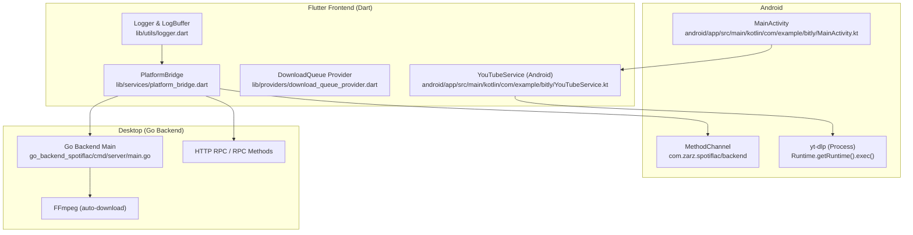
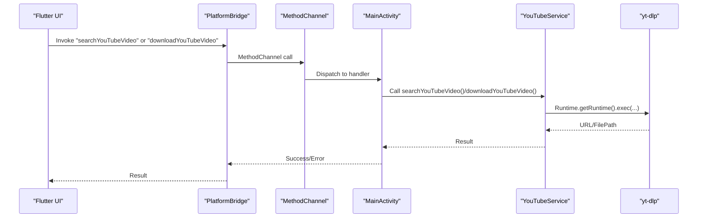
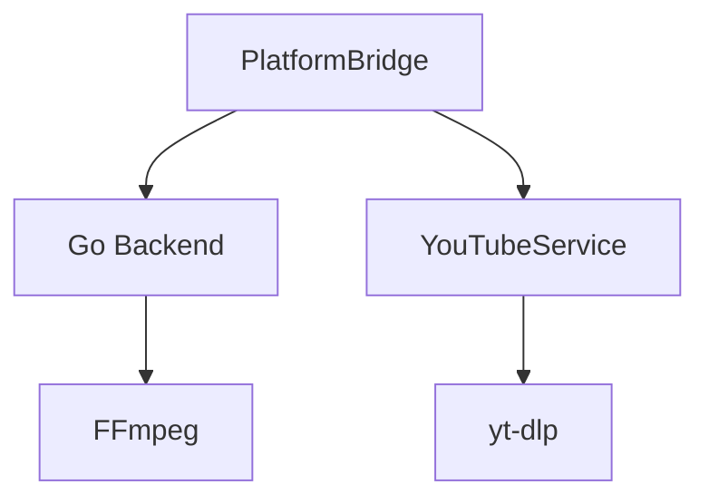

# Troubleshooting and FAQ

<cite>
**Referenced Files in This Document**
- [README_FINAL.md](file://README_FINAL.md)
- [FINAL_STATUS.md](file://FINAL_STATUS.md)
- [BUILD_STATUS.md](file://BUILD_STATUS.md)
- [build_log.txt](file://build_log.txt)
- [error_log.txt](file://error_log.txt)
- [go_backend_spotiflac/cmd/server/main.go](file://go_backend_spotiflac/cmd/server/main.go)
- [android/app/src/main/kotlin/com/example/bitly/MainActivity.kt](file://android/app/src/main/kotlin/com/example/bitly/MainActivity.kt)
- [android/app/src/main/kotlin/com/example/bitly/YouTubeService.kt](file://android/app/src/main/kotlin/com/example/bitly/YouTubeService.kt)
- [lib/services/platform_bridge.dart](file://lib/services/platform_bridge.dart)
- [lib/providers/download_queue_provider.dart](file://lib/providers/download_queue_provider.dart)
- [lib/utils/logger.dart](file://lib/utils/logger.dart)
- [android/app/build.gradle.kts](file://android/app/build.gradle.kts)
- [pubspec.yaml](file://pubspec.yaml)
</cite>

## Table of Contents
1. [Introduction](#introduction)
2. [Project Structure](#project-structure)
3. [Core Components](#core-components)
4. [Architecture Overview](#architecture-overview)
5. [Detailed Component Analysis](#detailed-component-analysis)
6. [Dependency Analysis](#dependency-analysis)
7. [Performance Considerations](#performance-considerations)
8. [Troubleshooting Guide](#troubleshooting-guide)
9. [FAQ](#faq)
10. [Conclusion](#conclusion)
11. [Appendices](#appendices)

## Introduction
This document provides comprehensive troubleshooting guidance for Bitly, focusing on installation problems, performance issues, platform-specific challenges, debugging tools, log analysis, and error resolution strategies. It covers Android build failures, network connectivity issues, audio processing problems, and platform integration challenges. It also includes frequently asked questions, step-by-step diagnostics, error code references, and support resources.

## Project Structure
Bitly is a cross-platform application with a Flutter frontend and a Go backend. The backend integrates YouTube video search and download via yt-dlp, and communicates with the Flutter frontend through MethodChannel on Android and HTTP RPC on desktop platforms.

**Diagram sources**
- [lib/services/platform_bridge.dart](file://lib/services/platform_bridge.dart)
- [lib/providers/download_queue_provider.dart](file://lib/providers/download_queue_provider.dart)
- [android/app/src/main/kotlin/com/example/bitly/MainActivity.kt](file://android/app/src/main/kotlin/com/example/bitly/MainActivity.kt)
- [android/app/src/main/kotlin/com/example/bitly/YouTubeService.kt](file://android/app/src/main/kotlin/com/example/bitly/YouTubeService.kt)
- [go_backend_spotiflac/cmd/server/main.go](file://go_backend_spotiflac/cmd/server/main.go)
- [lib/utils/logger.dart](file://lib/utils/logger.dart)

**Section sources**
- [README_FINAL.md](file://README_FINAL.md)
- [FINAL_STATUS.md](file://FINAL_STATUS.md)

## Core Components
- PlatformBridge: Orchestrates communication between Flutter and the backend. On Android, it uses MethodChannel; on desktop, it uses HTTP RPC to the Go backend.
- MainActivity: Registers MethodChannel handlers for backend operations, including YouTube search and download.
- YouTubeService: Executes yt-dlp commands on Android and returns results to Flutter.
- Go Backend: Provides HTTP endpoints and RPC methods for downloads, metadata, lyrics, and extension management.
- Logger: Centralized logging with sensitive data redaction and export capabilities.

**Section sources**
- [lib/services/platform_bridge.dart](file://lib/services/platform_bridge.dart)
- [android/app/src/main/kotlin/com/example/bitly/MainActivity.kt](file://android/app/src/main/kotlin/com/example/bitly/MainActivity.kt)
- [android/app/src/main/kotlin/com/example/bitly/YouTubeService.kt](file://android/app/src/main/kotlin/com/example/bitly/YouTubeService.kt)
- [go_backend_spotiflac/cmd/server/main.go](file://go_backend_spotiflac/cmd/server/main.go)
- [lib/utils/logger.dart](file://lib/utils/logger.dart)

## Architecture Overview
Bitly separates the frontend (Flutter/Dart) from the backend (Go). Android uses MethodChannel to call into the Go backend via a generated binding. Desktop platforms spawn the Go backend process and communicate via HTTP RPC.

**Diagram sources**
- [lib/services/platform_bridge.dart](file://lib/services/platform_bridge.dart)
- [android/app/src/main/kotlin/com/example/bitly/MainActivity.kt](file://android/app/src/main/kotlin/com/example/bitly/MainActivity.kt)
- [android/app/src/main/kotlin/com/example/bitly/YouTubeService.kt](file://android/app/src/main/kotlin/com/example/bitly/YouTubeService.kt)

## Detailed Component Analysis

### Android Build Issues
Common symptoms:
- Kotlin compilation errors during Gradle build.
- Conflicts between Kotlin plugin versions and stdlib.
- Missing or incompatible Java/Kotlin toolchains.

Resolution steps:
- Align Kotlin Gradle plugin version with stdlib compatibility.
- Ensure Java 17 toolchain is configured.
- Clear Gradle caches or rebuild with --no-cache.
- Verify coreLibraryDesugaring is enabled for Java 8+ APIs.

**Section sources**
- [BUILD_STATUS.md](file://BUILD_STATUS.md)
- [error_log.txt](file://error_log.txt)
- [build_log.txt](file://build_log.txt)
- [android/app/build.gradle.kts](file://android/app/build.gradle.kts)

### Android YouTube Integration
Issues:
- yt-dlp not found on device.
- Process execution failures or empty results.
- Incorrect output path resolution.

Resolution steps:
- Ensure yt-dlp is installed and accessible in PATH.
- Verify output directory permissions and existence.
- Confirm search/download arguments are correctly formed.

**Section sources**
- [android/app/src/main/kotlin/com/example/bitly/YouTubeService.kt](file://android/app/src/main/kotlin/com/example/bitly/YouTubeService.kt)
- [android/app/src/main/kotlin/com/example/bitly/MainActivity.kt](file://android/app/src/main/kotlin/com/example/bitly/MainActivity.kt)

### Desktop Backend (Go) Connectivity and FFmpeg
Issues:
- FFmpeg not found; auto-download fails.
- Port conflicts when launching backend.
- HTTP RPC timeouts or invalid responses.

Resolution steps:
- Manually place ffmpeg.exe alongside the backend or install FFmpeg in PATH.
- Change PORT environment variable or use a different port.
- Verify backend is reachable at http://127.0.0.1:PORT/rpc.

**Section sources**
- [go_backend_spotiflac/cmd/server/main.go](file://go_backend_spotiflac/cmd/server/main.go)
- [lib/services/platform_bridge.dart](file://lib/services/platform_bridge.dart)

### Logging and Diagnostics
Use the centralized logger to capture and export logs:
- Enable logging and export device info with logs.
- Filter logs by level, tag, or search term.
- Export logs for support with device and app metadata.

**Section sources**
- [lib/utils/logger.dart](file://lib/utils/logger.dart)

## Dependency Analysis
Bitly relies on several external tools and libraries:
- yt-dlp for YouTube search and download.
- FFmpeg for audio/video processing.
- Flutter plugins for networking, storage, permissions, and media playback.

**Diagram sources**
- [lib/services/platform_bridge.dart](file://lib/services/platform_bridge.dart)
- [android/app/src/main/kotlin/com/example/bitly/YouTubeService.kt](file://android/app/src/main/kotlin/com/example/bitly/YouTubeService.kt)
- [go_backend_spotiflac/cmd/server/main.go](file://go_backend_spotiflac/cmd/server/main.go)

**Section sources**
- [pubspec.yaml](file://pubspec.yaml)

## Performance Considerations
- Use MethodChannel on Android for low-latency calls; HTTP RPC on desktop for scalability.
- Cache metadata and availability lookups to reduce backend calls.
- Monitor download progress streams and throttle concurrent downloads.
- Ensure FFmpeg is available to avoid fallback delays.

[No sources needed since this section provides general guidance]

## Troubleshooting Guide

### Step-by-Step Diagnostic Procedures
1. Verify prerequisites
   - Android: Java 17, Kotlin 2.3+, coreLibraryDesugaring enabled.
   - Desktop: Go 1.25+, yt-dlp installed, FFmpeg available or auto-download succeeds.
2. Check Android build
   - Clean and rebuild with --no-cache if needed.
   - Align Kotlin plugin version with stdlib.
3. Test YouTube integration
   - Confirm yt-dlp is callable from device/emulator shell.
   - Validate output directory permissions.
4. Validate backend connectivity
   - Ensure backend process starts and listens on expected port.
   - Test HTTP RPC endpoint at /rpc.
5. Inspect logs
   - Enable logging and reproduce the issue.
   - Export logs with device info for support.

**Section sources**
- [BUILD_STATUS.md](file://BUILD_STATUS.md)
- [android/app/build.gradle.kts](file://android/app/build.gradle.kts)
- [lib/services/platform_bridge.dart](file://lib/services/platform_bridge.dart)
- [go_backend_spotiflac/cmd/server/main.go](file://go_backend_spotiflac/cmd/server/main.go)
- [lib/utils/logger.dart](file://lib/utils/logger.dart)

### Error Code References
- Android Kotlin compilation errors:
  - Example unresolved references and ambiguous iterator methods indicate version mismatches or missing dependencies.
- Android build failures:
  - Gradle task failures often stem from Kotlin plugin version conflicts or missing Java toolchain.
- Backend startup/port conflicts:
  - Backend stderr indicating bind errors suggests another process is using the port.

**Section sources**
- [error_log.txt](file://error_log.txt)
- [build_log.txt](file://build_log.txt)
- [lib/services/platform_bridge.dart](file://lib/services/platform_bridge.dart)

### Network Connectivity Issues
Symptoms:
- yt-dlp search/download timeouts or failures.
- HTTP RPC requests fail with timeouts.

Resolutions:
- Ensure device/emulator has internet access.
- Configure proxy/firewall if required.
- Retry with different network (Wi-Fi vs cellular).
- For desktop, verify firewall allows the backend process.

**Section sources**
- [android/app/src/main/kotlin/com/example/bitly/YouTubeService.kt](file://android/app/src/main/kotlin/com/example/bitly/YouTubeService.kt)
- [lib/services/platform_bridge.dart](file://lib/services/platform_bridge.dart)

### Audio Processing Problems
Symptoms:
- Missing FFmpeg, conversion failures, or incorrect output formats.

Resolutions:
- Place ffmpeg.exe next to the backend or add FFmpeg to PATH.
- Confirm FFmpeg auto-download succeeded; retry if it failed.
- Validate output file paths and permissions.

**Section sources**
- [go_backend_spotiflac/cmd/server/main.go](file://go_backend_spotiflac/cmd/server/main.go)

### Platform Integration Challenges
Android:
- MethodChannel handler mismatches or missing handlers cause “notImplemented” errors.
- Ensure handlers are registered in MainActivity and invoked from Flutter.

Desktop:
- Backend process spawning failures or port conflicts require checking environment variables and process lifecycle.

**Section sources**
- [android/app/src/main/kotlin/com/example/bitly/MainActivity.kt](file://android/app/src/main/kotlin/com/example/bitly/MainActivity.kt)
- [lib/services/platform_bridge.dart](file://lib/services/platform_bridge.dart)

### Debugging Tools and Log Analysis
- Use the centralized logger to capture logs with sensitive data redaction.
- Export logs with device info for support.
- Filter logs by level, tag, or search term.
- Poll Go backend logs periodically when enabled.

**Section sources**
- [lib/utils/logger.dart](file://lib/utils/logger.dart)

### Support Resources
- Community support channels and contribution guidelines are documented in the project’s final status and README documents.

**Section sources**
- [README_FINAL.md](file://README_FINAL.md)
- [FINAL_STATUS.md](file://FINAL_STATUS.md)

## FAQ

### Installation Problems
- How do I fix Kotlin version conflicts during Android build?
  - Align Kotlin Gradle plugin version with stdlib and enable coreLibraryDesugaring.
- Why does yt-dlp not work on Android?
  - Ensure yt-dlp is installed and accessible in PATH; confirm device/emulator has internet access.

**Section sources**
- [BUILD_STATUS.md](file://BUILD_STATUS.md)
- [android/app/build.gradle.kts](file://android/app/build.gradle.kts)
- [android/app/src/main/kotlin/com/example/bitly/YouTubeService.kt](file://android/app/src/main/kotlin/com/example/bitly/YouTubeService.kt)

### Performance Issues
- How can I improve download performance?
  - Reduce concurrent downloads, ensure FFmpeg is available, and monitor progress streams.
- Why is the backend slow to start?
  - Check port conflicts and environment variables; consider changing PORT.

**Section sources**
- [lib/providers/download_queue_provider.dart](file://lib/providers/download_queue_provider.dart)
- [lib/services/platform_bridge.dart](file://lib/services/platform_bridge.dart)

### Platform-Specific Challenges
- Android: MethodChannel handlers must match Flutter invocations; verify registration in MainActivity.
- Desktop: Backend must be reachable via HTTP RPC; confirm port and firewall settings.

**Section sources**
- [android/app/src/main/kotlin/com/example/bitly/MainActivity.kt](file://android/app/src/main/kotlin/com/example/bitly/MainActivity.kt)
- [lib/services/platform_bridge.dart](file://lib/services/platform_bridge.dart)

### Network Connectivity
- How do I troubleshoot network issues with yt-dlp?
  - Verify device/emulator connectivity, retry with different networks, and check proxy/firewall settings.

**Section sources**
- [android/app/src/main/kotlin/com/example/bitly/YouTubeService.kt](file://android/app/src/main/kotlin/com/example/bitly/YouTubeService.kt)

### Audio Processing
- How do I resolve FFmpeg-related errors?
  - Place ffmpeg.exe next to the backend or add FFmpeg to PATH; ensure auto-download succeeded.

**Section sources**
- [go_backend_spotiflac/cmd/server/main.go](file://go_backend_spotiflac/cmd/server/main.go)

### Logging and Diagnostics
- How do I collect logs for support?
  - Enable logging, reproduce the issue, export logs with device info, and attach to your support ticket.

**Section sources**
- [lib/utils/logger.dart](file://lib/utils/logger.dart)

## Conclusion
This guide consolidates common Bitly troubleshooting scenarios, offering actionable diagnostics, resolutions, and references to relevant source files. Use the logging framework to capture detailed information, validate platform-specific configurations, and leverage the backend’s HTTP RPC and Android MethodChannel for reliable integration.

[No sources needed since this section summarizes without analyzing specific files]

## Appendices

### Quick Reference: Common Commands and Paths
- Android: Ensure yt-dlp is installed and accessible in PATH.
- Desktop: Confirm backend executable location and PORT environment variable.
- Logs: Use the logger export feature to gather device and app metadata.

**Section sources**
- [android/app/src/main/kotlin/com/example/bitly/YouTubeService.kt](file://android/app/src/main/kotlin/com/example/bitly/YouTubeService.kt)
- [lib/services/platform_bridge.dart](file://lib/services/platform_bridge.dart)
- [lib/utils/logger.dart](file://lib/utils/logger.dart)