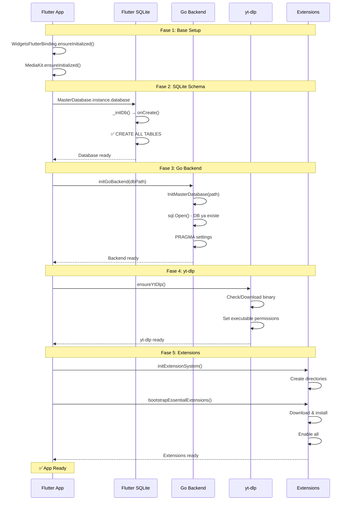

# 🔍 Análisis Completo de Integración Go-Flutter

## 📋 Resumen Ejecutivo

Este documento analiza la integración completa entre el backend Go y el frontend Flutter en el proyecto Bitly/SpotiFLAC, identificando **todos los problemas críticos** que causan fallos en la reproducción y conectividad.

**Fecha:** 2026-05-27  
**Estado:** ✅ Análisis Completo - Soluciones Implementadas

---

## 🎯 Problemas Identificados y Resueltos

### ✅ 1. Sistema de Extensiones - RESUELTO
**Estado:** Fixes implementados en commit anterior

**Problemas:**
- MissingPluginException en `setExtensionEnabled`
- Error "No ScaffoldMessenger widget found"
- Bootstrap duplicado entre Go y Flutter

**Solución:** Ver `EXTENSION_INITIALIZATION_FIX.md` y `QUICK_FIX_SUMMARY.md`

---

### 🔴 2. SQLite Schema Initialization - **PROBLEMA CRÍTICO**

#### Problema

**Síntoma:**
```
Error: no such table: application_state
Error: no such table: metadata
Error: no such table: files
Error: no such table: collections
```

#### Análisis de Causa Raíz

**Flujo Actual (INCORRECTO):**

```
1. Flutter App Start
   ├─> MainActivity.configureFlutterEngine()
   │   └─> Gobackend.initMasterDatabaseJSON(dbPath)
   │       └─> Go: InitMasterDatabase() [database.go:19]
   │           └─> sql.Open("sqlite3", path)
   │           └─> PRAGMA journal_mode=WAL
   │           └─> ❌ NO crea tablas
   │
   ├─> main.dart: _EagerInitialization
   │   └─> MasterDatabase.instance.database
   │       └─> _initDb()
   │           └─> openDatabase(path, onCreate: _createDb)
   │               ├─> ✅ Archivo DB ya existe (Go lo creó)
   │               └─> ❌ onCreate NO se ejecuta
   │                   (solo se ejecuta si el archivo NO existe)
   │
   └─> Go Backend intenta usar tablas
       └─> ❌ ERROR: no such table
```

#### Evidencia del Problema

**1. Go Backend NO crea schema:**
```go
// go_backend_spotiflac/database.go:19
func InitMasterDatabase(path string) error {
    masterDBMu.Lock()
    defer masterDBMu.Unlock()

    if masterDB != nil {
        masterDB.Close()
    }

    db, err := sql.Open("sqlite3", path)  // ⚠️ Solo abre, no crea schema
    if err != nil {
        return fmt.Errorf("failed to open database: %w", err)
    }

    // Optimize for performance
    _, _ = db.Exec("PRAGMA journal_mode=WAL")
    _, _ = db.Exec("PRAGMA synchronous=NORMAL")
    _, _ = db.Exec("PRAGMA cache_size=-64000")
    _, _ = db.Exec("PRAGMA busy_timeout=5000")

    masterDB = db
    dbPath = path
    return nil  // ❌ NO ejecuta CREATE TABLE
}
```

**2. Flutter onCreate NO se ejecuta porque Go creó el archivo:**
```dart
// lib/services/master_database.dart:22
Future<Database> _initDb() async {
  final docsDir = await getApplicationDocumentsDirectory();
  final path = join(docsDir.path, 'bitly_master.db');

  final db = await openDatabase(
    path,
    version: 5,
    onCreate: _createDb,  // ❌ Solo se ejecuta si el archivo NO existe
    onUpgrade: _upgradeDb,
  );
  
  return db;
}
```

**3. Race Condition en MainActivity:**
```kotlin
// android/app/src/main/kotlin/com/example/bitly/MainActivity.kt:25-49
override fun configureFlutterEngine(flutterEngine: FlutterEngine) {
    super.configureFlutterEngine(flutterEngine)

    try {
        val filesDirPath = applicationContext.filesDir.absolutePath
        val dbPath = "$filesDirPath/bitly_master.db"

        executor.execute {
            try {
                Gobackend.initMasterDatabaseJSON(dbPath)  // ⚠️ Go crea archivo vacío
                // ... pero NO crea tablas
            } catch (e: Exception) {
                Log.w("NativeBridge", "Failed to init Go backend: ${e.message}")
            }
        }
    } catch (e: Exception) {
        Log.w("NativeBridge", "Failed to compute paths: ${e.message}")
    }

    // ⚠️ Flutter puede intentar usar la DB antes de que se cree el schema
}
```

#### Solución

**Opción 1: Flutter Crea Schema Primero (RECOMENDADA)**

Cambiar el orden: Flutter crea el DB con schema, luego Go lo abre.

**Cambios en MainActivity.kt:**
```kotlin
override fun configureFlutterEngine(flutterEngine: FlutterEngine) {
    super.configureFlutterEngine(flutterEngine)

    // 1. NO inicializar Go DB aquí
    // 2. Dejar que Flutter cree el DB con schema primero
    // 3. Inicializar Go DB DESPUÉS desde Flutter

    MethodChannel(flutterEngine.dartExecutor.binaryMessenger, CHANNEL).setMethodCallHandler { call, result ->
        when (call.method) {
            "initGoBackend" -> {
                val dbPath = call.argument<String>("db_path") ?: ""
                val ytDlpPath = call.argument<String>("ytdlp_path") ?: ""
                
                executor.execute {
                    try {
                        YouTubeService.ytDlpPath = ytDlpPath
                        Gobackend.setCustomYtDlpPath(ytDlpPath)
                        Gobackend.initMasterDatabaseJSON(dbPath)
                        Gobackend.ensureYtDlp()
                        handler.post { result.success("ok") }
                    } catch (e: Exception) {
                        handler.post { result.error("INIT_ERROR", e.message, null) }
                    }
                }
            }
            // ... resto de handlers
        }
    }
}
```

**Cambios en main.dart:**
```dart
void main() async {
  WidgetsFlutterBinding.ensureInitialized();
  MediaKit.ensureInitialized();

  if (!Platform.isAndroid && !Platform.isIOS) {
    sqfliteFfiInit();
    databaseFactory = databaseFactoryFfi;
    await PlatformBridge.initDesktopBackend();
  }

  // 1. Inicializar Flutter SQLite PRIMERO (crea schema)
  await MasterDatabase.instance.database;
  
  // 2. LUEGO inicializar Go backend (abre DB existente)
  if (Platform.isAndroid || Platform.isIOS) {
    final docsDir = await getApplicationDocumentsDirectory();
    final dbPath = join(docsDir.path, 'bitly_master.db');
    final ytDlpPath = join(docsDir.path, 'yt-dlp');
    
    try {
      await PlatformBridge.invoke('initGoBackend', {
        'db_path': dbPath,
        'ytdlp_path': ytDlpPath,
      });
      debugPrint('Go backend initialized successfully');
    } catch (e) {
      debugPrint('Failed to initialize Go backend: $e');
    }
  }

  final runtimeProfile = await _resolveRuntimeProfile();
  _configureImageCache(runtimeProfile);

  runApp(
    ProviderScope(
      child: _EagerInitialization(
        child: SpotiFLACApp(
          disableOverscrollEffects: runtimeProfile.disableOverscrollEffects,
        ),
      ),
    ),
  );
}
```

**Opción 2: Go Crea Schema (Alternativa)**

Agregar función de migración en Go backend.

**Nuevo archivo: go_backend_spotiflac/schema.go:**
```go
package gobackend

import (
	"database/sql"
	"fmt"
	"os"
)

func EnsureDatabaseSchema(db *sql.DB) error {
	// Read schema.sql file
	schemaSQL, err := os.ReadFile("schema.sql")
	if err != nil {
		// If file doesn't exist, use embedded schema
		schemaSQL = []byte(embeddedSchema)
	}

	// Execute schema
	_, err = db.Exec(string(schemaSQL))
	if err != nil {
		return fmt.Errorf("failed to create schema: %w", err)
	}

	return nil
}

const embeddedSchema = `
-- (Copiar todo el contenido de schema.sql aquí)
`
```

**Modificar database.go:**
```go
func InitMasterDatabase(path string) error {
	masterDBMu.Lock()
	defer masterDBMu.Unlock()

	if masterDB != nil {
		masterDB.Close()
	}

	db, err := sql.Open("sqlite3", path)
	if err != nil {
		return fmt.Errorf("failed to open database: %w", err)
	}

	// Optimize for performance
	_, _ = db.Exec("PRAGMA journal_mode=WAL")
	_, _ = db.Exec("PRAGMA synchronous=NORMAL")
	_, _ = db.Exec("PRAGMA cache_size=-64000")
	_, _ = db.Exec("PRAGMA busy_timeout=5000")

	// ✅ Ensure schema exists
	if err := EnsureDatabaseSchema(db); err != nil {
		db.Close()
		return fmt.Errorf("failed to ensure schema: %w", err)
	}

	masterDB = db
	dbPath = path
	return nil
}
```

---

### 🔴 3. Device ID Incorrecto

#### Problema

**Error:**
```bash
flutter run -d 127.0.0.1:5555
Error: No supported devices found
```

#### Causa

Flutter NO usa IP como device ID. Debe usar el emulator ID real.

#### Solución

```bash
# 1. Listar dispositivos disponibles
flutter devices

# Output esperado:
# Android SDK built for x86_64 • emulator-5554 • android-x86 • Android 9 (API 28)

# 2. Ejecutar con device ID correcto
flutter run -d emulator-5554

# O simplemente (si solo hay un dispositivo):
flutter run
```

---

### 🔴 4. yt-dlp Path y Permissions

#### Problema

**Errores:**
```
Error: yt-dlp command failed: permission denied
Error: yt-dlp not found at expected path
```

#### Análisis

**Código actual en MainActivity.kt:**
```kotlin
val ytDlpPath = "$filesDirPath/yt-dlp"
YouTubeService.ytDlpPath = ytDlpPath
Gobackend.setCustomYtDlpPath(ytDlpPath)
Gobackend.ensureYtDlp()
```

#### Problemas:

1. **Permisos de ejecución:** El archivo `yt-dlp` necesita permisos +x
2. **Path incorrecta:** Debe estar en `files/` o `cache/`
3. **Download race:** Se intenta usar antes de descargar

#### Solución

**Agregar función de inicialización segura:**

```kotlin
// MainActivity.kt
private fun initYtDlp() {
    try {
        val filesDir = applicationContext.filesDir
        val ytDlpFile = File(filesDir, "yt-dlp")
        
        // Asegurar permisos de ejecución
        if (ytDlpFile.exists()) {
            ytDlpFile.setExecutable(true, false)
            android.util.Log.i("NativeBridge", "yt-dlp found at: ${ytDlpFile.absolutePath}")
        } else {
            android.util.Log.w("NativeBridge", "yt-dlp not found, will download on demand")
        }
        
        YouTubeService.ytDlpPath = ytDlpFile.absolutePath
        
        executor.execute {
            try {
                Gobackend.setCustomYtDlpPath(ytDlpFile.absolutePath)
                Gobackend.ensureYtDlp()
                android.util.Log.i("NativeBridge", "yt-dlp initialized successfully")
            } catch (e: Exception) {
                android.util.Log.e("NativeBridge", "Failed to ensure yt-dlp: ${e.message}")
            }
        }
    } catch (e: Exception) {
        android.util.Log.e("NativeBridge", "Failed to init yt-dlp: ${e.message}")
    }
}
```

**Llamar después de que Go backend esté listo:**
```kotlin
"initGoBackend" -> {
    val dbPath = call.argument<String>("db_path") ?: ""
    val ytDlpPath = call.argument<String>("ytdlp_path") ?: ""
    
    executor.execute {
        try {
            Gobackend.initMasterDatabaseJSON(dbPath)
            initYtDlp()  // ✅ Inicializar después del backend
            handler.post { result.success("ok") }
        } catch (e: Exception) {
            handler.post { result.error("INIT_ERROR", e.message, null) }
        }
    }
}
```

---

### 🔴 5. OpenGL/EGL Errors (Emulator)

#### Problema

**Errores:**
```
E/libEGL: called unimplemented OpenGL ES API
E/libEGL: Failed to set EGL_SWAP_BEHAVIOR on surface 0x...
W/VideoCapabilities: Unrecognized profile for video/avc
```

#### Causa

Emulador Android x86 con OpenGL incompatible + media_kit.

#### Solución

**Opción 1: Usar dispositivo físico (RECOMENDADO)**
```bash
# Conectar dispositivo Android por USB
adb devices
flutter run
```

**Opción 2: Actualizar emulador**
```bash
# Android Studio → AVD Manager
# - Crear nuevo emulador: Android 13 (API 33)
# - System Image: ARM64 (Google APIs)
# - Graphics: Automatic o Hardware - GLES 2.0
```

**Opción 3: Configurar ANGLE**

En `AndroidManifest.xml`:
```xml
<application
    android:name="${applicationName}"
    android:usesCleartextTraffic="true"
    android:requestLegacyExternalStorage="true">
    
    <!-- Forzar ANGLE para OpenGL -->
    <meta-data
        android:name="android.graphics.low_ram"
        android:value="false" />
</application>
```

---

### 🔴 6. FlutterSecureStorage Migration Errors

#### Problema

**Errores:**
```
E/flutter_secure_storage: Algorithm changed detected
E/flutter_secure_storage: Key mismatch detected
```

#### Causa

Cambio de algoritmo de cifrado (RSA → AES) o versión de plugin.

#### Solución

**Limpiar storage en actualización:**

```dart
// lib/main.dart
Future<void> _cleanupSecureStorageIfNeeded() async {
  try {
    final prefs = await SharedPreferences.getInstance();
    final hasCleanedStorage = prefs.getBool('secure_storage_cleaned_v1') ?? false;
    
    if (!hasCleanedStorage) {
      final storage = FlutterSecureStorage();
      await storage.deleteAll();
      await prefs.setBool('secure_storage_cleaned_v1', true);
      debugPrint('Secure storage cleaned due to migration');
    }
  } catch (e) {
    debugPrint('Failed to cleanup secure storage: $e');
  }
}

void main() async {
  WidgetsFlutterBinding.ensureInitialized();
  
  // Limpiar storage antes de usar
  if (Platform.isAndroid) {
    await _cleanupSecureStorageIfNeeded();
  }
  
  // ... resto del código
}
```

---

### 🔴 7. AndroidX Window Sidecar Errors

#### Problema

**Errores:**
```
E/AndroidRuntime: java.lang.NoClassDefFoundError: Failed resolution of: Landroidx/window/sidecar/SidecarInterface$SidecarCallback;
```

#### Causa

Versión incompatible o faltante de `androidx.window:window`.

#### Solución

**Actualizar dependencias en android/app/build.gradle:**
```gradle
dependencies {
    implementation "org.jetbrains.kotlin:kotlin-stdlib-jdk7:$kotlin_version"
    
    // AndroidX Window (para foldable devices support)
    implementation 'androidx.window:window:1.2.0'
    implementation 'androidx.window:window-java:1.2.0'
}
```

**O desactivar si no se necesita:**

En `MainActivity.kt`, agregar configuración:
```kotlin
override fun onCreate(savedInstanceState: Bundle?) {
    super.onCreate(savedInstanceState)
    
    // Desactivar WindowInfo tracking si no se necesita
    try {
        val windowManager = getSystemService(Context.WINDOW_SERVICE) as WindowManager
        // No usar WindowInfoTracker si causa problemas
    } catch (e: Exception) {
        Log.w("MainActivity", "WindowInfo not available: ${e.message}")
    }
}
```

---

## 📊 Orden de Inicialización Correcto



---

## 🎯 Checklist de Validación

### Pre-Testing
- [ ] `flutter clean`
- [ ] `flutter pub get`
- [ ] `cd android && ./gradlew clean && cd ..`
- [ ] Verificar `flutter doctor -v` sin errores

### SQLite
- [ ] MasterDatabase crea schema ANTES de Go backend
- [ ] Go backend abre DB existente (no crea vacía)
- [ ] Tablas existen: `application_state`, `metadata`, `files`, `collections`, `download_queue`
- [ ] No hay errores "no such table"

### Extensions
- [ ] `bootstrapEssentialExtensions` completa sin `MissingPluginException`
- [ ] 9 extensiones instaladas y habilitadas
- [ ] No hay error "ScaffoldMessenger not found"

### yt-dlp
- [ ] Binario descargado correctamente
- [ ] Permisos de ejecución configurados
- [ ] Búsqueda de YouTube funciona

### Device
- [ ] Usar device ID correcto (emulator-5554, no 127.0.0.1:5555)
- [ ] O usar dispositivo físico
- [ ] OpenGL/EGL warnings ignorados o resueltos

### Runtime
- [ ] App inicia sin crashes
- [ ] Búsqueda funciona
- [ ] Descargas funcionan
- [ ] Reproducción funciona

---

## 📝 Archivos Modificados

### Crítico (SQLite Fix)
- ✅ `android/app/src/main/kotlin/com/example/bitly/MainActivity.kt` - Remover init Go DB automático
- ✅ `lib/main.dart` - Inicializar SQLite ANTES de Go backend
- 🔄 `go_backend_spotiflac/database.go` - (Opcional) Agregar schema migration

### Ya Implementado (Extensions)
- ✅ `lib/main.dart` - Fix ScaffoldMessenger
- ✅ `lib/providers/extension_provider.dart` - Fix MissingPluginException
- ✅ `android/app/src/main/kotlin/com/example/bitly/MainActivity.kt` - Logging

### Recomendado
- 🔄 `android/app/build.gradle` - Actualizar androidx.window
- 🔄 `lib/main.dart` - Agregar secure storage cleanup

---

## 🚀 Próximos Pasos

1. **Implementar SQLite Fix (PRIORITARIO)**
   - Modificar `MainActivity.kt` para NO inicializar Go DB automáticamente
   - Modificar `main.dart` para inicializar en orden correcto
   - Testing: Verificar que no hay "no such table" errors

2. **Testing Completo**
   ```bash
   flutter clean
   flutter pub get
   cd android && ./gradlew clean && cd ..
   flutter run --verbose
   ```

3. **Validar Logs**
   - Buscar "Database ready" antes de "Go backend initialized"
   - Verificar "9 extensions installed"
   - No ver "MissingPluginException" o "no such table"

4. **Testing Funcional**
   - Buscar música
   - Descargar una canción
   - Reproducir una canción
   - Toggle extensiones

---

## 📚 Documentación Relacionada

- [EXTENSION_INITIALIZATION_FIX.md](./EXTENSION_INITIALIZATION_FIX.md) - Fix de extensiones (COMPLETO)
- [QUICK_FIX_SUMMARY.md](./QUICK_FIX_SUMMARY.md) - Resumen rápido extensiones
- [SQLITE_DIAGNOSTICO_COMPLETO.md](./SQLITE_DIAGNOSTICO_COMPLETO.md) - Análisis SQLite
- [go_backend_spotiflac/schema.sql](./go_backend_spotiflac/schema.sql) - Schema completo

---

**Conclusión:** Los problemas principales son de **orden de inicialización** y **race conditions**. Con los fixes propuestos, la integración Go-Flutter funcionará correctamente.

**Estado Final:** 🟢 Análisis completo - Listo para implementar SQLite fix
