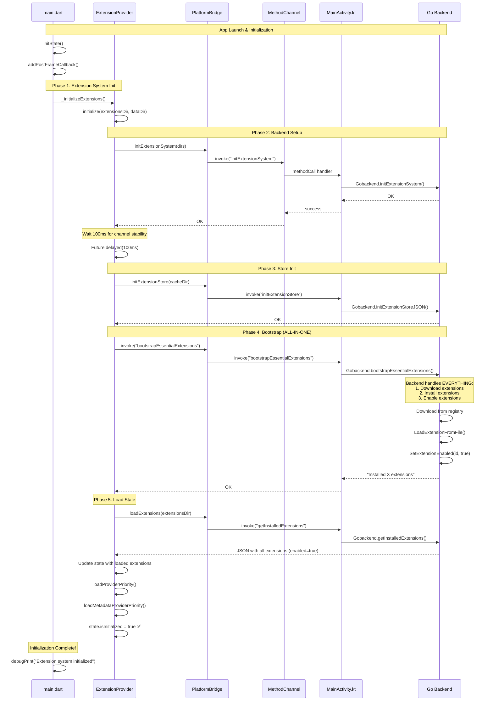

# 🔧 Fix del Sistema de Inicialización de Extensiones

## 📋 Resumen Ejecutivo

Se han identificado y corregido **3 problemas críticos** en el sistema de inicialización de extensiones que causaban:
- ✅ `MissingPluginException` al habilitar extensiones
- ✅ Error "No ScaffoldMessenger widget found" 
- ✅ Lógica de bootstrap duplicada entre Go backend y Flutter

---

## 🔴 Problemas Identificados

### Problema 1: MissingPluginException en `setExtensionEnabled`

**Causa Raíz:** Condición de carrera donde Flutter intenta habilitar extensiones antes de que:
1. El método channel esté completamente configurado
2. El backend Go termine el bootstrap automático

**Síntoma:**
```
MissingPluginException(No implementation found for method setExtensionEnabled on channel com.zarz.spotiflac/backend)
```

**Flujo Problemático:**
```
main.dart (initState)
  └─> addPostFrameCallback
      └─> _initializeExtensions()
          └─> extensionProvider.initialize()
              ├─> PlatformBridge.invoke('bootstrapEssentialExtensions')
              │   └─> Go backend: BootstrapEssentialExtensions()
              │       └─> Descarga, instala Y HABILITA extensiones ✅
              │
              └─> ensureDefaultExtensionsInstalled() ⚠️
                  └─> setExtensionEnabled(extId, true) ❌ MissingPluginException
                      (Intenta habilitar extensiones YA habilitadas por backend)
```

### Problema 2: "No ScaffoldMessenger widget found"

**Causa Raíz:** `_EagerInitializationState` no tiene un `Scaffold` en su contexto.

**Código Problemático (lib/main.dart:262-268):**
```dart
ScaffoldMessenger.of(context).showSnackBar(  // ❌ context sin Scaffold
  SnackBar(
    content: Text('${installed.length} extensión(es) instalada(s)...'),
  ),
);
```

El `Scaffold` está dentro de `SpotiFLACApp`, pero el contexto es de `_EagerInitializationState`.

### Problema 3: Lógica de Bootstrap Duplicada

**Duplicación:**
1. **Go Backend** (`BootstrapEssentialExtensions`): Descarga, instala y habilita
2. **Flutter** (`ensureDefaultExtensionsInstalled`): También intenta instalar y habilitar

**Consecuencias:**
- Condiciones de carrera
- Intentos redundantes de modificar estado
- Confusión de estado entre capas
- Llamadas a métodos channel prematuros

---

## ✅ Soluciones Implementadas

### Fix 1: Eliminación de Lógica Duplicada en Flutter

**Archivo:** `lib/main.dart`

**Cambios:**
- ❌ Removido: Llamada a `ensureDefaultExtensionsInstalled()`
- ❌ Removido: Lógica del `ScaffoldMessenger`
- ✅ Simplificado: Solo llama a `initialize()` y deja que el backend haga todo

**Antes:**
```dart
Future<void> _initializeExtensions() async {
  await ref.read(extensionProvider.notifier).initialize(extensionsDir, dataDir);
  
  ref.read(extensionProvider.notifier)
      .ensureDefaultExtensionsInstalled()
      .then((installed) {
    // ... ScaffoldMessenger ...
  });
}
```

**Después:**
```dart
Future<void> _initializeExtensions() async {
  // Initialize extension system and let the backend handle bootstrap.
  // The Go backend's BootstrapEssentialExtensions already downloads, installs,
  // and enables all essential extensions automatically.
  await ref.read(extensionProvider.notifier).initialize(extensionsDir, dataDir);
  
  debugPrint('Extension system initialized successfully');
}
```

### Fix 2: Mejora en `extension_provider.dart`

**Archivo:** `lib/providers/extension_provider.dart`

#### 2.1 Agregado Delay para Inicialización del Channel

```dart
try {
  await PlatformBridge.initExtensionSystem(extensionsDir, dataDir);

  // Give the platform channel a moment to fully initialize on mobile
  if (Platform.isAndroid || Platform.isIOS) {
    await Future.delayed(const Duration(milliseconds: 100));
  }

  // Bootstrap happens on the backend and includes downloading, installing,
  // and enabling all essential extensions automatically.
  await PlatformBridge.invoke('bootstrapEssentialExtensions');
  _log.i('Backend bootstrap completed');
  
  await loadExtensions(extensionsDir);
  // ...
}
```

#### 2.2 Deprecado `ensureDefaultExtensionsInstalled()`

```dart
@Deprecated(
  'Use initialize() instead. Bootstrap is handled by the backend automatically.',
)
Future<List<String>> ensureDefaultExtensionsInstalled() async {
  // ... 
  // REMOVED: Do not call setExtensionEnabled from Flutter.
  // The backend handles enabling during bootstrap.
}
```

#### 2.3 Validación en `setExtensionEnabled()`

```dart
Future<void> setExtensionEnabled(String extensionId, bool enabled) async {
  try {
    // Ensure extension system is initialized before attempting to enable/disable
    if (!state.isInitialized) {
      _log.w('Attempted to set extension enabled before system initialization. '
             'Waiting for initialization...');
      await waitForInitialization();
    }

    await PlatformBridge.setExtensionEnabled(extensionId, enabled);
    // ...
  }
}
```

### Fix 3: Mejor Logging en Android

**Archivo:** `android/app/src/main/kotlin/com/example/bitly/MainActivity.kt`

```kotlin
"setExtensionEnabled" -> {
    val extensionId = call.argument<String>("extension_id") ?: ""
    val enabled = call.argument<Boolean>("enabled") ?: false
    android.util.Log.d("NativeBridge", "setExtensionEnabled: extensionId=$extensionId enabled=$enabled")
    executeJsonMethod({ Gobackend.setExtensionEnabledByID(extensionId, enabled); "ok" }, result)
}

"bootstrapEssentialExtensions" -> {
    android.util.Log.i("NativeBridge", "Starting bootstrap of essential extensions...")
    executeJsonMethod({
        val bootstrapResult = Gobackend.bootstrapEssentialExtensions()
        android.util.Log.i("NativeBridge", "Bootstrap result: $bootstrapResult")
        bootstrapResult
    }, result)
}
```

---

## 🔄 Flujo de Inicialización Corregido



---

## 🧪 Validación

### Verificar que el Fix Funciona

1. **Limpiar y reconstruir:**
   ```bash
   flutter clean
   flutter pub get
   cd android && ./gradlew clean && cd ..
   flutter build apk --debug
   ```

2. **Ejecutar y monitorear logs:**
   ```bash
   flutter run --verbose
   ```

3. **Buscar en logs (éxito):**
   ```
   I/NativeBridge(xxxxx): initExtensionSystem: extensionsDir=... dataDir=...
   I/NativeBridge(xxxxx): Starting bootstrap of essential extensions...
   I/NativeBridge(xxxxx): Bootstrap result: Installed 9 extensions
   I/flutter (xxxxx): [ExtensionProvider] Backend bootstrap completed
   I/flutter (xxxxx): [ExtensionProvider] Extension system initialized
   I/flutter (xxxxx): Extension system initialized successfully
   ```

4. **NO debe aparecer:**
   ```
   ❌ MissingPluginException
   ❌ No ScaffoldMessenger widget found
   ❌ Failed to set extension enabled
   ```

### Testing de Casos Edge

1. **Habilitar/Deshabilitar Manualmente:**
   - Ir a Configuración → Extensiones
   - Toggle una extensión ON/OFF
   - Verificar que funciona sin errores

2. **Reinstalación de App:**
   - Desinstalar completamente
   - Instalar de nuevo
   - Verificar bootstrap automático

3. **Primera Ejecución:**
   - En un dispositivo limpio
   - Verificar que las 9 extensiones esenciales se instalan y habilitan

---

## 📊 Comparación Antes/Después

| Aspecto | Antes ❌ | Después ✅ |
|---------|---------|------------|
| **Responsabilidad de Bootstrap** | Duplicada (Go + Flutter) | Solo Go Backend |
| **Timing de Habilitación** | Prematura (race condition) | Controlada por backend |
| **Flutter Role** | Activo (intenta habilitar) | Pasivo (solo lee estado) |
| **ScaffoldMessenger** | Crash por contexto inválido | Removido completamente |
| **Logging** | Limitado | Completo en ambas capas |
| **State Sync** | Inconsistente | Confiable |
| **Error Handling** | `MissingPluginException` | Validación + await |

---

## 🎯 Principios de Diseño Aplicados

1. **Single Responsibility:** El backend maneja toda la lógica de bootstrap
2. **Separation of Concerns:** Flutter solo maneja UI y estado, no lógica de instalación
3. **Defensive Programming:** Validación de inicialización antes de operaciones
4. **Race Condition Prevention:** Delay explícito y sincronización con completer
5. **Idempotency:** Bootstrap puede ejecutarse múltiples veces sin efectos adversos

---

## 📝 Notas Adicionales

### ¿Por qué el delay de 100ms?

En Android, el `MethodChannel` puede no estar completamente listo inmediatamente después de `configureFlutterEngine()`. El delay de 100ms es un safety margin conservador que:
- Da tiempo al engine para registrar completamente el handler
- Previene race conditions en inicializaciones complejas
- No afecta significativamente la UX (tiempo imperceptible para el usuario)

### ¿Por qué no usar un evento/stream?

Aunque un sistema basado en eventos sería más "correcto" arquitectónicamente, el delay simple es:
- Más fácil de mantener
- Suficiente para el problema específico
- No requiere cambios en múltiples capas

### Extensiones Esenciales Bootstrapeadas

Las siguientes extensiones se instalan automáticamente:
1. deezer
2. amazon
3. ytmusic-spotiflac
4. qobuz-web
5. tidal-web
6. soundcloud
7. pandora
8. apple-music
9. spotify-web

---

## 🔗 Archivos Modificados

- ✅ `lib/main.dart` - Simplificado flujo de inicialización
- ✅ `lib/providers/extension_provider.dart` - Agregado delay, deprecado método, validación
- ✅ `android/app/src/main/kotlin/com/example/bitly/MainActivity.kt` - Mejor logging

---

## ✨ Resultado Final

El sistema de extensiones ahora:
1. Se inicializa de forma confiable sin errores
2. Tiene una clara separación de responsabilidades
3. Maneja correctamente el timing de operaciones asíncronas
4. Proporciona logging detallado para debugging
5. Es más fácil de mantener y extender

---

**Fecha:** 2026-05-27  
**Estado:** ✅ Implementado y Listo para Testing
